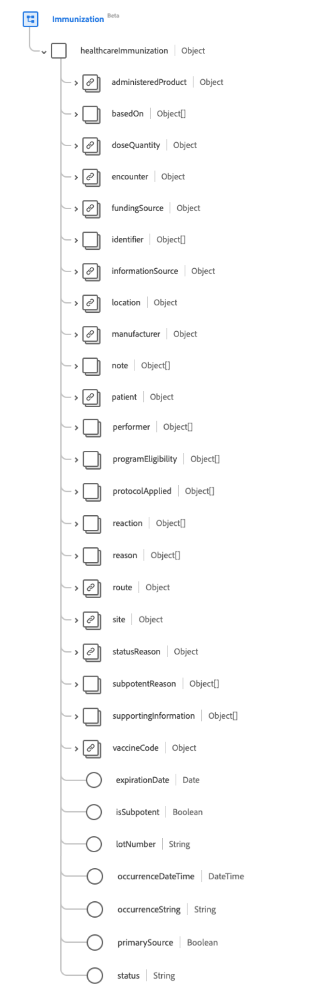

# [!UICONTROL Vacunación] grupo de campos de esquema

[!UICONTROL Immunization] es un grupo de campos de esquema estándar para la [[!DNL XDM Experience Event] clase](../../../classes/experienceevent.md). Proporciona un único campo de tipo de objeto `healthcareImmunization` que captura la información del evento de inmunización.

| Nombre para mostrar | Propiedad | Tipo de datos | Descripción |
| --- | --- | --- | --- |
| [!UICONTROL Producto administrado] | `administeredProduct` | [[!UICONTROL Referencia codificable]](../data-types/codeable-reference.md) | El producto que se administró. |
| [!UICONTROL Basado En] | `basedOn` | Matriz de [[!UICONTROL referencia]](../data-types/reference.md) | La autoridad en la que se basa el evento de vacunación. |
| [!UICONTROL Cantidad de dosis] | `doseQuantity` | [[!UICONTROL Cantidad simple]](../data-types/simple-quantity.md) | Cantidad de vacuna administrada. |
| [!UICONTROL Encuentro] | `encounter` | [[!UICONTROL Referencia]](../data-types/reference.md) | El encuentro del que formaba parte la inmunización. |
| [!UICONTROL Source de fondos] | `fundingSource` | [[!UICONTROL Concepto codificable]](../data-types/codeable-concept.md) | La fuente de financiamiento para la vacuna. |
| [!UICONTROL Identificador] | `identifier` | Matriz de [[!UICONTROL identificador]](../data-types/identifier.md) | El identificador empresarial. |
| [!UICONTROL Información de Source] | `informationSource` | [[!UICONTROL Referencia codificable]](../data-types/codeable-reference.md) | Indica el origen del registro del informe. |
| [!UICONTROL Ubicación] | `location` | [[!UICONTROL Referencia]](../data-types/reference.md) | El lugar donde ocurrió la vacunación. |
| [!UICONTROL Fabricante] | `manufacturer` | [[!UICONTROL Referencia codificable]](../data-types/codeable-reference.md) | El fabricante de la vacuna. |
| [!UICONTROL Nota] | `note` | Matriz de [[!UICONTROL anotación]](../data-types/annotation.md) | Notas de vacunación adicionales. |
| [!UICONTROL Paciente] | `patient` | [[!UICONTROL Referencia]](../data-types/reference.md) | Que fue inmunizado. |
| [!UICONTROL Lote] | `performer` | Matriz de objetos | Quién realizó el evento de inmunización. Consulte la [sección siguiente](#performer) para obtener más información. |
| [!UICONTROL Elegibilidad del programa] | `programEligibility` | Matriz de objetos | La elegibilidad del paciente para un programa de vacunación específico. Consulte la [sección siguiente](#program-eligibility) para obtener más información. |
| [!UICONTROL Protocolo aplicado] | `protocolApplied` | Matriz de objetos | El protocolo proporcionado por el proveedor. Consulte la [sección siguiente](#protocol-applied) para obtener más información. |
| [!UICONTROL Reacción] | `reaction` | Matriz de objetos | Los detalles de una reacción después de la inmunización. Consulte la [sección siguiente](#reaction) para obtener más información. |
| [!UICONTROL Motivo] | `reason` | Matriz de [[!UICONTROL referencia codificable]](../data-types/codeable-reference.md) | La razón de la vacunación. |
| [!UICONTROL Ruta] | `route` | [[!UICONTROL Concepto codificable]](../data-types/codeable-concept.md) | Cómo entró la vacuna en el cuerpo. |
| [!UICONTROL Sitio] | `site` | [[!UICONTROL Concepto codificable]](../data-types/codeable-concept.md) | Lugar del cuerpo donde se administró la vacuna |
| [!UICONTROL Motivo del estado] | `statusReason` | [[!UICONTROL Concepto codificable]](../data-types/codeable-concept.md) | El motivo del estado actual. |
| [!UICONTROL Motivo de subpotencia] | `subpotentReason` | Matriz de [[!UICONTROL concepto codificable]](../data-types/codeable-concept.md) | La razón de la vacuna es subpotente. |
| [!UICONTROL Información de apoyo] | `supportingInformation` | Matriz de [[!UICONTROL referencia]](../data-types/reference.md) | Información adicional en apoyo de la vacunación. |
| [!UICONTROL Código de vacuna] | `vaccineCode` | [[!UICONTROL Concepto codificable]](../data-types/codeable-concept.md) | El código de la vacuna administrada. |
| [!UICONTROL Fecha de caducidad] | `expirationDate` | Fecha | La fecha de caducidad de la vacuna. |
| [!UICONTROL Es Subpotente] | `isSubpotent` | Booleano | El indicador para saber si la vacuna es subpotente. |
| [!UICONTROL Número de lote] | `lotNumber` | Cadena | El número de lote de la vacuna. |
| [!UICONTROL HoraFechaDeOcurrencia] | `occurenceDateTime` | Fecha/Hora | La fecha de administración de la vacuna. |
| [!UICONTROL Cadena de ocurrencia] | `occurenceString` | Cadena | La fecha de administración de la vacuna. |
| [!UICONTROL Source principal] | `primarySource` | Booleano | Indica si los datos se capturaron desde un origen principal. |
| [!UICONTROL Estado] | `status` | Cadena | El estado de la inmunización. El valor de esta propiedad debe ser igual a uno de los siguientes valores de enumeración conocidos. <li> `completed` </li> <li> `entered-in-error` </li> <li> `not-done` </li> |

Para obtener más información sobre el grupo de campos, consulte el repositorio XDM público:

* [Ejemplo completado](https://github.com/adobe/xdm/blob/master/extensions/industry/healthcare/fhir/fieldgroups/immunization.example.1.json)
* [Esquema completo](https://github.com/adobe/xdm/blob/master/extensions/industry/healthcare/fhir/fieldgroups/immunization.schema.json)

## `performer` {#performer}

`performer` se proporciona como una matriz de objetos. A continuación se describe la estructura de cada objeto.

| Nombre para mostrar | Propiedad | Tipo de datos | Descripción |
| --- | --- | --- | --- |
| [!UICONTROL Actor] | `actor` | [[!UICONTROL Referencia]](../data-types/reference.md) | El individuo u organización que actuaba. |
| [!UICONTROL Función] | `function` | [[!UICONTROL Concepto codificable]](../data-types/codeable-concept.md) | Qué tipo de actuación se realizó. |

## `programEligibility` {#program-eligibility}

`programEligibility` se proporciona como una matriz de objetos. A continuación se describe la estructura de cada objeto.

| Nombre para mostrar | Propiedad | Tipo de datos | Descripción |
| --- | --- | --- | --- |
| [!UICONTROL Programa] | `program` | [[!UICONTROL Concepto codificable]](../data-types/codeable-concept.md) | Programa para el que se declara la idoneidad. |
| [!UICONTROL Estado del programa] | `programStatus` | [[!UICONTROL Concepto codificable]](../data-types/codeable-concept.md) | El estado de elegibilidad del paciente para el programa. |

## `protocolApplied` {#protocol-applied}

`protocolApplied` se proporciona como una matriz de objetos. A continuación se describe la estructura de cada objeto.

| Nombre para mostrar | Propiedad | Tipo de datos | Descripción |
| --- | --- | --- | --- |
| [!UICONTROL Autoridad] | `authority` | [[!UICONTROL Referencia]](../data-types/reference.md) | Quién es el responsable de publicar las recomendaciones. |
| [!UICONTROL Enfermedad de destino] | `targetDisease` | Matriz de [[!UICONTROL concepto codificable]](../data-types/codeable-concept.md) | La enfermedad prevenible a la que se dirige la vacuna. |
| [!UICONTROL Número de dosis] | `doseNumber` | Cadena | El número de dosis dentro de la serie. |
| [!UICONTROL Serie] | `series` | Cadena | El nombre de la serie de vacunas. |
| [!UICONTROL Dosis de la serie] | `seriesDoses` | Cadena | Número recomendado de dosis de inmunidad. |

## `reaction` {#reaction}

`reaction` se proporciona como una matriz de objetos. A continuación se describe la estructura de cada objeto.

| Nombre para mostrar | Propiedad | Tipo de datos | Descripción |
| --- | --- | --- | --- |
| [!UICONTROL Manifestación] | `manifestation` | [[!UICONTROL Referencia codificable]](../data-types/codeable-concept.md) | Información adicional sobre la reacción. |
| [!UICONTROL Fecha] | `date` | Fecha/Hora | Cuando empezó la reacción. |
| [!UICONTROL Notificado] | `reported` | Cadena | Indica si la reacción se autoinformó. |
