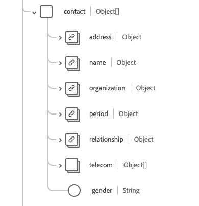

# [!UICONTROL Paciente] grupo de campos de esquema

[!UICONTROL El paciente] es un grupo de campos de esquema estándar para la [[!DNL XDM Individual Profile] clase](../../../classes/individual-profile.md). Proporciona un único campo de tipo de objeto `healthcarePatient` que captura la demografía y otros detalles administrativos de un individuo o animal que recibe atención u otros servicios relacionados con la salud.

| Nombre para mostrar | Propiedad | Tipo de datos | Descripción |
| --- | --- | --- | --- |
| [!UICONTROL Dirección] | `address` | Matriz de [[!UICONTROL dirección]](../data-types/address.md) | La dirección del paciente. |
| [!UICONTROL Comunicación] | `communication` | Matriz de objetos | Lenguaje que puede utilizarse para comunicarse con el paciente sobre su salud. Consulte la [sección siguiente](#communication) para obtener más información. |
| [!UICONTROL Contactos del paciente] | `contact` | Matriz de objetos | La persona de contacto del paciente, como un tutor, pareja o amigo. Consulte la [sección siguiente](#contact) para obtener más información. |
| [!UICONTROL Médico general] | `generalPractioner` | Matriz de [[!UICONTROL referencia]](../data-types/reference.md) | El proveedor de atención primaria del paciente. |
| [!UICONTROL Identificador] | `identifier` | Matriz de [[!UICONTROL identificador]](../data-types/identifier.md) | Un identificador para el paciente. |
| [!UICONTROL Detalles de vínculo del paciente] | `link` | Matriz de objetos | Un vínculo al recurso de un paciente o de una persona relacionada que concierne a la misma persona. Consulte la [sección siguiente](#link) para obtener más información. |
| [!UICONTROL Administrar organización] | `managingOrganization` | [[!UICONTROL Referencia]](../data-types/reference.md) | La organización de la custodia del registro del paciente. |
| [!UICONTROL Estado civil] | `maritalStatus` | [[!UICONTROL Concepto codificable]](../data-types/codeable-concept.md) | El estado civil del paciente. |
| [!UICONTROL Nombre] | `name` | Matriz de [[!UICONTROL nombre humano]](../data-types/human-name.md) | El nombre asociado con el paciente. |
| [!UICONTROL Detalles de contacto] | `telecom` | Matriz de [[!UICONTROL punto de contacto]](../data-types/contact-point.md) | Un dato de contacto, como un número de teléfono o una dirección de correo electrónico, mediante los cuales se puede contactar al paciente. |
| [!UICONTROL Activo] | `active` | Booleano | Indica si el historial del paciente está en uso activo. |
| [!UICONTROL Fecha de nacimiento] | `birthDate` | Fecha | La fecha de nacimiento del paciente. |
| [!UICONTROL Indicador fallecido] | `deceasedBoolean` | Booleano | Indica si el paciente ha fallecido o no. |
| [!UICONTROL Hora de la fecha de fallecimiento] | `deceasedDateTime` | Fecha/Hora | La fecha y hora de la muerte del paciente. |
| [!UICONTROL Sexo] | `gender` | Cadena | La identidad de género de la persona. El valor de esta propiedad debe ser igual a uno de los siguientes valores de enumeración conocidos. <li> `female` </li> <li> `male` </li> <li> `other` </li> <li> `unknown`</li> |
| [!UICONTROL Forma Parte De Un Nacimiento Múltiple] | `multipleBirthBoolean` | Booleano | Indica si el paciente es parte de un parto múltiple. |
| [!UICONTROL Número de nacimiento] | `multipleBirthInteger` | Entero | El número de nacimiento en la secuencia. |

Para obtener más información sobre el grupo de campos, consulte el repositorio XDM público:

* [Ejemplo completado](https://github.com/adobe/xdm/blob/master/extensions/industry/healthcare/fhir/fieldgroups/patient.example.1.json)
* [Esquema completo](https://github.com/adobe/xdm/blob/master/extensions/industry/healthcare/fhir/fieldgroups/patient.schema.json)

## `communication` {#communication}

`communication` se proporciona como una matriz de objetos. A continuación se describe la estructura de cada objeto.

| Nombre para mostrar | Propiedad | Tipo de datos | Descripción |
| --- | --- | --- | --- |
| [!UICONTROL Idioma] | `language` | [[!UICONTROL Concepto codificable]](../data-types/codeable-concept.md) | El idioma que se puede utilizar para comunicarse con la persona sobre su salud. |
| [!UICONTROL Es El Idioma Preferido] | `preferred` | Booleano | Indica si el idioma es su idioma preferido o no. |

## `contact` {#contact}

`contact` se proporciona como una matriz de objetos. A continuación se describe la estructura de cada objeto.

| Nombre para mostrar | Propiedad | Tipo de datos | Descripción |
| --- | --- | --- | --- |
| [!UICONTROL Dirección de contacto] | `address` | [[!UICONTROL Dirección]](../data-types/address.md) | La dirección de la persona de contacto. |
| [!UICONTROL Nombre de contacto] | `name` | [[!UICONTROL Nombre humano]](../data-types/human-name.md) | El nombre de la persona de contacto. |
| [!UICONTROL Organización de contacto] | `organization` | [[!UICONTROL Referencia]](../data-types/reference.md) | La organización asociada con la persona de contacto. |
| [!UICONTROL Período de contacto] | `period` | [[!UICONTROL Período]](../data-types/period.md) | Período de tiempo en el que el contacto estaba o está en uso. |
| [!UICONTROL Relación&#39;] | `relationship` | [[!UICONTROL Concepto codificable]](../data-types/codeable-concept.md) | La relación entre el paciente y la persona de contacto. |
| [!UICONTROL Detalles de contacto] | `telecom` | Matriz de objetos | Los datos de contacto de la persona de contacto. Consulte la [sección siguiente](#telecom) para obtener más información. |
| [!UICONTROL Sexo] | `gender` | Cadena | La identidad de género de la persona. El valor de esta propiedad debe ser igual a uno de los siguientes valores de enumeración conocidos. <li> `female` </li> <li> `male` </li> <li> `other` </li> <li> `unknown`</li> |

### `telecom` {#telecom}

`telecom` se proporciona como una matriz de objetos. A continuación se describe la estructura de cada objeto.

| Nombre para mostrar | Propiedad | Tipo de datos | Descripción |
| --- | --- | --- | --- |
| [!UICONTROL Punto de contacto] | `contactPoint` | [[!UICONTROL Punto de contacto]](../data-types/contact-point.md) | Los datos de contacto de la persona. |

## `link` {#link}

`link` se proporciona como una matriz de objetos. A continuación se describe la estructura de cada objeto.

| Nombre para mostrar | Propiedad | Tipo de datos | Descripción |
| --- | --- | --- | --- |
| [!UICONTROL Otras] | `other` | [[!UICONTROL Referencia]](../data-types/reference.md) | Un vínculo al recurso de un paciente o de una persona relacionada que concierne a la misma persona. |
| [!UICONTROL Tipo] | `type` | Cadena | Tipo de vínculo entre los dos recursos para el paciente. |
