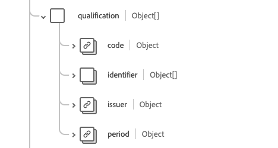

# [!UICONTROL Profesional] grupo de campos de esquema

[!UICONTROL Practioner] es un grupo de campos de esquema estándar para [[!DNL XDM Individual Profile] class](../../../classes/individual-profile.md) y [[!DNL Provider class]](../../../classes/provider.md). Proporciona un único campo de tipo de objeto `healthcarePractioner` que contiene información sobre una persona que participa directa o indirectamente en el suministro de servicios de atención médica o servicios relacionados.

| Nombre para mostrar | Propiedad | Tipo de datos | Descripción |
| --- | --- | --- | --- |
| [!UICONTROL Dirección] | `address` | Matriz de [[!UICONTROL dirección]](../data-types/address.md) | Las direcciones del profesional que están más allá de su lugar de trabajo, como una dirección postal. |
| [!UICONTROL Comunicación] | `communication` | Matriz de objeto | Un idioma que se puede utilizar para comunicarse con el profesional. Consulte la [sección siguiente](#communication) para obtener más información |
| [!UICONTROL Identificador] | `identifier` | Matriz de [[!UICONTROL identificador]](../data-types/identifier.md) | Identificador que se aplica a esta persona con esta función. |
| [!UICONTROL Nombre] | `name` | Matriz de [[!UICONTROL nombre humano]](../data-types/human-name.md) | Nombre(s) asociado(s) con el profesional. |
| [!UICONTROL Calificación] | `qualification` | Matriz de objeto | Las calificaciones oficiales, certificaciones, acreditaciones, capacitación, licencias o similares que autorizan o de otra manera se refieren a la prestación de atención por el profesional. Consulte la [sección siguiente](#qualification) para obtener más información. |
| [!UICONTROL Detalles de contacto] | `telecom` | Matriz de [[!UICONTROL punto de contacto]](../data-types/contact-point.md) | Los datos de contacto del profesional. |
| [!UICONTROL Activo] | `active` | Booleano | Indica si el registro de profesionales está en uso activo. |
| [!UICONTROL Fecha de nacimiento] | `birthDate` | Fecha | La fecha de nacimiento del profesional. |
| [!UICONTROL Indicador fallecido] | `deceasedBoolean` | Booleano | Indica si el profesional ha fallecido. |
| [!UICONTROL Hora de la fecha de fallecimiento] | `deceasedDateTime` | Fecha/Hora | La fecha y hora de la muerte del profesional. |
| [!UICONTROL Sexo] | `gender` | Cadena | La identidad de género de la persona. El valor de esta propiedad debe ser igual a uno de los siguientes valores de enumeración conocidos. <li> `female` </li> <li> `male` </li> <li> `other` </li> <li> `unknown`</li> |

Para obtener más información sobre el grupo de campos, consulte el repositorio XDM público:

* [Ejemplo completado](https://github.com/adobe/xdm/blob/master/extensions/industry/healthcare/fhir/fieldgroups/practitioner.example.1.json)
* [Esquema completo](https://github.com/adobe/xdm/blob/master/extensions/industry/healthcare/fhir/fieldgroups/practitioner.schema.json)

## `communication` {#communication}

`communication` se proporciona como una matriz de objetos. A continuación se describe la estructura de cada objeto.

| Nombre para mostrar | Propiedad | Tipo de datos | Descripción |
| --- | --- | --- | --- |
| [!UICONTROL Idioma] | `language` | [[!UICONTROL Concepto codificable]](../data-types/codeable-concept.md) | El idioma que se puede utilizar para comunicarse con la persona sobre su salud. |
| [!UICONTROL Es El Idioma Preferido] | `preferred` | Booleano | Indica si el idioma es su idioma preferido o no. |

## `qualification` {#qualification}

`qualification` se proporciona como una matriz de objetos. A continuación se describe la estructura de cada objeto.

| Nombre para mostrar | Propiedad | Tipo de datos | Descripción |
| --- | --- | --- | --- |
| [!UICONTROL Código] | `code` | [[!UICONTROL Concepto codificable]](../data-types/codeable-concept.md) | La representación codificada de la calificación. |
| [!UICONTROL Identificador] | `identifier` | Matriz de [[!UICONTROL identificador]](../data-types/identifier.md) | Un identificador para la calificación. |
| [!UICONTROL Emisor] | `issuer` | [[!UICONTROL Referencia]](../data-types/reference.md) | La organización que regula y emite la calificación. |
| [!UICONTROL Período] | `period` | [[!UICONTROL Período]](../data-types/period.md) | Período de validez de la calificación. |
