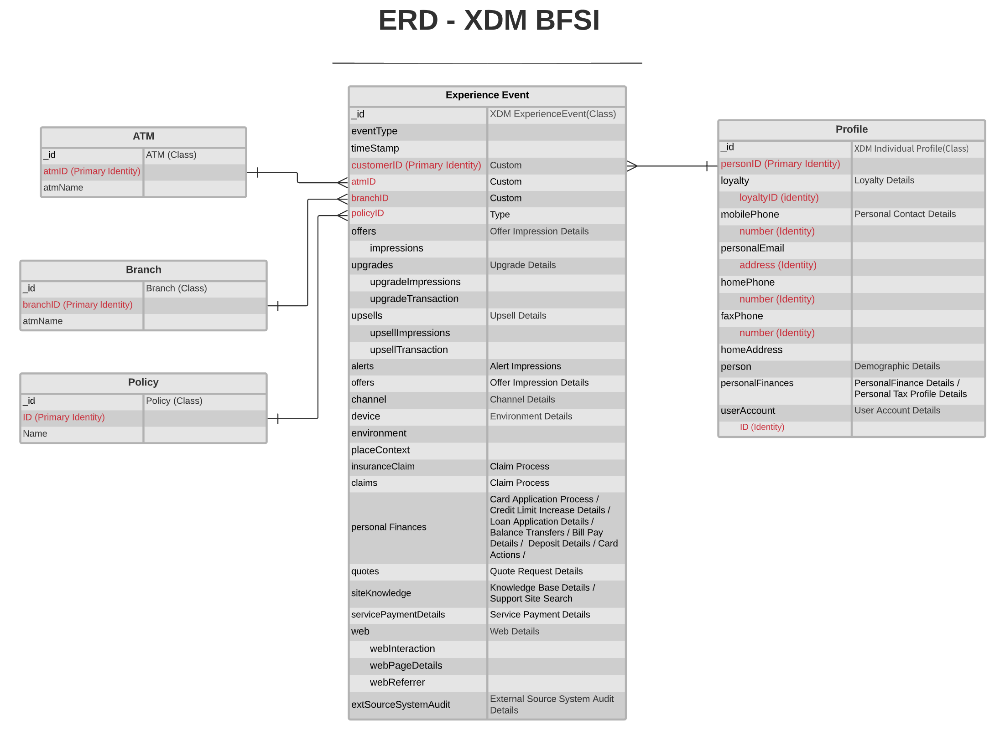

# [!UICONTROL Servicios financieros] ERD del modelo de datos del sector

El siguiente diagrama de relación de entidades (ERD) representa un modelo de datos estandarizado para el sector bancario, de servicios financieros y de seguros (BFSI). El ERD se presenta intencionalmente de manera desnormalizada y teniendo en cuenta cómo se almacenan los datos en Adobe Experience Platform.

>[!NOTE]
>
>El ERD tal como se describe es una recomendación sobre cómo debe modelar los datos para este caso de uso del sector. Para utilizar este modelo de datos en Platform, debe construir los esquemas recomendados y sus relaciones. Consulte las guías sobre la administración de [esquemas](../../ui/resources/schemas.md) y [relaciones](../../tutorials/relationship-ui.md) en la interfaz de usuario para obtener más información.

Utilice la siguiente leyenda para interpretar este ERD:

* Cada entidad mostrada en se basa en una clase [Experience Data Model (XDM) subyacente](../composition.md#class).
* Los campos con sangría debajo de un campo principal representan un campo secundario, o subcampo, que pertenece al grupo de campos del elemento principal.
* Los campos más importantes de una entidad determinada se resaltan en rojo.
* Todas las propiedades que se pueden utilizar para identificar clientes individuales se marcan como &quot;identidad&quot;, con una de estas propiedades marcada como &quot;identidad principal&quot;.
* Las relaciones de entidad se marcan como no dependientes, ya que los eventos basados en cookies a menudo no pueden determinar la persona o individuo que realizó la transacción.

>[!NOTE]
>
>La entidad Evento de experiencia incluye un campo &quot;_ID&quot;, que representa el atributo de identificador único (`_id`) proporcionado por la clase XDM ExperienceEvent. Consulte el documento de referencia sobre [XDM ExperienceEvent](../../classes/experienceevent.md) para obtener más información sobre lo que se espera para este valor.

## Casos de uso de [!UICONTROL Servicios financieros]

En la tabla siguiente se describen las clases recomendadas y los grupos de campos de esquema para varios casos de uso financiero comunes.

| Ejemplo de uso | Clases y grupos de campos recomendados |
| --- | --- |
| Impulse la personalización a escala para segmentos preferidos a través de perspectivas de creación de informes omnicanal y automatice los recorridos para aumentar la inscripción en un programa de recompensas preferido. | <ul><li>**[[!UICONTROL Producto]](../../classes/product.md)**:<ul><li>[[!UICONTROL Categoría del producto]](../../field-groups/product/product-category.md)</li></ul></li><li>**[[!UICONTROL ExperienceEvent de XDM]](../../classes/experienceevent.md)**:<ul><li>[[!UICONTROL Acciones de tarjeta]](../../field-groups/event/card-actions.md)</li><li>[[!UICONTROL Detalles de solicitud de presupuesto]](../../field-groups/event/quote-request-details.md)</li><li>[[!UICONTROL Detalles de depósito]](../../field-groups/event/deposit-details.md)</li><li>[[!UICONTROL Detalles de canal]](../../field-groups/event/channel-details.md)</li><li>[[!UICONTROL Transferencias de saldo]](../../field-groups/event/balance-transfers.md)</li></ul></li><li>**[[!UICONTROL Perfil individual de XDM]](../../classes/individual-profile.md)**:<ul><li>[[!UICONTROL Detalles demográficos]](../../field-groups/profile/demographic-details.md)</li><li>[[!UICONTROL Datos personales de contacto]](../../field-groups/profile/personal-contact-details.md)</li><li>[[!UICONTROL Detalles de fidelización]](../../field-groups/profile/loyalty-details.md)</li></ul></li></ul> |
| Optimice la personalización en canales múltiples en canales en línea y sin conexión. | <ul><li>**[[!UICONTROL Producto]](../../classes/product.md)**:<ul><li>[[!UICONTROL Categoría del producto]](../../field-groups/product/product-category.md)</li></ul></li><li>**[[!UICONTROL ExperienceEvent de XDM]](../../classes/experienceevent.md)**:<ul><li>[[!UICONTROL Detalles de canal]](../../field-groups/event/channel-details.md)</li></ul></li><li>**[[!UICONTROL Perfil individual de XDM]](../../classes/individual-profile.md)**:<ul><li>[[!UICONTROL Detalles demográficos]](../../field-groups/profile/demographic-details.md)</li><li>[[!UICONTROL Datos personales de contacto]](../../field-groups/profile/personal-contact-details.md)</li><li>[[!UICONTROL Detalles de fidelización]](../../field-groups/profile/loyalty-details.md)</li></ul></li></ul> |
| Impulse nuevas oportunidades de ingresos utilizando las perspectivas obtenidas del análisis de comportamiento entre canales, identificando patrones de uso de productos que podrían dar lugar a nuevas ofertas de productos. | <ul><li>**[[!UICONTROL Directiva]](../../classes/policy.md)**</li><li>**[[!UICONTROL Producto]](../../classes/product.md)**:<ul><li>[[!UICONTROL Categoría del producto]](../../field-groups/product/product-category.md)</li></ul></li><li>**[[!UICONTROL ExperienceEvent de XDM]](../../classes/experienceevent.md)**:<ul><li>[[!UICONTROL Acciones de tarjeta]](../../field-groups/event/card-actions.md)</li><li>[[!UICONTROL Búsqueda del sitio de soporte técnico]](../../field-groups/event/support-site-search.md)</li><li>[[!UICONTROL Detalles de depósito]](../../field-groups/event/deposit-details.md)</li><li>[[!UICONTROL Detalles de canal]](../../field-groups/event/channel-details.md)</li></ul></li><li>**[[!UICONTROL Perfil individual de XDM]](../../classes/individual-profile.md)**:<ul><li>[[!UICONTROL Detalles demográficos]](../../field-groups/profile/demographic-details.md)</li><li>[[!UICONTROL Datos personales de contacto]](../../field-groups/profile/personal-contact-details.md)</li><li>[[!UICONTROL Detalles de fidelización]](../../field-groups/profile/loyalty-details.md)</li></ul></li></ul> |
