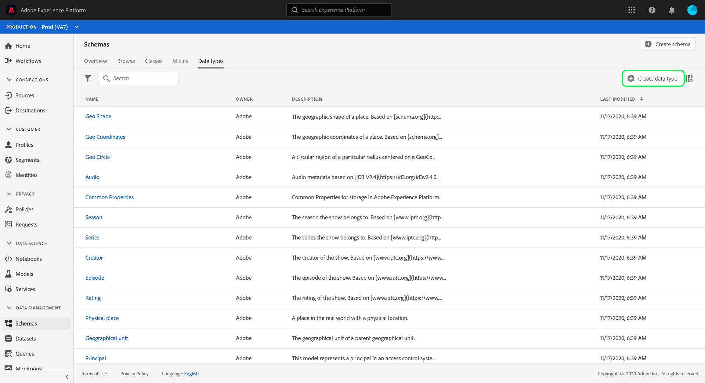

# Creación y edición de tipos de datos mediante la interfaz de usuario del Experience Platform

En el Modelo de datos de experiencia (XDM), los tipos de datos se utilizan como campos de tipo de referencia en clases o mezclas de la misma manera que los campos literales básicos. La diferencia clave es que los tipos de datos pueden definir varios subcampos. Aunque son similares a las mezclas, ya que permiten el uso coherente de una estructura de varios campos, los tipos de datos son más flexibles porque pueden incluirse en cualquier parte de la estructura de esquema, mientras que las mezclas sólo pueden agregarse en el nivel raíz.

Adobe Experience Platform proporciona muchos tipos de datos estándar que pueden utilizarse para cubrir una amplia variedad de casos de uso comunes de administración de experiencias. Sin embargo, también puede definir sus propios tipos de datos personalizados para satisfacer sus necesidades comerciales únicas.

Este tutorial trata los pasos para crear y editar tipos de datos personalizados en la interfaz de usuario de la plataforma.

## Requisitos previos 

Este tutorial requiere un conocimiento práctico del sistema XDM. Consulte la descripción general [de](../home.md) XDM para obtener una introducción a la función de XDM dentro del ecosistema del Experience Platform y los [conceptos básicos de la composición](../schema/composition.md) del esquema para saber cómo los tipos de datos contribuyen a los esquemas XDM.

Aunque no es necesario para este tutorial, se recomienda que también siga el tutorial sobre la [composición de un esquema en la interfaz de usuario](./-schema-ui.md) para familiarizarse con las diversas funciones de la [!DNL Schema Editor].

## Abrir el [!DNL Schema Editor] para un tipo de datos

En la interfaz de usuario de la plataforma, seleccione **[!UICONTROL Esquemas]** en el panel de navegación izquierdo para abrir el espacio de trabajo de [!UICONTROL Esquemas] y, a continuación, seleccione la ficha Tipos **[!UICONTROL de]** datos. Se muestra una lista de los tipos de datos disponibles, incluidos los definidos por el Adobe y los creados por la organización.

Desde aquí tiene dos opciones:

* [Crear un nuevo tipo de datos](#create)
* [Seleccione un tipo de datos existente para editar](#edit)

### Crear un nuevo tipo de datos {#create}

En la ficha Tipos **[!UICONTROL de]** datos, seleccione **[!UICONTROL Crear tipo]** de datos.

Aparece [!DNL Schema Editor] , mostrando la estructura actual del nuevo tipo de datos en el lienzo. En el lado derecho del editor, puede proporcionar un nombre para mostrar y una descripción opcional para el tipo de datos. Asegúrese de proporcionar un nombre único y conciso para el tipo de datos, ya que así es como se identificará al agregarlo a un esquema.

Este tutorial crea un tipo de datos que describe una propiedad de restaurante, por lo que al tipo de datos se le asigna el nombre para mostrar &quot;Restaurante&quot;.

Avance hasta la [siguiente sección](#add-fields) del inicio agregando campos al tipo de datos.

### Editar un tipo de datos existente

Solo se pueden editar los tipos de datos personalizados definidos por la organización. Para reducir la lista mostrada, seleccione el icono de filtro (icono) para mostrar los controles de filtrado según el [!UICONTROL propietario]. Seleccione **[!UICONTROL Cliente]** para mostrar solo los tipos de datos personalizados que posee su organización.

Seleccione el tipo de datos que desea editar en la lista para abrir el carril derecho, mostrando los detalles del tipo de datos. Seleccione el nombre del tipo de datos en el carril derecho para abrir su estructura en el [!DNL Schema Editor].

## Añadir campos al tipo de datos {#add-fields}

Para agregar campos al tipo de datos en inicio, seleccione el icono **más (+)** junto al campo de nivel raíz en el lienzo. A continuación aparece un nuevo campo y el carril correcto se actualiza para mostrar los controles del nuevo campo.

Utilice los controles de carril derecho para proporcionar un nombre **[!UICONTROL de]** campo, un nombre **[!UICONTROL para]** mostrar y un **[!UICONTROL tipo]** para el campo. Tenga en cuenta que el tipo de campo puede ser un tipo escalar básico (como una cadena, un entero o un booleano), o puede representar otro tipo de datos de varios campos definido por Adobe o su organización.

El tipo de datos Restaurante requiere un campo de cadena para representar el nombre del restaurante. Como tal, el nombre [!UICONTROL del] campo se establece como &quot;nombre&quot; y el [!UICONTROL tipo] se establece como [!UICONTROL cadena]. Seleccione **[!UICONTROL Aplicar]** para aplicar los cambios al campo.

Continúe siguiendo el mismo proceso para agregar campos adicionales, empezando por seleccionar el icono **más (+)** junto al campo de nivel raíz y proporcionando los detalles de configuración en el carril derecho.

El tipo de datos del Restaurante ahora tiene campos adicionales para marca, capacidad de asiento y espacio en el suelo.

Además de los campos básicos, también puede anidar tipos de datos adicionales dentro del tipo de datos personalizado. Por ejemplo, el tipo de datos Restaurante requiere un campo que represente la dirección física de la propiedad. En este escenario, puede agregar un nuevo campo &quot;dirección&quot; al que se asigna el tipo de datos estándar &quot;direcciónpostal&quot;.

Esto demuestra la flexibilidad de los tipos de datos en cuanto a la descripción de los datos: los tipos de datos pueden emplear campos que también son tipos de datos, que pueden contener otros tipos de datos, etc. Esto le permite abstraer y reutilizar patrones de datos comunes en sus esquemas XDM, lo que facilita la representación de estructuras de datos complejas.

Una vez que haya terminado de agregar campos al tipo de datos, seleccione **[!UICONTROL Guardar]** para guardar los cambios y agregar el tipo de datos al [!DNL Schema Library].

## Añadir el tipo de datos en una mezcla

Una vez creado el tipo de datos, puede usar el inicio en sus esquemas. Dado que los esquemas XDM están compuestos por una clase y cero o más mezclas, los campos proporcionados por un tipo de datos no se pueden agregar directamente a un esquema. En su lugar, deben incluirse en una clase o en una mezcla.

>[!NOTE]
>
>Esta sección se centra en agregar un tipo de datos a una mezcla, ya que este es el patrón más común para los tipos de datos personalizados. Sin embargo, también puede aplicar los mismos pasos para agregar el tipo de datos a una clase.

Puede agregar el tipo de datos a una mezcla existente o crear una mezcla nueva por completo. En cualquier caso, debe abrir el [!DNL Schema Editor] para un esquema al que desee agregar el nuevo tipo de datos, ya sea seleccionando un esquema existente en la ficha **[!UICONTROL Examinar]** o creando un nuevo esquema por completo.

Una vez abierto el esquema en la barra [!DNL Schema Editor], seleccione la mezcla a la que desea agregar el tipo de datos en la barra de la izquierda. Si el esquema no tiene una mezcla adecuada, siga los pasos para [crear una nueva mezcla](./create-schema-ui.md#define-mixin) para añadirla al esquema y asegúrese de que la mezcla está seleccionada en el carril izquierdo.

Seleccione el icono **más (+)** junto al nombre del esquema para agregar un nuevo campo a la mezcla seleccionada. Al seleccionar la propiedad **[!UICONTROL Type]** para el campo, el nombre del tipo de datos que creó anteriormente ya está disponible en la lista desplegable. Puede escribir en inicio el nombre del tipo de datos para facilitar su localización.

Seleccione el tipo de datos en la lista y, a continuación, seleccione **[!UICONTROL Aplicar]**. El campo esquema se actualiza en el lienzo para mostrar los subcampos estructurados proporcionados por el tipo de datos. Si guarda el esquema seleccionando **[!UICONTROL Guardar]**, la mezcla también se guarda, permitiéndole reutilizar la mezcla en esquemas adicionales pertenecientes a la misma clase.

>[!NOTE]
>
>Las mezclas solo son compatibles con una clase. Si desea utilizar el tipo de datos en esquemas adicionales basados en diferentes clases, debe seguir los pasos anteriores para agregar el tipo de datos a mezclas adicionales destinadas a ampliar esas clases.

## Pasos siguientes

En este tutorial se explica cómo crear y editar tipos de datos y cómo agregarlos a las mezclas mediante el [!DNL Schema Editor]. Para obtener más información sobre el trabajo con tipos de datos en la interfaz de usuario, incluida la conversión de un objeto de varios campos en un tipo de datos, consulte el tutorial [de creación de](./create-schema-ui.md#datatype)esquema.

Para obtener información sobre cómo crear un tipo de datos mediante la API del Registro de Esquema, consulte la guía [de extremo de tipos de](../api/data-types.md#create)datos.