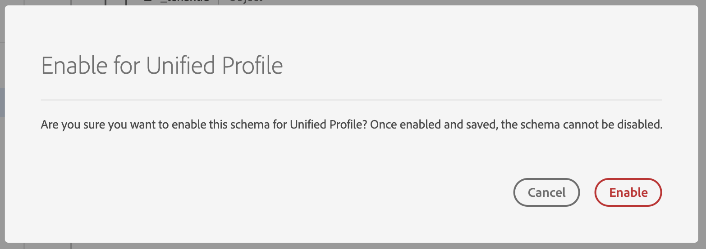

# Creación de un esquema con el Editor de Esquemas

El Registro de Esquema proporciona una interfaz de usuario y una API RESTful desde la que puede realizar la vista y la gestión de todos los recursos en la biblioteca de Esquemas de Adobe Experience Platform. La biblioteca de Esquemas contiene los recursos que Adobe, los socios de la plataforma de experiencia y los proveedores cuyas aplicaciones utiliza, así como los recursos que define y guarda en el Registro de Esquema.

En este tutorial se explican los pasos para crear un esquema con el Editor de Esquemas en la plataforma de experiencia. Si prefiere componer un esquema con la API de Registro de Esquema, lea la guía [para desarrolladores de](../api/getting-started.md) Esquema Registry antes de intentar el tutorial para [crear un esquema con la API](create-schema-api.md).

Este tutorial también incluye pasos para [definir una nueva clase](#create-new-class) que puede utilizar para componer un esquema.

## Primeros pasos

Este tutorial requiere un conocimiento práctico de los distintos aspectos de la plataforma de Adobe Experience Platform relacionados con el uso del Editor de Esquemas. Antes de comenzar este tutorial, consulte la documentación de los siguientes conceptos:

* [Modelo de datos de experiencia (XDM)](../home.md): El marco estandarizado por el cual Platform organiza los datos de experiencia del cliente.
* [Conceptos básicos de la composición](../schema/composition.md)de esquemas: Información general sobre los esquemas XDM y sus componentes, incluidas clases, mezclas, tipos de datos y campos.
* [Perfil](../../profile/home.md)del cliente en tiempo real: Proporciona un perfil de consumo unificado y en tiempo real basado en datos agregados de varias fuentes.

Este tutorial requiere que tenga acceso a la plataforma de experiencias. Si no tiene acceso a una organización de IMS en la plataforma de experiencia, póngase en contacto con el administrador del sistema antes de continuar.

## Examinar esquemas existentes en el espacio de trabajo Esquemas

El espacio de trabajo Esquemas de la plataforma de experiencias proporciona una visualización de la biblioteca de Esquemas, lo que le permite realizar vistas y administrar todos los esquemas disponibles, así como componer otros nuevos. El espacio de trabajo también incluye el Editor de Esquemas, el lienzo en el que se compondrá un esquema a lo largo de este tutorial.

Después de iniciar sesión en la plataforma de experiencia, haga clic en **Esquemas** en el panel de navegación izquierdo y se le dirigirá al espacio de trabajo Esquemas. Verá una lista de esquemas (una representación de la biblioteca de Esquemas) en la que podrá realizar vistas, administrar y personalizar todos los esquemas disponibles. La lista incluye el nombre, el tipo, la clase y el comportamiento (registro o serie temporal) en los que se basa el esquema, así como la fecha y la hora en que se modificó el esquema por última vez.

Haga clic en el icono de filtro situado junto a la barra de búsqueda para utilizar las capacidades de filtrado de todos los recursos del Registro, incluidos los tipos de datos, las clases y las mezclas.

## Crear y asignar un nombre a un esquema

Para empezar a componer un esquema, haga clic en **Crear Esquema** en la esquina superior derecha del espacio de trabajo Esquemas.

Aparece el Editor ** de Esquemas. Este es el lienzo sobre el cual compondrás tu esquema. Al llegar al editor, se crea automáticamente un &quot;Esquema sin título&quot; en la sección *Estructura* del lienzo para que pueda empezar a personalizarlo.

A la derecha del editor se encuentran las Propiedades *del* Esquema, donde puede proporcionar un nombre para el esquema (mediante el campo Nombre **para** mostrar). Una vez introducido un nombre, el lienzo se actualiza para reflejar el nuevo nombre del esquema.

A la hora de decidir un nombre para el esquema, hay que tener en cuenta varias consideraciones importantes:

* Los nombres de los Esquemas deben ser cortos y descriptivos para que el esquema pueda encontrarse fácilmente en la biblioteca más adelante.
* Los nombres de los Esquemas deben ser únicos, lo que significa que también deben ser lo suficientemente específicos como para que no se vuelvan a utilizar en el futuro. Por ejemplo: si su organización tiene programas de lealtad separados para diferentes marcas, sería aconsejable nombrar a su esquema &quot;Miembros de lealtad de la marca A&quot; para que sea más fácil distinguir de otros esquemas relacionados con la lealtad que pueda definir más adelante.
* De forma opcional, puede proporcionar información adicional sobre el esquema mediante el campo **Descripción** .

Este tutorial contiene un esquema para ingestar datos relacionados con los miembros de un programa de lealtad, por lo que el esquema se denomina &quot;Miembros de lealtad&quot;.

## Asignar una clase

A la izquierda del editor se encuentra la sección *Composición* . Actualmente contiene dos subsecciones: *Esquema* y *clase*.

Ahora que el esquema tiene un nombre, es hora de asignar la clase que el esquema va a implementar. Haga clic en **Asignar** junto a *Clase*.

Aparecerá el cuadro de diálogo *Asignar clase* . Esta ventana muestra una lista de todas las clases disponibles, incluidas las definidas por su organización (el propietario es &quot;Cliente&quot;), así como las clases estándar definidas por Adobe.

Haga clic en el nombre de clase para mostrar la descripción de la clase. También puede elegir **Previsualización de la estructura** de clases para ver los campos y metadatos asociados a la clase.

Este tutorial utiliza la clase de Perfil XDM Individual. Haga clic en el botón de radio situado junto a la clase para seleccionarla y, a continuación, haga clic en **Asignar clase**.

El lienzo vuelve a aparecer. La sección *Clase* ahora contiene la clase seleccionada (Perfil individual XDM) y los campos que aporta la clase de Perfil individual XDM ahora están visibles en la sección *Estructura* .

Los campos aparecen con el formato &quot;fieldName&quot;| Tipo de datos&quot;. Los pasos para definir los campos de esquema en la interfaz de usuario se proporcionan más adelante en este tutorial.

>[!NOTE] Puede [cambiar la clase de un esquema](#change-class) en cualquier momento durante el proceso de composición inicial antes de guardar el esquema, pero esto debe hacerse con extrema precaución. Las mezclas solo son compatibles con determinadas clases, por lo que al cambiar la clase se restablecerán el lienzo y los campos que se hayan agregado.

## Añadir una mezcla

Ahora que se ha asignado una clase, la sección *Composición* contiene una tercera subsección: *Mezclas*.

Ahora puede empezar a agregar campos al esquema agregando mezclas. Una mezcla es un grupo de uno o más campos que describen un concepto en particular. Este tutorial utiliza mezclas para describir los miembros del programa de lealtad y capturar información clave como nombre, cumpleaños, número de teléfono, dirección, etc.

Para agregar una mezcla, haga clic en **Añadir** en la subsección *Mezclas* .

Aparecerá el cuadro de diálogo *Añadir mezcla* . Las mezclas solo están destinadas a utilizarse con clases específicas, por lo que la lista de mezclas muestra solo las compatibles con la clase seleccionada (en este caso, la clase de Perfil individual XDM).

Si selecciona el botón de radio junto a una mezcla, tendrá la opción de **Previsualización de la estructura** de la mezcla. Seleccione la mezcla &quot;Detalles de persona de Perfil&quot; y haga clic en **Añadir mezcla**.

El lienzo del esquema vuelve a aparecer. La sección *Mezclas* ahora lista la mezcla &quot;Detalles de persona de Perfil&quot; y la sección *Estructura* incluye los campos que la mezcla aporta.

Esta combinación aporta varios campos bajo el nombre de nivel superior &quot;persona&quot; con el tipo de datos &quot;Persona&quot;. Este grupo de campos describe información sobre un individuo, incluido el nombre, la fecha de nacimiento y el sexo.

>[!NOTE] Recuerde que los campos pueden utilizar tipos escalares (como cadena, entero, matriz o fecha) como tipo de datos, así como cualquier &quot;tipo de datos&quot; (un grupo de campos que representan un concepto común) en el Registro de Esquemas.

Observe que el campo &quot;nombre&quot; tiene un tipo de datos de &quot;Nombre de la persona&quot;, lo que significa que también describe un concepto común y contiene subcampos relacionados con el nombre, como nombre, apellidos y nombre completo.

Haga clic en diferentes campos dentro del lienzo para ver los campos adicionales que contribuyen a la estructura de esquema.

## Añadir otra mezcla

Ahora puede repetir los mismos pasos para agregar otra mezcla. Cuando esta vez vista el cuadro de diálogo *Añadir mezcla* , tenga en cuenta que la combinación &quot;Detalles de persona de Perfil&quot; se ha atenuado y que el botón de radio situado junto a él no se puede seleccionar. Esto evita que usted duplique accidentalmente las mezclas que ya ha incluido en el esquema actual.

Ahora puede añadir la combinación &quot;Datos personales de Perfil&quot; desde el cuadro de diálogo *Añadir mezcla* .

Una vez agregado, el lienzo vuelve a aparecer. Los &quot;Detalles personales de Perfil&quot; ahora se enumeran en *Mezclas* en la sección *Composición* , y los campos de dirección de casa, teléfono móvil, y más se han agregado en *Estructura*.

De forma similar al campo &quot;nombre&quot;, los campos que acaba de agregar representan conceptos de varios campos. Por ejemplo, &quot;homeAddress&quot; tiene un tipo de datos de &quot;Address&quot; y &quot;mobilePhone&quot; tiene un tipo de datos de &quot;Phone Number&quot;. Puede hacer clic en cada uno de estos campos para expandirlos y ver los campos adicionales incluidos en el tipo de datos.

## Definir una nueva mezcla

El esquema &quot;Miembros de lealtad&quot; tiene como objetivo capturar datos relacionados con los miembros de un programa de lealtad, por lo que requerirá algunos campos específicos relacionados con la lealtad. No hay mezclas estándar disponibles que contengan los campos necesarios, por lo tanto deberá definir una nueva mezcla.

Esta vez, cuando abra el cuadro de diálogo *Añadir mezcla* , seleccione **Crear nueva combinación**. Luego se le pedirá que proporcione un **Nombre** para mostrar y una **Descripción** para la mezcla.

Al igual que con los nombres de clase, el nombre de la mezcla debe ser corto y simple, describiendo lo que la mezcla contribuirá al esquema. Estos también son únicos, por lo que no podrá reutilizar el nombre y, por lo tanto, debe asegurarse de que sea lo suficientemente específico.

Para este tutorial, asigne un nombre a la nueva combinación &quot;Detalles de lealtad&quot;.

Haga clic en **Añadir mezcla** para volver al editor de esquemas. &quot;Detalles de lealtad&quot; debería aparecer ahora en *Mezclas* en la parte izquierda del lienzo, pero todavía no hay campos asociados a él y por lo tanto no aparecen campos nuevos en *Estructura*.

## Añadir campos a la mezcla

Ahora que ha creado la mezcla &quot;Detalles de Lealtad&quot;, es hora de definir los campos que la mezcla contribuirá al esquema.

Para comenzar, haga clic en el nombre de la mezcla en la sección *Mezclas* . Una vez hecho esto, *las Propiedades* de la mezcla aparecerán en la parte derecha del editor y aparecerá un botón **Añadir campo** junto al nombre del esquema en *Estructura*.

Haga clic en **Añadir campo** junto a &quot;Miembros de lealtad&quot; para crear un nuevo nodo en la estructura. Este nodo (denominado &quot;_inquilinoId&quot; en este ejemplo) representa el ID de inquilino de la organización de IMS, precedido de un guion bajo. La presencia de la ID de inquilino indica que los campos que está agregando están contenidos en la Área de nombres de su organización.

En otras palabras, los campos que está agregando son exclusivos de su organización y se van a guardar en el Registro de Esquemas en un área específica a la que sólo pueda acceder su organización IMS. Los campos que defina siempre deben agregarse a la Área de nombres para evitar conflictos con nombres de otras clases estándar, mezclas, tipos de datos y campos.

Dentro de ese nodo con espacio de nombres hay un &quot;Nuevo campo&quot;. Este es el comienzo de la mezcla de &quot;Detalles de Lealtad&quot;.

Mediante el uso de Propiedades *de* campo en la parte derecha del editor, cree un campo de &quot;lealtad&quot; con el tipo &quot;Objeto&quot; que se utilizará para mantener los campos relacionados con la lealtad. Cuando termine, haga clic en **Aplicar**.

Los cambios se aplican y aparece el nuevo objeto de &quot;lealtad&quot;. Haga clic en **Añadir campo** junto al objeto para agregar campos adicionales relacionados con la lealtad. Aparece un &quot;Nuevo campo&quot; y la sección Propiedades *del* campo está visible en el lado derecho del lienzo.

Cada campo requiere la siguiente información:

* **Nombre del campo:** Nombre del campo, escrito en caso de camello. Ejemplo: loyaltyLevel
* **Nombre para mostrar:** Nombre del campo, escrito en caso de título. Ejemplo: Nivel de fidelidad
* **Tipo:** Tipo de datos del campo. Esto incluye tipos escalares básicos y cualquier tipo de datos definido en el Registro de Esquemas. Ejemplos: cadena, entero, booleano, Persona, Dirección, Número de teléfono, etc.
* **Descripción:** Debe incluirse una descripción opcional del campo, escrita en caso de sentencia. (200 caracteres como máximo)

El primer campo del objeto Lealtad será una cadena denominada &quot;loyaltyId&quot;. Al establecer el tipo del nuevo campo en &quot;Cadena&quot;, la ventana Propiedades *del* campo se llena con varias opciones para aplicar restricciones, como Valor **** predeterminado, **Formato** y Longitud **** máxima.

Hay diferentes opciones de restricción disponibles según el tipo de datos seleccionado. Dado que &quot;loyaltyId&quot; será una dirección de correo electrónico, seleccione &quot;email&quot; en el menú desplegable **Formato** . Seleccione **Aplicar** para aplicar los cambios.

## Añadir más campos para mezclar

Ahora que ha agregado el campo &quot;loyaltyId&quot;, puede agregar campos adicionales para capturar información relacionada con la lealtad como:

* Puntos (entero)
* Miembro desde (fecha)

Para agregar cada campo, haga clic en **Añadir campo** en el objeto de lealtad y rellene la información requerida.

Una vez finalizado, el objeto Lealtad contendrá campos para: ID de lealtad, puntos y miembros desde entonces.

## Añadir el campo &#39;enum&#39; a la mezcla

Al definir campos en el Editor de Esquemas, existen algunas opciones adicionales que puede aplicar a los tipos de campo básicos para proporcionar restricciones adicionales en los datos que el campo puede contener.

Un ejemplo de esto sería un campo &quot;Nivel de lealtad&quot;, donde el valor sólo puede ser una de las cuatro opciones posibles. Para agregar este campo al esquema, haga clic en **Añadir campo** al lado del objeto &quot;lealtad&quot; y rellene los campos requeridos en Propiedades *del campo*.

Para **Tipo**, seleccione &quot;Cadena&quot; y verá casillas de verificación adicionales para **Matriz**, **Enum** e **Identidad**.

Seleccione la casilla **Enum** para abrir la sección Valores *de* enumeración que aparece a continuación. Aquí puede introducir el **valor** (en camelCase) y la **etiqueta** (un nombre opcional y fácil de leer en el caso del título) para cada nivel de lealtad aceptable.

Cuando haya completado todas las propiedades del campo, haga clic en **Aplicar** y el campo &quot;loyaltyLevel&quot; se agregará al objeto &quot;loyalty&quot;.

Más información sobre las restricciones adicionales disponibles:

* **Requerido:** Indica que el campo es obligatorio para la ingesta de datos. Cualquier dato cargado en un conjunto de datos basado en este esquema que no contenga este campo fallará durante la ingestión.
* **Matriz:** Indica que el campo contiene una matriz de valores, cada uno con el tipo de datos especificado. Por ejemplo, si selecciona un tipo de datos de &quot;Cadena&quot; y marca la casilla &quot;Matriz&quot; significa que el campo contendrá una matriz de cadenas.
* **Enum:** Indica que este campo debe contener uno de los valores de una lista enumerada de valores posibles.
* **Identidad:** Indica que este campo es un campo de identidad. Más información sobre los campos de identidad se proporciona [más adelante en este tutorial](#identity-field).

## Conversión de un objeto de varios campos en un tipo de datos

Después de agregar varios campos específicos de lealtad, el objeto &quot;loyalty&quot; ahora contiene una estructura de datos común que podría ser útil en otros esquemas.

Cuando considere que una estructura de varios campos puede ser reutilizable y le gustaría tener la flexibilidad de usar esa misma estructura de datos en otro lugar, el Editor de Esquema permite convertir esa estructura en un tipo de datos.

Los tipos de datos permiten el uso coherente de estructuras de varios campos y proporcionan más flexibilidad que una mezcla, ya que se pueden utilizar en cualquier lugar dentro de un esquema. Esto se realiza estableciendo el **tipo** de un campo en una combinación con el tipo de datos definido en el Registro.

Para convertir el objeto &quot;lealtad&quot; en un tipo de datos, haga clic en el campo &quot;lealtad&quot; en *Estructura* y seleccione **Convertir en nuevo tipo** de datos en el lado derecho del editor en Propiedades *del* campo. Aparece una pequeña ventana emergente verde que confirma &quot;Objeto convertido a tipo de datos&quot;.

Ahora, cuando se observa en *Estructura*, se puede ver que el campo &quot;lealtad&quot; tiene un tipo de datos de &quot;Lealtad&quot; y que los campos tienen iconos de bloqueo pequeños junto a ellos, lo que indica que ya no son campos individuales, sino parte de una estructura de varios campos.

En un esquema futuro, ahora se puede asignar un campo al **Tipo** de &quot;Lealtad&quot; y se incluirán automáticamente los campos Nivel de Lealtad, Puntos, Desde Miembro e ID de Lealtad.

## Definición de un campo de esquema como campo de identidad {#identity-field}

Los Esquemas se utilizan para la ingesta de datos en la plataforma de experiencia y, en última instancia, se utilizan para identificar a personas y unir información procedente de múltiples fuentes. Para ayudar con este proceso, los campos clave pueden marcarse como campos &quot;Identidad&quot;.

La plataforma de experiencia facilita la identificación de un campo de identidad mediante el uso de la casilla de verificación **Identidad** en el Editor de Esquemas.

Por ejemplo, puede haber miles de miembros del programa de lealtad que pertenezcan al mismo &quot;nivel&quot;, pero cada miembro del programa de lealtad tiene un &quot;loyaltyId&quot; único (que en este caso es la dirección de correo electrónico del miembro individual). El hecho de que &quot;loyaltyId&quot; sea un identificador único para cada miembro lo convierte en un buen candidato para un campo de identidad, mientras que &quot;level&quot; no lo es.

En la sección *Estructura* del editor, haga clic en el campo &quot;loyaltyId&quot; que ha creado y verá la casilla **Identidad** en Propiedades *del* campo. Marque la casilla y tendrá la opción de establecerla como Identidad **** principal. Marque también esa casilla.

A continuación, debe proporcionar un espacio de nombres **de identidad**. Hay varias Áreas de nombres predefinidas, pero como &quot;loyaltyId&quot; es la dirección de correo electrónico del miembro, seleccione &quot;Correo electrónico&quot; en la lista desplegable. Ahora puede hacer clic en **Aplicar** para confirmar las actualizaciones del campo &quot;loyaltyId&quot;.

Ahora todos los datos ingestados en el campo &quot;loyaltyId&quot; se utilizarán para identificar a esa persona y unir una sola vista de ese cliente.

>[!NOTE] Una vez que un campo de esquema se haya establecido como identidad principal, recibirá un mensaje de error si posteriormente intenta establecer otro campo del esquema como principal. Cada esquema puede contener sólo un campo de identidad principal.

Para obtener más información sobre cómo trabajar con identidades, consulte la documentación de [Identity Service](../../identity-service/home.md) .

<!-- ## Relationship

Schemas define a static view of a concept, but do not provide specific details on how data based on these schemas (datasets, etc) may relate to one another. Adobe Experience Platform allows you to describe these relationships through the **Relationship** checkbox in the schema editor. 

In order to define a relationship, click on the field and check the **Relationship** checkbox on the right-side of the canvas. 

More information about relationships and other schema metadata can be found in the [Schema Registry API Developer Guide](../schema_registry_developer_guide.md). -->

## Habilitar el esquema para utilizarlo en el Perfil del cliente en tiempo real {#profile}

El Editor de Esquemas permite habilitar un esquema para su uso con el Perfil [del cliente en tiempo](../../profile/home.md)real. Perfil proporciona una vista holística de cada cliente mediante la creación de un perfil sólido de 360° de atributos del cliente, así como una cuenta con marca de tiempo de cada interacción que el cliente ha tenido en cualquier sistema integrado con la plataforma de experiencia.

Para que un esquema se pueda utilizar con el Perfil del cliente en tiempo real, debe tener una identidad principal definida. Recibirá un mensaje de error &quot;Falta identidad principal&quot; si intenta habilitar un esquema sin definir primero una identidad principal.

Para habilitar el esquema &quot;Miembros de lealtad&quot; para su uso en Perfil, haga clic en &quot;Miembros de lealtad&quot; en la sección *Estructura* del editor.

A la derecha del editor, en Propiedades *del* Esquema, se muestra información sobre el esquema, incluido su nombre para mostrar, descripción y tipo. Además de esta información, hay un botón de alternancia denominado **Perfil**.

Haga clic en **Perfil** y aparecerá una ventana emergente en la que se le pedirá que confirme que desea habilitar el esquema para Perfil.

>[!NOTE] Una vez que un esquema se ha habilitado para el Perfil del cliente en tiempo real y se ha guardado, no se puede deshabilitar.

## Pasos siguientes

Ahora que ha terminado de componer un esquema &quot;Miembros de lealtad&quot;, puede ver el esquema completo en la sección *Estructura* del editor. Haga clic en **Guardar** y el esquema se guardará en la biblioteca de Esquemas, para que el Registro de Esquemas pueda acceder a él.

El nuevo esquema ahora se puede usar para ingerir datos en la plataforma. Recuerde que una vez que el esquema se ha utilizado para ingestar datos, sólo se pueden realizar cambios aditivos. Consulte los [conceptos básicos de la composición](../schema/composition.md) de esquema para obtener más información sobre el control de versiones de esquemas.

El esquema &quot;Miembros de lealtad&quot; también está disponible para su visualización y administración mediante la API del Registro de Esquemas. Para empezar a trabajar con la API, lea la guía [para desarrolladores de la API de](../api/getting-started.md)Esquema Registry.

## Apéndice

La siguiente información se complementa con el tutorial del Editor de Esquemas.

### Create a new class {#create-new-class}

La plataforma de experiencias proporciona la flexibilidad para definir un esquema en función de una clase exclusiva de su organización.

Abra el cuadro de diálogo *Asignar clase* haciendo clic en **Asignar** en la sección *Clase* del Editor de Esquemas. En el cuadro de diálogo, seleccione **Crear nueva clase**.

A continuación, puede asignar a la nueva clase un nombre **para** mostrar (un nombre corto, descriptivo, único y práctico para la clase), una **descripción** y un **comportamiento** (&quot;Grabar&quot; o &quot;Serie temporal&quot;) para los datos que el esquema definirá.

>[!NOTE] Cuando cree un esquema que implemente una clase definida por su organización, recuerde que las mezclas están disponibles para su uso únicamente con clases compatibles. Como la clase que ha definido es nueva, no hay mezclas compatibles en el cuadro de diálogo *Añadir mezcla* . En su lugar, deberá seleccionar **Crear nueva mezcla** y definir una mezcla para utilizarla con esa clase. La próxima vez que componga un esquema que implemente la nueva clase, la mezcla que definió aparecerá en la lista y estará disponible para su uso.

### Cambiar la clase de un esquema {#change-class}

En cualquier momento durante el proceso de composición de esquema inicial, antes de guardar el esquema, puede cambiar la clase en la que se basa el esquema.

>[!WARNING] Tenga cuidado antes de cambiar la clase. Las mezclas solo son compatibles con determinadas clases, por lo que al cambiar la clase se restablece el lienzo y se eliminan los campos que se hayan agregado a ese punto.

Para cambiar la clase, haga clic en **Asignar** junto a *Clase* en la sección *Composición* del editor.

Cuando se abre el cuadro de diálogo *Asignar clase* , puede elegir una nueva clase de la lista disponible. Haga clic en **Asignar clase** y se abrirá un nuevo cuadro de diálogo en el que se le pedirá que confirme que desea asignar una nueva clase.

Si confirma el cambio de clase, se restablecerá el lienzo y se perderá todo el progreso de la composición.