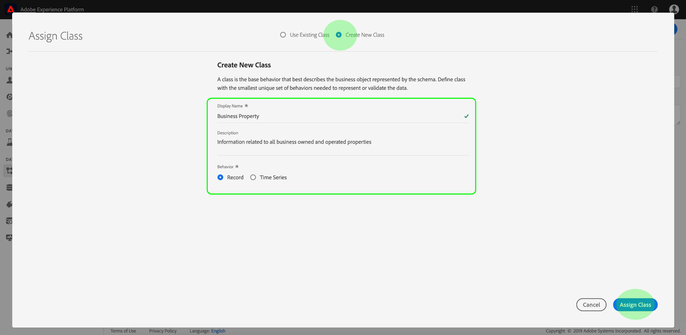

# Cree un esquema con la variable [!DNL Schema Editor]

La interfaz de usuario de Adobe Experience Platform le permite crear y administrar esquemas [!DNL Experience Data Model] (XDM) en un lienzo visual interactivo denominado [!DNL Schema Editor]. En este tutorial se explica cómo crear un esquema con el [!DNL Schema Editor].

>[!NOTE]
>
>Para demostraciones, los pasos de este tutorial incluyen la creación de un esquema de ejemplo que describe a los miembros de un programa de lealtad del cliente. Aunque puede utilizar estos pasos para crear un esquema diferente para sus propios fines, se recomienda que primero siga la creación del esquema de ejemplo para conocer las funciones del [!DNL Schema Editor].

Si prefiere componer un esquema con la [!DNL Schema Registry] API en su lugar, consulte la guía [[!DNL Schema Registry] del](../api/getting-started.md) desarrollador antes de intentar el tutorial sobre la [creación de un esquema con la API](create-schema-api.md).

## Primeros pasos

Este tutorial requiere un conocimiento práctico de los diversos aspectos de Adobe Experience Platform relacionados con la creación de esquemas. Antes de comenzar este tutorial, consulte la documentación de los siguientes conceptos:

* [[!DNL Experience Data Model (XDM)]](../home.md):: El marco normalizado por el cual [!DNL Platform] organiza los datos de experiencia del cliente.
   * [Conceptos básicos de la composición](../schema/composition.md)de esquemas: Información general sobre los esquemas XDM y sus componentes, incluidas clases, mezclas, tipos de datos y campos.
* [[!DNL Real-time Customer Profile]](../../profile/home.md):: Proporciona un perfil de consumo unificado y en tiempo real basado en datos agregados de varias fuentes.

## Abrir el espacio de trabajo de [!UICONTROL Esquemas] {#browse}

El espacio de trabajo [!UICONTROL Esquemas] de la [!DNL Platform] interfaz de usuario proporciona una visualización de la [!DNL Schema Library], lo que le permite administrar vistas de los esquemas disponibles para su organización. El espacio de trabajo también incluye el [!DNL Schema Editor], el lienzo en el que puede componer un esquema a lo largo de este tutorial.

Después de iniciar sesión [!DNL Experience Platform], seleccione **[!UICONTROL Esquemas]** en el panel de navegación izquierdo para abrir el espacio de trabajo de **[!UICONTROL Esquemas]** . La ficha **[!UICONTROL Examinar]** muestra una lista de esquemas (una representación del [!DNL Schema Library]) que se pueden vista y personalizar. La lista incluye el nombre, el tipo, la clase y el comportamiento (registro o serie temporal) en los que se basa el esquema, así como la fecha y la hora en que se modificó el esquema por última vez.

Consulte la guía para [explorar recursos XDM existentes en la interfaz de usuario](./explore.md) para obtener más información.

## Crear y asignar un nombre a un esquema {#create}

Para empezar a componer un esquema, seleccione **[!UICONTROL Crear esquema]** en la esquina superior derecha del espacio de trabajo de **[!UICONTROL Esquemas]** . Aparece un menú desplegable que le ofrece la opción de elegir entre las clases principales [!UICONTROL XDM Perfil] individual y [!UICONTROL XDM ExperienceEvent]. Si estas clases no se ajustan a sus necesidades, también puede seleccionar **[!UICONTROL Examinar]** para elegir entre otras clases disponibles o [crear una nueva clase](#create-new-class).

Para los fines de este tutorial, seleccione Perfil **[!UICONTROL individual]** XDM.

Aparece [!DNL Schema Editor] . Este es el lienzo sobre el cual compondrás tu esquema. Dado que ha seleccionado una clase XDM estándar en la que basar el esquema, se crea automáticamente un esquema sin título en la sección **[!UICONTROL Estructura]** del lienzo al llegar al editor, junto con los campos estándar incluidos en todos los esquemas basados en esa clase. La clase asignada para el esquema también se muestra en **[!UICONTROL Clase]** en la sección **[!UICONTROL Composición]** .

>[!NOTE]
>
>Puede [cambiar la clase de un esquema](#change-class) en cualquier momento durante el proceso de composición inicial antes de guardar el esquema, pero esto debe hacerse con extrema precaución. Las mezclas solo son compatibles con determinadas clases y, por lo tanto, si se cambia la clase, se restablecerán el lienzo y los campos que se hayan agregado.

Utilice los campos del lado derecho del editor para proporcionar un nombre para mostrar y una descripción opcional del esquema. Una vez introducido un nombre, el lienzo se actualiza para reflejar el nuevo nombre del esquema.

A la hora de decidir un nombre para el esquema, hay que tener en cuenta varias consideraciones importantes:

* Los nombres de los esquemas deben ser cortos y descriptivos para que el esquema pueda encontrarse más adelante.
* Los nombres de los esquemas deben ser únicos, lo que significa que también deben ser lo suficientemente específicos como para que no se vuelvan a utilizar en el futuro. Por ejemplo: si su organización tiene programas de lealtad separados para diferentes marcas, sería aconsejable nombrar a su esquema &quot;Miembros de lealtad de la marca A&quot; para que sea más fácil distinguir de otros esquemas relacionados con la lealtad que pueda definir más adelante.
* También puede utilizar la descripción del esquema para proporcionar cualquier información contextual adicional relacionada con el esquema.

Este tutorial contiene un esquema para ingestar datos relacionados con los miembros de un programa de lealtad y, por lo tanto, el esquema se denomina &quot;Miembros de lealtad&quot;.

## Añadir una mezcla {#mixin}

Ahora puede empezar a agregar campos al esquema agregando mezclas. Una mezcla es un grupo de uno o más campos que se utilizan a menudo juntos para describir un concepto en particular. Este tutorial utiliza mezclas para describir los miembros del programa de lealtad y capturar información clave como nombre, cumpleaños, número de teléfono, dirección, etc.

Para agregar una mezcla, seleccione **[!UICONTROL Añadir]** en la subsección **[!UICONTROL Mezclas]** .

Aparece un nuevo cuadro de diálogo, que muestra una lista de mezclas disponibles. Cada mezcla está destinada únicamente a utilizarse con una clase específica, por lo que el cuadro de diálogo sólo lista mezclas compatibles con la clase seleccionada (en este caso, la [!DNL XDM Individual Profile] clase). Si utiliza una clase XDM estándar, la lista de mezclas se ordenará de forma inteligente en función de la popularidad del uso.

La selección de una mezcla de la lista hace que aparezca en el carril derecho. Puede seleccionar varias mezclas si lo desea, agregando cada una a la lista en el carril derecho antes de confirmar. Además, aparece un icono en el lado derecho de la mezcla seleccionada que le permite realizar una previsualización de la estructura de los campos que proporciona.

Al previsualizar una mezcla, se proporciona una descripción detallada del esquema de la mezcla en el carril derecho. También puede navegar por los campos de la mezcla en el lienzo proporcionado. Al seleccionar campos diferentes, se actualiza el carril correcto para mostrar detalles sobre el campo en cuestión. Seleccione **[!UICONTROL Atrás]** cuando termine de obtener una vista previa para volver al cuadro de diálogo de selección de mezcla.

Para este tutorial, seleccione la mezcla de detalles **** demográficos y, a continuación, seleccione **[!UICONTROL Añadir mezcla]**.

El lienzo del esquema vuelve a aparecer. La sección **[!UICONTROL Mixins]** ahora lista &quot;Detalles[!UICONTROL demográficos]&quot; y la sección **[!UICONTROL Estructura]** incluye los campos que la mezcla aporta. Puede seleccionar el nombre de la mezcla en la sección **[!UICONTROL Mezclas]** para resaltar los campos específicos que proporciona dentro del lienzo.

Esta combinación aporta varios campos bajo el nombre de nivel superior `person` con el tipo de datos &quot;[!UICONTROL Persona]&quot;. Este grupo de campos describe información sobre un individuo, incluido el nombre, la fecha de nacimiento y el sexo.

>[!NOTE]
>
>Recuerde que los campos pueden utilizar tipos escalares (como cadena, entero, matriz o fecha), así como cualquier tipo de datos (un grupo de campos que representa un concepto común) definido dentro del [!DNL Schema Registry].

Observe que el `name` campo tiene un tipo de datos de &quot;Nombre de la[!UICONTROL persona]&quot;, lo que significa que también describe un concepto común y contiene subcampos relacionados con el nombre, como nombre, apellidos, título de cortesía y sufijo.

Seleccione los diferentes campos dentro del lienzo para mostrar los campos adicionales que contribuyen a la estructura de esquema.

## Añadir otra mezcla {#mixin-2}

Ahora puede repetir los mismos pasos para agregar otra mezcla. Cuando esta vez vista el cuadro de diálogo **[!UICONTROL Añadir mezcla]** , observe que la combinación de &quot;Detalles[!UICONTROL demográficos]&quot; se ha atenuado y que la casilla de verificación situada junto a él no se puede seleccionar. Esto evita que usted duplique accidentalmente las mezclas que ya ha incluido en el esquema actual.

Para este tutorial, seleccione la mezcla &quot;[!DNL Personal Contact Details]&quot; en el cuadro de diálogo y, a continuación, seleccione **[!UICONTROL Añadir mezcla]** para agregarla al esquema.

Una vez agregado, el lienzo vuelve a aparecer. &quot;Detalles[!UICONTROL de contacto]personal&quot; ahora aparece en **[!UICONTROL Mezclas]** en la sección **[!UICONTROL Composición]** , y los campos para la dirección doméstica, el teléfono móvil y más se han agregado en **[!UICONTROL Estructura]**.

De forma similar al `name` campo, los campos que acaba de agregar representan conceptos de varios campos. Por ejemplo, `homeAddress` tiene un tipo de datos de &quot;direcciónpostal&quot; y `mobilePhone` tiene un tipo de datos de &quot;número[!UICONTROL de]teléfono&quot;. Puede seleccionar cada uno de estos campos para expandirlos y ver los campos adicionales incluidos en el tipo de datos.

## Definir una nueva mezcla {#define-mixin}

El esquema &quot;Miembros[!UICONTROL de la]lealtad&quot; pretende capturar datos relacionados con los miembros de un programa de lealtad, por lo que requerirá algunos campos específicos relacionados con la lealtad. No hay mezclas estándar disponibles que contengan los campos necesarios, por lo tanto deberá definir una nueva mezcla.

Esta vez, cuando abra el cuadro de diálogo **[!UICONTROL Añadir mezcla]** , seleccione **[!UICONTROL Crear nueva combinación]**. Luego se le pedirá que proporcione un nombre para mostrar y una descripción para la mezcla.

Al igual que con los nombres de clase, el nombre de la mezcla debe ser corto y simple, describiendo lo que la mezcla contribuirá al esquema. Estos también son únicos, por lo que no podrá reutilizar el nombre y, por lo tanto, debe asegurarse de que sea lo suficientemente específico.

Para este tutorial, asigne un nombre a la nueva combinación &quot;Detalles de lealtad&quot;.

Seleccione **[!UICONTROL Añadir mezcla]** para volver a la [!DNL Schema Editor]. &quot;Detalles[!UICONTROL de]lealtad&quot; debería aparecer ahora en **[!UICONTROL Mezclas]** en la parte izquierda del lienzo, pero todavía no hay campos asociados a él y por lo tanto no aparecen campos nuevos en **[!UICONTROL Estructura]**.

## Añadir campos a la mezcla {#mixin-fields}

Ahora que ha creado la mezcla &quot;Detalles de Lealtad&quot;, es hora de definir los campos que la mezcla contribuirá al esquema.

Para comenzar, seleccione el nombre de la mezcla en la sección **[!UICONTROL Mezclas]** . Una vez realizado esto, las propiedades de la mezcla aparecen en la parte derecha del editor y aparece un **signo más (+)** junto al nombre del esquema en **[!UICONTROL Estructura]**.

Seleccione el icono **más (+)** junto a &quot;[!DNL Loyalty Members]&quot; para crear un nuevo nodo en la estructura. Este nodo (denominado `_tenantId` en este ejemplo) representa la ID de inquilino de la organización de IMS, precedida por un guion bajo. La presencia de la ID de inquilino indica que los campos que está agregando están contenidos en la Área de nombres de su organización.

En otras palabras, los campos que está agregando son exclusivos de su organización y se van a guardar en el [!DNL Schema Registry] en un área específica a la que solo pueda acceder su organización. Los campos que defina siempre deben agregarse a la Área de nombres del inquilino para evitar conflictos con nombres de otras clases estándar, mezclas, tipos de datos y campos.

Dentro de ese nodo con espacio de nombres hay un &quot;[!UICONTROL nuevo campo]&quot;. Este es el comienzo de la combinación de &quot;Detalles[!UICONTROL de]Lealtad&quot;.

Con los controles del lado derecho del editor, cree un `loyalty` campo con el tipo &quot;[!UICONTROL Objeto]&quot; que se utilizará para mantener los campos relacionados con la lealtad. Cuando termine, seleccione **[!UICONTROL Aplicar]**.

Los cambios se aplican y aparece el `loyalty` objeto recién creado. Seleccione el icono **más (+)** junto al objeto para agregar campos adicionales relacionados con la lealtad. Aparece un &quot;[!UICONTROL Nuevo campo]&quot; y la sección de propiedades **[!UICONTROL de]** campo está visible en la parte derecha del lienzo.

Cada campo requiere la siguiente información:

* **[!UICONTROL Nombre]del campo:** Nombre del campo, escrito en caso de camello. Ejemplo: loyaltyLevel
* **[!UICONTROL Nombre]para mostrar:** Nombre del campo, escrito en caso de título. Ejemplo: Nivel de fidelidad
* **[!UICONTROL Tipo]:** Tipo de datos del campo. Esto incluye los tipos escalares básicos y cualquier tipo de datos definido en el [!DNL Schema Registry]. Ejemplos: [!UICONTROL Cadena], [!UICONTROL Entero], [!UICONTROL Booleano], [!UICONTROL Persona], [!UICONTROL Dirección], Número de teléfono, etc.
* **[!UICONTROL Descripción]:** Se debe incluir una descripción opcional del campo, escrita en caso de sentencia, con un máximo de 200 caracteres.

El primer campo del `Loyalty` objeto será una cadena llamada `loyaltyId`. Al establecer el tipo del nuevo campo en &quot;[!UICONTROL String]&quot;, la sección Propiedades **[!UICONTROL del]** campo se llena con varias opciones para aplicar restricciones, incluido el valor predeterminado, el formato y la longitud máxima.

Hay diferentes opciones de restricción disponibles según el tipo de datos seleccionado. Como `loyaltyId` será una dirección de correo electrónico, seleccione &quot;[!UICONTROL correo electrónico]&quot; en el menú desplegable **[!UICONTROL Formato]** . Seleccione **[!UICONTROL Aplicar]** para aplicar los cambios.

## Añadir más campos a la mezcla {#mixin-fields-2}

Ahora que ha agregado el `loyaltyId` campo, puede agregar campos adicionales para capturar información relacionada con la lealtad como:

* Puntos (entero)
* Miembro desde (fecha)

Para agregar cada campo al esquema, seleccione el icono **más (+)** junto al `loyalty` objeto y rellene la información requerida.

Una vez completado, el objeto Lealtad contendrá campos para ID de lealtad, puntos y elementos desde los que se obtuvo.

## Añadir un campo de enumeración a la mezcla {#enum}

Al definir los campos en el [!DNL Schema Editor], hay algunas opciones adicionales que puede aplicar a los tipos de campo básicos para proporcionar restricciones adicionales en los datos que el campo puede contener. Los casos de uso de estas restricciones se explican en la siguiente tabla:

| Restricción | Descripción |
| --- | --- |
| [!UICONTROL Requerido] | Indica que el campo es obligatorio para la ingesta de datos. Cualquier dato cargado en un conjunto de datos basado en este esquema que no contenga este campo fallará durante la ingestión. |
| [!UICONTROL Matriz] | Indica que el campo contiene una matriz de valores, cada uno con el tipo de datos especificado. Por ejemplo, si se utiliza esta restricción en un campo con un tipo de datos de &quot;[!UICONTROL String]&quot;, se especifica que el campo contendrá una matriz de cadenas. |
| [!UICONTROL Enum] | Indica que este campo debe contener uno de los valores de una lista enumerada de valores posibles. |
| [!UICONTROL Identidad] | Indica que este campo es un campo de identidad. Más información sobre los campos de identidad se proporciona [más adelante en este tutorial](#identity-field). |
| [!UICONTROL Relación] | Aunque las relaciones de esquema pueden inferirse mediante el uso del esquema de unión y [!DNL Real-time Customer Profile], esto sólo se aplica a esquemas que comparten la misma clase. La restricción [!UICONTROL Relación] indica que este campo hace referencia a la identidad principal de un esquema basado en una clase diferente, lo que implica una relación entre los dos esquemas. Consulte el tutorial sobre la [definición de una relación](./relationship-ui.md) para obtener más información. |

Para este tutorial, el [!DNL "loyalty"] objeto del esquema requiere un nuevo campo de enumeración que describe el &quot;nivel de lealtad&quot; de un cliente, donde el valor sólo puede ser una de las cuatro opciones posibles. Para agregar este campo al esquema, seleccione el icono **más (+)** junto al `loyalty` objeto y rellene los campos obligatorios para Nombre **[!UICONTROL de]** campo y **[!UICONTROL Nombre]** para mostrar. Para **[!UICONTROL Tipo]**, seleccione &quot;[!UICONTROL Cadena]&quot;.

Aparecerán casillas de verificación adicionales para el campo después de que se haya seleccionado su tipo, incluidas las casillas de verificación para **[!UICONTROL Array]**, **[!UICONTROL Enum]** e **[!UICONTROL Identity]**.

Seleccione la casilla **[!UICONTROL Enum]** para abrir la sección Valores **** Enum que aparece a continuación. Aquí puede introducir el **[!UICONTROL valor]** (en camelCase) y la **[!UICONTROL etiqueta]** (un nombre opcional y fácil de leer en el caso del título) para cada nivel de lealtad aceptable.

Cuando haya completado todas las propiedades de campo, seleccione **[!UICONTROL Aplicar]** para agregar el campo &quot;[!DNL loyaltyLevel]&quot; al `loyalty` objeto.

## Conversión de un objeto de varios campos en un tipo de datos {#datatype}

El `loyalty` objeto ahora contiene varios campos específicos de lealtad y representa una estructura de datos común que podría ser útil en otros esquemas. Esto [!DNL Schema Editor] le permite aplicar fácilmente objetos de varios campos reutilizables mediante la conversión de la estructura de dichos objetos en tipos de datos.

Los tipos de datos permiten el uso coherente de estructuras de varios campos y proporcionan más flexibilidad que una mezcla, ya que se pueden utilizar en cualquier lugar dentro de un esquema. Esto se lleva a cabo estableciendo el valor **[!UICONTROL Tipo]** del campo en el valor de cualquier tipo de datos definido en el [!DNL Schema Registry].

Para convertir el `loyalty` objeto en un tipo de datos, seleccione el `loyalty` campo en **[!UICONTROL Estructura]** y, a continuación, seleccione **[!UICONTROL Convertir en nuevo tipo]** de datos en el lado derecho del editor en Propiedades **[!UICONTROL de]** campo. Aparece una ventana emergente verde que confirma que el objeto se ha convertido correctamente.

Ahora, cuando se observa en **[!UICONTROL Estructura]**, se puede ver que el `loyalty` campo tiene un tipo de datos &quot;[!DNL Loyalty]&quot; y que los campos tienen iconos de bloqueo pequeños junto a ellos, lo que indica que ya no son campos individuales sino que forman parte de un tipo de datos de varios campos.

En un esquema futuro, ahora se puede asignar un campo como tipo &quot;[!DNL Loyalty]&quot; y se incluirán automáticamente campos para ID, nivel de lealtad, miembro desde y puntos.

>[!NOTE]
>
>También puede crear y editar tipos de datos personalizados independientemente de la edición de esquemas. Consulte el tutorial sobre la [creación y edición de tipos](./create-data-type.md) de datos para obtener más información.

## Buscar y filtrar campos de esquema

El esquema ahora contiene varias mezclas además de los campos proporcionados por su clase base. Al trabajar con esquemas más grandes, puede seleccionar las casillas de verificación situadas junto a los nombres de las mezclas en el carril izquierdo para filtrar los campos mostrados únicamente a los proporcionados por las mezclas que le interesen.

Si busca un campo específico en el esquema, también puede utilizar la barra de búsqueda para filtrar los campos mostrados por nombre, independientemente de la mezcla en la que se proporcionen.

>[!IMPORTANT]
>
>La función de búsqueda tiene en cuenta cualquier filtros de mezcla seleccionado al mostrar los campos coincidentes. Si una consulta de búsqueda no muestra los resultados esperados, es posible que tenga que comprobar con doble que no está filtrando ninguna mezcla relevante.

## Definición de un campo de esquema como campo de identidad {#identity-field}

La estructura de datos estándar que proporcionan los esquemas se puede aprovechar para identificar los datos que pertenecen a la misma persona en múltiples fuentes, permitiendo diversos casos de uso descendente como segmentación, sistema de informes, análisis de la ciencia de datos, etc. Para poder unir datos en función de identidades individuales, los campos clave deben marcarse como campos [!UICONTROL de identidad] dentro de los esquemas aplicables.

[!DNL Experience Platform] facilita la identificación de un campo de identidad mediante el uso de una casilla de verificación **[!UICONTROL Identidad]** en la [!DNL Schema Editor]. Sin embargo, debe determinar qué campo es el mejor candidato para utilizar como identidad, en función de la naturaleza de los datos.

Por ejemplo, puede haber miles de miembros del programa de lealtad que pertenecen al mismo &quot;nivel de lealtad&quot;, pero cada miembro del programa de lealtad tiene un único `loyaltyId` (que en este caso es la dirección de correo electrónico del miembro individual). El hecho de que `loyaltyId` sea un identificador único para cada miembro lo convierte en un buen candidato para un campo de identidad, mientras que no lo `loyaltyLevel` es.

>[!IMPORTANT]
>
>Los pasos que se describen a continuación explican cómo agregar un descriptor de identidad a un campo de esquema existente. Como alternativa a definir campos de identidad dentro de la estructura del esquema mismo, también puede utilizar un `identityMap` campo para contener información de identidad.
>
>Si planea usar `identityMap`, tenga en cuenta que anulará cualquier identidad principal que agregue directamente al esquema. Consulte la sección sobre `identityMap` los [conceptos básicos de la guía](../schema/composition.md#identityMap) de composición de esquemas para obtener más información.

En la sección **[!UICONTROL Estructura]** del editor, seleccione el `loyaltyId` campo y la casilla de verificación **[!UICONTROL Identidad]** aparecerá en Propiedades **** de campo. Marque la casilla y la opción para establecer esto como la identidad **** principal aparece. Seleccione también este cuadro.

>[!NOTE]
>
>Cada esquema puede contener sólo un campo de identidad principal. Una vez que un campo de esquema se haya establecido como identidad principal, recibirá un mensaje de error si posteriormente intenta establecer otro campo de identidad en el esquema como principal.

A continuación, debe proporcionar una Área de nombres **[!UICONTROL de]** identidad a partir de la lista de Áreas de nombres predefinidas en el menú desplegable. Como `loyaltyId` es la dirección de correo electrónico del cliente, seleccione &quot;[!UICONTROL Correo electrónico]&quot; en el menú desplegable. Seleccione **[!UICONTROL Aplicar]** para confirmar las actualizaciones en el `loyaltyId` campo.

>[!NOTE]
>
>Para obtener una lista de las Áreas de nombres estándar y sus definiciones, consulte la [[!DNL Identity Service] documentación](../../identity-service/troubleshooting-guide.md#standard-namespaces).

Después de aplicar el cambio, el icono para `loyaltyId` muestra un símbolo de huella digital que indica que ahora es un campo de identidad.

Ahora, todos los datos ingestados en el `loyaltyId` campo se utilizarán para identificar a ese individuo y unir una sola vista de ese cliente. Para obtener más información sobre cómo trabajar con identidades en [!DNL Experience Platform], consulte la [[!DNL Identity Service]](../../identity-service/home.md) documentación.

## Habilitar el esquema para utilizarlo en [!DNL Real-time Customer Profile] {#profile}

[[!DNL Real-time Customer Profile]](../../profile/home.md) aprovecha los datos de identidad en [!DNL Experience Platform] para proporcionar una vista holística de cada cliente individual. El servicio crea sólidos perfiles de 360° de atributos del cliente, así como cuentas con marca de hora de cada interacción que los clientes han tenido en cualquier sistema integrado con [!DNL Experience Platform].

Para que un esquema se pueda utilizar con [!DNL Real-time Customer Profile], debe tener una identidad principal definida. Recibirá un mensaje de error si intenta habilitar un esquema sin definir primero una identidad principal.

 

Para habilitar el esquema &quot;Miembros de lealtad&quot; para su uso en [!DNL Profile], seleccione &quot;[!DNL Loyalty Members]&quot; en la sección **[!UICONTROL Estructura]** del editor.

A la derecha del editor, se muestra información sobre el esquema, incluido su nombre para mostrar, descripción y tipo. Además de esta información, hay un botón de alternancia de **[!UICONTROL Perfil]** .

Seleccione el **[!UICONTROL Perfil]** y aparecerá una ventana emergente para pedirle que confirme que desea habilitar el esquema para [!DNL Profile].

 

>[!WARNING]
>
>Una vez que un esquema se ha habilitado [!DNL Real-time Customer Profile] y guardado, no se puede deshabilitar.

Seleccione **[!UICONTROL Habilitar]** para confirmar su elección. Puede volver a seleccionar la opción de **[!UICONTROL Perfil]** para deshabilitar el esquema si lo desea, pero una vez que el esquema se ha guardado mientras [!DNL Profile] está activado, ya no se puede deshabilitar.

## Próximos pasos y recursos adicionales

Ahora que ha terminado de componer el esquema, puede ver el esquema completo en el lienzo. Seleccione **[!UICONTROL Guardar]** y el esquema se guardará en el [!DNL Schema Library]archivo, lo que lo hará accesible para el [!DNL Schema Registry].

El nuevo esquema ahora se puede utilizar para ingerir datos en [!DNL Platform]. Recuerde que una vez que el esquema se ha utilizado para ingestar datos, sólo se pueden realizar cambios aditivos. Consulte los [conceptos básicos de la composición](../schema/composition.md) de esquema para obtener más información sobre el control de versiones de esquemas.

Ahora puede seguir el tutorial sobre la [definición de una relación de esquema en la interfaz de usuario](./relationship-ui.md) para agregar un nuevo campo de relación al esquema &quot;Miembros de lealtad&quot;.

El esquema &quot;Miembros de lealtad&quot; también está disponible para su visualización y administración mediante la [!DNL Schema Registry] API. Para empezar a trabajar con la API, lea la guía [[!DNL Schema Registry API] del](../api/getting-started.md)desarrollador para inicio.

### Recursos de vídeo

>[!WARNING]
>
>La interfaz de usuario que [!DNL Platform] se muestra en los siguientes vídeos no está actualizada. Consulte la documentación anterior para obtener las capturas de pantalla y la funcionalidad más recientes de la interfaz de usuario.

El siguiente vídeo muestra cómo crear un esquema sencillo en la [!DNL Platform] interfaz de usuario.

>[!VIDEO](https://video.tv.adobe.com/v/27012?quality=12&learn=on)

El siguiente vídeo pretende reforzar su comprensión del trabajo con mezclas y clases.

>[!VIDEO](https://video.tv.adobe.com/v/27013?quality=12&learn=on)

## Apéndice

Las siguientes secciones proporcionan información adicional sobre el uso del [!DNL Schema Editor].

### Create a new class {#create-new-class}

[!DNL Experience Platform] proporciona la flexibilidad necesaria para definir un esquema basado en una clase exclusiva de su organización.

En el espacio de trabajo **[!UICONTROL Esquemas]** , seleccione **[!UICONTROL Crear esquema]** y, a continuación, seleccione **[!UICONTROL Examinar]** en el menú desplegable.

Aparece un cuadro de diálogo que le permite seleccionar entre una lista de clases disponibles. En la parte superior del cuadro de diálogo, seleccione **[!UICONTROL Crear nueva clase]**. A continuación, puede asignar a la nueva clase un nombre para mostrar (un nombre corto, descriptivo, único y práctico para la clase), una descripción y un comportamiento (&quot;[!UICONTROL Registro]&quot; o &quot;Serietemporal&quot;) para los datos que el esquema definirá.

>[!IMPORTANT]
>
>Cuando cree un esquema que implemente una clase definida por su organización, recuerde que las mezclas están disponibles para su uso únicamente con clases compatibles. Como la clase que ha definido es nueva, no hay mezclas compatibles enumeradas en el cuadro de diálogo **[!UICONTROL Añadir mezcla]** . En su lugar, deberá seleccionar **[!UICONTROL Crear nueva mezcla]** y definir una mezcla para utilizarla con esa clase. La próxima vez que componga un esquema que implemente la nueva clase, la mezcla que definió aparecerá en la lista y estará disponible para su uso.

### Cambiar la clase de un esquema {#change-class}

Puede cambiar la clase de un esquema en cualquier momento durante el proceso de composición inicial antes de guardar el esquema.

>[!WARNING]
>
>La reasignación de la clase para un esquema debe realizarse con extrema precaución. Las mezclas solo son compatibles con determinadas clases y, por lo tanto, si se cambia la clase, se restablecerán el lienzo y los campos que se hayan agregado.

Para reasignar una clase, seleccione **[!UICONTROL Asignar]** en el lado izquierdo del lienzo.

Aparece un cuadro de diálogo que muestra una lista de todas las clases disponibles, incluidas las definidas por su organización (el propietario es &quot;[!UICONTROL Cliente]&quot;) y las clases estándar definidas por Adobe.

Seleccione una clase de la lista para mostrar su descripción en el lado derecho del cuadro de diálogo. También puede seleccionar la estructura **[!UICONTROL de clases de]** Previsualización para ver los campos y metadatos asociados a la clase. Seleccione **[!UICONTROL Asignar clase]** para continuar.

Se abre un nuevo cuadro de diálogo en el que se le solicita que confirme que desea asignar una nueva clase. Seleccione **[!UICONTROL Asignar]** para confirmar.

Después de confirmar el cambio de clase, se restablecerá el lienzo y se perderá todo el progreso de la composición.