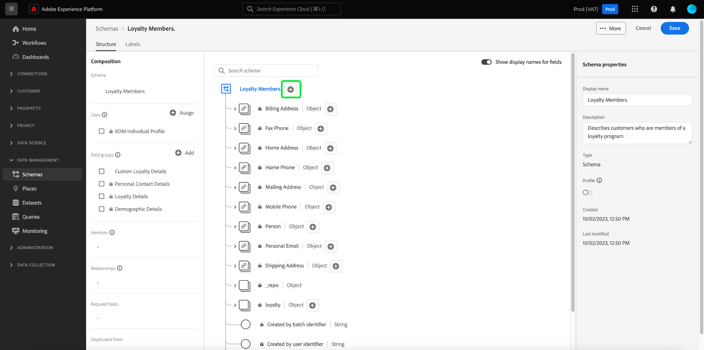

# Crear un esquema con [!DNL Schema Editor]

La interfaz de usuario de Adobe Experience Platform le permite crear y administrar [!DNL Experience Data Model] esquemas (XDM) en un lienzo visual interactivo denominado [!DNL Schema Editor]. Este tutorial explica cómo crear un esquema con [!DNL Schema Editor].

Para fines de demostración, los pasos de este tutorial implican la creación de un esquema de ejemplo que describe a los miembros de un programa de lealtad de clientes. Aunque puede utilizar estos pasos para crear un esquema diferente para sus propios fines, se recomienda que siga primero junto con la creación del esquema de ejemplo para conocer las capacidades de [!DNL Schema Editor].

>[!NOTE]
>
>Si está introduciendo datos CSV en Platform, puede [asignar esos datos a un esquema XDM creado por recomendaciones generadas por IA](../../ingestion/tutorials/map-csv/recommendations.md) (actualmente en fase beta) sin tener que crear manualmente el esquema.
>
>Si prefiere componer un esquema con la API [!DNL Schema Registry], comience por leer la [[!DNL Schema Registry] guía para desarrolladores](../api/getting-started.md) antes de intentar el tutorial sobre [crear un esquema con la API](create-schema-api.md).

## Introducción

Este tutorial requiere una comprensión práctica de los distintos aspectos de Adobe Experience Platform implicados en la creación de esquemas. Antes de comenzar este tutorial, revise la documentación para los siguientes conceptos:

* [[!DNL Experience Data Model (XDM)]](../home.md): El marco estandarizado mediante el cual [!DNL Platform] organiza los datos de experiencia del cliente.
   * [Aspectos básicos de la composición de esquemas](../schema/composition.md): Información general sobre los esquemas XDM y sus componentes básicos, incluidas las clases, los grupos de campos de esquema, los tipos de datos y los campos individuales.
* [[!DNL Real-Time Customer Profile]](../../profile/home.md): proporciona un perfil de consumidor unificado y en tiempo real basado en los datos agregados de varias fuentes.

## Abrir el área de trabajo [!UICONTROL Esquemas] {#browse}

El área de trabajo [!UICONTROL Esquemas] en la interfaz de usuario de [!DNL Platform] proporciona una visualización de [!DNL Schema Library], lo que le permite ver y administrar los esquemas disponibles para su organización. El área de trabajo también incluye [!DNL Schema Editor], el lienzo en el que puede crear un esquema a lo largo de este tutorial.

Después de iniciar sesión en [!DNL Experience Platform], seleccione **[!UICONTROL Esquemas]** en el panel de navegación izquierdo para abrir el área de trabajo **[!UICONTROL Esquemas]**. La pestaña **[!UICONTROL Examinar]** muestra una lista de esquemas (una representación de [!DNL Schema Library]) que puede ver y personalizar. La lista incluye el nombre, el tipo, la clase y el comportamiento (registro o serie temporal) en los que se basa el esquema, así como la fecha y la hora de la última modificación.

Consulte la guía [Exploración de recursos XDM existentes en la interfaz de usuario](../ui/explore.md) para obtener más información.

## Creación y asignación de nombres a un esquema {#create}

Para empezar a maquetar un esquema, seleccione **[!UICONTROL Crear esquema]** en la esquina superior derecha del área de trabajo **[!UICONTROL Esquemas]**.

![La ficha [!UICONTROL Examinar] del área de trabajo [!UICONTROL Esquemas] con [!UICONTROL Crear esquema] resaltado.](../images/tutorials/create-schema/create-schema-button.png)

Aparece el flujo de trabajo [!UICONTROL Crear esquema]. A continuación, elija una clase base para el esquema. Puede elegir entre las clases principales de [!UICONTROL XDM Individual Profile] y [!UICONTROL XDM ExperienceEvent], o [!UICONTROL Other] si estas clases no se ajustan a sus propósitos. La opción [!UICONTROL Otras] clases permite [crear una clase nueva](#create-new-class) o elegir entre otras clases preexistentes.

Consulte la documentación de [XDM individual profile](../classes/individual-profile.md) y [XDM ExperienceEvent](../classes/experienceevent.md) para obtener más información sobre estas clases. A los efectos de este tutorial, seleccione **[!UICONTROL Perfil individual de XDM]** seguido de **[!UICONTROL Siguiente]**.

<!-- You can  by selecting either **[!UICONTROL Individual Profile]**, **[!UICONTROL Experience Event]**, or **[!UICONTROL Other]**, followed by **[!UICONTROL Next]** to confirm your choice.  -->

![El flujo de trabajo [!UICONTROL Crear esquema] con las opciones de [!UICONTROL perfil individual XDM] y [!UICONTROL Siguiente] resaltadas.](../images/tutorials/create-schema/individual-profile-base-class.png)

Después de seleccionar una clase, aparece la sección [!UICONTROL Nombre y revisión]. En esta sección, proporcione un nombre y una descripción para identificar el esquema. Hay varias consideraciones importantes que se deben tener en cuenta al decidir un nombre para el esquema:

* Los nombres de los esquemas deben ser cortos y descriptivos para que el esquema se pueda encontrar fácilmente más adelante.
* Los nombres de los esquemas deben ser únicos, lo que significa que también deben ser lo suficientemente específicos para que no se reutilicen en el futuro. Por ejemplo, si su organización tiene programas de fidelización independientes para diferentes marcas, sería aconsejable nombrar el esquema &quot;Miembros fieles de marca A&quot; para que sea fácil distinguirlo de otros esquemas relacionados con la lealtad que pueda definir más adelante.
* También puede utilizar la descripción del esquema para proporcionar cualquier información contextual adicional sobre el esquema.

Este tutorial crea un esquema para introducir datos relacionados con los miembros de un programa de fidelidad y, por lo tanto, el esquema se denomina &quot;[!DNL Loyalty Members]&quot;.

&#x200B;La estructura base del esquema (proporcionada por la clase ) se muestra en el lienzo para que revise y compruebe la clase y la estructura de esquema seleccionadas.

Escriba un [!UICONTROL nombre para mostrar del esquema] descriptivo en el campo de texto. A continuación, introduzca una descripción adecuada para ayudar a identificar el esquema. Cuando haya revisado la estructura de esquema y esté satisfecho con la configuración, seleccione **[!UICONTROL Finalizar]** para crear el esquema.

![Se ha resaltado la sección [!UICONTROL Nombre y revisión] del flujo de trabajo [!UICONTROL Crear esquema] con [!UICONTROL Nombre para mostrar esquema], [!UICONTROL Descripción] y [!UICONTROL Finalizar].](../images/ui/resources/schemas/name-and-review.png)

Aparece [!DNL Schema Editor]. Este es el lienzo sobre el que compondrá el esquema. El esquema con título propio se crea automáticamente en la sección **[!UICONTROL Structure]** del lienzo cuando llega al editor, junto con los campos estándar incluidos en la clase base que ha seleccionado. La clase asignada para el esquema también se enumera en **[!UICONTROL Class]** en la sección **[!UICONTROL Composition]**.

>[!NOTE]
>
>Puede actualizar el nombre para mostrar y la descripción opcional del esquema en la barra lateral **[!UICONTROL Propiedades del esquema]**. Una vez introducido un nuevo nombre, el lienzo se actualiza automáticamente para reflejar el nuevo nombre del esquema.

>[!NOTE]
>
>Puede [cambiar la clase de un esquema](#change-class) en cualquier momento durante el proceso de composición inicial antes de guardar el esquema, pero esto debe hacerse con extrema precaución. Los grupos de campos solo son compatibles con determinadas clases y, por lo tanto, al cambiar la clase se restablecerán el lienzo y los campos que haya agregado.

## Adición de un grupo de campos {#field-group}

Ahora puede empezar a añadir campos al esquema añadiendo grupos de campos. Un grupo de campos es un grupo de uno o más campos que a menudo se utilizan juntos para describir un concepto en particular. Este tutorial utiliza grupos de campos para describir a los miembros del programa de fidelidad y capturar información clave como el nombre, el cumpleaños, el número de teléfono, la dirección, etc.

Para agregar un grupo de campos, seleccione **[!UICONTROL Agregar]** en la subsección **[!UICONTROL Grupos de campos]**.

Aparece un nuevo cuadro de diálogo que muestra una lista de grupos de campos disponibles. Cada grupo de campos está diseñado únicamente para utilizarse con una clase específica; por lo tanto, el cuadro de diálogo solo enumera los grupos de campos compatibles con la clase seleccionada (en este caso, la clase [!DNL XDM Individual Profile]). Si utiliza una clase XDM estándar, la lista de grupos de campos se ordenará de forma inteligente en función de la popularidad del uso.

![Cuadro de diálogo [!UICONTROL Agregar grupos de campos].](../images/tutorials/create-schema/field-group-popularity.png)

Puede seleccionar uno de los filtros en el carril izquierdo para reducir la lista de grupos de campos estándar a [industrias](../schema/industries/overview.md) específicas, como comercio minorista, servicios financieros y atención médica.

![Se ha resaltado el cuadro de diálogo [!UICONTROL Agregar grupos de campos] con los grupos de campos del sector.](../images/tutorials/create-schema/industry-field-groups.png)

Al seleccionar un grupo de campos de la lista, aparece en el carril derecho. Si lo desea, puede seleccionar varios grupos de campos y añadir cada uno a la lista en el carril derecho antes de confirmar. Además, aparece un icono en el lado derecho del grupo de campos seleccionado actualmente que le permite previsualizar la estructura de los campos que proporciona.

![Se resaltó el cuadro de diálogo [!UICONTROL Agregar grupos de campos] con el icono de vista previa del grupo de campos seleccionado.](../images/tutorials/create-schema/preview-field-group-button.png)

Al obtener una vista previa de un grupo de campos, se proporciona una descripción detallada del esquema del grupo de campos en el carril derecho. También puede navegar por los campos del grupo de campos en el lienzo proporcionado. A medida que selecciona diferentes campos, el carril derecho se actualiza para mostrar detalles sobre el campo en cuestión. Seleccione **[!UICONTROL Atrás]** cuando haya terminado de obtener la vista previa para volver al cuadro de diálogo de selección de grupos de campos.

![Vista previa del cuadro de diálogo [!UICONTROL Previsualizar grupo de campos] con el grupo de campos Detalles demográficos.](../images/tutorials/create-schema/preview-field-group.png)

Para este tutorial, seleccione el grupo de campos **[!UICONTROL Detalles demográficos]** y luego seleccione **[!UICONTROL Agregar grupo de campos]**.

![Se ha resaltado el cuadro de diálogo [!UICONTROL Agregar grupos de campos] con el grupo de campos Detalles demográficos seleccionado y [!UICONTROL Agregar grupos de campos].](../images/tutorials/create-schema/demographic-details.png)

El lienzo del esquema vuelve a aparecer. La sección **[!UICONTROL Grupos de campos]** ahora enumera &quot;[!UICONTROL Detalles demográficos]&quot; y la sección **[!UICONTROL Estructura]** incluye los campos aportados por el grupo de campos. Puede seleccionar el nombre del grupo de campos en la sección **[!UICONTROL Grupos de campos]** para resaltar los campos específicos que proporciona dentro del lienzo.

>[!NOTE]
>
>En el Editor de esquemas, las clases y los grupos de campos estándar (generados por el Adobe) se indican con el icono de candado (. El candado aparece en el carril izquierdo junto al nombre de la clase o del grupo de campos, así como junto a cualquier campo del diagrama de esquema que forme parte de un recurso generado por el sistema.
>
>

Este grupo de campos aporta varios campos bajo el nombre de nivel superior `person` con el tipo de datos &quot;[!UICONTROL Persona]&quot;. Este grupo de campos describe información sobre un individuo, incluido el nombre, la fecha de nacimiento y el sexo.

>[!NOTE]
>
>Recuerde que los campos pueden utilizar tipos escalares (como cadena, entero, matriz o fecha), así como cualquier tipo de datos (un grupo de campos que representa un concepto común) definido dentro de [!DNL Schema Registry].

Observe que el campo `name` tiene un tipo de datos de &quot;[!UICONTROL Nombre completo]&quot;, lo que significa que también describe un concepto común y contiene subcampos relacionados con el nombre como nombre, apellido, título de cortesía y sufijo.

Seleccione los diferentes campos dentro del lienzo para mostrar cualquier campo adicional que contribuyan a la estructura del esquema.

## Añadir más grupos de campos {#field-group-2}

Ahora puede repetir los mismos pasos para agregar otro grupo de campos. Cuando vea el cuadro de diálogo **[!UICONTROL Agregar grupo de campos]** esta vez, fíjese en que el grupo de campos &quot;[!UICONTROL Detalles demográficos]&quot; ha quedado atenuado y no se puede seleccionar la casilla que hay junto a él. Esto evita que duplique accidentalmente grupos de campos que ya ha incluido en el esquema actual.

Para este tutorial, seleccione los grupos de campos estándar **[!UICONTROL Datos de contacto personal]** y **[!UICONTROL Detalles de fidelidad]** de la lista, luego seleccione **[!UICONTROL Agregar grupos de campos]** para agregarlos al esquema.

![Se ha resaltado el cuadro de diálogo [!UICONTROL Agregar grupos de campos] con dos nuevos grupos de campos seleccionados y [!UICONTROL Agregar grupos de campos].](../images/tutorials/create-schema/more-field-groups.png)

El lienzo vuelve a aparecer con los grupos de campos agregados enumerados en **[!UICONTROL Grupos de campos]** en la sección **[!UICONTROL Composición]** y sus campos compuestos agregados a la estructura de esquema.

## Definir un grupo de campos personalizados {#define-field-group}

El esquema [!UICONTROL Miembros fieles] está diseñado para capturar datos relacionados con los miembros de un programa de fidelización, y el grupo de campos estándar [!UICONTROL Detalles de fidelización] que agregó al esquema proporciona la mayoría de ellos, incluidos el tipo de programa, los puntos, la fecha de unión, etc.

Sin embargo, puede haber un escenario en el que desee incluir campos personalizados adicionales no cubiertos por grupos de campos estándar para lograr sus casos de uso. En el caso de agregar campos de lealtad personalizados, tiene dos opciones:

1. Cree un nuevo grupo de campos personalizados para capturar estos campos. Este es el método que se explica en este tutorial.
1. Amplíe el grupo de campos estándar [!UICONTROL Detalles de fidelización] con campos personalizados. Esto hace que [!UICONTROL Detalles de fidelización] se convierta en un grupo de campos personalizados y el grupo de campos estándar original ya no estará disponible. Consulte la guía de la interfaz de usuario [!UICONTROL Esquemas] para obtener más información sobre [agregar campos personalizados a la estructura de grupos de campos estándar](../ui/resources/schemas.md#custom-fields-for-standard-groups).

Para crear un nuevo grupo de campos, selecciona **[!UICONTROL Agregar]** en la subsección **[!UICONTROL Grupos de campos]** como antes, pero esta vez selecciona **[!UICONTROL Crear nuevo grupo de campos]** cerca de la parte superior del cuadro de diálogo que aparece. A continuación, se le pedirá que proporcione un nombre para mostrar y una descripción para el nuevo grupo de campos. Para este tutorial, asigne un nombre al nuevo grupo de campos &quot;[!DNL Custom Loyalty Details]&quot; y seleccione **[!UICONTROL Agregar grupos de campos]**.

![Se ha resaltado el cuadro de diálogo [!UICONTROL Agregar grupos de campos] con [!UICONTROL Crear nuevo grupo de campos], [!UICONTROL Nombre para mostrar] y [!UICONTROL Descripción].](../images/tutorials/create-schema/create-new-field-group.png)

>[!NOTE]
>
>Al igual que con los nombres de clase, el nombre del grupo de campos debe ser corto y sencillo, y describir lo que el grupo de campos contribuirá al esquema. Estos también son únicos, por lo que no podrá reutilizar el nombre y, por lo tanto, debe asegurarse de que sea lo suficientemente específico.

&quot;[!DNL Custom Loyalty Details]&quot; debería aparecer ahora en **[!UICONTROL Grupos de campos]** en el lado izquierdo del lienzo, pero aún no hay campos asociados a él y, por lo tanto, no aparecen nuevos campos en **[!UICONTROL Estructura]**.

## Agregar campos al grupo de campos {#field-group-fields}

Ahora que ha creado el grupo de campos &quot;[!DNL Custom Loyalty Details]&quot;, es hora de definir los campos que el grupo de campos contribuirá al esquema.

Para empezar, seleccione el icono **más (+)** junto al nombre del esquema en el lienzo.

Aparece un marcador de posición &quot;[!UICONTROL Campo sin título]&quot; en el lienzo y el carril derecho se actualiza para mostrar las opciones de configuración del campo.

![Se ha resaltado el editor de esquemas con un [!UICONTROL campo sin título] y el esquema [!UICONTROL propiedades de campo].](../images/tutorials/create-schema/untitled-field.png)

En esta situación, el esquema debe tener un campo de tipo de objeto que describa en detalle el nivel de lealtad actual de la persona. Usando los controles del carril derecho, empiece a crear un campo `loyaltyTier` con el tipo &quot;[!UICONTROL Objeto]&quot; que se utilizará para contener los campos relacionados.

En **[!UICONTROL Asignar a]**, debe seleccionar un grupo de campos al que asignar el campo. Recuerde que todos los campos de esquema pertenecen a una clase o a un grupo de campos y, como este esquema utiliza una clase estándar, la única opción es seleccionar un grupo de campos. Empiece a escribir el nombre &quot;[!DNL Custom Loyalty Details]&quot; y, a continuación, seleccione el grupo de campos de la lista.

Cuando termine, seleccione **[!UICONTROL Aplicar]**.

![Se ha resaltado el editor de esquemas con el objeto de nivel de fidelidad agregado al esquema [!UICONTROL Propiedades del campo].](../images/tutorials/create-schema/loyalty-tier-object.png)

Los cambios se aplican y aparece el objeto `loyaltyTier` recién creado. Dado que es un campo personalizado, se anida automáticamente dentro de un espacio de nombres de objeto al ID de inquilino de su organización, precedido de un guion bajo (`_tenantId` en este ejemplo).

>[!NOTE]
>
>La presencia del objeto de ID de inquilino indica que los campos que está agregando están contenidos en el área de nombres de su organización.
>
>En otras palabras, los campos que está agregando son exclusivos de su organización y se guardarán en [!DNL Schema Registry] en un área específica accesible solamente para su organización. Los campos que defina siempre deben agregarse al espacio de nombres de inquilino para evitar conflictos con nombres de otras clases, grupos de campos, tipos de datos y campos estándar.

Seleccione el icono **más (+)** junto al objeto `loyaltyTier` para empezar a agregar subcampos. Aparece un nuevo marcador de posición de campo y la sección **[!UICONTROL Propiedades del campo]** está visible a la derecha del lienzo.

Cada campo requiere la siguiente información:

* **[!UICONTROL Nombre de campo]:** El nombre del campo, preferiblemente escrito en camelCase. No se permiten caracteres de espacio. Es el nombre que se utiliza para hacer referencia al campo en el código y en otras aplicaciones de flujo descendente.
   * Ejemplo: loyaltyLevel
* **[!UICONTROL Nombre para mostrar]:** El nombre del campo, escrito en mayúsculas y minúsculas. Este es el nombre que se mostrará en el lienzo al ver o editar el esquema.
   * Ejemplo: Nivel de fidelización
* **[!UICONTROL Tipo]:** El tipo de datos del campo. Esto incluye tipos escalares básicos y cualquier tipo de datos definido en [!DNL Schema Registry]. Ejemplos: [!UICONTROL String], [!UICONTROL Integer], [!UICONTROL Boolean], [!UICONTROL Person], [!UICONTROL Address], [!UICONTROL Phone number], etc.
* **[!UICONTROL Descripción]:** Se debe incluir una descripción opcional del campo con un máximo de 200 caracteres.

El primer campo del objeto `loyaltyTier` será una cadena denominada `id`, que representa el identificador del nivel actual del miembro socio. El ID de nivel será único para cada miembro socio, ya que esta empresa establece diferentes umbrales de punto de nivel de fidelidad para cada cliente en función de diferentes factores. Establezca el tipo del nuevo campo en &quot;[!UICONTROL String]&quot; y la sección **[!UICONTROL Field properties]** se rellenará con varias opciones para aplicar restricciones, incluidos el valor predeterminado, el formato y la longitud máxima. Consulte la documentación sobre [prácticas recomendadas para los campos de validación de datos](../schema/best-practices.md#data-validation-fields) para obtener más información.

Dado que `id` será una cadena de forma libre generada aleatoriamente, no se necesitan más restricciones. Seleccione **[!UICONTROL Aplicar]** para aplicar los cambios.

## Agregar más campos al grupo de campos {#field-group-fields-2}

Ahora que ha agregado el campo `id`, puede agregar campos adicionales para capturar información del nivel de lealtad como:

* Umbral de punto actual (entero): el número mínimo de puntos de lealtad que debe mantener el miembro para permanecer en el nivel actual.
* Umbral de punto de nivel siguiente (entero): número de puntos de lealtad que debe acumular el miembro para pasar al siguiente nivel.
* Fecha en Vigor (fecha-hora): La fecha en la que el miembro socio se unió a este nivel.

Para agregar cada campo al esquema, seleccione el icono **más (+)** junto al objeto `loyalty` y rellene la información requerida.

Una vez finalizado, el objeto `loyaltyTier` contendrá campos para `id`, `currentThreshold`, `nextThreshold` y `effectiveDate`.

## Agregar un campo de enumeración al grupo de campos {#enum}

Al definir campos en [!DNL Schema Editor], hay algunas opciones adicionales que puede aplicar a los tipos de campo básicos para proporcionar más restricciones en los datos que el campo puede contener. Los casos de uso de estas restricciones se explican en la siguiente tabla:

| Restricción | Descripción |
| --- | --- |
| [!UICONTROL Requerido] | Indica que el campo es necesario para la ingesta de datos. Cualquier dato cargado en un conjunto de datos basado en este esquema que no contenga este campo fallará tras la ingesta. |
| [!UICONTROL Matriz] | Indica que el campo contiene una matriz de valores, cada uno con el tipo de datos especificado. Por ejemplo, el uso de esta restricción en un campo con un tipo de datos de &quot;[!UICONTROL Cadena]&quot; especifica que el campo contendrá una matriz de cadenas. |
| [!UICONTROL Enumeración y valores sugeridos] | Una enumeración indica que este campo debe contener uno de los valores de una lista enumerada de valores posibles. También puede utilizar esta opción para proporcionar una lista de valores sugeridos para un campo de cadena sin restringir el campo a esos valores. |
| [!UICONTROL Identidad] | Indica que este campo es un campo de identidad. Se proporciona más información sobre los campos de identidad [más adelante en este tutorial](#identity-field). |
| [!UICONTROL Relación] | Aunque las relaciones de esquema se pueden inferir mediante el uso del esquema de unión y [!DNL Real-Time Customer Profile], esto sólo se aplica a los esquemas que comparten la misma clase. La restricción [!UICONTROL Relationship] indica que este campo hace referencia a la identidad principal de un esquema basado en una clase diferente, lo que implica una relación entre los dos esquemas. Vea el tutorial sobre [definición de una relación](./relationship-ui.md) para obtener más información. |

{style="table-layout:auto"}

>[!NOTE]
>
>Cualquier campo obligatorio, de identidad o de relación se enumera en sus respectivas secciones en el carril izquierdo, lo que le permite localizar estos campos fácilmente, independientemente de la complejidad del esquema.

Para este tutorial, el objeto `loyaltyTier` del esquema requiere un nuevo campo de enumeración que describe la clase de nivel, donde el valor solo puede ser una de las cuatro opciones posibles. Para agregar este campo al esquema, seleccione el icono **más (+)** junto al objeto `loyaltyTier` y rellene los campos obligatorios para **[!UICONTROL Nombre de campo]** y **[!UICONTROL Nombre para mostrar]**. Para **[!UICONTROL Type]**, seleccione &quot;[!UICONTROL String]&quot;.

![Editor de esquemas con el objeto de clase de nivel agregado y resaltado en las [!UICONTROL propiedades de campo].](../images/tutorials/create-schema/tier-class-type.png)

Aparecen casillas de verificación adicionales para el campo después de seleccionar su tipo, incluidas las casillas de verificación de **[!UICONTROL Matriz]**, **[!UICONTROL Enumeración y valores sugeridos]**, **[!UICONTROL Identidad]** y **[!UICONTROL Relación]**.

Seleccione la casilla de verificación **[!UICONTROL Enumeración y valores sugeridos]** y, a continuación, seleccione **[!UICONTROL Enumeración]**. Aquí puede escribir **[!UICONTROL Value]** (en camelCase) y **[!UICONTROL Display Name]** (un nombre opcional y fácil de leer en Title Case) para cada clase de nivel de lealtad aceptable.

Cuando haya completado todas las propiedades de campo, seleccione **[!UICONTROL Aplicar]** para agregar el campo `tierClass` al objeto `loyaltyTier`.

![Las propiedades del campo de enumeración y valores sugeridos se completaron con [!UICONTROL Aplicar] resaltado.](../images/tutorials/create-schema/tier-class-enum.png)

## Conversión de un objeto de varios campos en un tipo de datos {#datatype}

El objeto `loyaltyTier` ahora contiene varios campos y representa una estructura de datos común que podría ser útil en otros esquemas. [!DNL Schema Editor] le permite aplicar fácilmente objetos de varios campos reutilizables convirtiendo la estructura de esos objetos en tipos de datos.

Los tipos de datos permiten el uso coherente de estructuras de varios campos y proporcionan más flexibilidad que un grupo de campos porque se pueden utilizar en cualquier lugar dentro de un esquema. Esto se hace estableciendo el valor **[!UICONTROL Type]** del campo en el de cualquier tipo de datos definido en [!DNL Schema Registry].

Para convertir el objeto `loyaltyTier` en un tipo de datos, seleccione el campo `loyaltyTier` en el lienzo y, a continuación, seleccione **[!UICONTROL Convertir a nuevo tipo de datos]** a la derecha del editor en **[!UICONTROL Propiedades del campo]**.

![Se resaltó el Editor de esquemas con el objeto loyaltyTier y [!UICONTROL Convertir a nuevo tipo de datos].](../images/tutorials/create-schema/convert-data-type.png)

Aparece una notificación que confirma que el objeto se ha convertido correctamente. En el lienzo ahora puede ver que el campo `loyaltyTier` tiene ahora un icono de vínculo y el carril derecho indica que tiene un tipo de datos de &quot;[!DNL Loyalty Tier]&quot;.

En un esquema futuro, ahora podría asignar un campo como tipo &quot;[!DNL Loyalty Tier]&quot; e incluiría automáticamente campos para ID, clase de nivel, umbrales de punto y fecha de entrada en vigor.

>[!NOTE]
>
>También puede crear y editar tipos de datos personalizados independientemente de la edición de esquemas. Consulte la guía sobre [creación y edición de tipos de datos](../ui/resources/data-types.md) para obtener más información.

## Buscar y filtrar campos de esquema

El esquema ahora contiene varios grupos de campos además de los campos proporcionados por su clase base. Al trabajar con esquemas más grandes, puede seleccionar las casillas de verificación situadas junto a los nombres de los grupos de campos en el carril izquierdo para filtrar los campos mostrados únicamente a los proporcionados por los grupos de campos en los que esté interesado.

Si busca un campo específico en el esquema, también puede utilizar la barra de búsqueda para filtrar los campos mostrados por nombre, independientemente del grupo de campos en el que se proporcionen.

>[!IMPORTANT]
>
>La función de búsqueda tiene en cuenta cualquier filtro de grupo de campos seleccionado al mostrar los campos coincidentes. Si una consulta de búsqueda no muestra los resultados esperados, es posible que tenga que volver a comprobar que no está filtrando ningún grupo de campos relevante.

## Definir un campo de esquema como campo de identidad {#identity-field}

La estructura de datos estándar que proporcionan los esquemas se puede aprovechar para identificar datos que pertenecen a la misma persona en varias fuentes, lo que permite varios casos de uso descendentes, como segmentación, creación de informes, análisis de ciencia de datos y más. Para unir datos basados en identidades individuales, los campos clave deben marcarse como [!UICONTROL campos de identidad] dentro de los esquemas aplicables.

[!DNL Experience Platform] facilita la denotación de un campo de identidad mediante el uso de la casilla de verificación **[!UICONTROL Identidad]** en [!DNL Schema Editor]. Sin embargo, debe determinar qué campo es el mejor candidato para utilizar como identidad, según la naturaleza de los datos.

Por ejemplo, puede haber miles de miembros del programa de fidelidad que pertenecen al mismo nivel de fidelidad y varios que comparten la misma dirección física. Sin embargo, en esta situación, al inscribirse, cada miembro del programa de fidelidad proporciona su dirección de correo electrónico personal. Dado que las direcciones de correo electrónico personales normalmente las administra una persona, el campo `personalEmail.address` (proporcionado por el grupo de campos [!UICONTROL Datos de contacto personal]) es un buen candidato para un campo de identidad.

>[!IMPORTANT]
>
>Los pasos descritos a continuación tratan sobre cómo añadir un descriptor de identidad a un campo de esquema existente. Como alternativa a la definición de campos de identidad dentro de la estructura del propio esquema, también puede utilizar un campo `identityMap` para contener información de identidad en su lugar.
>
>Si planea usar `identityMap`, tenga en cuenta que anulará cualquier identidad principal que agregue directamente al esquema. Consulte la sección sobre `identityMap` en la [guía básica de composición de esquemas](../schema/composition.md#identityMap) para obtener más información.

Seleccione el campo `personalEmail.address` en el lienzo y la casilla de verificación **[!UICONTROL Identidad]** aparecerá en **[!UICONTROL Propiedades del campo]**. Marque la casilla y aparecerá la opción de establecer esta como **[!UICONTROL Identidad principal]**. Seleccione también esta casilla.

>[!NOTE]
>
>Cada esquema puede contener solo un campo de identidad principal. Una vez que un campo de esquema se ha establecido como identidad principal, recibirá un mensaje de error si más tarde intenta establecer otro campo de identidad en el esquema como principal.

A continuación, debe proporcionar un **[!UICONTROL área de nombres de identidad]** de la lista de áreas de nombres predefinidas en el menú desplegable. Dado que este campo es la dirección de correo electrónico del cliente, seleccione &quot;[!UICONTROL Correo electrónico]&quot; de la lista desplegable. Seleccione **[!UICONTROL Aplicar]** para confirmar las actualizaciones del campo `personalEmail.address`.

>[!NOTE]
>
>Para obtener una lista de áreas de nombres estándar y sus definiciones, consulte la [[!DNL Identity Service] documentación](../../identity-service/troubleshooting-guide.md#standard-namespaces).

Después de aplicar el cambio, el icono de `personalEmail.address` muestra un símbolo de huella digital, que indica que ahora es un campo de identidad. El campo también aparece en el carril izquierdo bajo **[!UICONTROL Identidades]**.

Ahora, todos los datos introducidos en el campo `personalEmail.address` se utilizarán para ayudar a identificar a ese individuo y unir una sola vista de ese cliente. Para obtener más información acerca de cómo trabajar con identidades en [!DNL Experience Platform], consulte la documentación de [[!DNL Identity Service]](../../identity-service/home.md).

## Habilitar el esquema para utilizarlo en [!DNL Real-Time Customer Profile] {#profile}

[[!DNL Real-Time Customer Profile]](../../profile/home.md) aprovecha los datos de identidad de [!DNL Experience Platform] para proporcionar una vista integral de cada cliente individual. El servicio crea perfiles sólidos de 360° de atributos del cliente, así como cuentas con marca de tiempo de cada interacción que los clientes hayan tenido en cualquier sistema integrado con [!DNL Experience Platform].

Para habilitar un esquema para utilizarlo con [!DNL Real-Time Customer Profile], debe tener definida una identidad principal. Recibirá un mensaje de error si intenta habilitar un esquema sin definir primero una identidad principal.

Para habilitar el esquema &quot;Miembros socio&quot; para usarlo en [!DNL Profile], comience por seleccionar el título del esquema en el lienzo.

A la derecha del editor, se muestra información sobre el esquema, incluido su nombre para mostrar, descripción y tipo. Además de esta información, hay un botón de alternancia **[!UICONTROL Perfil]**.

Seleccione **[!UICONTROL Perfil]** y aparecerá una ventana emergente, pidiéndole que confirme que desea habilitar el esquema para [!DNL Profile].

>[!WARNING]
>
>Una vez que un esquema se ha habilitado para [!DNL Real-Time Customer Profile] y se ha guardado, no se puede deshabilitar.

Seleccione **[!UICONTROL Habilitar]** para confirmar su elección. Puede volver a seleccionar el conmutador **[!UICONTROL Perfil]** para deshabilitar el esquema si lo desea, pero una vez guardado el esquema mientras [!DNL Profile] está habilitado, ya no se puede deshabilitar.

## Más acciones {#more}

En el Editor de esquemas también puede realizar acciones rápidas para copiar la estructura JSON del esquema o eliminarlo. Seleccione [!UICONTROL Más] en la parte superior de la vista para mostrar una lista desplegable con acciones rápidas.

### Eliminar un esquema {#delete-a-schema}

>[!CONTEXTUALHELP]
>id="platform_schemas_delete_profileenabledwithdatasets"
>title="No se puede eliminar esquema"
>abstract="No se puede eliminar el esquema porque se ha habilitado para el perfil y tiene conjuntos de datos asociados."

>[!CONTEXTUALHELP]
>id="platform_schemas_delete_profileenablednodatasets"
>title="No se puede eliminar esquema"
>abstract="No se puede eliminar el esquema porque se ha habilitado para el perfil."

>[!CONTEXTUALHELP]
>id="platform_schemas_delete_withdatasetsnotprofileenabled"
>title="No se puede eliminar esquema"
>abstract="No se puede eliminar el esquema porque tiene conjuntos de datos asociados."

Se puede eliminar un esquema en la interfaz de usuario desde el Editor de esquemas con [!UICONTROL Más] acciones y también desde los detalles del esquema en la pestaña [!UICONTROL Examinar]. Existen ciertas condiciones que impiden que se elimine un esquema. Un esquema no se puede eliminar si:

* El esquema está habilitado para el perfil.
* El esquema está habilitado para el perfil y tiene conjuntos de datos asociados.
* El esquema tiene conjuntos de datos asociados, pero no está habilitado para el perfil.

### Copiar estructura JSON {#copy-json-structure}

Seleccione **[!UICONTROL Copiar estructura JSON]** para generar una carga útil de exportación para cualquier esquema de la biblioteca de esquemas. Esta acción copia la estructura JSON en el portapapeles. El JSON exportado se puede utilizar para importar el esquema y cualquier recurso relacionado en una zona protegida u organización diferente. Esto hace que compartir y reutilizar esquemas entre diferentes entornos sea sencillo y eficaz.

## Pasos siguientes y recursos adicionales

Ahora que ha terminado de maquetar el esquema, puede ver el esquema completo en el lienzo. Seleccione **[!UICONTROL Guardar]** y el esquema se guardará en [!DNL Schema Library], para que el [!DNL Schema Registry] pueda obtener acceso a él.

Ahora puede usar su nuevo esquema para ingerir datos en [!DNL Platform]. Recuerde que una vez que se ha utilizado el esquema para la ingesta de datos, solo se pueden realizar cambios adicionales. Consulte los [conceptos básicos de la composición de esquemas](../schema/composition.md) para obtener más información sobre las versiones de esquemas.

Ahora puede seguir el tutorial de [definición de una relación de esquema en la interfaz de usuario](./relationship-ui.md) para agregar un nuevo campo de relación al esquema &quot;Miembros socio&quot;.

El esquema &quot;Miembros socio&quot; también está disponible para ser visto y administrado usando la API [!DNL Schema Registry]. Para comenzar a trabajar con la API, comience por leer la [[!DNL Schema Registry API] guía para desarrolladores](../api/getting-started.md).

### Recursos de vídeo

>[!WARNING]
>
>La interfaz de usuario [!DNL Platform] que se muestra en los siguientes vídeos no está actualizada. Consulte la documentación anterior para obtener las capturas de pantalla y la funcionalidad más recientes de la interfaz de usuario.

El siguiente vídeo muestra cómo crear un esquema simple en la interfaz de usuario de [!DNL Platform].

>[!VIDEO](https://video.tv.adobe.com/v/27012?quality=12&learn=on)

El siguiente vídeo tiene como objetivo reforzar su comprensión del trabajo con grupos y clases de campo.

>[!VIDEO](https://video.tv.adobe.com/v/27013?quality=12&learn=on)

## Apéndice

Las secciones siguientes proporcionan información adicional sobre el uso de [!DNL Schema Editor].

### Crear una nueva clase {#create-new-class}

[!DNL Experience Platform] proporciona la flexibilidad para definir un esquema basado en una clase que sea única para su organización. Para aprender a crear una nueva clase, consulte la guía sobre [creación y edición de clases en la interfaz de usuario](../ui/resources/classes.md#create).

### Cambiar la clase de un esquema {#change-class}

Puede cambiar la clase de un esquema en cualquier momento durante el proceso inicial de maquetación antes de guardar el esquema.

>[!WARNING]
>
>La reasignación de la clase para un esquema debe realizarse con extrema precaución. Los grupos de campos solo son compatibles con determinadas clases y, por lo tanto, al cambiar la clase se restablecerán el lienzo y los campos que haya agregado.

Para aprender a cambiar la clase de un esquema, consulte la guía sobre [administración de esquemas en la interfaz de usuario](../ui/resources/schemas.md#change-class).
