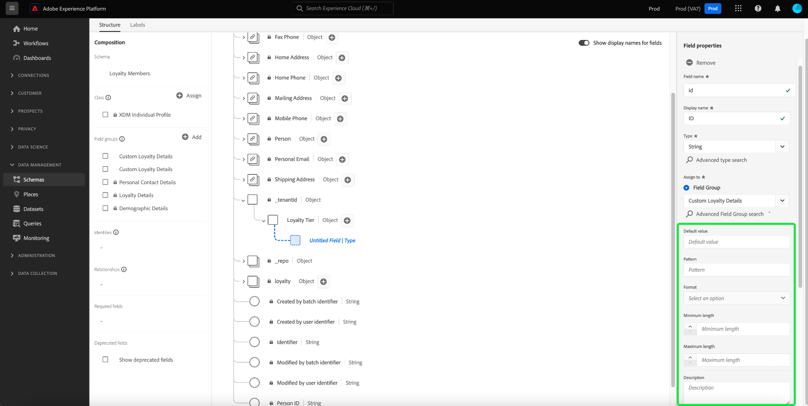
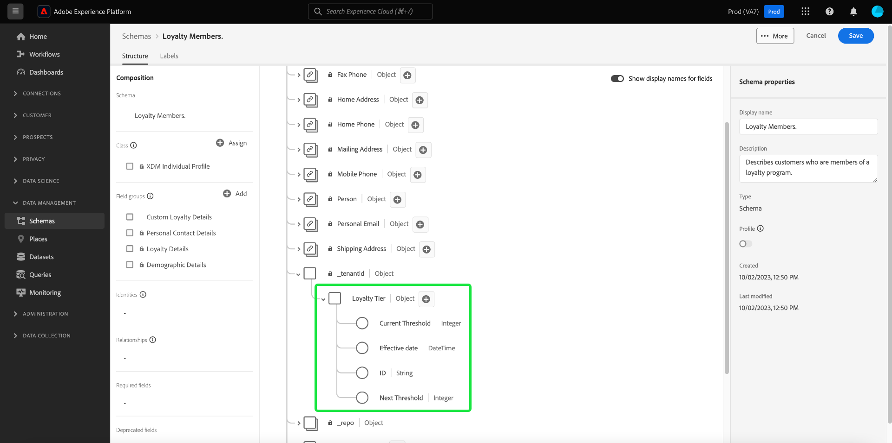

# Cree un esquema con la variable [!DNL Schema Editor]

La interfaz de usuario de Adobe Experience Platform le permite crear y administrar [!DNL Experience Data Model] (XDM) en un lienzo visual interactivo denominado [!DNL Schema Editor]. Este tutorial explica cómo crear un esquema con la variable [!DNL Schema Editor].

Para fines de demostración, los pasos de este tutorial implican la creación de un esquema de ejemplo que describe a los miembros de un programa de lealtad de clientes. Aunque puede utilizar estos pasos para crear un esquema diferente para sus propios fines, se recomienda que siga primero junto con la creación del esquema de ejemplo para conocer las capacidades del [!DNL Schema Editor].

>[!NOTE]
>
>Si está introduciendo datos CSV en Platform, puede hacer lo siguiente [asigne esos datos a un esquema XDM creado por recomendaciones generadas por IA](../../ingestion/tutorials/map-csv/recommendations.md) (actualmente en fase beta) sin tener que crear manualmente el esquema.
>
>Si prefiere componer un esquema con la variable [!DNL Schema Registry] API, comience por leer el [[!DNL Schema Registry] guía para desarrolladores](../api/getting-started.md) antes de intentar realizar el tutorial en [creación de un esquema con la API](create-schema-api.md).

## Introducción

Este tutorial requiere una comprensión práctica de los distintos aspectos de Adobe Experience Platform implicados en la creación de esquemas. Antes de comenzar este tutorial, revise la documentación para los siguientes conceptos:

* [[!DNL Experience Data Model (XDM)]](../home.md): El marco estandarizado mediante el cual [!DNL Platform] organiza los datos de experiencia del cliente.
   * [Conceptos básicos de composición de esquemas](../schema/composition.md): Información general sobre los esquemas XDM y sus componentes básicos, incluidas clases, grupos de campos de esquema, tipos de datos y campos individuales.
* [[!DNL Real-Time Customer Profile]](../../profile/home.md): Proporciona un perfil de consumidor unificado y en tiempo real basado en los datos agregados de varias fuentes.

## Abra el [!UICONTROL Esquemas] workspace {#browse}

El [!UICONTROL Esquemas] workspace en [!DNL Platform] La interfaz de usuario de proporciona una visualización de [!DNL Schema Library], lo que le permite ver y administrar los esquemas disponibles para su organización. El espacio de trabajo también incluye [!DNL Schema Editor], el lienzo en el que puede componer un esquema a lo largo de este tutorial.

Después de iniciar sesión en [!DNL Experience Platform], seleccione **[!UICONTROL Esquemas]** en la navegación izquierda para abrir **[!UICONTROL Esquemas]** workspace. El **[!UICONTROL Examinar]** pestaña muestra una lista de esquemas (una representación de la variable [!DNL Schema Library]) para que usted las vea y las personalice. La lista incluye el nombre, el tipo, la clase y el comportamiento (registro o serie temporal) en los que se basa el esquema, así como la fecha y la hora de la última modificación.

Consulte la guía de [exploración de recursos XDM existentes en la IU](../ui/explore.md) para obtener más información.

## Creación y asignación de nombres a un esquema {#create}

Para empezar a maquetar un esquema, seleccione **[!UICONTROL Crear esquema]** en la esquina superior derecha de la **[!UICONTROL Esquemas]** workspace.

![El [!UICONTROL Esquemas] workspace [!UICONTROL Examinar] pestaña con [!UICONTROL Crear esquema] resaltado.](../images/tutorials/create-schema/create-schema-button.png)

El [!UICONTROL Crear esquema] flujo de trabajo aparece. A continuación, elija una clase base para el esquema. Puede elegir entre las clases principales de [!UICONTROL Perfil individual de XDM] y [!UICONTROL ExperienceEvent de XDM], o [!UICONTROL Otros] si estas clases no se adaptan a sus propósitos. El [!UICONTROL Otros] La opción de clases permite [crear una nueva clase](#create-new-class) o elija entre otras clases preexistentes.

Consulte la [Perfil individual de XDM](../classes/individual-profile.md) y [ExperienceEvent de XDM](../classes/experienceevent.md) para obtener más información sobre estas clases. Para los fines de este tutorial, seleccione **[!UICONTROL Perfil individual de XDM]** seguido de **[!UICONTROL Siguiente]**.

<!--  -->

<!-- You can  by selecting either **[!UICONTROL Individual Profile]**, **[!UICONTROL Experience Event]**, or **[!UICONTROL Other]**, followed by **[!UICONTROL Next]** to confirm your choice.  -->

![El [!UICONTROL Crear esquema] flujo de trabajo con [!UICONTROL Perfil individual de XDM] opciones y [!UICONTROL Siguiente] resaltado.](../images/tutorials/create-schema/individual-profile-base-class.png)

Después de seleccionar una clase, la variable [!UICONTROL Nombre y revisión] aparece la sección. En esta sección, proporcione un nombre y una descripción para identificar el esquema. Hay varias consideraciones importantes que se deben tener en cuenta al decidir un nombre para el esquema:

* Los nombres de los esquemas deben ser cortos y descriptivos para que el esquema se pueda encontrar fácilmente más adelante.
* Los nombres de los esquemas deben ser únicos, lo que significa que también deben ser lo suficientemente específicos para que no se reutilicen en el futuro. Por ejemplo, si su organización tiene programas de fidelización independientes para diferentes marcas, sería aconsejable nombrar el esquema &quot;Miembros fieles de marca A&quot; para que sea fácil distinguirlo de otros esquemas relacionados con la lealtad que pueda definir más adelante.
* También puede utilizar la descripción del esquema para proporcionar cualquier información contextual adicional sobre el esquema.

Este tutorial compone un esquema para introducir datos relacionados con los miembros de un programa de fidelidad y, por lo tanto, el esquema se denomina &quot;[!DNL Loyalty Members]&quot;.

&#x200B;La estructura base del esquema (proporcionada por la clase ) se muestra en el lienzo para que revise y compruebe la clase y la estructura de esquema seleccionadas.

Introduce un amigo de los humanos [!UICONTROL Nombre para mostrar del esquema] en el campo de texto. A continuación, introduzca una descripción adecuada para ayudar a identificar el esquema. Cuando haya revisado la estructura de esquema y esté satisfecho con la configuración, seleccione **[!UICONTROL Finalizar]** para crear el esquema.

![El [!UICONTROL Nombre y revisión] de la sección [!UICONTROL Crear esquema] flujo de trabajo con [!UICONTROL Nombre para mostrar del esquema], [!UICONTROL Descripción], y [!UICONTROL Finalizar] resaltado.](../images/ui/resources/schemas/name-and-review.png)

El [!DNL Schema Editor] aparece. Este es el lienzo sobre el que compondrá el esquema. El esquema con título propio se crea automáticamente en la variable **[!UICONTROL Estructura]** del lienzo cuando llegue al editor, junto con los campos estándar incluidos en la clase base que seleccionó. La clase asignada para el esquema también se enumera en **[!UICONTROL Clase]** in **[!UICONTROL Composición]** sección.

>[!NOTE]
>
>Puede actualizar el nombre para mostrar y la descripción opcional del esquema desde el  **[!UICONTROL Propiedades del esquema]** barra lateral. Una vez introducido un nuevo nombre, el lienzo se actualiza automáticamente para reflejar el nuevo nombre del esquema.

>[!NOTE]
>
>Puede [cambiar la clase de un esquema](#change-class) en cualquier momento del proceso de maquetación inicial antes de guardar el esquema, pero esto debe hacerse con extrema precaución. Los grupos de campos solo son compatibles con determinadas clases y, por lo tanto, al cambiar la clase se restablecerán el lienzo y los campos que haya agregado.

## Adición de un grupo de campos {#field-group}

Ahora puede empezar a añadir campos al esquema añadiendo grupos de campos. Un grupo de campos es un grupo de uno o más campos que a menudo se utilizan juntos para describir un concepto en particular. Este tutorial utiliza grupos de campos para describir a los miembros del programa de fidelidad y capturar información clave como el nombre, el cumpleaños, el número de teléfono, la dirección, etc.

Para añadir un grupo de campos, seleccione **[!UICONTROL Añadir]** en el **[!UICONTROL Grupos de campos]** subsección.

Aparece un nuevo cuadro de diálogo que muestra una lista de grupos de campos disponibles. Cada grupo de campos está diseñado para utilizarse únicamente con una clase específica; por lo tanto, el cuadro de diálogo solo enumera los grupos de campos compatibles con la clase seleccionada (en este caso, la variable [!DNL XDM Individual Profile] class). Si utiliza una clase XDM estándar, la lista de grupos de campos se ordenará de forma inteligente en función de la popularidad del uso.

![El [!UICONTROL Adición de grupos de campos] diálogo.](../images/tutorials/create-schema/field-group-popularity.png)

Puede seleccionar uno de los filtros en el carril izquierdo para reducir la lista de grupos de campos estándar a específicos [industrias](../schema/industries/overview.md) como venta minorista, servicios financieros y atención sanitaria.

![El [!UICONTROL Adición de grupos de campos] diálogo con los grupos de campo del sector destacados.](../images/tutorials/create-schema/industry-field-groups.png)

Al seleccionar un grupo de campos de la lista, aparece en el carril derecho. Si lo desea, puede seleccionar varios grupos de campos y añadir cada uno a la lista en el carril derecho antes de confirmar. Además, aparece un icono en el lado derecho del grupo de campos seleccionado actualmente que le permite previsualizar la estructura de los campos que proporciona.

![El [!UICONTROL Adición de grupos de campos] con el icono de vista previa del grupo de campos seleccionado resaltado.](../images/tutorials/create-schema/preview-field-group-button.png)

Al obtener una vista previa de un grupo de campos, se proporciona una descripción detallada del esquema del grupo de campos en el carril derecho. También puede navegar por los campos del grupo de campos en el lienzo proporcionado. A medida que selecciona diferentes campos, el carril derecho se actualiza para mostrar detalles sobre el campo en cuestión. Seleccionar **[!UICONTROL Atrás]** cuando haya terminado de previsualizar para volver al cuadro de diálogo de selección de grupos de campos.

![El [!UICONTROL Previsualizar grupo de campos] con el grupo de campos Detalles demográficos de la vista previa.](../images/tutorials/create-schema/preview-field-group.png)

Para este tutorial, seleccione la **[!UICONTROL Datos demográficos]** grupo de campos y seleccione **[!UICONTROL Agregar grupo de campos]**.

![El [!UICONTROL Adición de grupos de campos] diálogo con el grupo de campos Detalles demográficos seleccionado y [!UICONTROL Adición de grupos de campos] resaltado.](../images/tutorials/create-schema/demographic-details.png)

El lienzo del esquema vuelve a aparecer. El **[!UICONTROL Grupos de campos]** La sección ahora enumera &quot;[!UICONTROL Datos demográficos]&quot; y el **[!UICONTROL Estructura]** incluye los campos aportados por el grupo de campos. Puede seleccionar el nombre del grupo de campos en la variable **[!UICONTROL Grupos de campos]** para resaltar los campos específicos que proporciona dentro del lienzo.

Este grupo de campos aporta varios campos bajo el nombre de nivel superior `person` con el tipo de datos &quot;[!UICONTROL Persona]&quot;. Este grupo de campos describe información sobre un individuo, incluido el nombre, la fecha de nacimiento y el sexo.

>[!NOTE]
>
>Recuerde que los campos pueden utilizar tipos escalares (como cadena, entero, matriz o fecha), así como cualquier tipo de datos (un grupo de campos que representa un concepto común) definido dentro de [!DNL Schema Registry].

Observe que la variable `name` tiene un tipo de datos de &quot;[!UICONTROL Nombre completo]&quot;, lo que significa que también describe un concepto común y contiene subcampos relacionados con el nombre, como nombre, apellidos, título de cortesía y sufijo.

Seleccione los diferentes campos dentro del lienzo para mostrar cualquier campo adicional que contribuyan a la estructura del esquema.

## Añadir más grupos de campos {#field-group-2}

Ahora puede repetir los mismos pasos para agregar otro grupo de campos. Cuando vea la **[!UICONTROL Agregar grupo de campos]** esta vez, observe que la opción &quot;[!UICONTROL Datos demográficos]&quot; el grupo de campos se ha atenuado y la casilla de verificación situada junto a él no se puede seleccionar. Esto evita que duplique accidentalmente grupos de campos que ya ha incluido en el esquema actual.

Para este tutorial, seleccione los grupos de campos estándar **[!UICONTROL Datos personales de contacto]** y **[!UICONTROL Detalles de fidelización]** en la lista, seleccione **[!UICONTROL Adición de grupos de campos]** para añadirlos al esquema.

![El [!UICONTROL Adición de grupos de campos] diálogo con dos nuevos grupos de campos seleccionados y [!UICONTROL Adición de grupos de campos] resaltado.](../images/tutorials/create-schema/more-field-groups.png)

El lienzo vuelve a aparecer con los grupos de campos añadidos enumerados en **[!UICONTROL Grupos de campos]** en el **[!UICONTROL Composición]** y sus campos compuestos añadidos a la estructura del esquema.

## Definir un grupo de campos personalizados {#define-field-group}

El [!UICONTROL Miembros socio] El esquema está diseñado para capturar datos relacionados con los miembros de un programa de fidelidad y el estándar de [!UICONTROL Detalles de fidelización] el grupo de campos que ha agregado al esquema proporciona la mayoría de estos elementos, incluido el tipo de programa, los puntos, la fecha de unión, etc.

Sin embargo, puede haber un escenario en el que desee incluir campos personalizados adicionales no cubiertos por grupos de campos estándar para lograr sus casos de uso. En el caso de agregar campos de lealtad personalizados, tiene dos opciones:

1. Cree un nuevo grupo de campos personalizados para capturar estos campos. Este es el método que se explica en este tutorial.
1. Ampliación del estándar [!UICONTROL Detalles de fidelización] grupo de campos con campos personalizados. Esto causa [!UICONTROL Detalles de fidelización] para convertirlo en un grupo de campos personalizados y el grupo de campos estándar original ya no estará disponible. Consulte la [!UICONTROL Esquemas] Guía de la IU para obtener más información sobre [agregar campos personalizados a la estructura de grupos de campos estándar](../ui/resources/schemas.md#custom-fields-for-standard-groups).

Para crear un nuevo grupo de campos, seleccione **[!UICONTROL Añadir]** en el **[!UICONTROL Grupos de campos]** subsección como antes, pero esta vez seleccione **[!UICONTROL Crear nuevo grupo de campos]** cerca de la parte superior del cuadro de diálogo que aparece. A continuación, se le pedirá que proporcione un nombre para mostrar y una descripción para el nuevo grupo de campos. Para este tutorial, asigne un nombre al nuevo grupo de campos &quot;[!DNL Custom Loyalty Details]&quot;, y luego seleccione **[!UICONTROL Adición de grupos de campos]**.

![El [!UICONTROL Adición de grupos de campos] diálogo con [!UICONTROL Crear nuevo grupo de campos], [!UICONTROL Nombre para mostrar] y [!UICONTROL Descripción] resaltado.](../images/tutorials/create-schema/create-new-field-group.png)

>[!NOTE]
>
>Al igual que con los nombres de clase, el nombre del grupo de campos debe ser corto y sencillo, y describir lo que el grupo de campos contribuirá al esquema. Estos también son únicos, por lo que no podrá reutilizar el nombre y, por lo tanto, debe asegurarse de que sea lo suficientemente específico.

&quot;[!DNL Custom Loyalty Details]&quot; debería aparecer ahora en **[!UICONTROL Grupos de campos]** a la izquierda del lienzo, pero aún no hay campos asociados a él y, por lo tanto, no aparecen campos nuevos en **[!UICONTROL Estructura]**.

## Agregue campos al grupo de campos {#field-group-fields}

Ahora que ha creado el &quot;[!DNL Custom Loyalty Details]&quot; grupo de campos, es hora de definir los campos que el grupo de campos contribuirá al esquema.

Para empezar, seleccione la **más (+)** junto al nombre del esquema en el lienzo.

Un &quot;[!UICONTROL Campo sin título]El marcador de posición &quot; aparece en el lienzo y el carril derecho se actualiza para mostrar las opciones de configuración del campo.

![El editor de esquemas con una [!UICONTROL Campo sin título] y el esquema [!UICONTROL Propiedades del campo] resaltado.](../images/tutorials/create-schema/untitled-field.png)

En esta situación, el esquema debe tener un campo de tipo de objeto que describa en detalle el nivel de lealtad actual de la persona. Con los controles del carril derecho, empiece a crear un `loyaltyTier` campo con tipo &quot;[!UICONTROL Objeto]&quot; que se utilizará para guardar los campos relacionados.

En **[!UICONTROL Asignar a]**, debe seleccionar un grupo de campos al que asignar el campo. Recuerde que todos los campos de esquema pertenecen a una clase o a un grupo de campos y, como este esquema utiliza una clase estándar, la única opción es seleccionar un grupo de campos. Empiece a escribir el nombre &quot;[!DNL Custom Loyalty Details]&quot; y, a continuación, seleccione el grupo de campos de la lista.

Cuando termine, seleccione **[!UICONTROL Aplicar]**.

![Editor de esquemas con el objeto de nivel de fidelización agregado al esquema [!UICONTROL Propiedades del campo] resaltado.](../images/tutorials/create-schema/loyalty-tier-object.png)

Los cambios se aplican y el recién creado `loyaltyTier` aparece el objeto. Como es un campo personalizado, se anida automáticamente dentro de un espacio de nombres de objeto al ID de inquilino de su organización, precedido de un guion bajo (`_tenantId` en este ejemplo).

>[!NOTE]
>
>La presencia del objeto de ID de inquilino indica que los campos que está agregando están contenidos en el área de nombres de su organización.
>
>En otras palabras, los campos que está añadiendo son únicos para su organización y se guardarán en [!DNL Schema Registry] en un área específica accesible solo para su organización. Los campos que defina siempre deben agregarse al espacio de nombres de inquilino para evitar conflictos con nombres de otras clases, grupos de campos, tipos de datos y campos estándar.

Seleccione el **más (+)** junto al icono `loyaltyTier` para empezar a añadir subcampos. Aparece un nuevo marcador de posición de campo y la variable **[!UICONTROL Propiedades del campo]** Esta sección es visible en el lado derecho del lienzo.

Cada campo requiere la siguiente información:

* **[!UICONTROL Nombre de campo]:** El nombre del campo, preferiblemente escrito en camelCase. No se permiten caracteres de espacio. Es el nombre que se utiliza para hacer referencia al campo en el código y en otras aplicaciones de flujo descendente.
   * Ejemplo: loyaltyLevel
* **[!UICONTROL Nombre para mostrar]:** El nombre del campo, escrito en mayúsculas o minúsculas. Este es el nombre que se mostrará en el lienzo al ver o editar el esquema.
   * Ejemplo: Nivel de fidelización
* **[!UICONTROL Tipo]:** El tipo de datos del campo. Esto incluye tipos escalares básicos y cualquier tipo de datos definido en la variable [!DNL Schema Registry]. Ejemplos: [!UICONTROL Cadena], [!UICONTROL Entero], [!UICONTROL Booleano], [!UICONTROL Persona], [!UICONTROL Dirección], [!UICONTROL Número de teléfono], etc.
* **[!UICONTROL Descripción]:** Se debe incluir una descripción opcional del campo con un máximo de 200 caracteres.

El primer campo de la variable `loyaltyTier` el objeto será una cadena llamada `id`, que representa el ID del nivel actual del miembro socio. El ID de nivel será único para cada miembro socio, ya que esta empresa establece diferentes umbrales de punto de nivel de fidelidad para cada cliente en función de diferentes factores. Establezca el tipo del nuevo campo en &quot;[!UICONTROL Cadena]&quot;, y el **[!UICONTROL Propiedades del campo]** La sección se rellena con varias opciones para aplicar restricciones, incluidos el valor predeterminado, el formato y la longitud máxima.

Desde `id` será una cadena de forma libre generada aleatoriamente, no son necesarias más restricciones. Seleccionar **[!UICONTROL Aplicar]** para aplicar los cambios.

## Agregar más campos al grupo de campos {#field-group-fields-2}

Ahora que ha agregado la variable `id` , puede añadir campos adicionales para capturar información del nivel de fidelidad, como:

* Umbral de punto actual (entero): el número mínimo de puntos de lealtad que debe mantener el miembro para permanecer en el nivel actual.
* Umbral de punto de nivel siguiente (entero): número de puntos de lealtad que debe acumular el miembro para pasar al siguiente nivel.
* Fecha en Vigor (fecha-hora): La fecha en la que el miembro socio se unió a este nivel.

Para añadir cada campo al esquema, seleccione la **más (+)** junto al icono `loyalty` y rellene la información necesaria.

Cuando finalice, la variable `loyaltyTier` el objeto contendrá campos para `id`, `currentThreshold`, `nextThreshold`, y `effectiveDate`.

## Agregar un campo de enumeración al grupo de campos {#enum}

Al definir campos en [!DNL Schema Editor]Sin embargo, hay algunas opciones adicionales que puede aplicar a tipos de campo básicos para proporcionar más restricciones en los datos que puede contener el campo. Los casos de uso de estas restricciones se explican en la siguiente tabla:

| Restricción | Descripción |
| --- | --- |
| [!UICONTROL Requerido] | Indica que el campo es necesario para la ingesta de datos. Cualquier dato cargado en un conjunto de datos basado en este esquema que no contenga este campo fallará tras la ingesta. |
| [!UICONTROL Matriz] | Indica que el campo contiene una matriz de valores, cada uno con el tipo de datos especificado. Por ejemplo, si se utiliza esta restricción en un campo con un tipo de datos de &quot;[!UICONTROL Cadena]&quot; especifica que el campo contendrá una matriz de cadenas. |
| [!UICONTROL Enumeración y valores sugeridos] | Una enumeración indica que este campo debe contener uno de los valores de una lista enumerada de valores posibles. También puede utilizar esta opción para proporcionar una lista de valores sugeridos para un campo de cadena sin restringir el campo a esos valores. |
| [!UICONTROL Identidad] | Indica que este campo es un campo de identidad. Se proporciona más información sobre los campos de identidad [más adelante en este tutorial](#identity-field). |
| [!UICONTROL Relación] | Mientras que las relaciones de esquema se pueden inferir mediante el uso del esquema de unión y [!DNL Real-Time Customer Profile], esto solo se aplica a los esquemas que comparten la misma clase. El [!UICONTROL Relación] Una restricción indica que este campo hace referencia a la identidad principal de un esquema basado en una clase diferente, lo que implica una relación entre los dos esquemas. Consulte el tutorial sobre [definición de una relación](./relationship-ui.md) para obtener más información. |

{style="table-layout:auto"}

>[!NOTE]
>
>Cualquier campo obligatorio, de identidad o de relación se enumera en sus respectivas secciones en el carril izquierdo, lo que le permite localizar estos campos fácilmente, independientemente de la complejidad del esquema.

Para este tutorial, la variable `loyaltyTier` El objeto del esquema requiere un nuevo campo de enumeración que describe la clase de nivel, donde el valor solo puede ser una de las cuatro opciones posibles. Para añadir este campo al esquema, seleccione la **más (+)** junto al icono `loyaltyTier` y rellene los campos obligatorios de **[!UICONTROL Nombre de campo]** y **[!UICONTROL Nombre para mostrar]**. Para **[!UICONTROL Tipo]**, seleccione &quot;[!UICONTROL Cadena]&quot;.

![Editor de esquemas con el objeto de clase de nivel agregado y resaltado en el [!UICONTROL Propiedades del campo].](../images/tutorials/create-schema/tier-class-type.png)

Aparecerán casillas de verificación adicionales para el campo después de seleccionar su tipo, incluidas las casillas de verificación para **[!UICONTROL Matriz]**, **[!UICONTROL Enumeración y valores sugeridos]**, **[!UICONTROL Identidad]**, y **[!UICONTROL Relación]**.

Seleccione el **[!UICONTROL Enumeración y valores sugeridos]** y, a continuación, seleccione **[!UICONTROL Enumeración]**. Aquí puede introducir la variable **[!UICONTROL Valor]** (en camelCase) y **[!UICONTROL Nombre para mostrar]** (un nombre opcional fácil de leer en el caso del título) para cada clase de nivel de fidelidad aceptable.

Cuando haya completado todas las propiedades del campo, seleccione **[!UICONTROL Aplicar]** para añadir el `tierClass` a la `loyaltyTier` objeto.

![Las propiedades del campo enum y suggested values se completan con [!UICONTROL Aplicar] resaltado.](../images/tutorials/create-schema/tier-class-enum.png)

## Conversión de un objeto de varios campos en un tipo de datos {#datatype}

El `loyaltyTier` ahora contiene varios campos y representa una estructura de datos común que podría ser útil en otros esquemas. El [!DNL Schema Editor] permite aplicar fácilmente objetos de varios campos reutilizables convirtiendo la estructura de esos objetos en tipos de datos.

Los tipos de datos permiten el uso coherente de estructuras de varios campos y proporcionan más flexibilidad que un grupo de campos porque se pueden utilizar en cualquier lugar dentro de un esquema. Esto se hace estableciendo el **[!UICONTROL Tipo]** valor igual al de cualquier tipo de datos definido en la variable [!DNL Schema Registry].

Para convertir la variable `loyaltyTier` objeto a un tipo de datos, seleccione el `loyaltyTier` en el lienzo y seleccione **[!UICONTROL Convertir a nuevo tipo de datos]** en el lado derecho del editor, debajo de **[!UICONTROL Propiedades del campo]**.

![El Editor de esquemas con el objeto loyaltyTier y [!UICONTROL Convertir a nuevo tipo de datos] resaltado.](../images/tutorials/create-schema/convert-data-type.png)

Aparece una notificación que confirma que el objeto se ha convertido correctamente. En el lienzo ahora puede ver que la variable `loyaltyTier` El campo ahora tiene un icono de vínculo y el carril derecho indica que tiene un tipo de datos de &quot;[!DNL Loyalty Tier]&quot;.

En un esquema futuro, ahora puede asignar un campo como &quot;[!DNL Loyalty Tier]&quot; y automáticamente incluiría campos de ID, clase de nivel, umbrales de punto y fecha de entrada en vigor.

>[!NOTE]
>
>También puede crear y editar tipos de datos personalizados independientemente de la edición de esquemas. Consulte la guía de [creación y edición de tipos de datos](../ui/resources/data-types.md) para obtener más información.

## Buscar y filtrar campos de esquema

El esquema ahora contiene varios grupos de campos además de los campos proporcionados por su clase base. Al trabajar con esquemas más grandes, puede seleccionar las casillas de verificación situadas junto a los nombres de los grupos de campos en el carril izquierdo para filtrar los campos mostrados únicamente a los proporcionados por los grupos de campos en los que esté interesado.

Si busca un campo específico en el esquema, también puede utilizar la barra de búsqueda para filtrar los campos mostrados por nombre, independientemente del grupo de campos en el que se proporcionen.

>[!IMPORTANT]
>
>La función de búsqueda tiene en cuenta cualquier filtro de grupo de campos seleccionado al mostrar los campos coincidentes. Si una consulta de búsqueda no muestra los resultados esperados, es posible que tenga que volver a comprobar que no está filtrando ningún grupo de campos relevante.

## Definir un campo de esquema como campo de identidad {#identity-field}

La estructura de datos estándar que proporcionan los esquemas se puede aprovechar para identificar datos que pertenecen a la misma persona en varias fuentes, lo que permite varios casos de uso descendentes, como segmentación, creación de informes, análisis de ciencia de datos y más. Para unir datos basados en identidades individuales, los campos clave deben marcarse como [!UICONTROL Identidad] campos dentro de esquemas aplicables.

[!DNL Experience Platform] facilita la denotación de un campo de identidad mediante el uso de una variable **[!UICONTROL Identidad]** casilla de verificación en la [!DNL Schema Editor]. Sin embargo, debe determinar qué campo es el mejor candidato para utilizar como identidad, según la naturaleza de los datos.

Por ejemplo, puede haber miles de miembros del programa de fidelidad que pertenecen al mismo nivel de fidelidad y varios que comparten la misma dirección física. Sin embargo, en esta situación, al inscribirse, cada miembro del programa de fidelidad proporciona su dirección de correo electrónico personal. Dado que las direcciones de correo electrónico personales suelen ser administradas por una persona, el campo `personalEmail.address` (proporcionado por el [!UICONTROL Datos personales de contacto] grupo de campos) es un buen candidato para un campo de identidad.

>[!IMPORTANT]
>
>Los pasos descritos a continuación tratan sobre cómo añadir un descriptor de identidad a un campo de esquema existente. Como alternativa a la definición de campos de identidad dentro de la estructura del propio esquema, también puede utilizar una variable `identityMap` para contener información de identidad en su lugar.
>
>Si planea usar `identityMap`, tenga en cuenta que anulará cualquier identidad principal que agregue directamente al esquema. Consulte la sección sobre `identityMap` en el [guía de conceptos básicos de composición de esquemas](../schema/composition.md#identityMap) para obtener más información.

Seleccione el `personalEmail.address` en el lienzo y la variable **[!UICONTROL Identidad]** La casilla de verificación aparece bajo **[!UICONTROL Propiedades del campo]**. Marque la casilla y la opción para establecerlo como. **[!UICONTROL Identidad principal]** aparece. Seleccione también esta casilla.

>[!NOTE]
>
>Cada esquema puede contener solo un campo de identidad principal. Una vez que un campo de esquema se ha establecido como identidad principal, recibirá un mensaje de error si más tarde intenta establecer otro campo de identidad en el esquema como principal.

A continuación, debe proporcionar un **[!UICONTROL Área de nombres de identidad]** de la lista de áreas de nombres predefinidas en el menú desplegable. Dado que este campo es la dirección de correo electrónico del cliente, seleccione &quot;[!UICONTROL Correo electrónico]&quot; en el menú desplegable. Seleccionar **[!UICONTROL Aplicar]** para confirmar las actualizaciones de `personalEmail.address` field.

>[!NOTE]
>
>Para obtener una lista de áreas de nombres estándar y sus definiciones, consulte la [[!DNL Identity Service] documentación](../../identity-service/troubleshooting-guide.md#standard-namespaces).

Después de aplicar el cambio, el icono de `personalEmail.address` muestra un símbolo de huella digital que indica que ahora es un campo de identidad. El campo también aparece en el carril izquierdo debajo de **[!UICONTROL Identidades]**.

Ahora, todos los datos introducidos en el `personalEmail.address` Este campo se utilizará para ayudar a identificar a ese individuo y unir una sola vista de ese cliente. Para obtener más información sobre cómo trabajar con identidades en [!DNL Experience Platform], revise la [[!DNL Identity Service]](../../identity-service/home.md) documentación.

## Habilitar el esquema para utilizarlo en [!DNL Real-Time Customer Profile] {#profile}

[[!DNL Real-Time Customer Profile]](../../profile/home.md) aprovecha los datos de identidad en [!DNL Experience Platform] para proporcionar una vista integral de cada cliente individual. El servicio crea perfiles sólidos de 360° de atributos del cliente, así como cuentas con marca de tiempo de cada interacción que los clientes han tenido en cualquier sistema integrado con [!DNL Experience Platform].

Para habilitar un esquema para su uso con [!DNL Real-Time Customer Profile], debe tener una identidad principal definida. Recibirá un mensaje de error si intenta habilitar un esquema sin definir primero una identidad principal.

Para habilitar el esquema &quot;Miembros socio&quot; para utilizarlo en [!DNL Profile], comience por seleccionar el título del esquema en el lienzo.

A la derecha del editor, se muestra información sobre el esquema, incluido su nombre para mostrar, descripción y tipo. Además de esta información, hay un **[!UICONTROL Perfil]** botón de alternancia.

Seleccionar **[!UICONTROL Perfil]** y aparece una ventana emergente, en la que se le solicita que confirme que desea habilitar el esquema para [!DNL Profile].

>[!WARNING]
>
>Una vez habilitado un esquema para [!DNL Real-Time Customer Profile] y se guarda, no se puede desactivar.

Seleccionar **[!UICONTROL Activar]** para confirmar su elección. Puede seleccionar el **[!UICONTROL Perfil]** vuelva a activarlo para desactivar el esquema si lo desea, pero una vez guardado el esquema mientras [!DNL Profile] está activada, ya no se puede desactivar.

## Más acciones

En el Editor de esquemas también puede realizar acciones rápidas para copiar la estructura JSON del esquema o eliminar el esquema si no se ha habilitado para el perfil del cliente en tiempo real o tiene conjuntos de datos asociados. Seleccionar [!UICONTROL Más] en la parte superior de la vista para mostrar una lista desplegable con acciones rápidas.

La funcionalidad Copiar estructura JSON le permite ver el aspecto que tendría una carga útil de ejemplo mientras sigue creando el esquema y las canalizaciones de datos. Resulta especialmente útil en situaciones en las que hay estructuras de mapa de objetos complejas en el esquema, como un mapa de identidad.

## Pasos siguientes y recursos adicionales

Ahora que ha terminado de maquetar el esquema, puede ver el esquema completo en el lienzo. Seleccionar **[!UICONTROL Guardar]** y el esquema se guardará en el [!DNL Schema Library], haciéndolo accesible mediante el [!DNL Schema Registry].

El nuevo esquema ahora se puede utilizar para introducir datos en [!DNL Platform]. Recuerde que una vez que se ha utilizado el esquema para la ingesta de datos, solo se pueden realizar cambios adicionales. Consulte la [conceptos básicos de composición de esquemas](../schema/composition.md) para obtener más información sobre las versiones de esquema.

Ahora puede seguir el tutorial sobre [definición de una relación de esquema en la IU](./relationship-ui.md) para agregar un nuevo campo de relación al esquema &quot;Miembros socio&quot;.

El esquema &quot;Miembros socio&quot; también está disponible para su visualización y administración mediante el [!DNL Schema Registry] API. Para empezar a trabajar con la API, comience leyendo el [[!DNL Schema Registry API] guía para desarrolladores](../api/getting-started.md).

### Recursos de vídeo

>[!WARNING]
>
>El [!DNL Platform] La interfaz de usuario que se muestra en los siguientes vídeos no está actualizada. Consulte la documentación anterior para obtener las capturas de pantalla y la funcionalidad más recientes de la interfaz de usuario.

El siguiente vídeo muestra cómo crear un esquema simple en la variable [!DNL Platform] IU.

>[!VIDEO](https://video.tv.adobe.com/v/27012?quality=12&learn=on)

El siguiente vídeo tiene como objetivo reforzar su comprensión del trabajo con grupos y clases de campo.

>[!VIDEO](https://video.tv.adobe.com/v/27013?quality=12&learn=on)

## Apéndice

En las secciones siguientes se proporciona información adicional sobre el uso de [!DNL Schema Editor].

### Crear una nueva clase {#create-new-class}

[!DNL Experience Platform] proporciona la flexibilidad para definir un esquema basado en una clase única para su organización. Para aprender a crear una nueva clase, consulte la guía de [crear y editar clases en la interfaz de usuario](../ui/resources/classes.md#create).

### Cambiar la clase de un esquema {#change-class}

Puede cambiar la clase de un esquema en cualquier momento durante el proceso inicial de maquetación antes de guardar el esquema.

>[!WARNING]
>
>La reasignación de la clase para un esquema debe realizarse con extrema precaución. Los grupos de campos solo son compatibles con determinadas clases y, por lo tanto, al cambiar la clase se restablecerán el lienzo y los campos que haya agregado.

Para obtener información sobre cómo cambiar la clase de un esquema, consulte la guía de [administración de esquemas en la IU](../ui/resources/schemas.md#change-class).
