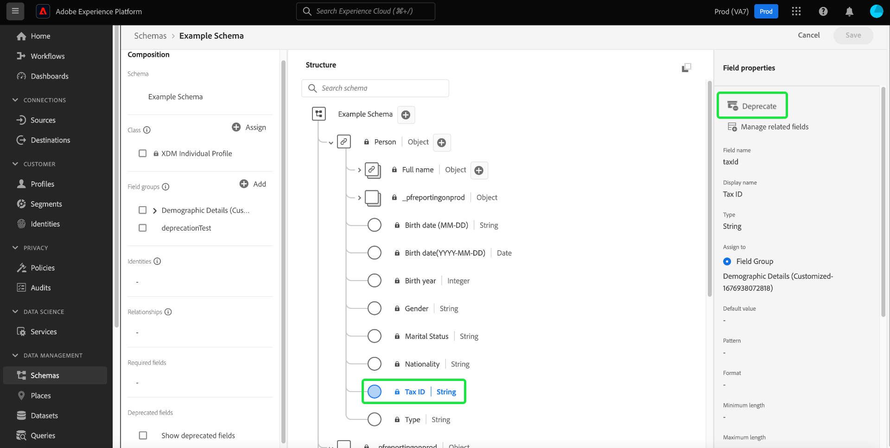

# Dejar de utilizar un campo XDM en la IU

El modelo de datos de experiencia (XDM) le ofrece la flexibilidad para administrar su modelo de datos a medida que cambian sus necesidades comerciales al dejar obsoletos los campos de esquema una vez introducidos los datos. Los campos no deseados pueden quedar obsoletos para eliminarlos de la vista de la interfaz de usuario y también ocultarlos de las interfaces de usuario descendentes. De manera práctica, una casilla de verificación en el Editor de esquemas permite mostrar los campos obsoletos y, si es necesario, también puede dejar de utilizarlos.

Como los campos obsoletos están ocultos de la interfaz de usuario de forma predeterminada, esto optimiza el esquema en el Editor de esquemas y evita que se agreguen campos no deseados a dependencias descendentes, como el Generador de segmentos, el Diseñador de recorridos, etc. La desuso de los campos también es compatible con versiones anteriores. Otros sistemas que utilizan campos obsoletos, como segmentos y consultas, seguirán evaluándolos según lo previsto. Si se utiliza un campo obsoleto en un segmento existente, se trata normalmente, lo que significa que el campo se muestra como se espera en el lienzo del generador de segmentos o se evalúa en función de los datos disponibles en los campos obsoletos. Se trata de un cambio permanente que no afecta negativamente a ningún flujo de datos existente.

>[!NOTE]
>
>Antes de ingerir los datos en un esquema, puede eliminar grupos de campos innecesarios. Consulte la documentación sobre [eliminación de un grupo de campos de un esquema](../ui/resources/schemas.md#remove-fields) para obtener más información.

Una vez introducidos los datos en el esquema, ya no puede eliminar campos del esquema sin realizar cambios importantes. En este caso, puede retirar un campo no deseado dentro de un esquema o recurso personalizado utilizando [Editor de esquemas](./create-schema-ui.md) o el [API de Registro de esquemas](https://developer.adobe.com/experience-platform-apis/references/schema-registry/).

Este documento explica cómo dejar de utilizar los campos para diferentes recursos XDM mediante el Editor de esquemas en la interfaz de usuario de Experience Platform. Para ver los pasos sobre cómo dejar de utilizar un campo XDM mediante la API, consulte el tutorial sobre [desaprobación de un campo XDM mediante la API de Registro de esquemas](./field-deprecation-api.md).

## Dejar obsoleto un campo {#deprecate}

Para dejar de utilizar un campo personalizado, vaya al Editor de esquemas para el esquema que desea editar. Seleccione el campo que desea retirar de la [!UICONTROL Estructura] del lienzo, seguido de **[!UICONTROL Obsoleto]** desde el [!UICONTROL Propiedades del campo].

Aparecerá un cuadro de diálogo para confirmar sus opciones y notificarle que el campo se eliminará de la vista de interfaz de usuario del esquema de unión y se ocultará de las interfaces de usuario descendentes. Para completar la acción, seleccione **[!UICONTROL Confirmar]**.

El campo ahora se elimina de la vista de la interfaz de usuario.

>[!NOTE]
>
>Una vez obsoletas, las interfaces de usuario descendentes, como los paneles de segmentación, Customer Journey Analytics y Adobe Journey Optimizer, ya no muestran los campos obsoletos como parte de su flujo de trabajo. Sin embargo, las IU descendentes tienen la opción de mostrar los campos obsoletos si es necesario y seguir tratando el campo obsoleto como algo normal. Consulte su documentación correspondiente para obtener más información. Las consultas y los segmentos que utilicen el campo obsoleto seguirán ejecutándose según lo esperado.

## Mostrar campos obsoletos {#show-deprecated}

Para ver los campos obsoletos anteriormente, vaya al esquema correspondiente en el Editor de esquemas. Seleccione el **[!UICONTROL Mostrar campos obsoletos]** casilla de verificación en la [!UICONTROL Composición] del lienzo.

El campo obsoleto ahora aparece en la vista de la interfaz de usuario. Seleccionar **[!UICONTROL Guardar]** para confirmar la configuración.

## Campos infrautilizados {#undeprecate-fields}

Para deshacer un campo obsoleto, primero [mostrar el campo obsoleto](#show-deprecated) como se ha descrito anteriormente, seleccione el campo obsoleto del [!UICONTROL Estructura] sección. A continuación, seleccione **[!UICONTROL Insuficiente]** desde el [!UICONTROL Propiedades del campo] barra lateral seguida de **[!UICONTROL Guardar]**.

El [!UICONTROL Campo infrautilizado] aparece el cuadro de diálogo. Para confirmar los cambios, seleccione **[!UICONTROL Confirmar]**.

![El [!UICONTROL Campo infrautilizado] Cuadro de diálogo con Confirmar resaltado.](../images/tutorials/field-deprecation/undeprecate-field-dialog.png)

El campo ahora se muestra como estándar en la vista de interfaz de usuario y también en las interfaces de usuario descendentes. De nuevo, ahora tiene la opción de dejar obsoleto el campo.

## Pasos siguientes

En este documento se explica cómo dejar de utilizar los campos XDM mediante la IU del Editor de esquemas. Para obtener más información sobre la configuración de campos para recursos personalizados, consulte la guía de [definición de campos XDM en la API](./custom-fields-api.md). Para obtener más información sobre la administración de descriptores, consulte la [guía de extremo de descriptores](../api/descriptors.md).
