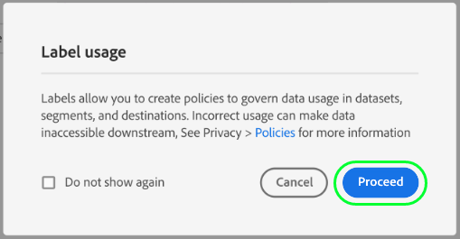
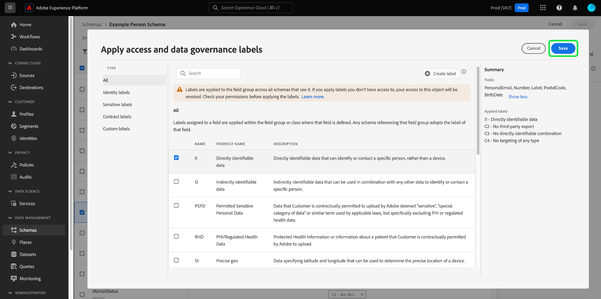

# Administración de etiquetas de uso de datos para un esquema

>[!IMPORTANT]
>
>El etiquetado basado en esquemas es parte de [control de acceso basado en atributos](../../access-control/abac/overview.md), que actualmente está disponible en una versión limitada para clientes de asistencia sanitaria de EE. UU. Esta capacidad estará disponible para todos los clientes de Real-time Customer Data Platform una vez que se haya lanzado completamente.

Todos los datos introducidos en Adobe Experience Platform están restringidos por esquemas del Modelo de datos de experiencia (XDM). Estos datos pueden estar sujetos a restricciones de uso definidas por su organización o por las regulaciones legales. Para tener en cuenta esto, la plataforma le permite restringir el uso de ciertos conjuntos de datos y campos mediante el uso de [etiquetas de uso de datos](../../data-governance/labels/overview.md).

Una etiqueta aplicada a un campo de esquema indica las políticas de uso que se aplican a los datos contenidos en ese campo específico.

Aunque las etiquetas se pueden aplicar a conjuntos de datos individuales (y campos dentro de esos conjuntos de datos), también se pueden aplicar etiquetas a nivel de esquema. Cuando las etiquetas se aplican directamente a un esquema, esas etiquetas se propagan a todos los conjuntos de datos existentes y futuros que se basan en ese esquema.

Este tutorial trata los pasos para agregar etiquetas a un esquema mediante el Editor de esquemas en la interfaz de usuario de Platform.

## Primeros pasos

Esta guía requiere conocer los siguientes componentes de Adobe Experience Platform:

* [[!DNL Experience Data Model (XDM) System]](../home.md): El marco normalizado por el cual [!DNL Experience Platform] organiza los datos de experiencia del cliente.
   * [Editor de esquemas](../ui/overview.md): Obtenga información sobre cómo crear y administrar esquemas y otros recursos en la interfaz de usuario de Platform.
* [[!DNL Adobe Experience Platform Data Governance]](../../data-governance/home.md): Proporciona la infraestructura para aplicar restricciones de uso de datos en operaciones de Platform, mediante políticas que definen qué acciones de marketing se pueden (o no) realizar en datos etiquetados.

## Seleccionar un esquema o campo al que añadir etiquetas

Las etiquetas solo se pueden aplicar a esquemas y no se pueden agregar a los componentes que conforman esos esquemas (clases, grupos de campos y tipos de datos). Para empezar a añadir etiquetas, primero debe [seleccionar un esquema existente para editar](../ui/resources/schemas.md#edit) o [crear un nuevo esquema](../ui/resources/schemas.md#create) para ver su estructura en el Editor de esquemas.

Para editar las etiquetas de un campo individual, puede seleccionar el campo en el lienzo y luego seleccionar **[!UICONTROL Administrar acceso]** en el carril derecho.

También puede seleccionar el **[!UICONTROL Etiquetas]** , elija el campo deseado de la lista y seleccione **[!UICONTROL Editar etiquetas de control]** en el carril derecho.

![Seleccione un campo del [!UICONTROL Etiquetas] ficha](../images/tutorials/labels/select-field-on-labels-tab.png)

Para editar las etiquetas de todo el esquema, seleccione el icono de lápiz () junto al nombre del esquema bajo el **[!UICONTROL Etiquetas]** pestaña .

![Seleccione el nombre del esquema en el [!UICONTROL Etiquetas] ficha](../images/tutorials/labels/select-schema-on-labels-tab.png)

>[!NOTE]
>
>Aparece un mensaje de renuncia de responsabilidad cuando intenta editar por primera vez las etiquetas de un esquema o campo, explicando cómo el uso de etiquetas afecta a las operaciones descendentes en función de las políticas de su organización. Select **[!UICONTROL Continuar]** para continuar editando.
>
>

## Edición de las etiquetas del esquema o campo

Aparece un cuadro de diálogo que le permite editar las etiquetas del campo seleccionado. Si ha seleccionado un campo de tipo de objeto individual, el carril derecho enumera los subcampos a los que se propagarán las etiquetas aplicadas.

>[!NOTE]
>
>Si está editando campos para todo el esquema, el carril derecho no enumera los campos aplicables y muestra el nombre del esquema.

Utilice la lista mostrada para seleccionar las etiquetas que desea añadir al esquema o campo. A medida que se seleccionan las etiquetas, la variable **[!UICONTROL Etiquetas aplicadas]** actualizaciones de sección para mostrar las etiquetas que se han seleccionado hasta ahora.

Para filtrar las etiquetas mostradas por tipo, seleccione la categoría que desee en el carril izquierdo. Para crear una etiqueta personalizada nueva, seleccione **[!UICONTROL Crear etiqueta]**.

Una vez que esté satisfecho con las etiquetas elegidas, seleccione **[!UICONTROL Guardar]** para aplicarlos al campo o esquema.

La variable **[!UICONTROL Etiquetas]** vuelve a aparecer la pestaña , que muestra las etiquetas aplicadas para el esquema.

## Pasos siguientes

En esta guía se explica cómo administrar las etiquetas de uso de datos para esquemas y campos. Para obtener información sobre la administración de etiquetas de uso de datos, incluido cómo agregarlas a conjuntos de datos específicos en lugar de en el nivel de esquema, consulte [guía de IU de etiquetas de uso de datos](../../data-governance/labels/user-guide.md).
