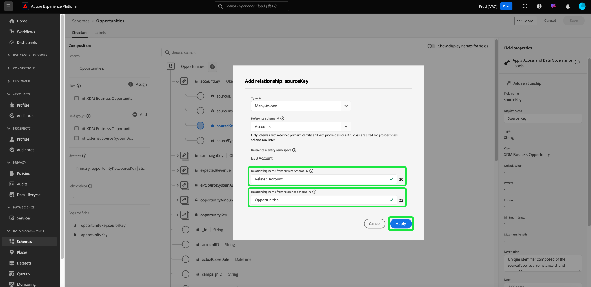

# Defina una relación varios a uno entre dos esquemas en Real-time Customer Data Platform B2B Edition {#relationship-b2b}

>[!CONTEXTUALHELP]
>id="platform_xdm_b2b_reference_schema"
>title="Esquema de referencia"
>abstract="Seleccione el esquema con el que desea establecer una relación. Según la clase del esquema, también puede tener relaciones existentes con otras entidades del contexto B2B. Consulte la documentación para conocer cómo se relacionan las clases de esquema B2B entre sí."

Adobe Real-time Customer Data Platform B2B Edition proporciona varias clases de modelo de datos de experiencia (XDM) que capturan entidades de datos B2B fundamentales, como [cuentas](../classes/b2b/business-account.md), [oportunidades](../classes/b2b/business-opportunity.md), [campañas](../classes/b2b/business-campaign.md), y más. Generando esquemas basados en estas clases y habilitándolos para su uso en [Perfil del cliente en tiempo real](../../profile/home.md)Además, puede combinar datos de fuentes diferentes en una representación unificada denominada esquema de unión.

Sin embargo, los esquemas de unión solo pueden contener campos capturados por esquemas que comparten la misma clase. Aquí es donde entran en juego las relaciones de esquema. Al implementar relaciones en los esquemas B2B, puede describir cómo se relacionan entre sí estas entidades comerciales y puede incluir atributos de varias clases en casos de uso de segmentación descendente.

El diagrama siguiente proporciona un ejemplo de cómo las diferentes clases B2B pueden relacionarse entre sí en una implementación básica:

Este tutorial trata los pasos para definir una relación varios a uno entre dos esquemas en Real-Time CDP B2B Edition.

>[!NOTE]
>
>Si no utiliza Real-time Customer Data Platform B2B Edition o desea crear una relación uno a uno, consulte la guía de [creación de una relación uno a uno](./relationship-ui.md) en su lugar.
>
>Este tutorial se centra en cómo establecer manualmente relaciones entre esquemas B2B en la IU de Platform. Si va a traer datos desde una conexión de origen B2B, puede utilizar una utilidad de generación automática para crear los esquemas, identidades y relaciones necesarios en su lugar. Consulte la documentación de fuentes sobre áreas de nombres y esquemas B2B para obtener más información sobre [uso de la utilidad de generación automática](../../sources/connectors/adobe-applications/marketo/marketo-namespaces.md).

## Primeros pasos

Este tutorial requiere una comprensión práctica de [!DNL XDM System] y el Editor de esquemas en el [!DNL Experience Platform] IU. Antes de comenzar este tutorial, revise la siguiente documentación:

* [Sistema XDM en Experience Platform](../home.md): Información general sobre XDM y su implementación en [!DNL Experience Platform].
* [Conceptos básicos de composición de esquemas](../schema/composition.md): Introducción a los componentes básicos de los esquemas XDM.
* [Cree un esquema con la variable [!DNL Schema Editor]](create-schema-ui.md): Un tutorial que cubre los conceptos básicos de cómo crear y editar esquemas en la interfaz de usuario.

## Definir un esquema de origen y de referencia

Se espera que ya haya creado los dos esquemas que se definirán en la relación. Para fines de demostración, este tutorial crea una relación entre oportunidades de negocio (definidas en un &quot;[!DNL Opportunities]&quot; esquema) y su cuenta empresarial asociada (definida en una &quot;[!DNL Accounts]&quot; esquema).

Las relaciones de esquema se representan mediante un campo dedicado dentro de un **esquema de origen** que hace referencia al campo de identidad principal de una **esquema de referencia**. En los pasos siguientes, &quot;[!DNL Opportunities]&quot; sirve como esquema de origen, mientras que &quot;[!DNL Accounts]&quot; actúa como esquema de referencia.

### Explicación de las identidades en las relaciones B2B

>[!CONTEXTUALHELP]
>id="platform_xdm_b2b_identity_namespace"
>title="Área de nombres de identidad"
>abstract="El área de nombres (tipo) del campo de identidad principal del esquema de referencia. El esquema de referencia debe tener un campo de identidad principal establecido para participar en una relación. Consulte la documentación para obtener más información sobre las identidades en las relaciones B2B."

Para establecer una relación, el esquema de referencia debe tener una identidad principal definida. Al establecer una identidad principal para una entidad B2B, tenga en cuenta que los ID de entidad basados en cadenas pueden superponerse si los recopila en diferentes sistemas o ubicaciones, lo que podría provocar conflictos de datos en Platform.

Para tener en cuenta esto, todas las clases B2B estándar contienen campos &quot;clave&quot; que se ajustan a la variable [[!UICONTROL Origen B2B] tipo de datos](../data-types/b2b-source.md). Este tipo de datos proporciona campos para un identificador de cadena para la entidad B2B junto con otra información contextual sobre el origen del identificador. Uno de estos campos, `sourceKey`, concatena los valores de los demás campos del tipo de datos para producir un identificador completamente único para la entidad. Este campo siempre debe utilizarse como identidad principal para los esquemas de entidad B2B.

>[!NOTE]
>
>Cuándo [configuración de un campo XDM como identidad](../ui/fields/identity.md), debe proporcionar un área de nombres de identidad para definir la identidad en. Puede ser un área de nombres estándar proporcionada por Adobe o un área de nombres personalizada definida por su organización. En la práctica, el área de nombres es simplemente una cadena contextual y se puede establecer en cualquier valor que desee, siempre que tenga sentido para su organización categorizar el tipo de identidad. Consulte la información general sobre [áreas de nombres de identidad](../../identity-service/namespaces.md) para obtener más información.

Como referencia, las secciones siguientes describen la estructura de cada esquema utilizado en este tutorial antes de definir una relación. Tome nota de dónde se han definido las identidades principales en la estructura de esquema y las áreas de nombres personalizadas que utilizan.

### [!DNL Opportunities] esquema

El esquema de origen &quot;[!DNL Opportunities]&quot; se basa en [!UICONTROL Oportunidad empresarial de XDM] clase. Uno de los campos proporcionados por la clase, `opportunityKey`, sirve como identificador para el esquema. En concreto, la variable `sourceKey` en el campo `opportunityKey` se establece como identidad principal del esquema en un área de nombres personalizada denominada [!DNL B2B Opportunity].

Como se ve debajo de **[!UICONTROL Propiedades del esquema]**, este esquema se ha habilitado para su uso en [!DNL Real-Time Customer Profile].

### [!DNL Accounts] esquema

El esquema de referencia &quot;[!DNL Accounts]&quot; se basa en [!UICONTROL Cuenta XDM] clase. El nivel de raíz `accountKey` contiene el campo `sourceKey` que actúa como su identidad principal en un área de nombres personalizada denominada [!DNL B2B Account]. Este esquema también se ha habilitado para su uso en el perfil.

## Definir un campo de relación para el esquema de origen {#relationship-field}

>[!CONTEXTUALHELP]
>id="platform_xdm_b2b_relationship_name_current"
>title="Nombre de relación del esquema actual"
>abstract="Una etiqueta que describe la relación del esquema actual con el esquema de referencia (por ejemplo, &quot;Cuenta relacionada&quot;). Esta etiqueta se utiliza en Perfil y Segmentación para dar contexto a los datos de entidades B2B relacionadas. Consulte la documentación para obtener más información sobre la creación de relaciones de esquema B2B."

>[!CONTEXTUALHELP]
>id="platform_xdm_b2b_relationship_name_reference"
>title="Nombre de relación del esquema de referencia"
>abstract="Una etiqueta que describe la relación del esquema de referencia con el esquema actual (por ejemplo, &quot;Oportunidades relacionadas&quot;). Esta etiqueta se utiliza en Perfil y Segmentación para dar contexto a los datos de entidades B2B relacionadas. Consulte la documentación para obtener más información sobre la creación de relaciones de esquema B2B."

Para definir una relación entre dos esquemas, el esquema de origen debe tener un campo dedicado que indique la identidad principal del esquema de referencia. Las clases B2B estándar incluyen campos de clave de origen dedicados para entidades comerciales comúnmente relacionadas. Por ejemplo, la variable [!UICONTROL Oportunidad empresarial de XDM] contiene campos de clave de origen para una cuenta relacionada (`accountKey`) y una campaña relacionada (`campaignKey`). Sin embargo, también puede agregar otros [!UICONTROL Origen B2B] Agregue campos al esquema utilizando grupos de campos personalizados si necesita más de los componentes predeterminados.

>[!NOTE]
>
>Actualmente, solo se pueden definir relaciones varios a uno y uno a uno desde un esquema de origen a un esquema de referencia. Para las relaciones uno a varios, debe definir el campo de relación en el esquema que representa a &quot;varios&quot;.

Para establecer un campo de relación, seleccione el icono de flecha () junto al campo en cuestión dentro del lienzo. En el caso de [!DNL Opportunities] esquema, este es el `accountKey.sourceKey` ya que el objetivo es establecer una relación de varios a uno con una cuenta de.

Aparece un cuadro de diálogo que le permite especificar los detalles de la relación. El tipo de relación se establece automáticamente como **[!UICONTROL Varios a uno]**.

En **[!UICONTROL Esquema de referencia]**, utilice la barra de búsqueda para encontrar el nombre del esquema de referencia. Cuando se resalta el nombre del esquema de referencia, la variable **[!UICONTROL Área de nombres de identidad]** Este campo se actualiza automáticamente al área de nombres de la identidad principal del esquema.

En **[!UICONTROL Nombre de relación del esquema actual]** y **[!UICONTROL Nombre de relación del esquema de referencia]**, proporcione nombres descriptivos para la relación en el contexto de los esquemas de origen y referencia, respectivamente. Cuando termine, seleccione **[!UICONTROL Guardar]** para aplicar los cambios y guardar el esquema.

El lienzo vuelve a aparecer y el campo de relación ahora está marcado con el nombre descriptivo proporcionado anteriormente. El nombre de la relación también se enumera bajo el carril izquierdo para facilitar la referencia.

Si se ve la estructura del esquema de referencia, el marcador de relación aparece junto al campo de identidad principal del esquema y en el carril izquierdo.

## Pasos siguientes

Al seguir este tutorial, ha creado correctamente una relación de varios a uno entre dos esquemas utilizando [!DNL Schema Editor]. Una vez que los datos se han introducido utilizando conjuntos de datos basados en estos esquemas y que los datos se han activado en el almacén de datos de perfil, puede utilizar atributos de ambos esquemas para [casos de uso de segmentación de varias clases](../../rtcdp/segmentation/b2b.md).
