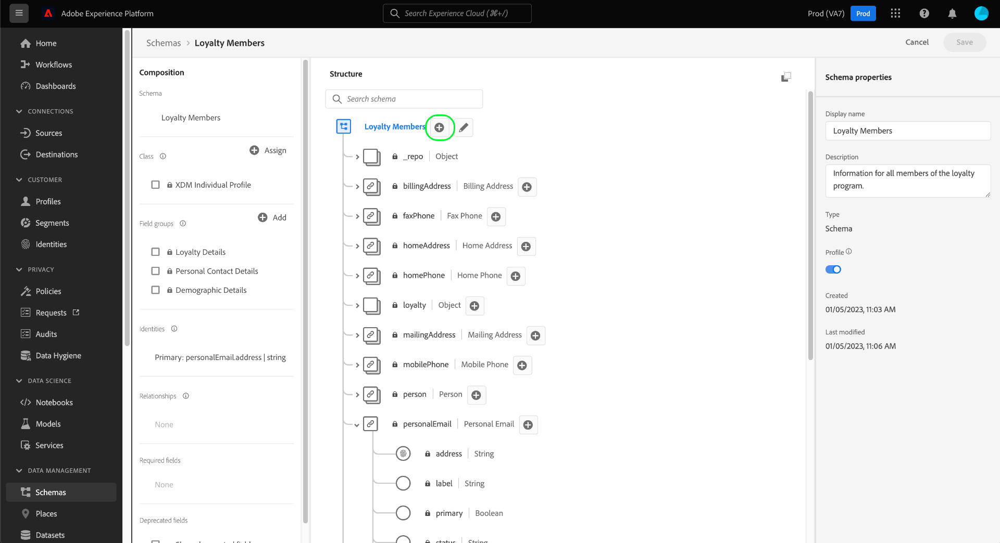

# Defina una relación entre dos esquemas usando el [!DNL Schema Editor]

La capacidad de comprender las relaciones entre sus clientes y sus interacciones con su marca en diversos canales es una parte importante de Adobe Experience Platform. La definición de estas relaciones dentro de la estructura de sus esquemas [!DNL Experience Data Model] (XDM) le permite obtener perspectivas complejas en los datos de sus clientes.

Aunque las relaciones de esquema se pueden inferir mediante el uso del esquema de unión y [!DNL Real-time Customer Profile], esto solo se aplica a esquemas que comparten la misma clase. Para establecer una relación entre dos esquemas pertenecientes a diferentes clases, se debe agregar un campo de relación dedicado a un esquema de origen, que haga referencia a la identidad de un esquema de destino.

Este documento proporciona un tutorial para definir una relación entre dos esquemas mediante el Editor de Esquemas en la interfaz de usuario [!DNL Experience Platform]. Para ver los pasos sobre la definición de relaciones de esquema mediante la API, consulte el tutorial sobre [definición de una relación mediante la API del Registro de Esquema](relationship-api.md).

## Primeros pasos

Este tutorial requiere un conocimiento práctico de [!DNL XDM System] y del Editor de Esquemas en la [!DNL Experience Platform] interfaz de usuario. Antes de comenzar este tutorial, consulte la siguiente documentación:

* [Sistema XDM en Experience Platform](../home.md): Información general sobre XDM y su implementación en  [!DNL Experience Platform].
* [Conceptos básicos de la composición](../schema/composition.md) de esquemas: Introducción de los componentes básicos de los esquemas XDM.
* [Cree un esquema con los [!DNL Schema Editor]](create-schema-ui.md) siguientes elementos: Un tutorial que cubre los conceptos básicos del trabajo con el  [!DNL Schema Editor].

## Definir un esquema de origen y destino

Se espera que ya haya creado los dos esquemas que se definirán en la relación. Para fines de demostración, este tutorial crea una relación entre los miembros del programa de lealtad de una organización (definido en un esquema &quot;[!DNL Loyalty Members]&quot;) y su hotel favorito (definido en un esquema &quot;[!DNL Hotels]&quot;).

>[!IMPORTANT]
>
>Para establecer una relación, ambos esquemas deben tener identidades primarias definidas y habilitarse para [!DNL Real-time Customer Profile]. Consulte la sección sobre [habilitación de un esquema para su uso en Perfil](./create-schema-ui.md#profile) en el tutorial de creación de esquema si necesita instrucciones sobre cómo configurar sus esquemas en consecuencia.

Las relaciones de esquema están representadas por un campo dedicado dentro de un **esquema de origen** que hace referencia a otro campo dentro de un **esquema de destino**. En los pasos siguientes, &quot;[!DNL Loyalty Members]&quot; será el esquema de origen, mientras que &quot;[!DNL Hotels]&quot; actuará como el esquema de destino.

Con fines de referencia, las siguientes secciones describen la estructura de cada esquema utilizado en este tutorial antes de definir una relación.

### [!DNL Loyalty Members] esquema

El esquema de origen &quot;[!DNL Loyalty Members]&quot; se basa en la clase [!DNL XDM Individual Profile] y es el esquema que se construyó en el tutorial para [crear un esquema en la interfaz de usuario](create-schema-ui.md). Incluye un objeto `loyalty` bajo su Área de nombres `_tenantId`, que incluye varios campos específicos de lealtad. Uno de estos campos, `loyaltyId`, sirve como identidad principal para el esquema en la Área de nombres [!UICONTROL Email]. Como se muestra en **[!UICONTROL Propiedades de Esquema]**, este esquema se ha habilitado para su uso en [!DNL Real-time Customer Profile].

### [!DNL Hotels] esquema

El esquema de destino &quot;[!DNL Hotels]&quot; se basa en una clase personalizada &quot;[!DNL Hotels]&quot; y contiene campos que describen un hotel. El campo `hotelId` sirve como identidad principal para el esquema en una Área de nombres `hotelId` personalizada. Al igual que el esquema [!DNL Loyalty Members], este esquema también se ha habilitado para [!DNL Real-time Customer Profile].

## Crear una mezcla de relación

>[!NOTE]
>
>Este paso solo es necesario si el esquema de origen no tiene un campo de tipo de cadena dedicado que se pueda utilizar como referencia al esquema de destino. Si este campo ya está definido en el esquema de origen, vaya al siguiente paso de [definición de un campo de relación](#relationship-field).

Para definir una relación entre dos esquemas, el esquema de origen debe tener un campo específico para utilizarlo como referencia al esquema de destino. Puede agregar este campo al esquema de origen creando una nueva mezcla.

Para inicio, seleccione **[!UICONTROL Añadir]** en la sección **[!UICONTROL Mezclas]**.

Aparece el cuadro de diálogo [!UICONTROL Añadir mezcla]. Desde aquí, seleccione **[!UICONTROL Crear nueva mezcla]**. En los campos de texto que aparecen, introduzca un nombre para mostrar y una descripción para la nueva combinación. Seleccione **[!UICONTROL Añadir mezcla]** cuando termine.

 

El lienzo vuelve a aparecer con &quot;[!DNL Favorite Hotel]&quot; en la sección **[!UICONTROL Mezclas]**. Seleccione el nombre de la mezcla y, a continuación, seleccione **[!UICONTROL Añadir campo]** junto al campo de nivel de raíz `Loyalty Members`.

Aparece un nuevo campo en el lienzo bajo la Área de nombres `_tenantId`. En **[!UICONTROL Propiedades del campo]**, proporcione un nombre de campo y un nombre para mostrar para el campo y defina su tipo en &quot;[!UICONTROL String]&quot;.

Cuando termine, seleccione **[!UICONTROL Aplicar]**.

El campo `favoriteHotel` actualizado aparece en el lienzo. Seleccione **[!UICONTROL Guardar]** para finalizar los cambios en el esquema.

## Definir un campo de relación para el esquema de origen {#relationship-field}

Una vez definido el esquema de origen, puede designarlo como un campo de relación.

Seleccione el campo `favoriteHotel` en el lienzo, luego desplácese hacia abajo en **[!UICONTROL Propiedades del campo]** hasta que aparezca la casilla **[!UICONTROL Relación]**. Seleccione la casilla de verificación para mostrar los parámetros necesarios para configurar un campo de relación.

Seleccione el menú desplegable para **[!UICONTROL esquema de referencia]** y seleccione el esquema de destino para la relación (&quot;[!DNL Hotels]&quot; en este ejemplo). Si el esquema de destino está habilitado para [!DNL Profile], el campo **[!UICONTROL Área de nombres de identidad de referencia]** se establece automáticamente en la Área de nombres de la identidad principal del esquema de destino. Si el esquema no tiene definida una identidad principal, debe seleccionar manualmente la Área de nombres que va a utilizar en el menú desplegable. Seleccione **[!UICONTROL Aplicar]** cuando termine.

El campo `favoriteHotel` ahora se resalta como una relación en el lienzo, mostrando la Área de nombres de identidad de nombre y referencia del esquema de destino. Seleccione **[!UICONTROL Guardar]** para guardar los cambios y completar el flujo de trabajo.

## Pasos siguientes

Siguiendo este tutorial, ha creado correctamente una relación uno a uno entre dos esquemas mediante el uso de [!DNL Schema Editor]. Para ver los pasos sobre cómo definir relaciones mediante la API, consulte el tutorial sobre [definición de una relación mediante la API del Registro de Esquema](relationship-api.md).