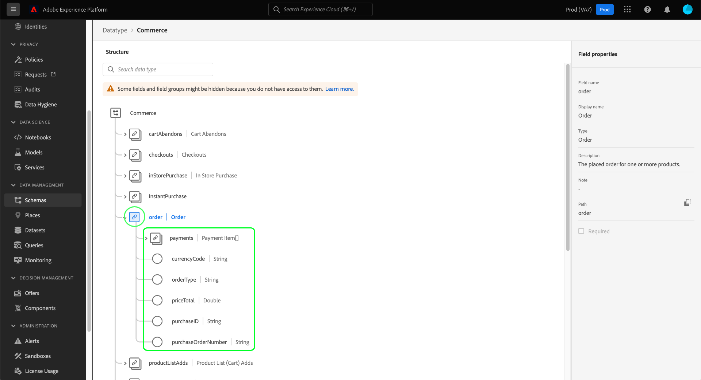
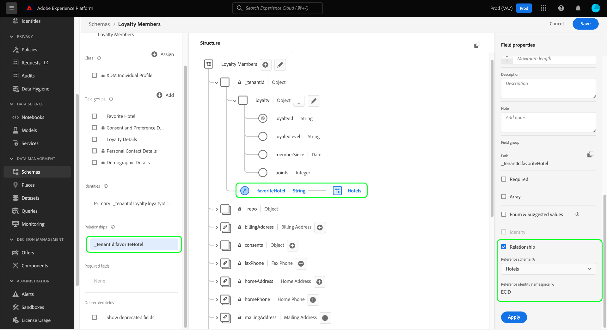

# Explorar recursos XDM en la interfaz de usuario

En Adobe Experience Platform, todos los recursos del Modelo de datos de experiencia (XDM) se almacenan en [!DNL Schema Library], incluidos los recursos estándar proporcionados por el Adobe y los recursos personalizados definidos por la organización. En la interfaz de usuario del Experience Platform, puede realizar la vista de la estructura y los campos de cualquier esquema, clase, mezcla o tipo de datos existente en [!DNL Schema Library]. Esto resulta especialmente útil al planificar y preparar la ingestión de datos, ya que la interfaz de usuario proporciona información sobre los tipos de datos esperados y los casos de uso de cada campo que proporcionan estos recursos XDM.

En este tutorial se explican los pasos para explorar los esquemas, las clases, las mezclas y los tipos de datos existentes en la interfaz de usuario del Experience Platform.

## Buscar un recurso XDM {#lookup}

En la interfaz de usuario de la plataforma, seleccione **[!UICONTROL Esquemas]** en el panel de navegación izquierdo. El espacio de trabajo [!UICONTROL Esquemas] proporciona una ficha **[!UICONTROL Examinar]** para explorar todos los recursos XDM existentes en su organización, junto con fichas adicionales dedicadas para explorar **[!UICONTROL Clases]**, **[!UICONTROL Mezclas]** y **[!UICONTROL Tipos de datos]** específicamente.

En la ficha [!UICONTROL Examinar], puede utilizar el icono de filtro () para mostrar los controles en el carril izquierdo y reducir los resultados de la lista.

Por ejemplo, para filtrar la lista y mostrar únicamente los tipos de datos estándar proporcionados por Adobe, seleccione **[!UICONTROL Tipo de datos]** y **[!UICONTROL Adobe]** en las secciones **[!UICONTROL Tipo]** y **[!UICONTROL Propietario]**, respectivamente.

La opción **[!UICONTROL Incluido en Perfil]** permite filtrar los resultados para mostrar solo los recursos que se utilizan en esquemas que se han habilitado para su uso en [Perfil del cliente en tiempo real](../../profile/home.md).

También puede utilizar la barra de búsqueda para reducir aún más los resultados. Al buscar un término, los elementos principales representan recursos cuyos nombres coinciden con la consulta de búsqueda. Debajo de estos elementos, en **[!UICONTROL Campos estándar]**, se enumerarán todos los recursos que contengan campos que coincidan con la consulta. Esto le permite buscar recursos XDM en función del tipo de datos que contienen, sin tener que conocer previamente el nombre del recurso.

Cuando encuentre el recurso que desea explorar, seleccione su nombre en la lista para vista de su estructura en el lienzo.

## Explorar un recurso XDM en el lienzo {#explore}

Una vez seleccionado un recurso, su estructura se abre en el lienzo.

Todos los campos de tipo de objeto que contienen subpropiedades se contraen de forma predeterminada cuando aparecen por primera vez en el lienzo. Para mostrar las subpropiedades de cualquier campo, seleccione el icono junto a su nombre.

### Campos generados por el sistema {#system-fields}

Algunos nombres de campo van precedidos de un guión bajo, como `_repo` y `_id`. Representan marcadores de posición para los campos que el sistema generará automáticamente y asignará a medida que se ingrese datos.

Como tal, la mayoría de estos campos deben excluirse de la estructura de los datos al realizar la ingesta en la plataforma. La principal excepción a esta regla es el campo [`_{TENANT_ID}`](../api/getting-started.md#know-your-tenant_id), en el que se deben asignar nombres a todos los campos XDM creados en la organización.

### Tipos de datos {#data-types}

Para cada campo mostrado en el lienzo, se muestra el tipo de datos correspondiente junto a su nombre, indicando de un vistazo el tipo de datos que ese campo espera para la ingestión.

Cualquier tipo de datos que se anexa con corchetes (`[]`) representa una matriz de ese tipo de datos en particular. Por ejemplo, un tipo de datos de **[!UICONTROL String]\[]** indica que el campo espera una matriz de valores de cadena. Un tipo de datos de **[!UICONTROL Elemento de pago]\[]** indica una matriz de objetos que se ajustan al tipo de datos [!UICONTROL Elemento de pago].

Si un campo de matriz se basa en un tipo de objeto, puede seleccionar su icono en el lienzo para mostrar los atributos esperados para cada elemento de matriz.

### [!UICONTROL Propiedades del campo] {#field-properties}

Al seleccionar el nombre de cualquier campo del lienzo, se actualiza el carril derecho para mostrar detalles sobre ese campo en **[!UICONTROL Propiedades del campo]**. Esto puede incluir una descripción del caso de uso previsto del campo, los valores predeterminados, los patrones, los formatos, si el campo es obligatorio o no, etc.

Si el campo que está inspeccionando es un campo de enumeración, el carril derecho también mostrará los valores aceptables que el campo espera recibir.

### Campos de identidad {#identity}

Al inspeccionar esquemas que contienen campos de identidad, estos campos se enumeran en el carril izquierdo bajo la clase o mezcla que los proporciona al esquema. Seleccione el nombre del campo de identidad en el carril izquierdo para mostrar el campo en el lienzo, independientemente de la profundidad con que esté anidado.

Los campos de identidad se resaltan en el lienzo con un icono de huella dactilar (). Si selecciona el nombre del campo de identidad, puede vista información adicional como la [Área de nombres de identidad](../../identity-service/namespaces.md) y si el campo es o no la identidad principal del esquema.

>[!NOTE]
>
>Consulte la guía sobre [definición de campos de identidad](./fields/identity.md) para obtener más información sobre los campos de identidad y su relación con los servicios de plataforma descendente.

### Campos de relación {#relationship}

Si está inspeccionando un esquema que contiene un campo de relación, el campo se enumerará en el carril izquierdo en **[!UICONTROL Relaciones]**. Seleccione el nombre del campo de relación en el carril izquierdo para mostrar el campo en el lienzo, independientemente de la profundidad con que esté anidado.

Los campos de relación también se resaltan de forma única en el lienzo, mostrando el nombre del esquema de destino al que hace referencia el campo. Si selecciona el nombre del campo de relación, puede vista la Área de nombres de identidad de la identidad principal del esquema de destino en el carril derecho.

>[!NOTE]
>
>Consulte el tutorial sobre [creación de una relación en la interfaz de usuario](../tutorials/create-schema-ui.md) para obtener más información sobre el uso de relaciones en esquemas XDM.

## Pasos siguientes

Este documento explicaba cómo explorar los recursos XDM existentes en la interfaz de usuario del Experience Platform. Para obtener más información sobre las diferentes características del espacio de trabajo [!UICONTROL Esquemas] y [!DNL Schema Editor], consulte la [[!UICONTROL información general del espacio de trabajo ] Esquemas](./overview.md).