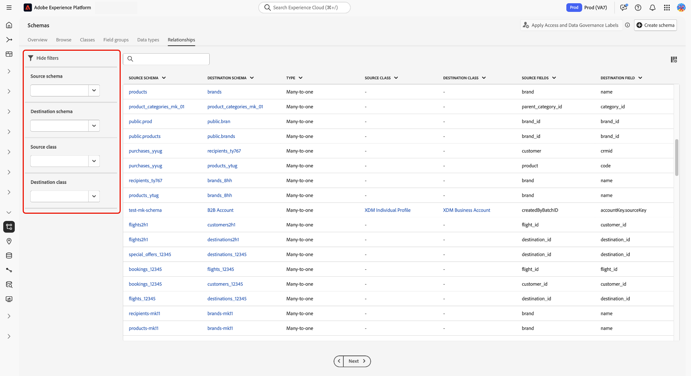
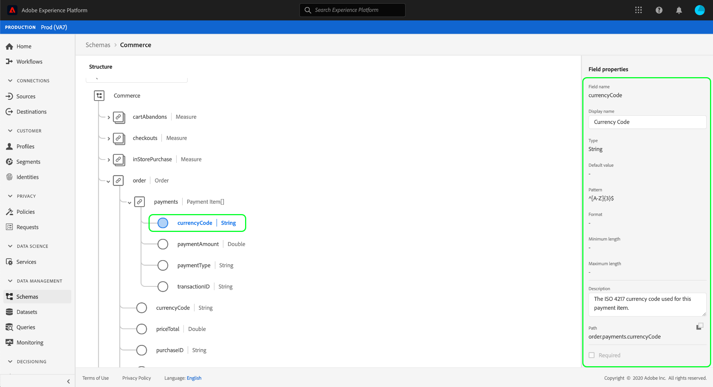
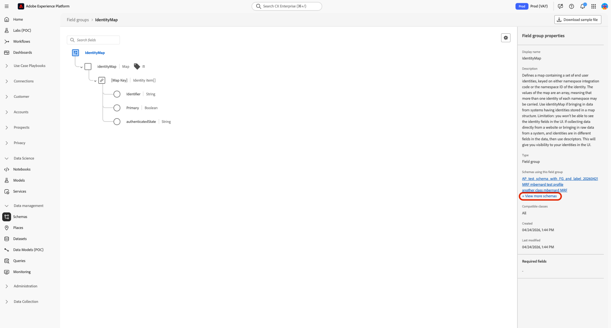
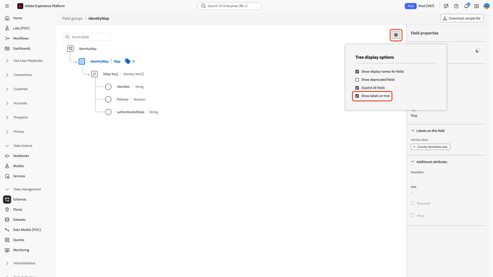

# Exploración de recursos de esquema en la IU

En Adobe Experience Platform, todos los recursos de esquema del Modelo de datos de experiencia (XDM) se almacenan en [!DNL Schema Library], incluidos los recursos estándar proporcionados por Adobe y los recursos personalizados definidos por su organización. En la interfaz de usuario de Experience Platform, puede ver la estructura y los campos de cualquier esquema, clase, grupo de campos o tipo de datos existente en [!DNL Schema Library]. Esto resulta especialmente útil a la hora de planificar y preparar la ingesta de datos, ya que la interfaz de usuario proporciona información sobre los tipos de datos esperados y los casos de uso de cada campo proporcionado por estos recursos XDM.

Este tutorial explica los pasos para explorar los esquemas, las clases, los grupos de campos y los tipos de datos existentes en la interfaz de usuario de Experience Platform.

## Búsqueda de un recurso de esquema {#lookup}

En la interfaz de usuario de Experience Platform, seleccione **[!UICONTROL Schemas]** en el panel de navegación izquierdo. El espacio de trabajo [!UICONTROL Schemas] proporciona una ficha **[!UICONTROL Browse]** para explorar todos los esquemas de su organización, junto con fichas dedicadas adicionales para explorar **[!UICONTROL Classes]**, **[!UICONTROL Field groups]**, **[!UICONTROL Data types]** y **[!UICONTROL Relationships]** respectivamente.

El icono de filtro () muestra los controles en el carril izquierdo para reducir los resultados de la lista. Los filtros de recursos están disponibles para esquemas y relaciones en las fichas **[!UICONTROL Browse]** y **[!UICONTROL Relationships]** respectivamente. En la ficha **[!UICONTROL Field groups]**, use los filtros descritos en [Filtrado y metadatos de grupos de campos](#field-group-metadata-and-filtering) para reducir la lista según etiquetas de clase e industria compatibles.

En la ficha [!UICONTROL Browse] del área de trabajo [!UICONTROL Schemas], puede filtrar el inventario de esquemas. Utilice la opción **[!UICONTROL Included in Profile]** para mostrar solo los esquemas que se han habilitado para su uso en [Perfil del cliente en tiempo real](../../profile/home.md). Utilice la opción **[!UICONTROL Show adhoc schemas]** para filtrar la lista de esquemas creados con campos con espacio de nombres para su uso solamente por un único conjunto de datos.

![La ficha [!UICONTROL Schemas] del área de trabajo [!UICONTROL Browse] con el panel de filtros resaltado.](../images/ui/explore/filters.png)

En la ficha [!UICONTROL Relationship] del área de trabajo [!UICONTROL Schemas], puede filtrar la lista de relaciones en función de cuatro criterios. Los filtros incluyen [!UICONTROL Source schema], [!UICONTROL Destination schema], [!UICONTROL Source class] y [!UICONTROL Destination class]. La siguiente tabla proporciona una descripción de los filtros.

| Filtro | Descripción |
|-----------------------------------|------------|
| [!UICONTROL Source schema] | Para ver todas las relaciones en las que el esquema seleccionado sea el punto de partida o el &quot;origen&quot;, seleccione un esquema en el menú desplegable [!UICONTROL Source schema]. |
| [!UICONTROL Destination schema] | Para ver todas las relaciones en las que el esquema seleccionado sea el destino o el &quot;destino&quot;, seleccione un esquema en el menú desplegable [!UICONTROL Destination schema]. |
| [!UICONTROL Source class] | Para filtrar relaciones basadas en la clase del esquema de inicio, seleccione una clase del menú desplegable [!UICONTROL Source class]. |
| [!UICONTROL Destination class] | Para mostrar las relaciones que terminan con esquemas de una clase específica, seleccione una clase en el menú desplegable [!UICONTROL Destination class]. |

{style="table-layout:auto"}

También puede utilizar la barra de búsqueda para reducir aún más los resultados.

Los recursos mostrados en los resultados de búsqueda se ordenan primero por coincidencias de título y luego por coincidencias de descripción. A su vez, cuanto más coincidan las palabras en cualquiera de estas categorías, más alto aparecerá el recurso en la lista.

Cuando haya encontrado el recurso que desea explorar, seleccione su nombre en la lista para ver su estructura en el lienzo.

## Administrar esquemas, clases, grupos de campos y tipos de datos: acciones y eliminación {#xdm-resource-actions}

Utilice esta sección cuando necesite administrar o eliminar recursos XDM, o cuando una acción (como eliminar) no esté disponible y necesite comprender por qué.

### Dónde encontrar acciones (página en línea frente a página de detalles) {#where-to-find-actions}

Para realizar acciones como eliminar, exportar o copiar un recurso, utilice uno de los siguientes puntos de entrada:

En las fichas **[!UICONTROL Browse]**, **[!UICONTROL Classes]**, **[!UICONTROL Field groups]** y **[!UICONTROL Data types]**, las acciones de administración están disponibles en dos ubicaciones:

- **En línea en la tabla**: cada fila de recurso incluye un menú de acciones (por ejemplo, **[!UICONTROL …]**) que proporciona acceso directo a las acciones disponibles.

- **Vista de detalles del recurso**: para acceder a las acciones completas en la vista de detalles, debe seleccionar un recurso **personalizado (definido por el inquilino)**. Los recursos estándar (proporcionados por Adobe) tienen acciones limitadas y no muestran opciones como Eliminar, Copiar estructura JSON o Agregar a paquete. Seleccione un recurso personalizado del inventario para abrir su vista de detalles y, a continuación, utilice el menú **[!UICONTROL More]** del encabezado de la página para acceder a las mismas acciones disponibles.

Estas acciones son coherentes en ambos puntos de entrada para los tipos de recursos admitidos (esquemas, clases, grupos de campos y tipos de datos).

### Acciones disponibles {#available-actions}

Según el tipo de recurso y los permisos, pueden estar disponibles las siguientes acciones:

- **[!UICONTROL Delete]**: elimine permanentemente un recurso personalizado de su organización (cuando las restricciones lo permitan). Si la eliminación está bloqueada, consulte [Restricciones](#delete-constraints).
- **[!UICONTROL Download sample file]**: genere un archivo de datos de ejemplo basado en la estructura de recursos. Paso a paso: [Generar datos XDM de muestra](./sample.md).
- **[!UICONTROL Copy JSON structure]**: copie la definición del recurso en formato JSON para su reutilización, exportación o inspección. Paso a paso: [Exportar esquemas XDM](./export.md).
- **[!UICONTROL Add to package]**: incluir el recurso en un paquete de zona protegida para exportarlo o importarlo en zonas protegidas. Paso a paso: [Exporte objetos a un paquete](../../sandboxes/ui/sandbox-tooling.md#export-objects).

Lo siguiente se aplica a diferentes tipos de recursos:

- Para **esquemas, clases, grupos de campos y tipos de datos personalizados (definidos por el inquilino)**, todas las acciones anteriores pueden estar disponibles.
- Para **clases, grupos de campos y tipos de datos estándar (definidos por Adobe)**:
   - Solo está disponible **[!UICONTROL Download sample file]**.
   - **Eliminar**, **Copiar la estructura de JSON** y **Agregar al paquete** no están disponibles.

### Eliminar comportamiento {#delete-behavior}

Utilice la acción **[!UICONTROL Delete]** cuando desee eliminar un recurso personalizado que ya no sea necesario.

>[!IMPORTANT]
>
> Al eliminar un recurso, este se elimina permanentemente de su organización y no se puede deshacer. Algunos recursos no se pueden eliminar debido a restricciones de uso, permisos o del sistema.

Para eliminar un recurso:

1. Busque el recurso en la tabla o abra su vista de detalles.
2. Seleccione el menú de acciones (**[!UICONTROL …]** o **[!UICONTROL More]**).
3. Seleccione **[!UICONTROL Delete]**.
4. Confirme la acción en el cuadro de diálogo volviendo a seleccionar **[!UICONTROL Delete]**.

El recurso se elimina permanentemente de su organización después de la confirmación.

Si la eliminación no está disponible para un recurso, la opción aparece deshabilitada con información del objeto que explica por qué no se puede realizar la acción.

### Restricciones (conjunto de datos, perfil, RBAC, inquilino frente a global) {#delete-constraints}

Si una acción como **[!UICONTROL Delete]** no está disponible o está deshabilitada, normalmente se debe a una de las siguientes condiciones:

- **Permisos (RBAC)**: debe tener los permisos necesarios (como **[!UICONTROL Manage Schemas]**) para realizar acciones de administración. Si faltan permisos, las acciones aparecen deshabilitadas con la información sobre herramientas. Para obtener información sobre cómo se configuran los permisos, consulte la [descripción general de la IU de control de acceso](../../access-control/ui/overview.md).

- **Asociación de conjuntos de datos**: No se pueden eliminar los recursos que utilizan uno o varios conjuntos de datos (como esquemas asociados a conjuntos de datos). Para identificar y quitar dependencias de conjuntos de datos, vea [Eliminar un conjunto de datos](../../catalog/datasets/user-guide.md#delete).

- **Habilitación de perfil**: no se pueden eliminar los esquemas habilitados para el perfil de cliente en tiempo real. Para obtener instrucciones sobre cómo afecta la habilitación del perfil a su esquema, consulte [Planificación de la habilitación del perfil del cliente en tiempo real](../schema/profile-enablement-planning.md).

- **Recursos de inquilino vs. recursos globales**: los recursos definidos por inquilino (personalizados) se pueden eliminar (sujetos a restricciones), mientras que las clases estándar (proporcionadas por Adobe), los grupos de campos y los tipos de datos no se pueden eliminar.

Estas restricciones se reflejan directamente en la interfaz de usuario. Cuando una acción no está disponible, aparece deshabilitada e incluye información sobre herramientas que explica la limitación específica.

Si no puede eliminar un recurso, revise las condiciones anteriores para determinar si necesita actualizar los permisos, eliminar dependencias o ajustar el modelo de datos.

Para ver flujos de trabajo adicionales de edición de esquemas en el lienzo, consulte [Crear y editar esquemas en la interfaz de usuario](./resources/schemas.md).

## Exploración de un recurso XDM en el lienzo {#explore}

Una vez seleccionado un recurso, su estructura se abre en el lienzo.

Todos los campos de tipo de objeto que contienen subpropiedades se contraen de forma predeterminada la primera vez que aparecen en el lienzo. Para mostrar las subpropiedades de cualquier campo, seleccione el icono junto a su nombre.

### Indicador de clase y grupo de campos estándar {#standard-class-and-field-group-indicator}

Dentro del Editor de esquemas, las clases y los grupos de campos estándar (generados por Adobe) se indican con el icono de candado (. El candado aparece en el carril izquierdo junto al nombre de la clase o del grupo de campos, así como junto a cualquier campo del diagrama de esquema que forme parte de un recurso generado por el sistema.

Consulte la documentación de [Agregar campos personalizados a grupos de campos estándar](./resources/schemas.md) para obtener instrucciones. No se puede editar una clase estándar.

### Campos generados por el sistema {#system-fields}

Algunos nombres de campo van precedidos de un guion bajo, como `_repo` y `_id`. Representan marcadores de posición para campos que el sistema generará y asignará automáticamente a medida que se incorporen los datos.

Como tal, la mayoría de estos campos deben excluirse de la estructura de los datos al ingerirlos en Experience Platform. La principal excepción a esta regla es el campo [`_{TENANT_ID}`](../api/getting-started.md#know-your-tenant_id), en el cual todos los campos XDM creados en su organización deben tener un espacio de nombres.

### Tipos de datos {#data-types}

Para cada campo que se muestra en el lienzo, su tipo de datos correspondiente se muestra junto a su nombre, lo que indica de un vistazo el tipo de datos que ese campo espera para la ingesta.

Cualquier tipo de datos que se agregue entre corchetes (`[]`) representa una matriz de ese tipo de datos en particular. Por ejemplo, un tipo de datos de **[!UICONTROL String]\[]** indica que el campo espera una matriz de valores de cadena. Un tipo de datos de **[!UICONTROL Payment Item]\[]** indica una matriz de objetos que se ajustan al tipo de datos de [!UICONTROL Payment Item].

Si un campo de matriz se basa en un tipo de objeto, puede seleccionar su icono en el lienzo para mostrar los atributos esperados para cada elemento de matriz.

### [!UICONTROL Field properties] {#field-properties}

Al seleccionar el nombre de cualquier campo en el lienzo, el carril derecho se actualiza para mostrar detalles sobre ese campo en **[!UICONTROL Field properties]**. Esto puede incluir una descripción del caso de uso previsto del campo, los valores predeterminados, los patrones, los formatos, si el campo es obligatorio y más. Cuando explora un grupo de campos, los detalles relacionados con etiquetas para el campo seleccionado también pueden aparecer aquí; consulte [Etiquetas en la vista de estructura](#field-group-labels-in-structure).

Si el campo que está inspeccionando es un campo de enumeración, el carril derecho también mostrará los valores aceptables que el campo espera recibir.

### Campos de identidad {#identity}

Al inspeccionar esquemas que contienen campos de identidad, estos campos se enumeran en el carril izquierdo bajo la clase o el grupo de campos que los proporciona al esquema. Seleccione el nombre del campo de identidad en el carril izquierdo para mostrar el campo en el lienzo, independientemente de la profundidad con que esté anidado.

Los campos de identidad se resaltan en el lienzo con un icono de huella digital (). Si selecciona el nombre del campo de identidad, puede ver información adicional como el [área de nombres de identidad](../../identity-service/features/namespaces.md) y si el campo es o no la identidad principal del esquema.

>[!NOTE]
>
>Consulte la guía de [definición de campos de identidad](./fields/identity.md) para obtener más información sobre los campos de identidad y su relación con los servicios de Experience Platform descendentes.

### Campos de relación {#relationship}

Si está inspeccionando un esquema que contiene un campo de relación, el campo se mostrará en el carril izquierdo bajo **[!UICONTROL Relationships]**. Seleccione el nombre del campo de relación en el carril izquierdo para mostrar el campo en el lienzo, independientemente de la profundidad con que esté anidado. Los campos de relación también se resaltan de forma exclusiva en el lienzo, mostrando el nombre del esquema de referencia al que está vinculado el campo. Para las organizaciones con capacidades B2B, se pueden escribir nombres de relación personalizados que se mostrarán en el lienzo en estos casos.

Para ver el área de nombres de identidad de la identidad principal del esquema de referencia, seleccione el campo de relación y luego **[!UICONTROL Edit relationship]** en la barra lateral [!UICONTROL Field properties]. Los parámetros de la relación se muestran en el cuadro de diálogo [!UICONTROL Edit relationship] que aparece.

Consulte el tutorial sobre [creación de una relación en la interfaz de usuario](../tutorials/relationship-ui.md) para obtener más información sobre el uso de relaciones en esquemas XDM.

## Explorar grupos de campos: uso y metadatos {#explore-field-groups}

Vaya a **[!UICONTROL Schemas]** > **[!UICONTROL Field groups]** para explorar grupos de campos. En la pestaña **[!UICONTROL Field groups]**, las capacidades adicionales le ayudan a comprender dónde se utiliza un grupo de campos en los esquemas y lo que incluye, como la compatibilidad, los campos obligatorios (que aplican requisitos de ingesta) y las señales de control.

Estas funciones le ayudan a evaluar el impacto antes de realizar cambios e identificar grupos de campos relevantes de forma más eficaz durante el diseño del esquema.

### Ver el uso del esquema para grupos de campos {#view-schema-usage-for-field-groups}

En la tabla **[!UICONTROL Field groups]**, seleccione un grupo de campos para abrir su vista de detalles. El lienzo se actualiza para mostrar la estructura del grupo de campos y el carril de propiedades muestra información adicional sobre el recurso seleccionado.

#### Esquemas que utilizan este grupo de campos

En el carril de propiedades derecho, la sección **[!UICONTROL Schemas using this field group]** enumera los esquemas que actualmente incluyen el grupo de campos.

- Si tres o menos esquemas utilizan el grupo de campos, se muestran todos los nombres de esquema.
- Si lo utilizan más de tres esquemas, solo se muestran algunos nombres, junto con una opción para ver la lista completa.

Seleccione un nombre de esquema para abrir su vista de detalles en una nueva pestaña e inspeccione cómo se implementa el grupo de campos dentro de ese esquema.

#### Ver más y una lista de esquemas completa

Si existen más esquemas de los que se pueden mostrar en línea, seleccione **[!UICONTROL View more]** para abrir el cuadro de diálogo completo.

Aparece el cuadro de diálogo **[!UICONTROL Schemas using this field group]**, que muestra la lista completa de esquemas que utilizan el grupo de campos.

En el cuadro de diálogo **[!UICONTROL Schemas using this field group]**, puede:

- Examinar todos los esquemas que utilizan el grupo de campos
- Página a través de grandes conjuntos de resultados
- Seleccione un esquema para abrir su vista de detalles en una nueva pestaña

Puede ver detalles del esquema, como el nombre del esquema, la clase y otros atributos.

Este flujo de trabajo está diseñado para **análisis y exploración de impacto solamente**. No modifica esquemas ni grupos de campos. Para cambiar la estructura del esquema, consulte [Crear y editar esquemas en la interfaz de usuario](./resources/schemas.md).

### Metadatos y filtrado de grupos de campos {#field-group-metadata-and-filtering}

La ficha **[!UICONTROL Field groups]** proporciona herramientas de filtrado y metadatos que le ayudarán a localizar y evaluar los grupos de campos antes de seleccionarlos.

#### Examinar tabla y filtros

La tabla de inventario de grupos de campos incluye columnas adicionales que exponen los metadatos directamente en la vista de lista, como **[!UICONTROL Compatible classes]**, que indica a qué clases se puede aplicar un grupo de campos. Los grupos de campos solo se pueden añadir a esquemas que utilicen una de las clases compatibles enumeradas, según el comportamiento de los datos que representan (por ejemplo, datos basados en registros o en series temporales). La tabla puede mostrar **[!UICONTROL All]** cuando el grupo de campos es compatible con todas las clases. **[!UICONTROL Industry tags]** ayuda a categorizar los grupos de campos para la detección.

Para restringir la lista, seleccione el icono de filtro () para abrir el panel de filtro en el carril izquierdo. La siguiente imagen muestra el panel de filtro abierto en el carril izquierdo.

En el panel de filtro, puede:

- **[!UICONTROL Compatible classes]**: utilice el menú desplegable para filtrar grupos de campos por compatibilidad de clase
- **[!UICONTROL Industry tags]**: utilice las casillas de verificación para filtrar por una o más categorías del sector

Durante la exploración, seleccione una fila de la tabla para actualizar el carril de información. El carril de información muestra metadatos como clases compatibles y etiquetas del sector para que pueda revisar los detalles clave sin abrir el grupo de campos.

#### Metadatos de detalle de grupo de campos

Cuando se abre un grupo de campos, el carril de propiedades muestra metadatos adicionales asociados al recurso.

El carril de propiedades puede mostrar los siguientes metadatos:

- **[!UICONTROL Compatible classes]** — Clases que el grupo de campos puede ampliar
- **[!UICONTROL Required attributes]**: atributos que deben tener valores válidos cuando el grupo de campos lo requiera durante la ingesta de datos. Los requisitos dependen de la estructura de datos y los registros en los que falten valores obligatorios o no sean válidos no superan la validación
- **[!UICONTROL Labels]** — Las etiquetas no se muestran en el nivel de grupo de campos. Seleccione un campo para ver los detalles de la etiqueta en el carril **[!UICONTROL Field properties]**

Esta información le ayuda a comprender las restricciones y los requisitos antes de utilizar o modificar el grupo de campos.

#### Etiquetas en la vista de estructura

Cuando un grupo de campos está abierto en el lienzo, puede ver la información de las etiquetas directamente en la estructura. Seleccione el icono de configuración () en la barra de herramientas lienzo y habilite **[!UICONTROL Show labels on tree]** para mostrar indicadores de etiqueta en los campos del lienzo.

Seleccione un campo en el lienzo para ver los detalles de la etiqueta en el carril **[!UICONTROL Field properties]**, incluidas las etiquetas aplicadas a ese campo.

Las etiquetas se agrupan por categoría (por ejemplo, etiquetas de identidad y confidenciales) y proporcionan visibilidad sobre la gobernanza o las restricciones relacionadas con el acceso aplicadas a los datos.

Estos indicadores solo son para visibilidad y no cambian la estructura del esquema. Para obtener más información, consulte [Administrar etiquetas de uso de datos para un esquema](../tutorials/labels.md).

## Próximos pasos

En este documento se explica cómo explorar los recursos XDM existentes en la interfaz de usuario de Experience Platform. Para obtener más información sobre las distintas características del área de trabajo [!UICONTROL Schemas] y [!DNL Schema Editor], vea la descripción general del área de trabajo [[!UICONTROL Schemas]](./overview.md).
