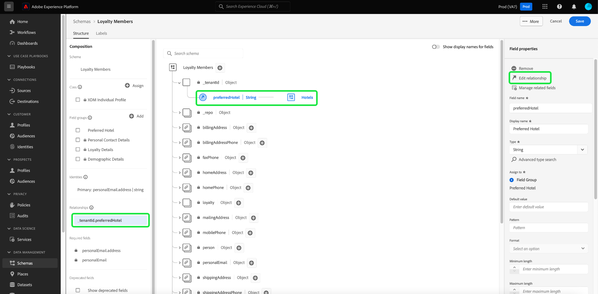

# Exploración de recursos de esquema en la IU

En Adobe Experience Platform, todos los recursos de esquema del Modelo de datos de experiencia (XDM) se almacenan en [!DNL Schema Library], incluidos los recursos estándar proporcionados por los recursos de Adobe y personalizados definidos por su organización. En la interfaz de usuario del Experience Platform, puede ver la estructura y los campos de cualquier esquema, clase, grupo de campos o tipo de datos existente en [!DNL Schema Library]. Esto resulta especialmente útil a la hora de planificar y preparar la ingesta de datos, ya que la interfaz de usuario proporciona información sobre los tipos de datos esperados y los casos de uso de cada campo proporcionado por estos recursos XDM.

Este tutorial explica los pasos para explorar los esquemas, las clases, los grupos de campos y los tipos de datos existentes en la interfaz de usuario de Experience Platform.

## Búsqueda de un recurso de esquema {#lookup}

En la interfaz de usuario de Platform, seleccione **[!UICONTROL Esquemas]** en el panel de navegación izquierdo. El área de trabajo [!UICONTROL Esquemas] proporciona una ficha **[!UICONTROL Examinar]** para explorar todos los esquemas de su organización, junto con fichas dedicadas adicionales para explorar **[!UICONTROL Clases]**, **[!UICONTROL Grupos de campos]** y **[!UICONTROL Tipos de datos]** respectivamente.

El icono de filtro () muestra los controles en el carril izquierdo para reducir los resultados de la lista. Los controles mostrados difieren según el tipo de recurso que se enumere.

Por ejemplo, para filtrar la lista de modo que solo se muestren los tipos de datos estándar proporcionados por el Adobe, seleccione **[!UICONTROL Tipo de datos]** y **[!UICONTROL Adobe]** en las secciones **[!UICONTROL Tipo]** y **[!UICONTROL Propietario]**, respectivamente.

La opción **[!UICONTROL Incluido en el perfil]** le permite filtrar los resultados para mostrar solo los recursos que se utilizan en esquemas que se han habilitado para su uso en [Perfil del cliente en tiempo real](../../profile/home.md). La opción **[!UICONTROL Mostrar esquemas ad hoc]** filtra la lista de esquemas que se crearon con campos con espacio de nombres para que los use un solo conjunto de datos.

![La ficha [!UICONTROL Esquemas] del área de trabajo [!UICONTROL Examinar] con el panel de filtros resaltado.](../images/ui/explore/filter.png)

Al listar recursos en las pestañas **[!UICONTROL Clases]**, **[!UICONTROL Grupos de campos]** o **[!UICONTROL Tipos de datos]**, puede seleccionar **[!UICONTROL Adobe]** para mostrar solo los recursos estándar o **[!UICONTROL Cliente]** para mostrar solo los recursos creados por su organización.

También puede utilizar la barra de búsqueda para reducir aún más los resultados.

Los recursos mostrados en los resultados de búsqueda se ordenan primero por coincidencias de título y luego por coincidencias de descripción. A su vez, cuanto más coincidan las palabras en cualquiera de estas categorías, más alto aparecerá el recurso en la lista.

Cuando haya encontrado el recurso que desea explorar, seleccione su nombre en la lista para ver su estructura en el lienzo.

## Exploración de un recurso XDM en el lienzo {#explore}

Una vez seleccionado un recurso, su estructura se abre en el lienzo.

Todos los campos de tipo de objeto que contienen subpropiedades se contraen de forma predeterminada la primera vez que aparecen en el lienzo. Para mostrar las subpropiedades de cualquier campo, seleccione el icono junto a su nombre.

### Indicador de clase y grupo de campos estándar {#standard-class-and-field-group-indicator}

En el Editor de esquemas, las clases y los grupos de campos estándar (generados por el Adobe) se indican con el icono de candado (. El candado aparece en el carril izquierdo junto al nombre de la clase o del grupo de campos, así como junto a cualquier campo del diagrama de esquema que forme parte de un recurso generado por el sistema.

Consulte la documentación de [Agregar campos personalizados a grupos de campos estándar](./resources/schemas.md) para obtener instrucciones. No se puede editar una clase estándar.

### Campos generados por el sistema {#system-fields}

Algunos nombres de campo van precedidos de un guion bajo, como `_repo` y `_id`. Representan marcadores de posición para campos que el sistema generará y asignará automáticamente a medida que se incorporen los datos.

Como tal, la mayoría de estos campos deben excluirse de la estructura de los datos al ingerirlos en Platform. La principal excepción a esta regla es el campo [`_{TENANT_ID}`](../api/getting-started.md#know-your-tenant_id), en el cual todos los campos XDM creados en su organización deben tener un espacio de nombres.

### Tipos de datos {#data-types}

Para cada campo que se muestra en el lienzo, su tipo de datos correspondiente se muestra junto a su nombre, lo que indica de un vistazo el tipo de datos que ese campo espera para la ingesta.

Cualquier tipo de datos que se agregue entre corchetes (`[]`) representa una matriz de ese tipo de datos en particular. Por ejemplo, un tipo de datos de **[!UICONTROL Cadena]\[]** indica que el campo espera una matriz de valores de cadena. Un tipo de datos de **[!UICONTROL Elemento de pago]\[]** indica una matriz de objetos que se ajustan al tipo de datos de [!UICONTROL Elemento de pago].

Si un campo de matriz se basa en un tipo de objeto, puede seleccionar su icono en el lienzo para mostrar los atributos esperados para cada elemento de matriz.

### [!UICONTROL Propiedades de campo] {#field-properties}

Cuando selecciona el nombre de cualquier campo en el lienzo, el carril derecho se actualiza para mostrar detalles sobre ese campo en **[!UICONTROL Propiedades del campo]**. Esto puede incluir una descripción del caso de uso previsto del campo, los valores predeterminados, los patrones, los formatos, si el campo es obligatorio o no, y más.

Si el campo que está inspeccionando es un campo de enumeración, el carril derecho también mostrará los valores aceptables que el campo espera recibir.

### Campos de identidad {#identity}

Al inspeccionar esquemas que contienen campos de identidad, estos campos se enumeran en el carril izquierdo bajo la clase o el grupo de campos que los proporciona al esquema. Seleccione el nombre del campo de identidad en el carril izquierdo para mostrar el campo en el lienzo, independientemente de la profundidad con que esté anidado.

Los campos de identidad se resaltan en el lienzo con un icono de huella digital (). Si selecciona el nombre del campo de identidad, puede ver información adicional como el [área de nombres de identidad](../../identity-service/features/namespaces.md) y si el campo es o no la identidad principal del esquema.

>[!NOTE]
>
>Consulte la guía de [definición de campos de identidad](./fields/identity.md) para obtener más información sobre los campos de identidad y su relación con los servicios de Platform secundarios.

### Campos de relación {#relationship}

Si está inspeccionando un esquema que contiene un campo de relación, el campo aparecerá en el carril izquierdo bajo **[!UICONTROL Relaciones]**. Seleccione el nombre del campo de relación en el carril izquierdo para mostrar el campo en el lienzo, independientemente de la profundidad con que esté anidado.

Los campos de relación también se resaltan de forma exclusiva en el lienzo, mostrando el nombre del esquema de referencia al que está vinculado el campo. Si selecciona el nombre del campo de relación, puede ver el área de nombres de identidad de la identidad principal del esquema de referencia en el carril derecho.

>[!NOTE]
>
>Consulte el tutorial sobre [creación de una relación en la interfaz de usuario](../tutorials/relationship-ui.md) para obtener más información sobre el uso de relaciones en esquemas XDM.

## Pasos siguientes

En este documento se explica cómo explorar los recursos XDM existentes en la interfaz de usuario de Experience Platform. Para obtener más información sobre las distintas características del área de trabajo [!UICONTROL Esquemas] y [!DNL Schema Editor], vea la información general sobre el área de trabajo [[!UICONTROL Esquemas]](./overview.md).
