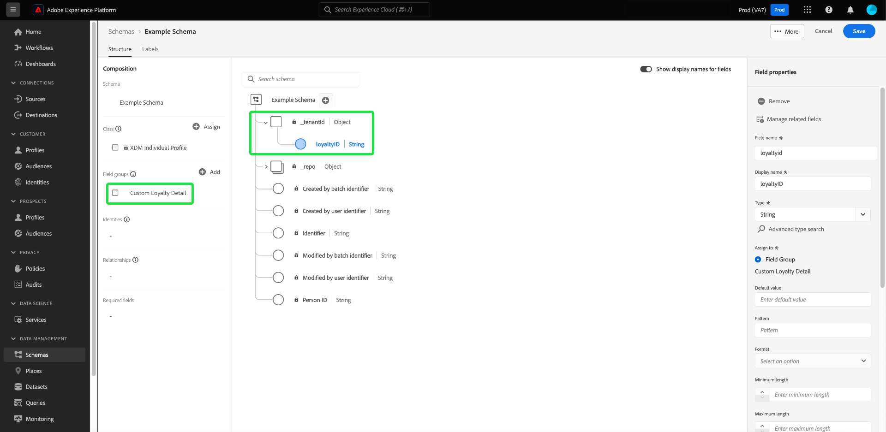

# Flujos de trabajo basados en el campo en el Editor de esquemas (Beta)

>[!IMPORTANT]
>
>Los flujos de trabajo descritos en este documento están actualmente en fase beta. La funcionalidad y la documentación están sujetas a cambios.

Adobe Experience Platform proporciona un conjunto sólido de [grupos de campos](../schema/composition.md#field-group) estandarizados para su uso en esquemas del Modelo de datos de experiencia (XDM). La estructura y la semántica detrás de estos grupos de campo están cuidadosamente diseñadas para satisfacer una amplia variedad de casos de uso de segmentación y otras aplicaciones posteriores en Platform. También puede definir sus propios grupos de campos personalizados para satisfacer necesidades comerciales únicas.

Cuando se agrega un grupo de campos a un esquema, ese esquema hereda todos los campos contenidos en ese grupo. Sin embargo, ahora puede agregar campos individuales al esquema sin necesidad de incluir otros campos del grupo de campos asociado que no necesariamente utilice.

Esta guía trata los diferentes métodos para añadir campos individuales a un esquema en la interfaz de usuario de Platform.

## Requisitos previos

Este tutorial supone que está familiarizado con la [composición de los esquemas XDM](../schema/composition.md) y cómo utilizar el Editor de esquemas en la interfaz de usuario de Platform. A continuación, debe iniciar el proceso de [creación de un nuevo esquema](./resources/schemas.md) y asignarlo a una clase estándar antes de continuar con esta guía.

## Eliminación de campos agregados de grupos de campos estándar

Después de agregar un grupo de campos estándar a un esquema, puede quitar los campos estándar que no necesite.

>[!NOTE]
>
>La eliminación de campos de un grupo de campos estándar solo afecta al esquema en el que se está trabajando y no afecta al propio grupo de campos. Si elimina los campos estándar de un esquema, dichos campos seguirán estando disponibles en todos los demás esquemas que empleen el mismo grupo de campos.

En el siguiente ejemplo, el grupo de campos estándar **[!UICONTROL Demographic Details]** se ha agregado a un esquema. Para quitar un solo campo como `taxId`, seleccione el campo en el lienzo y, a continuación, seleccione **[!UICONTROL Quitar]** en el carril derecho.

Si desea quitar varios campos, puede administrar el grupo de campos como un todo. Seleccione un campo que pertenezca al grupo en el lienzo y, a continuación, seleccione **[!UICONTROL Administrar campos relacionados]** en el carril derecho.

Aparece un cuadro de diálogo que muestra la estructura del grupo de campos en cuestión. Desde aquí puede utilizar las casillas de verificación proporcionadas para seleccionar o anular la selección de los campos que necesite. Cuando esté satisfecho, seleccione **[!UICONTROL Add fields]**.

El lienzo vuelve a aparecer con solo los campos seleccionados presentes en la estructura del esquema.

## Añadir campos personalizados directamente a un esquema

Si ya ha [creado grupos de campos personalizados](./resources/field-groups.md#create), puede añadir campos personalizados directamente al esquema sin necesidad de añadirlos por separado a un grupo de campos personalizados de antemano.

>[!WARNING]
>
>Al agregar un campo personalizado a un esquema, aún debe seleccionar un grupo de campos personalizados existente para que se asocie a él. Esto significa que, para agregar campos personalizados directamente a un esquema, debe tener al menos un grupo de campos personalizados previamente definido en el simulador de pruebas en el que esté trabajando. Además, cualquier otro esquema que emplee ese grupo de campos personalizados también heredará el campo recién agregado después de guardar los cambios.

Para añadir campos al nivel raíz de un esquema, seleccione el icono de signo más (**+**) junto al nombre del esquema en el lienzo. Un marcador de posición **[!UICONTROL Campo sin título]** aparece en la estructura del esquema y el carril correcto se actualiza para mostrar los controles que deben configurar el campo.

Utilice los controles del carril derecho para proporcionar un nombre, un nombre para mostrar y un tipo de datos para el campo. En **[!UICONTROL Asignar grupo de campos]**, seleccione el grupo de campos personalizados al que desea asociar el nuevo campo.

Cuando termine, seleccione **[!UICONTROL Aplicar]**.

El nuevo campo se agrega al lienzo y tiene un área de nombres bajo su [ID de inquilino](../api/getting-started.md#know-your-tenant_id) para evitar conflictos con los campos XDM estándar. El grupo de campos con el que ha asociado el nuevo campo también aparece en **[!UICONTROL Grupos de campos]** en el carril izquierdo.

>[!NOTE]
>
>El resto de los campos proporcionados por el grupo de campos personalizados seleccionado se eliminan del esquema de forma predeterminada. Si desea añadir algunos de estos campos al esquema, seleccione un campo perteneciente al grupo y, a continuación, seleccione **[!UICONTROL Manage related fields]** en el carril derecho.

### Añadir campos a la estructura de los grupos de campos estándar

Si el esquema en el que está trabajando tiene un campo de tipo objeto proporcionado por un grupo de campos estándar, puede agregar sus propios campos personalizados a ese objeto estándar. Seleccione el icono de signo más (**+**) junto a la raíz del objeto y proporcione los detalles del campo personalizado en el carril derecho.

Después de aplicar los cambios, el nuevo campo aparece debajo del espacio de nombres del ID del inquilino dentro del objeto estándar. Esta área de nombres anidada evita conflictos de nombre de campo dentro del propio grupo de campos para evitar que se rompan los cambios en otros esquemas que utilizan el mismo grupo de campos.

## Pasos siguientes

Esta guía abarcaba los nuevos flujos de trabajo basados en campos para el Editor de esquemas en la interfaz de usuario de Platform. Para obtener más información sobre la administración de esquemas en la interfaz de usuario, consulte la [información general de la interfaz de usuario](./overview.md).
