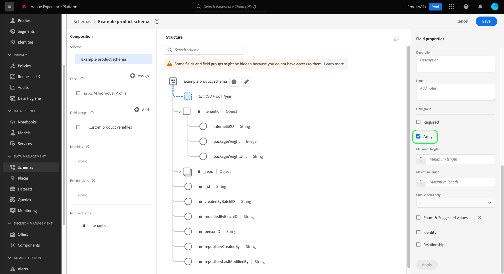

# Definición de campos de matriz en la interfaz de usuario

Al definir un campo Modelo de datos de experiencia (XDM) en la interfaz de usuario de Adobe Experience Platform, puede designar ese campo como una matriz.

El contenido de la matriz depende del [!UICONTROL Tipo] seleccionado para ese campo. Por ejemplo, si el [!UICONTROL Tipo] de un campo está establecido en &quot;[!UICONTROL Cadena]&quot;, al establecer ese campo como una matriz, se designará el campo como una matriz de cadenas. Si el [!UICONTROL Tipo] del campo se configura en un tipo de datos de varios campos como &quot;[!UICONTROL Dirección postal]&quot;, se convertiría en una matriz de objetos de dirección postal que se ajusten al tipo de datos.

Después de haber [definido un nuevo campo en la IU](./overview.md#define), puede configurarlo como un campo de matriz seleccionando la casilla **[!UICONTROL Array]** en el carril derecho.

Una vez seleccionada la casilla de verificación, aparecen controles adicionales en el carril derecho que permiten restringir la matriz de forma opcional. Si no desea aplicar una restricción concreta, deje el campo en blanco.

Los controles de configuración adicionales para las matrices son los siguientes:

| Propiedad Field | Descripción |
| --- | --- |
| [!UICONTROL Longitud mínima] | El número mínimo de elementos que debe contener la matriz para que la ingestión se realice correctamente. |
| [!UICONTROL Longitud máxima] | El número máximo de elementos que debe contener la matriz para que la ingestión se realice correctamente. |
| [!UICONTROL Solo elementos únicos] | Si se establece en &quot;[!UICONTROL True]&quot;, cada elemento de la matriz debe ser único para que la ingestión se realice correctamente. |

Una vez que haya terminado de configurar el campo, seleccione **[!UICONTROL Aplicar]** para aplicar el cambio al esquema.

El lienzo se actualiza para reflejar los cambios realizados en el campo. Tenga en cuenta que el tipo de datos que se muestra junto al nombre del campo en el lienzo se anexa con un par de corchetes (`[]`), lo que indica que el campo representa una matriz de ese tipo de datos.

## Pasos siguientes

En esta guía se explica cómo definir un campo de matriz en la interfaz de usuario. Consulte la información general sobre [definición de campos en la interfaz de usuario](./overview.md#special) para obtener información sobre cómo definir otros tipos de campos XDM en [!DNL Schema Editor].