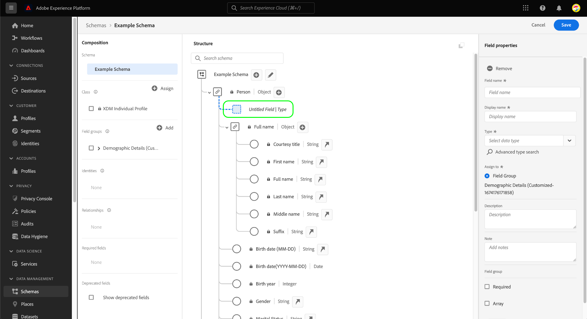

# Definición de campos XDM en la IU

El [!DNL Schema Editor] en la interfaz de usuario de Adobe Experience Platform le permite definir sus propios campos dentro de las clases personalizadas del Modelo de datos de experiencia (XDM) y los grupos de campos de esquema. Esta guía explica los pasos para definir campos XDM en la interfaz de usuario de, incluidas las opciones de configuración disponibles para cada tipo de campo.

## Requisitos previos

Esta guía requiere una comprensión práctica del sistema XDM. Consulte la [Información general de XDM](../../home.md) para obtener una introducción a la función de XDM dentro del ecosistema de Experience Platform, y la [conceptos básicos de composición de esquemas](../../schema/composition.md) para conocer cómo las clases y los grupos de campos contribuyen a los campos en los esquemas XDM.

Aunque no es necesario para esta guía, se recomienda seguir el tutorial en [composición de un esquema en la IU](../../tutorials/create-schema-ui.md) para familiarizarse con las diversas capacidades de la [!DNL Schema Editor].

## Seleccione un recurso al que añadir campos {#select-resource}

Para definir nuevos campos XDM en la interfaz de usuario de, primero debe abrir un esquema dentro de la [!DNL Schema Editor]. Dependiendo de los esquemas que estén disponibles actualmente en el [!DNL Schema Library], puede elegir entre [crear un nuevo esquema](../resources/schemas.md#create) o [seleccione un esquema existente para editarlo](../resources/schemas.md#edit).

Una vez que tenga el [!DNL Schema Editor] abierto, los controles para agregar campos aparecen en el lienzo. Estos controles aparecen junto al nombre del esquema, así como cualquier campo de tipo de objeto que se haya definido en la clase o grupo de campos seleccionado.

>[!WARNING]
>
>Si intenta agregar un campo a un objeto proporcionado por un grupo de campos estándar, ese grupo de campos se convertirá en un grupo de campos personalizado y el grupo de campos original dejará de estar disponible. Consulte la sección sobre [adición de campos a grupos de campos estándar](../resources/schemas.md#custom-fields-for-standard-groups) en la guía de la interfaz de usuario de esquemas para obtener más información.

Para añadir un nuevo campo al recurso, seleccione la **más (+)** junto al nombre del esquema en el lienzo o junto al campo de tipo de objeto en el que desea definir el campo.

Dependiendo de si agrega un campo directamente a un esquema o a su clase constituyente y a los grupos de campos, los pasos necesarios para agregar el campo variarán. El resto de este documento se centra en cómo configurar las propiedades de un campo independientemente de dónde aparezca en el esquema. Para obtener más información sobre las diferentes formas en que se pueden añadir campos a un esquema, consulte las siguientes secciones en la guía de la IU de esquemas:

* [Adición de campos a grupos de campos](../resources/schemas.md#add-fields)
* [Añadir campos directamente a un esquema](../resources/schemas.md#add-individual-fields)

## Definir las propiedades de un campo {#define}

Después de seleccionar el **más (+)** icono, un **[!UICONTROL Campo sin título]** el marcador de posición aparece en el lienzo.

En el carril derecho debajo de **[!UICONTROL Propiedades del campo]**, puede configurar los detalles del nuevo campo. Se requiere la siguiente información para cada campo:

| Propiedad de campo | Descripción |
| --- | --- |
| [!UICONTROL Nombre del campo] | Un nombre único y descriptivo para el campo. Tenga en cuenta que el nombre del campo no se puede cambiar una vez guardado el esquema. Este valor se utiliza para identificar y hacer referencia al campo en el código y en otras aplicaciones posteriores  Idealmente, el nombre debería escribirse en camelCase. Puede contener caracteres alfanuméricos, guiones o guiones bajos, pero **puede que no** empiece con un guion bajo.<ul><li>**Correcto**: `fieldName`</li><li>**Aceptable:** `field_name2`, `Field-Name`, `field-name_3`</li><li>**Incorrecto**: `_fieldName`</li></ul> |
| [!UICONTROL Nombre para mostrar] | Un nombre para mostrar para el campo. Este es el nombre que se utilizará para representar el campo en el lienzo del Editor de esquemas. El nombre del campo se puede cambiar por el nombre para mostrar mediante la variable [alternar nombre para mostrar](../resources/schemas.md#display-name-toggle). |
| [!UICONTROL Tipo] | Tipo de datos que contendrá el campo. En este menú desplegable, puede seleccionar una de las siguientes opciones [tipos escalares estándar](../../schema/field-constraints.md) compatible con XDM o uno de los campos múltiples [tipos de datos](../resources/data-types.md) que se han definido previamente en la [!DNL Schema Registry].  También puede seleccionar **[!UICONTROL Búsqueda de tipo avanzada]** para buscar y filtrar tipos de datos existentes y localizar el tipo deseado con mayor facilidad. |

{style="table-layout:auto"}

También puede proporcionar un lector en lenguaje natural opcional **[!UICONTROL Descripción]** al campo para proporcionar más contexto en cuanto al caso de uso previsto del campo.

>[!NOTE]
>
>Según la variable **[!UICONTROL Tipo]** Si ha seleccionado el campo, pueden aparecer controles de configuración adicionales en el carril derecho. Consulte la sección sobre [propiedades de campo específicas del tipo](#type-specific-properties) para obtener más información sobre estos controles.
>
>El carril derecho también proporciona casillas de verificación para designar tipos de campo especiales. Consulte la sección sobre [tipos de campo especiales](#special) para obtener más información.

Cuando haya terminado de configurar el campo, seleccione **[!UICONTROL Aplicar]**.

El lienzo se actualiza para mostrar el campo recién agregado, ubicado dentro de un objeto que tiene un espacio de nombres con su ID de inquilino único (mostrado como `_tenantId` en el ejemplo siguiente). Todos los campos personalizados que se agregan a un esquema se colocan automáticamente dentro de este espacio de nombres para evitar conflictos con otros campos de clases y grupos de campos proporcionados por el Adobe. El carril derecho ahora enumera la ruta del campo además de sus otras propiedades.

Puede seguir siguiendo los pasos anteriores para agregar más campos al esquema. Una vez guardado el esquema, su clase base y los grupos de campos también se guardan si se han realizado cambios en ellos.

>[!NOTE]
>
>Cualquier cambio que realice en los grupos de campos o en la clase de un esquema se reflejará en todos los demás esquemas que los utilicen.

## Propiedades de campo específicas del tipo {#type-specific-properties}

Al definir un nuevo campo, pueden aparecer opciones de configuración adicionales en el carril derecho, según el **[!UICONTROL Tipo]** elija para el campo. En la tabla siguiente se describen estas propiedades de campo adicionales junto con sus tipos compatibles:

| Propiedad de campo | Tipos compatibles | Descripción |
| --- | --- | --- |
| [!UICONTROL Valor predeterminado] | [!UICONTROL Cadena], [!UICONTROL Doble], [!UICONTROL Largo], [!UICONTROL Entero], [!UICONTROL Corto], [!UICONTROL Byte], [!UICONTROL Booleano] | Un valor predeterminado que se asignará a este campo si no se proporciona ningún otro valor durante la ingesta. Este valor debe cumplir con el tipo seleccionado en el campo. |
| [!UICONTROL Patrón] | [!UICONTROL Cadena] | A [expresión regular](https://developer.mozilla.org/en-US/docs/Web/JavaScript/Guide/Regular_Expressions) que el valor de este campo debe cumplir para que se acepte durante la ingesta. |
| [!UICONTROL Formato] | [!UICONTROL Cadena] | Seleccione de una lista de formatos predefinidos para cadenas con los que debe ajustarse el valor. Los formatos disponibles incluyen: <ul><li>[[!UICONTROL fecha-hora]](https://tools.ietf.org/html/rfc3339)</li><li>[[!UICONTROL email]](https://tools.ietf.org/html/rfc2822)</li><li>[[!UICONTROL hostname]](https://tools.ietf.org/html/rfc1123#page-13)</li><li>[[!UICONTROL ipv4]](https://tools.ietf.org/html/rfc791)</li><li>[[!UICONTROL ipv6]](https://tools.ietf.org/html/rfc2460)</li><li>[[!UICONTROL uri]](https://tools.ietf.org/html/rfc3986)</li><li>[[!UICONTROL uri-reference]](https://tools.ietf.org/html/rfc3986#section-4.1)</li><li>[[!UICONTROL url-template]](https://tools.ietf.org/html/rfc6570)</li><li>[[!UICONTROL json-pointer]](https://tools.ietf.org/html/rfc6901)</li></ul> |
| [!UICONTROL Longitud mínima] | [!UICONTROL Cadena] | Número mínimo de caracteres que debe contener la cadena para que el valor se acepte durante la ingesta. |
| [!UICONTROL Longitud máxima] | [!UICONTROL Cadena] | Número máximo de caracteres que debe contener la cadena para que el valor se acepte durante la ingesta. |
| [!UICONTROL Valor mínimo] | [!UICONTROL Doble] | El valor mínimo de Double que se aceptará durante la ingesta. Si el valor introducido coincide exactamente con el introducido aquí, se acepta el valor. Cuando se utiliza esta restricción, la variable &quot;[!UICONTROL Valor mínimo exclusivo]La restricción &quot; debe dejarse en blanco. |
| [!UICONTROL Valor máximo] | [!UICONTROL Doble] | El valor máximo de Double que se aceptará durante la ingesta. Si el valor introducido coincide exactamente con el introducido aquí, se acepta el valor. Cuando se utiliza esta restricción, la variable &quot;[!UICONTROL Valor máximo exclusivo]La restricción &quot; debe dejarse en blanco. |
| [!UICONTROL Valor mínimo exclusivo] | [!UICONTROL Doble] | El valor máximo de Double que se aceptará durante la ingesta. Si el valor introducido coincide exactamente con el introducido aquí, se rechaza el valor. Cuando se utiliza esta restricción, la variable &quot;[!UICONTROL Valor mínimo]La restricción &quot; (no exclusiva) debe dejarse en blanco. |
| [!UICONTROL Valor máximo exclusivo] | [!UICONTROL Doble] | El valor máximo de Double que se aceptará durante la ingesta. Si el valor introducido coincide exactamente con el introducido aquí, se rechaza el valor. Cuando se utiliza esta restricción, la variable &quot;[!UICONTROL Valor máximo]La restricción &quot; (no exclusiva) debe dejarse en blanco. |

{style="table-layout:auto"}

## Tipos de campo especiales {#special}

El carril derecho proporciona varias casillas de verificación para designar funciones especiales para el campo seleccionado. Los casos de uso de algunas de estas opciones implican consideraciones importantes sobre su estrategia de modelado de datos y cómo desea utilizar los servicios de Platform secundarios.

Para obtener más información sobre estos tipos especiales, consulte la siguiente documentación:

* [[!UICONTROL Requerido]](./required.md)
* [[!UICONTROL Matriz]](./array.md)
* [[!UICONTROL Enumeración]](./enum.md)
* [[!UICONTROL Identidad]](./identity.md) (Disponible solo para campos de cadena)
* [[!UICONTROL Relación]](./relationship.md) (Disponible solo para campos de cadena)

Aunque técnicamente no es un tipo de campo especial, también se recomienda que visite la guía en [definición de campos de tipo de objeto](./object.md) para obtener más información sobre la definición de subcampos anidados si las estructuras de esquema.

## Pasos siguientes

Esta guía proporciona información general sobre cómo definir campos XDM en la interfaz de usuario. Recuerde que los campos solo se pueden agregar a esquemas mediante el uso de clases y grupos de campos. Para obtener más información sobre cómo administrar estos recursos en la interfaz de usuario, consulte las guías sobre creación y edición [clases](../resources/classes.md) y [grupos de campos](../resources/field-groups.md).

Para obtener más información sobre las capacidades de [!UICONTROL Esquemas] Workspace, consulte la [[!UICONTROL Esquemas] información general de workspace](../overview.md).
