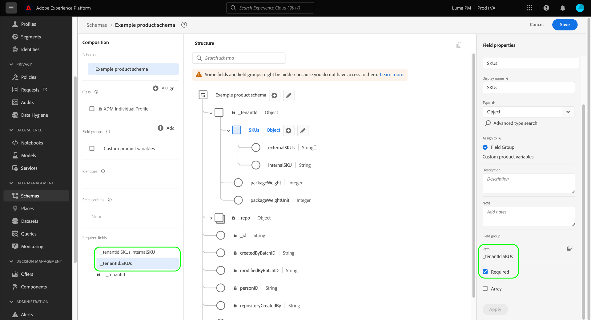

# Defina los campos obligatorios en la interfaz de usuario

En el Modelo de datos de experiencia (XDM), un campo obligatorio indica que debe proporcionarse un valor válido para que se acepte un registro o un evento de serie temporal concreto durante el consumo de datos. Los casos de uso comunes de los campos obligatorios incluyen información de identidad de usuario y marcas de tiempo.

Cuando [define un nuevo campo](./overview.md#define) en la interfaz de usuario de Adobe Experience Platform, puede definirlo como un campo obligatorio seleccionando la casilla **[!UICONTROL Required]** en el carril derecho. Seleccione **[!UICONTROL Apply]** para aplicar el cambio al esquema.

Si el campo es un atributo de nivel raíz bajo el objeto de ID de inquilino, su ruta aparece inmediatamente en **[!UICONTROL Campos requeridos]** en el carril izquierdo.

Sin embargo, si un campo obligatorio está anidado en un objeto que no está marcado como requerido, el campo anidado no aparece en **[!UICONTROL Campos requeridos]** en el carril izquierdo.

En el ejemplo siguiente, el campo `loyaltyId` está configurado como necesario, pero su objeto principal `loyalty` no lo está. En este caso, no se producirían errores de validación si se excluyera `loyalty` al introducir datos, aunque el campo secundario `loyaltyId` esté marcado como necesario. En otras palabras, mientras que `loyalty` es opcional, debe contener un campo `loyaltyId` en el caso de que se incluya.

Si desea que un campo anidado siempre sea necesario en un esquema, también debe definir todos los campos principales como sea necesario (con la excepción del objeto de ID de inquilino).

## Pasos siguientes

Esta guía explica cómo definir un campo obligatorio en la interfaz de usuario. Consulte la descripción general sobre la [definición de campos en la interfaz de usuario](./overview.md#special) para aprender a definir otros tipos de campos XDM en [!DNL Schema Editor].
