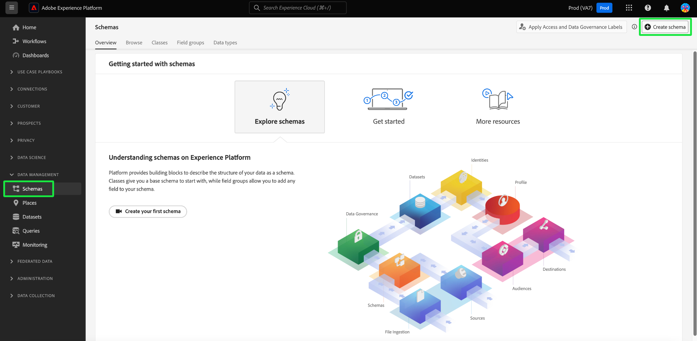
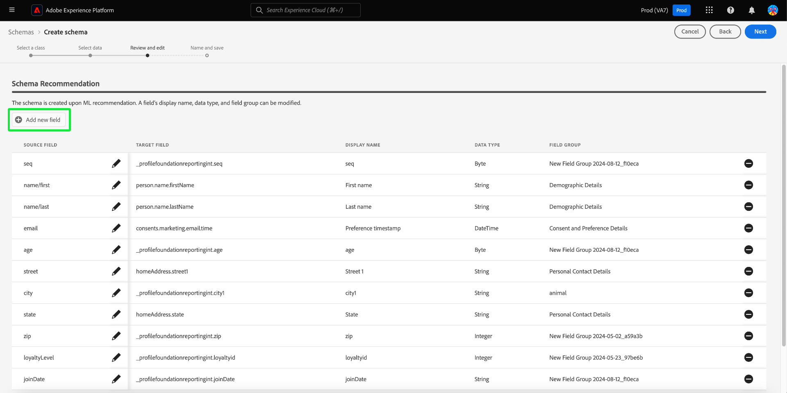

# Creación de esquemas asistida por aprendizaje automático

>[!AVAILABILITY]
>
>* La creación de esquemas asistida por aprendizaje automático está actualmente en fase beta. La documentación y las funcionalidades están sujetas a cambios.

Utilice algoritmos XML para generar un esquema a partir de datos de ejemplo. Este proceso ahorra tiempo y aumenta la precisión al definir la estructura, los campos y los tipos de datos para conjuntos de datos complejos y grandes.

Con la generación de esquemas XML, puede integrar rápidamente nuevas fuentes de datos y reducir los errores de la creación manual. Los usuarios no técnicos pueden utilizarlo para generar esquemas o administrar conjuntos de datos grandes y complejos sin ningún esfuerzo adicional. Esta asistencia acelera el proceso, desde la obtención de datos hasta la obtención de perspectivas, ya que facilita la combinación de nuevas fuentes de datos y la realización de análisis de datos.

## Introducción

Este tutorial requiere una comprensión práctica de los requisitos para la creación de esquemas. Antes de continuar con esta guía, debería leer la guía de [IU para crear y editar esquemas](./resources/schemas.md).

Esta guía explica cómo crear esquemas utilizando algoritmos de aprendizaje automático (ML) para generar un esquema a partir de datos de ejemplo. Consulte la [guía manual de flujo de trabajo para la creación de esquemas](https://experienceleague.adobe.com/en/docs/experience-platform/xdm/ui/resources/schemas#add-field-groups) para obtener información sobre la creación de esquemas o el documento sobre [flujos de trabajo basados en campos en el Editor de esquemas](https://experienceleague.adobe.com/en/docs/experience-platform/xdm/ui/field-based-workflows) para comprender mejor el proceso de creación de esquemas.

>[!NOTE]
>
>También puede componer un esquema utilizando la API [!DNL Schema Registry]. Para crear un esquema manualmente con la API, lea primero [[!DNL Schema Registry] guía para desarrolladores](../api/getting-started.md) antes de intentar el tutorial de [creación de un esquema con la API](../tutorials/create-schema-api.md).

## Vaya al flujo de trabajo Crear esquema {#navigate-to-schema-creation-workflow}

En el panel de navegación izquierdo de la interfaz de usuario de Platform, seleccione el área de trabajo **[!UICONTROL Esquemas]**. Aparece el área de trabajo **[!UICONTROL Esquemas]**. Seleccione **[!UICONTROL Crear esquema]** para agregar un nuevo esquema e iniciar un flujo de trabajo de creación de esquemas.

## Creación de un esquema {#create-a-schema}

Aparecerá el cuadro de diálogo [!UICONTROL Crear un esquema]. Seleccione la opción de creación de esquema **[ML-Assisted]**, seguida de **[!UICONTROL Select]** para confirmar su elección.

![Se ha resaltado el cuadro de diálogo [!UICONTROL Crear un esquema] con [!UICONTROL ML- Asistido].](../images/ui/ml-schema-creation/use-sample-csv.png)

### Seleccionar una clase base {#select-base-class}

Aparece el flujo de trabajo [!UICONTROL Crear esquema]. Seleccione una clase base para su esquema seguida de **[!UICONTROL Next]**.

### Cargar un archivo CSV {#upload-csv}

Aparecerá la fase **[!UICONTROL Seleccionar datos]** del flujo de trabajo de creación. En la sección **[!UICONTROL Cargar archivos]**, seleccione **[!UICONTROL Elegir archivos]** o la sección **[!UICONTROL Arrastrar y soltar archivos]**. Seleccione un archivo .csv del equipo para generar un esquema.

### Vista previa de datos {#preview-data}

La sección [!UICONTROL Cargar archivo] muestra el nombre del archivo CSV que ha importado y la sección **[!UICONTROL Vista previa]** muestra filas de datos de ejemplo del archivo que ha cargado. Seleccione **[!UICONTROL Siguiente]** para continuar el flujo de trabajo.

### Revisar y editar esquema {#review-schema}

Ahora aparece la fase **[!UICONTROL Revisar y editar]** del flujo de trabajo de creación, que muestra la **[!UICONTROL recomendación de esquema]** con asistencia de aprendizaje automático en una vista tabulada. En esta fase, puede editar, añadir o eliminar campos del esquema recomendado generado por el modelo de aprendizaje automático. La tabla contiene los campos siguientes:

| Nombre del campo | Descripción |
|------------------|---------------------------------------------------------|
| [!UICONTROL Tabla de datos] | Conjunto de datos o base de datos donde se origina el campo. |
| [!UICONTROL Campo de Source] | El nombre de campo original del sistema de origen. |
| [!UICONTROL Campo de destino] | Nombre de campo en el sistema de destino al que se asignarán los datos. |
| [!UICONTROL Nombre para mostrar] | Nombre utilizado para mostrar el campo en la interfaz de usuario. Este nombre debería ser más descriptivo o fácil de usar. |
| [!UICONTROL Tipo de datos] | El tipo de datos almacenados en el campo (por ejemplo, `String`, `Date`). |
| [!UICONTROL Grupo de campos] | Una categorización del campo basada en su uso o contexto (por ejemplo, [!UICONTROL Detalles demográficos], [!UICONTROL Detalles de Commerce]). |

#### Añadir un campo {#add-field}

Para agregar un campo al esquema, seleccione **[!UICONTROL Agregar nuevo campo]**.

Aparecerá el cuadro de diálogo [!UICONTROL Seleccionar campo]. El cuadro de diálogo contiene un diagrama del esquema tal como existe actualmente. Seleccione el campo deseado y seleccione **[Seleccionar]** para agregar un nuevo campo al esquema. Seleccione **[Cancelar]** para cerrar el cuadro de diálogo si es necesario.

Aparece una nueva fila en el esquema recomendado. Ahora puede editar el campo.

#### Editar un campo {#edit-field}

Para editar un campo, seleccione el icono de lápiz de la fila que desea editar. Aparece un panel de detalles a la derecha, donde puede editar la asignación de campo personalizado. El panel de detalles contiene el [!UICONTROL campo de destino], [!UICONTROL nombre para mostrar], [!UICONTROL tipo de datos] y [!UICONTROL grupo de campos]. Realice los cambios necesarios y seleccione **[!UICONTROL Aplicar]** para confirmar. Vuelva a seleccionar el icono de lápiz para cerrar el panel de detalles.

#### Eliminación de un campo {#remove-field}

Para quitar un campo, seleccione el icono menos de la fila que desee eliminar.

>[!CAUTION]
>
>No aparece ningún cuadro de diálogo de confirmación al eliminar este elemento.

#### Aprobar el esquema recomendado {#approve}

Para aprobar el esquema recomendado y continuar con el flujo de trabajo **[!UICONTROL Crear esquema]**, seleccione **[Siguiente]**.

### Nombrar y guardar esquema {#name-and-save}

Aparecerá la etapa **[!UICONTROL Name y save]** del flujo de trabajo de creación. Escriba un **[nombre para mostrar del esquema]** y una descripción opcional. La sección **[Esquema generado]** proporciona un diagrama del esquema generado por ML. Seleccione **[Finalizar]** para completar el flujo de trabajo de creación de esquemas.

### Ver en el Editor de esquemas {#view-in-editor}

El Editor de esquemas aparecerá con el esquema recién creado mostrado en el lienzo. Seleccione **[!UICONTROL Guardar]** para volver al área de trabajo de [!UICONTROL Esquemas].

## Pasos siguientes

Después de crear el esquema, puede utilizar el Editor de esquemas para realizar más modificaciones, si es necesario. El nuevo esquema ya está listo para integrarse con las fuentes de datos y se utilizará para el análisis de datos.

Consulte [Editar una guía de esquema existente](https://experienceleague.adobe.com/en/docs/experience-platform/xdm/ui/resources/schemas#edit) para obtener más información sobre cómo usar el Editor de esquemas.
