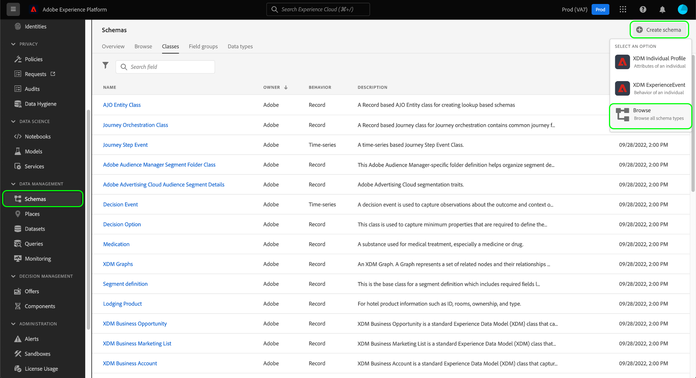

# Creación y edición de clases en la interfaz de usuario

En el Modelo de datos de experiencia (XDM), las clases definen los aspectos de comportamiento de los datos que contendrá un esquema (registro o serie temporal). Además de esto, las clases describen el menor número de propiedades comunes que todos los esquemas basados en esa clase necesitarían incluir y proporcionar una manera de combinar varios conjuntos de datos compatibles.

Adobe proporciona varias clases XDM estándar (&quot;core&quot;), incluidas [!DNL XDM Individual Profile] y [!DNL XDM ExperienceEvent]. Además de estas clases principales, también puede crear sus propias clases personalizadas para describir casos de uso más específicos para su organización.

Este documento proporciona información general sobre cómo crear, editar y administrar clases personalizadas en la interfaz de usuario de Adobe Experience Platform.

## Requisitos previos

Esta guía requiere un conocimiento práctico del sistema XDM. Consulte la [información general de XDM](../../home.md) para obtener una introducción a la función de XDM dentro del ecosistema del Experience Platform y los [conceptos básicos de la composición del esquema](../../schema/composition.md) para conocer cómo las clases contribuyen a los esquemas XDM.

Aunque no es necesario para esta guía, se recomienda que también siga el tutorial sobre [composición de un esquema en la IU](../../tutorials/create-schema-ui.md) para familiarizarse con las diversas funciones de la [!DNL Schema Editor].

## Crear una nueva clase {#create}

En el espacio de trabajo **[!UICONTROL Esquemas]**, seleccione **[!UICONTROL Crear esquema]** y, a continuación, seleccione **[!UICONTROL Examinar]** en el menú desplegable.

Aparece un cuadro de diálogo que le permite seleccionar entre una lista de clases disponibles. En la parte superior del cuadro de diálogo, seleccione **[!UICONTROL Crear nueva clase]**. A continuación, puede asignar a la nueva clase un nombre para mostrar (un nombre corto, descriptivo, único y práctico para la clase), una descripción y un comportamiento para los datos que el esquema definirá (&quot;[!UICONTROL Record]&quot; o &quot;[!UICONTROL Time-series]&quot;).

Cuando termine, seleccione **[!UICONTROL Asignar clase]**.

Aparece el [!DNL Schema Editor], que muestra un nuevo esquema en el lienzo basado en la clase personalizada que acaba de crear. Dado que todavía no se han agregado campos a la clase, el esquema sólo contiene un campo `_id`, que representa el identificador único generado por el sistema que se aplica automáticamente a todos los recursos de [!DNL Schema Registry].

>[!IMPORTANT]
>
>Cuando cree un esquema que implemente una clase definida por su organización, recuerde que las mezclas están disponibles para su uso únicamente con clases compatibles. Como la clase que ha definido es nueva, no hay mezclas compatibles enumeradas en el cuadro de diálogo **[!UICONTROL Añadir mezcla]**. En su lugar, deberá [crear nuevas mezclas](./mixins.md#create) para usarlas con esa clase. La próxima vez que componga un esquema que implemente la nueva clase, se enumerarán las mezclas que haya definido y estarán disponibles para su uso.

Ahora puede inicio [agregando campos a la clase](#add-fields), que compartirán todos los esquemas que empleen la clase.

## Editar una clase existente {#edit}

>[!NOTE]
>
>Solo se pueden editar las clases personalizadas definidas por su organización.
>
>Además, una vez que una clase se ha guardado y utilizado en la ingestión de datos, sólo se pueden realizar cambios aditivos en ella posteriormente. Consulte las [reglas de la evolución del esquema](../../schema/composition.md#evolution) para obtener más información.

Para editar una clase existente, seleccione la ficha **[!UICONTROL Examinar]** y, a continuación, seleccione el nombre de un esquema que emplee la clase que desee editar.

>[!TIP]
>
>Puede utilizar las funciones de búsqueda y filtrado del espacio de trabajo para encontrar el esquema más fácilmente. Consulte la guía sobre [exploración de recursos XDM](../explore.md) para obtener más información.

Aparece el [!DNL Schema Editor], con la estructura del esquema mostrada en el lienzo. Ahora puede inicio [agregando campos a la clase](#add-fields).

## Añadir campos a una clase {#add-fields}

Una vez que tenga un esquema que emplee una clase personalizada abierta en el [!UICONTROL Editor de Esquemas], puede agregar inicios a la clase. Para agregar un nuevo campo, seleccione el icono **más (+)** junto al nombre del esquema.

>[!IMPORTANT]
>
>Tenga en cuenta que los campos que agregue a una clase se utilizarán en todos los esquemas que utilicen dicha clase. Por lo tanto, debe considerar cuidadosamente qué campos serán útiles en todos los casos de uso de esquema. Si está pensando en agregar un campo que solo pueda ver su uso en algunos esquemas de esta clase, puede que desee considerar agregarlo a esos esquemas [creando una mezcla](./mixins.md#create) en su lugar.

En el lienzo aparece un **[!UICONTROL nuevo campo]** y el carril correcto se actualiza para mostrar los controles a fin de configurar las propiedades del campo. Consulte la guía sobre [definición de campos en la interfaz de usuario](../fields/overview.md#define) para ver los pasos específicos sobre cómo configurar y agregar el campo a la clase.

Continúe agregando tantos campos como sea necesario a la clase. Cuando termine, seleccione **[!UICONTROL Guardar]** para guardar tanto el esquema como la clase.

Si ya ha creado esquemas que emplean esta clase, los campos recién agregados aparecerán automáticamente en esos esquemas.

## Cambiar la clase de un esquema {#schema}

Puede cambiar la clase del esquema en cualquier momento durante el proceso de creación inicial antes de guardarlo. Consulte la guía sobre [creación y edición de esquemas](./schemas.md#change-class) para obtener más información.

## Pasos siguientes

En este documento se explica cómo crear y editar clases mediante la interfaz de usuario de la plataforma. Para obtener más información sobre las capacidades del espacio de trabajo [!UICONTROL Esquemas], consulte la información general del [[!UICONTROL espacio de trabajo Esquemas]](../overview.md).

Para obtener información sobre cómo administrar clases mediante la API [!DNL Schema Registry], consulte la [guía de extremo de clases](../../api/classes.md).