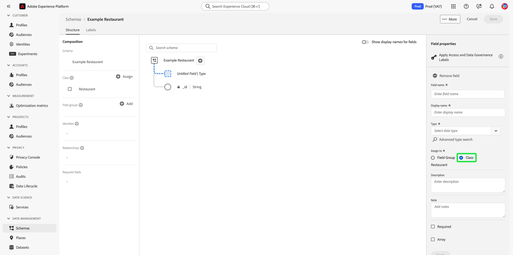

# Crear y editar clases en la interfaz de usuario {#ui-create-and-edit}

>[!CONTEXTUALHELP]
>id="platform_schemas_class_filter"
>title="Filtro de clase estándar o personalizado"
>abstract="La lista de clases disponibles se filtra previamente según cómo se crearon. Seleccione el botón de opción para elegir entre las opciones Estándar y Personalizado. La opción Estándar muestra las entidades creadas por Adobe e incluye las clases Perfil individual XDM y Evento de experiencia XDM. La opción Personalizado muestra las entidades creadas dentro de su organización. Consulte la documentación para obtener más información sobre la creación y edición de clases."

En Adobe Experience Platform, la clase de un esquema define los aspectos de comportamiento de los datos que contendrá el esquema (registro o serie temporal). Además, las clases describen el menor número de propiedades comunes que todos los esquemas basados en esa clase necesitarían incluir y proporcionan una forma de combinar varios conjuntos de datos compatibles.

Adobe proporciona varias clases de modelo de datos de experiencia (XDM) estándar (&quot;principales&quot;), incluidas las siguientes [!DNL XDM Individual Profile] y [!DNL XDM ExperienceEvent]. Además de estas clases principales, también puede crear sus propias clases personalizadas para describir casos de uso más específicos para su organización.

Este documento proporciona información general sobre cómo crear, editar y administrar clases personalizadas en la interfaz de usuario de Experience Platform.

## Requisitos previos

Esta guía requiere una comprensión práctica del sistema XDM. Consulte la [Información general de XDM](../../home.md) para obtener una introducción a la función de XDM dentro del ecosistema de Experience Platform, y la [conceptos básicos de composición de esquemas](../../schema/composition.md) para conocer cómo contribuyen las clases a los esquemas XDM.

Aunque no es necesario para esta guía, se recomienda seguir el tutorial en [composición de un esquema en la IU](../../tutorials/create-schema-ui.md) para familiarizarse con las diversas capacidades de la [!DNL Schema Editor].

## Crear una nueva clase {#create}

En el **[!UICONTROL Esquemas]** workspace, seleccione **[!UICONTROL Crear esquema]**, luego seleccione **[!UICONTROL Examinar]** en el menú desplegable.

Aparece un cuadro de diálogo que le permite seleccionar de una lista de clases disponibles. En la parte superior del cuadro de diálogo, seleccione **[!UICONTROL Crear nueva clase]**. A continuación, puede asignar a la nueva clase un nombre para mostrar (un nombre corto, descriptivo, único y descriptivo para la clase), una descripción y un comportamiento para los datos que definirá el esquema (**[!UICONTROL Registro]** o **[!UICONTROL Serie temporal]**).

Cuando termine, seleccione **[!UICONTROL Asignar clase]**.

El [!DNL Schema Editor] aparece y muestra un nuevo esquema en el lienzo basado en la clase personalizada que acaba de crear. Dado que todavía no se han agregado campos a la clase, el esquema solo contiene un `_id` , que representa el identificador único generado por el sistema que se aplica automáticamente a todos los recursos del [!DNL Schema Registry].

>[!IMPORTANT]
>
>Cuando genere un esquema que implemente una clase definida por su organización, recuerde que los grupos de campos de esquema solo están disponibles para su uso con clases compatibles. Dado que la clase que ha definido es nueva, no hay grupos de campos compatibles en la lista de **[!UICONTROL Agregar grupo de campos]** diálogo. En su lugar, deberá [crear nuevos grupos de campos](./field-groups.md#create) para su uso con esa clase. La próxima vez que cree un esquema que implemente la nueva clase, los grupos de campos que definió se enumerarán y estarán disponibles para su uso.

Ahora puede iniciar [adición de campos a la clase](#add-fields), que se compartirán en todos los esquemas que empleen la clase.

## Editar una clase existente {#edit}

>[!NOTE]
>
>Solo las clases personalizadas definidas por su organización se pueden editar y personalizar por completo. Para las clases principales definidas por Adobe, solo se pueden editar los nombres para mostrar de sus campos dentro del contexto de esquemas individuales. Consulte la sección sobre [edición de nombres para mostrar para campos de esquema](./schemas.md#display-names) para obtener más información.
>
>Una vez guardada una clase personalizada y utilizada en la ingesta de datos, solo se pueden realizar cambios adicionales en ella a partir de entonces. Consulte la [reglas de evolución de esquema](../../schema/composition.md#evolution) para obtener más información.

Para editar una clase existente, seleccione la **[!UICONTROL Examinar]** y, a continuación, seleccione el nombre de un esquema que emplea la clase que desea editar.

>[!TIP]
>
>Puede utilizar las funcionalidades de búsqueda y filtrado del espacio de trabajo para encontrar el esquema más fácilmente. Consulte la guía de [exploración de recursos XDM](../explore.md) para obtener más información.

El [!DNL Schema Editor] aparece, con la estructura del esquema mostrada en el lienzo. Ahora puede iniciar [adición de campos a la clase](#add-fields).

## Adición de campos a una clase {#add-fields}

Una vez que tenga un esquema que emplee una clase personalizada, abra en el [!UICONTROL Editor de esquemas], puede empezar a añadir campos a la clase. Para añadir un nuevo campo, seleccione la **más (+)** junto al nombre del esquema.

>[!IMPORTANT]
>
>Tenga en cuenta que cualquier campo que agregue a una clase se utilizará en todos los esquemas que empleen esa clase. Por lo tanto, debe considerar cuidadosamente qué campos son útiles en todos los casos de uso del esquema. Si está pensando en agregar un campo que quizá solo vea el uso en algunos esquemas bajo esta clase, puede que desee agregarlo a esos esquemas mediante [creación de un grupo de campos](./field-groups.md#create) en su lugar.

Un **[!UICONTROL Campo sin título]** el marcador de posición aparece en el lienzo y el carril derecho se actualiza para mostrar los controles y configurar las propiedades del campo. En **[!UICONTROL Asignar a]**, seleccione **[!UICONTROL Clase]**.

Consulte la guía de [definición de campos en la IU](../fields/overview.md#define) para obtener pasos específicos sobre cómo configurar y agregar el campo a la clase. Siga agregando tantos campos como sea necesario a la clase. Cuando termine, seleccione **[!UICONTROL Guardar]** para guardar el esquema y la clase.

Si ha creado anteriormente esquemas que emplean esta clase, los campos recién agregados aparecerán automáticamente en esos esquemas.

## Cambiar la clase de un esquema {#schema}

Puede cambiar la clase del esquema en cualquier momento durante el proceso de creación inicial antes de guardarlo. Consulte la guía de [creación y edición de esquemas](./schemas.md#change-class) para obtener más información.

## Pasos siguientes

En este documento se explica cómo crear y editar clases mediante la interfaz de usuario de Platform. Para obtener más información sobre las capacidades de [!UICONTROL Esquemas] Workspace, consulte la [[!UICONTROL Esquemas] información general de workspace](../overview.md).

Para obtener información sobre cómo administrar clases mediante [!DNL Schema Registry] API, consulte la [guía de extremo de clases](../../api/classes.md).
