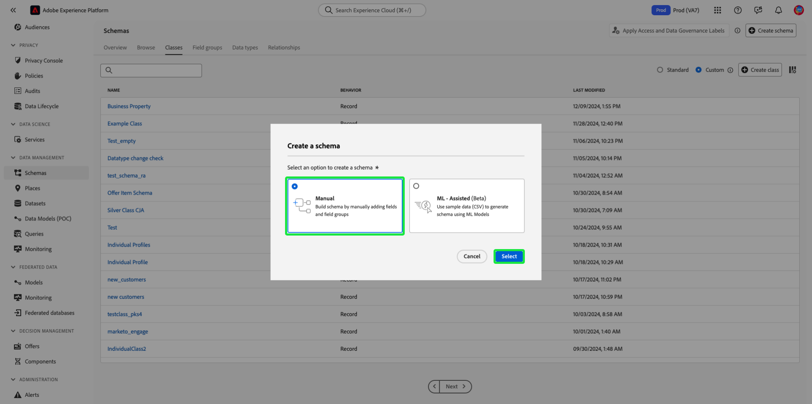
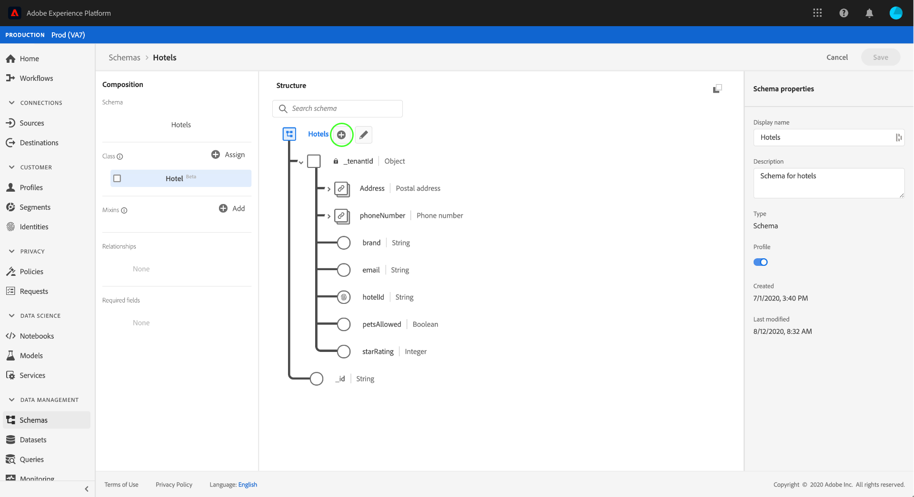

# Creación y edición de esquemas en la IU {#ui-create-and-edit}

>[!CONTEXTUALHELP]
>id="platform_schemas_class_filter"
>title="Filtro de clase estándar o personalizado"
>abstract="La lista de clases disponibles se filtra previamente en función de cómo se crearon. Seleccione el botón de opción para elegir entre las opciones Estándar y Personalizado. La opción Estándar muestra las entidades creadas por Adobe e incluye las clases Perfil individual XDM y Evento de experiencia XDM. La opción Personalizado muestra las entidades creadas dentro de su organización. Consulte la documentación para obtener más información sobre la creación y edición de clases."

En Adobe Experience Platform, la clase de un esquema define los aspectos de comportamiento de los datos que contendrá el esquema (registro o serie temporal). Además, las clases describen el menor número de propiedades comunes que todos los esquemas basados en esa clase necesitarían incluir y proporcionan una forma de combinar varios conjuntos de datos compatibles.

Adobe proporciona varias clases de modelo de datos de experiencia (XDM) estándar (&quot;principales&quot;), entre las que se incluyen [XDM Individual Profile](../../classes/individual-profile.md) y [XDM ExperienceEvent](../../classes/experienceevent.md). Además de estas clases principales, también puede crear sus propias clases personalizadas para describir casos de uso más específicos para su organización.

Este documento proporciona información general sobre cómo crear, editar y administrar clases personalizadas en la interfaz de usuario de Experience Platform.

>[!NOTE]
>
>Las acciones de XDM están disponibles en la tabla de inventario y en la vista de detalles de recursos (**[!UICONTROL More]**). Las acciones completas solo se aplican a recursos personalizados (definidos por el inquilino); los recursos estándar tienen opciones limitadas. Ver [Administrar esquemas, clases, grupos de campos y tipos de datos: acciones y eliminación](../explore.md#xdm-resource-actions).

## Requisitos previos {#prerequisites}

Esta guía requiere una comprensión práctica del sistema XDM. Consulte la [descripción general de XDM](../../home.md) para obtener una introducción del papel de XDM en el ecosistema de Experience Platform y los [conceptos básicos de la composición de esquemas](../../schema/composition.md) para conocer cómo las clases contribuyen a los esquemas XDM.

Aunque no es necesario para esta guía, se recomienda que también siga el tutorial sobre [maquetar un esquema en la interfaz de usuario](../../tutorials/create-schema-ui.md) para familiarizarse con las diversas funcionalidades del Editor de esquemas.

## Introducción {#getting-started}

En la interfaz de usuario de Experience Platform, seleccione **[!UICONTROL Schemas]** en el panel de navegación izquierdo para abrir el área de trabajo [!UICONTROL Schemas] y, a continuación, seleccione la pestaña **[!UICONTROL Classes]**. Se muestra una lista de las clases disponibles.

![Se ha resaltado el número de clases dentro de la ficha [!UICONTROL Classes] del área de trabajo [!UICONTROL Schemas] [!UICONTROL Classes] y [!UICONTROL Schemas].](../../images/ui/resources/classes/available-classes.png)

## Filtrar clases {#filter}

La lista de clases se filtra automáticamente en función de cómo se crearon. La configuración predeterminada muestra las clases definidas por Adobe. También puede filtrar la lista para mostrar los que ha creado su organización. Seleccione el botón de opción para elegir entre las opciones [!UICONTROL Standard] y [!UICONTROL Custom]. La opción [!UICONTROL Standard] muestra las entidades creadas por Adobe y la opción [!UICONTROL Custom] muestra las entidades creadas dentro de su organización.

![La ficha [!UICONTROL Classes] del área de trabajo [!UICONTROL Schemas] con [!UICONTROL Standard] y [!UICONTROL Custom] resaltados.](../../images/ui/resources/classes/standard-and-custom-classes.png)

>[!TIP]
>
>Utilice las funcionalidades de búsqueda para filtrar o encontrar una clase según su nombre. Consulte la guía [Exploración de recursos XDM](../explore.md) para obtener más información.

## Crear una nueva clase {#create}

Existen dos métodos para crear una clase en la interfaz de usuario de Experience Platform, mediante **[!UICONTROL Create class]** o **[!UICONTROL Create schema]**.

### Crear clase

Seleccione **[!UICONTROL Create class]** de la ficha [!UICONTROL Classes] en el área de trabajo [!UICONTROL Schemas].

![La ficha [!UICONTROL Classes] del área de trabajo [!UICONTROL Schemas] con [!UICONTROL Create class] resaltado](../../images/ui/resources/classes/create-class.png)

Aparecerá el cuadro de diálogo [!UICONTROL Create class]. Escriba [!UICONTROL Display name] y [!UICONTROL Description] para la clase y elija el comportamiento deseado de la clase con los botones de opción. Las clases pueden ser del tipo [!UICONTROL Record] o [!UICONTROL Time-series]. Seleccione **[!UICONTROL Create]** para confirmar sus opciones y volver a la ficha [!UICONTROL Classes].

![Se resaltó el cuadro de diálogo [!UICONTROL Create class] con [!UICONTROL Create].](../../images/ui/resources/classes/create-class-dialog.png)

La clase que ha creado está disponible y se enumera en la vista [!UICONTROL Classes].

![La ficha [!UICONTROL Classes] del área de trabajo [!UICONTROL Schemas] con la clase creada recientemente resaltada.](../../images/ui/resources/classes/new-class-listing.png)

### Crear esquema

Como alternativa, puede crear una clase creando manualmente un esquema. Seleccione **[!UICONTROL Create schema]** de la ficha [!UICONTROL Classes] en el área de trabajo [!UICONTROL Schemas].

![La ficha [!UICONTROL Classes] del área de trabajo [!UICONTROL Schemas] con [!UICONTROL Create schema] resaltado](../../images/ui/resources/classes/create-schema.png)

Seleccione **[!UICONTROL Manual]** en el cuadro de diálogo [!UICONTROL Create a schema] que aparece.

>[!NOTE]
>
>Si utiliza el flujo de trabajo de creación de esquemas asistidos por ML, puede cargar un archivo y utilizar algoritmos XML para generar un esquema recomendado. En ese flujo de trabajo de creación de esquemas, no es necesario especificar la clase base para el esquema. Para saber cómo ML puede recomendar una estructura de esquema basada en un archivo csv, consulte la [guía de creación de esquemas asistida por aprendizaje automático](../ml-assisted-schema-creation.md).

Aparecerá el flujo de trabajo de creación de esquemas. En la sección [!UICONTROL Schema details], seleccione **[!UICONTROL Other]**. Aparecerá una lista de las clases disponibles. Seleccione **[!UICONTROL Create class]**.

![El flujo de trabajo [!UICONTROL Create schema] con [!UICONTROL Other] resaltado en la sección [!UICONTROL Schema details].](../../images/ui/resources/classes/other-schema-details.png)

Aparecerá el cuadro de diálogo [!UICONTROL Create class]. Escriba [!UICONTROL Display name] y [!UICONTROL Description] para la clase y elija el comportamiento deseado de la clase con los botones de opción. Las clases pueden ser del tipo [!UICONTROL Record] o [!UICONTROL Time-series]. Seleccione **[!UICONTROL Create]** para confirmar sus opciones y volver a la ficha [!UICONTROL Classes].

![Se resaltó el cuadro de diálogo [!UICONTROL Create class] con [!UICONTROL Create].](../../images/ui/resources/classes/create-class-from-schema.png)

La lista de clases se actualiza en la sección [!UICONTROL Schema details] y la clase recién creada se selecciona automáticamente. Seleccione **[!UICONTROL Next]** para continuar creando su esquema.

![La sección [!UICONTROL Schema details] con la nueva clase seleccionada y [!UICONTROL Next] resaltada.](../../images/ui/resources/classes/select-new-class.png)

Después de seleccionar una clase, aparece la sección [!UICONTROL Name and review]. En esta sección, proporcione un nombre y una descripción para identificar el esquema en cuestión.La estructura base del esquema (proporcionada por la clase ) se muestra en el lienzo para que revise y compruebe la clase y la estructura de esquema seleccionadas.

Escriba un(a) [!UICONTROL Schema display name] descriptivo(a) en el campo de texto. A continuación, introduzca una descripción adecuada para ayudar a identificar el esquema. Una vez que haya revisado la estructura de esquema y esté satisfecho con la configuración, seleccione **[!UICONTROL Finish]** para crear el esquema.

![La sección [!UICONTROL Name and review] del flujo de trabajo [!UICONTROL Create schema] con [!UICONTROL Schema display name], [!UICONTROL Description] y [!UICONTROL Finish] resaltados.](../../images/ui/resources/classes/schema-details.png)

## Adición de campos a una clase {#add-fields}

Una vez que tenga un esquema que emplee una clase personalizada abierta en el Editor de esquemas, puede empezar a agregar campos a la clase. Para agregar un nuevo campo, seleccione el icono **más (+)** junto al nombre del esquema.

>[!IMPORTANT]
>
>Cuando genere un esquema que implemente una clase definida por su organización, recuerde que los grupos de campos de esquema solo están disponibles para su uso con clases compatibles. Dado que la clase que definió es nueva, no hay grupos de campos compatibles enumerados en el cuadro de diálogo **[!UICONTROL Add field group]**. En su lugar, deberá [crear nuevos grupos de campos](./field-groups.md#create) para usarlos con esa clase. La próxima vez que cree un esquema que implemente la nueva clase, los grupos de campos que definió se enumerarán y estarán disponibles para su uso.

>[!IMPORTANT]
>
>Tenga en cuenta que cualquier campo que agregue a una clase se utilizará en todos los esquemas que empleen esa clase. Por lo tanto, debe considerar cuidadosamente qué campos son útiles en todos los casos de uso del esquema. Si está pensando en agregar un campo que podría ver el uso solamente en algunos esquemas bajo esta clase, puede que desee considerar agregarlo a esos esquemas [creando un grupo de campos](./field-groups.md#create) en su lugar.

Aparece un marcador de posición **[!UICONTROL Untitled Field]** en el lienzo y el carril derecho se actualiza para mostrar controles para configurar las propiedades del campo. En **[!UICONTROL Assign to]**, seleccione **[!UICONTROL Class]**.

![Campo sin título en el lienzo del Editor de esquemas con la propiedad de campo Asignar a [!UICONTROL Class] seleccionada y resaltada.](../../images/ui/resources/classes/assign-to-class.png)

Consulte la guía [definición de campos en la interfaz de usuario](../fields/overview.md#define) para ver los pasos específicos sobre cómo configurar y agregar el campo a la clase. Siga agregando tantos campos como sea necesario a la clase. Cuando termine, seleccione **[!UICONTROL Save]** para guardar el esquema y la clase.

![Esquema recién creado en el lienzo del Editor de esquemas, con [!UICONTROL Save] resaltado.](../../images/ui/resources/classes/save.png)

Si ha creado anteriormente esquemas que emplean esta clase, los campos recién agregados aparecerán automáticamente en esos esquemas.

## Edición de una clase {#edit-a-class}

>[!NOTE]
>
>Solo las clases personalizadas definidas por su organización se pueden editar y personalizar por completo. Para las clases principales definidas por Adobe, solo se pueden editar los nombres para mostrar de sus campos dentro del contexto de esquemas individuales. Consulte la sección sobre [edición de nombres para mostrar para campos de esquema](./schemas.md#display-names) para obtener más información.
>
>Una vez guardada una clase personalizada y utilizada en la ingesta de datos, solo se pueden realizar cambios adicionales en ella a partir de entonces. Consulte las [reglas de evolución de esquema](../../schema/composition.md#evolution) para obtener más información.

Puede editar una clase a través del flujo de trabajo del esquema editando un esquema existente que extienda la clase o creando manualmente un esquema. No es posible editar directamente una clase. En la ficha [!UICONTROL Browse] del área de trabajo [!UICONTROL Schemas], seleccione una clase existente o **[!UICONTROL Create a schema]**.

![El Editor de esquemas con una clase existente y [!UICONTROL Create a schema] resaltado.](../../images/ui/resources/classes/edit-class-options.png)

Si decide crear un nuevo esquema, consulte la sección sobre [creación de un esquema](#create-schema) para obtener detalles. Cuando haya terminado de crear el esquema (o después de seleccionar uno existente), aparecerá el Editor de esquemas. Para actualizar un campo de clase existente, seleccione el campo de la estructura de esquema. La información del campo aparece en el carril derecho. Asegúrese de [!UICONTROL Assign to]
la opción **[!UICONTROL Class]** está seleccionada o las actualizaciones no afectarán a la clase.

![Editor de esquemas con un campo seleccionado y resaltado, y el carril derecho expuesto, resaltando [!UICONTROL Assign to].](../../images/ui/resources/classes/edit-existing-field.png)

Realice los cambios que desee en el campo, desplazándose hacia abajo en el carril derecho para seleccionar **[!UICONTROL Apply]** y guardar los cambios.

>[!IMPORTANT]
>
> Cualquier actualización que realice en los campos se aplicará en todos los esquemas que empleen esa clase, siguiendo las [reglas de evolución del esquema](../../schema/composition.md#evolution).

![Editor de esquemas con un campo seleccionado y el carril derecho expuesto, destacando [!UICONTROL Apply].](../../images/ui/resources/classes/save-changes.png)

Para agregar nuevos campos, siga la guía [agregar campos a una clase](#add-fields-to-a-class). Cuando termine, seleccione **[!UICONTROL Save]** para guardar el esquema y la clase.

![Editor de esquemas con [!UICONTROL Save] resaltado.](../../images/ui/resources/classes/save-schema.png)

## Cambiar la clase de un esquema {#schema}

Puede cambiar la clase del esquema en cualquier momento durante el proceso de creación inicial antes de guardarlo. Sin embargo, esto debe hacerse con precaución, ya que los grupos de campos solo son compatibles con determinadas clases. Al cambiar la clase, se restablecen el lienzo y los campos que se hayan añadido.
Consulte la guía de [creación y edición de esquemas](./schemas.md#change-class) para obtener más información.

## Próximos pasos {#next-steps}

En este documento se explica cómo crear y editar clases mediante la interfaz de usuario de Experience Platform. Para obtener más información sobre las capacidades del área de trabajo [!UICONTROL Schemas], vea la descripción general del área de trabajo [[!UICONTROL Schemas]](../overview.md).

Para obtener información sobre cómo administrar clases mediante la API de Registro de esquemas, consulte la [guía de extremo de clases](../../api/classes.md).
