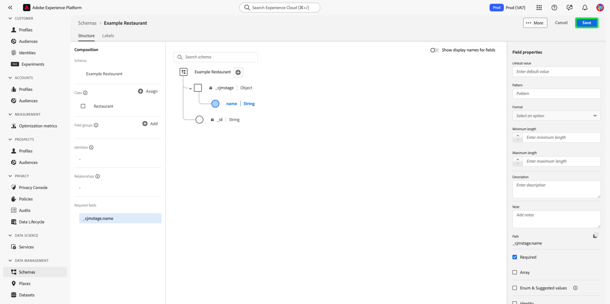

# Crear y editar clases en la interfaz de usuario

En Adobe Experience Platform, la clase de un esquema define los aspectos de comportamiento de los datos que contendrá el esquema (registro o serie temporal). Además de esto, las clases describen el menor número de propiedades comunes que todos los esquemas basados en esa clase necesitarían para incluir y proporcionar una forma de combinar varios conjuntos de datos compatibles.

Adobe proporciona varias clases estándar (&quot;core&quot;) del Modelo de datos de experiencia (XDM), incluidas [!DNL XDM Individual Profile] y [!DNL XDM ExperienceEvent]. Además de estas clases principales, también puede crear sus propias clases personalizadas para describir casos de uso más específicos para su organización.

Este documento proporciona información general sobre cómo crear, editar y administrar clases personalizadas en la interfaz de usuario del Experience Platform.

## Requisitos previos

Esta guía requiere una comprensión práctica del sistema XDM. Consulte la [Información general de XDM](../../home.md) para una introducción al papel de XDM dentro del ecosistema del Experience Platform, y [conceptos básicos de la composición del esquema](../../schema/composition.md) para aprender cómo las clases contribuyen a los esquemas XDM.

Aunque no es necesario para esta guía, se recomienda seguir también el tutorial de [composición de un esquema en la interfaz de usuario](../../tutorials/create-schema-ui.md) para familiarizarse con las diversas capacidades de la [!DNL Schema Editor].

## Crear una nueva clase {#create}

En el **[!UICONTROL Esquemas]** espacio de trabajo, seleccione **[!UICONTROL Crear esquema]** y, a continuación, seleccione **[!UICONTROL Examinar]** en la lista desplegable .

Aparece un cuadro de diálogo que le permite seleccionar entre una lista de clases disponibles. En la parte superior del cuadro de diálogo, seleccione **[!UICONTROL Crear nueva clase]**. A continuación, puede darle a la nueva clase un nombre para mostrar (un nombre corto, descriptivo, único y descriptivo para la clase), una descripción y un comportamiento para los datos que definirá el esquema (**[!UICONTROL Registro]** o **[!UICONTROL Serie temporal]**).

Cuando termine, seleccione **[!UICONTROL Asignar clase]**.

La variable [!DNL Schema Editor] , mostrando un nuevo esquema en el lienzo basado en la clase personalizada que acaba de crear. Dado que todavía no se han agregado campos a la clase , el esquema solo contiene un `_id` , que representa el identificador único generado por el sistema que se aplica automáticamente a todos los recursos del [!DNL Schema Registry].

>[!IMPORTANT]
>
>Al crear un esquema que implemente una clase definida por su organización, recuerde que los grupos de campos de esquema solo están disponibles para su uso con clases compatibles. Dado que la clase que ha definido es nueva, no hay grupos de campos compatibles enumerados en la variable **[!UICONTROL Agregar grupo de campos]** diálogo. En su lugar, deberá [crear nuevos grupos de campos](./field-groups.md#create) para usar con esa clase. La próxima vez que componga un esquema que implemente la nueva clase, los grupos de campos que haya definido se enumerarán y estarán disponibles para su uso.

Ahora puede empezar [adición de campos a la clase](#add-fields), que se compartirán en todos los esquemas que empleen la clase .

## Editar una clase existente {#edit}

>[!NOTE]
>
>Solo las clases personalizadas definidas por su organización pueden editarse y personalizarse completamente. Para las clases principales definidas por Adobe, solo se pueden editar los nombres para mostrar de sus campos en el contexto de esquemas individuales. Consulte la sección sobre [edición de nombres para mostrar en campos de esquema](./schemas.md#display-names) para obtener más información.
>
>Una vez que se ha guardado y utilizado una clase personalizada en el consumo de datos, solo se pueden realizar cambios aditivos en ella posteriormente. Consulte la [reglas de evolución de esquema](../../schema/composition.md#evolution) para obtener más información.

Para editar una clase existente, seleccione la **[!UICONTROL Examinar]** y, a continuación, seleccione el nombre de un esquema que emplea la clase que desea editar.

>[!TIP]
>
>Puede utilizar las capacidades de búsqueda y filtrado del espacio de trabajo para ayudar a encontrar el esquema más fácil. Consulte la guía de [exploración de recursos XDM](../explore.md) para obtener más información.

La variable [!DNL Schema Editor] aparece con la estructura del esquema en el lienzo. Ahora puede empezar [adición de campos a la clase](#add-fields).

## Añadir campos a una clase {#add-fields}

Una vez que tenga un esquema que emplee una clase personalizada abierta en la [!UICONTROL Editor de esquemas], puede empezar a añadir campos a la clase . Para añadir un nuevo campo, seleccione la opción **plus (+)** junto al nombre del esquema.

>[!IMPORTANT]
>
>Tenga en cuenta que cualquier campo que agregue a una clase se utilizará en todos los esquemas que empleen esa clase. Por lo tanto, debe tener en cuenta qué campos serán útiles en todos los casos de uso del esquema. Si está pensando en añadir un campo que solo pueda verse utilizado en algunos esquemas de esta clase, puede que desee considerar la posibilidad de añadirlo a esos esquemas mediante [creación de un grupo de campos](./field-groups.md#create) en su lugar.

A **[!UICONTROL Campo nuevo]** aparece en el lienzo, y el carril derecho se actualiza para mostrar los controles y configurar las propiedades del campo. En **[!UICONTROL Asignar a]**, seleccione **[!UICONTROL Clase]**.

Consulte la guía de [definición de campos en la interfaz de usuario](../fields/overview.md#define) para ver pasos específicos sobre cómo configurar y añadir el campo a la clase . Siga agregando tantos campos como sea necesario a la clase. Cuando termine, seleccione **[!UICONTROL Guardar]** para guardar el esquema y la clase.

Si ha creado esquemas anteriormente que emplean esta clase, los campos recién añadidos aparecerán automáticamente en esos esquemas.

## Cambiar la clase de un esquema {#schema}

Puede cambiar la clase del esquema en cualquier momento durante el proceso de creación inicial antes de guardarlo. Consulte la guía de [creación y edición de esquemas](./schemas.md#change-class) para obtener más información.

## Pasos siguientes

Este documento trata sobre cómo crear y editar clases mediante la interfaz de usuario de Platform. Para obtener más información sobre las capacidades de la variable [!UICONTROL Esquemas] espacio de trabajo, consulte [[!UICONTROL Esquemas] información general del espacio de trabajo](../overview.md).

Para aprender a administrar clases mediante el [!DNL Schema Registry] API, consulte la [guía de extremo de clases](../../api/classes.md).
