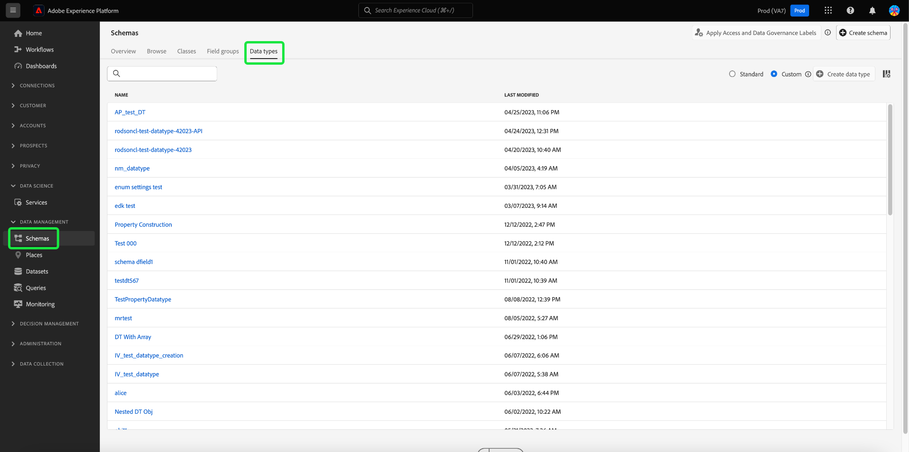

# Creación y edición de tipos de datos mediante la interfaz de usuario

En el Modelo de datos de experiencia (XDM), los tipos de datos se utilizan como campos de tipo de referencia en clases o mezclas de la misma manera que los campos literales básicos. La diferencia clave es que los tipos de datos pueden definir varios subcampos. Aunque son similares a las mezclas, ya que permiten el uso coherente de una estructura de varios campos, los tipos de datos son más flexibles porque pueden incluirse en cualquier parte de la estructura de esquema, mientras que las mezclas sólo pueden agregarse en el nivel raíz.

Adobe Experience Platform proporciona muchos tipos de datos estándar que pueden utilizarse para cubrir una amplia variedad de casos de uso comunes de administración de experiencias. Sin embargo, también puede definir sus propios tipos de datos personalizados para satisfacer sus necesidades comerciales únicas.

Este tutorial trata los pasos para crear y editar tipos de datos personalizados en la interfaz de usuario de la plataforma.

## Requisitos previos

Esta guía requiere un conocimiento práctico del sistema XDM. Consulte la [información general de XDM](../../home.md) para obtener una introducción a la función de XDM dentro del ecosistema del Experience Platform y los [conceptos básicos de la composición del esquema](../../schema/composition.md) para ver cómo los tipos de datos contribuyen a los esquemas XDM.

Aunque no es necesario para esta guía, se recomienda que también siga el tutorial sobre [composición de un esquema en la IU](../../tutorials/create-schema-ui.md) para familiarizarse con las diversas funciones de la [!DNL Schema Editor].

## Abra el [!DNL Schema Editor] para un tipo de datos

En la interfaz de usuario de la plataforma, seleccione **[!UICONTROL Esquemas]** en el panel de navegación izquierdo para abrir el espacio de trabajo [!UICONTROL Esquemas] y, a continuación, seleccione la ficha **[!UICONTROL Tipos de datos]**. Se muestra una lista de los tipos de datos disponibles, incluidos los definidos por el Adobe y los creados por la organización.

Desde aquí tiene dos opciones:

- [Crear un nuevo tipo de datos](#create)
- [Seleccione un tipo de datos existente para editar](#edit)

### Crear un nuevo tipo de datos {#create}

En la ficha **[!UICONTROL Tipos de datos]**, seleccione **[!UICONTROL Crear tipo de datos]**.

Aparece [!DNL Schema Editor], que muestra la estructura actual del nuevo tipo de datos en el lienzo. En el lado derecho del editor, puede proporcionar un nombre para mostrar y una descripción opcional para el tipo de datos. Asegúrese de proporcionar un nombre único y conciso para el tipo de datos, ya que así es como se identificará al agregarlo a un esquema.

Este tutorial crea un tipo de datos que describe una propiedad de restaurante, por lo que al tipo de datos se le asigna el nombre para mostrar &quot;Restaurante&quot;.

A partir de aquí, puede pasar a la [siguiente sección](#add-fields) en inicio agregando campos al nuevo tipo de datos.

### Editar un tipo de datos existente

Solo se pueden editar los tipos de datos personalizados definidos por la organización. Para reducir la lista mostrada, seleccione el icono de filtro () para mostrar los controles de filtrado basados en [!UICONTROL Propietario]. Seleccione **[!UICONTROL Cliente]** para mostrar solo los tipos de datos personalizados que posee su organización.

Seleccione el tipo de datos que desea editar en la lista para abrir el carril derecho, mostrando los detalles del tipo de datos. Seleccione el nombre del tipo de datos en el carril derecho para abrir su estructura en [!DNL Schema Editor].

## Añadir campos al tipo de datos {#add-fields}

Para agregar campos en inicio al tipo de datos, seleccione el icono **más (+)** junto al campo de nivel raíz en el lienzo. A continuación aparece un nuevo campo y el carril correcto se actualiza para mostrar los controles del nuevo campo.

Utilice los controles del carril derecho para configurar los detalles del nuevo campo. Consulte la guía sobre [definición de campos en la interfaz de usuario](../fields/overview.md#define) para ver los pasos específicos sobre cómo configurar y agregar el campo al tipo de datos.

El tipo de datos Restaurante requiere un campo de cadena para representar el nombre del restaurante. Como tal, el [!UICONTROL nombre del campo] se establece como &quot;nombre&quot; y el [!UICONTROL tipo] se establece como &quot;[!UICONTROL cadena]&quot;. Seleccione **[!UICONTROL Aplicar]** para aplicar los cambios al campo.

Continúe agregando más campos al tipo de datos según sea necesario. El tipo de datos del restaurante de ejemplo ahora tiene campos adicionales para marca, capacidad de asiento y espacio en el suelo.

Además de los campos básicos, también puede anidar tipos de datos adicionales dentro del tipo de datos personalizado. Por ejemplo, el tipo de datos Restaurante requiere un campo que represente la dirección física de la propiedad. En este escenario, puede agregar un nuevo campo &quot;dirección&quot; al que se asigna el tipo de datos estándar &quot;[!UICONTROL Dirección postal]&quot;.

Esto demuestra la flexibilidad de los tipos de datos en cuanto a la descripción de los datos: los tipos de datos pueden emplear campos que también son tipos de datos, que pueden contener otros tipos de datos, etc. Esto le permite abstraer y reutilizar patrones de datos comunes en sus esquemas XDM, lo que facilita la representación de estructuras de datos complejas.

Una vez que haya terminado de agregar campos al tipo de datos, seleccione **[!UICONTROL Guardar]** para guardar los cambios y agregar el tipo de datos al [!DNL Schema Library].

## Añadir el tipo de datos a una clase o mezcla

Una vez creado el tipo de datos, puede usar el inicio en sus esquemas. Dado que los esquemas XDM están compuestos por una clase y cero o más mezclas, los campos proporcionados por un tipo de datos no se pueden agregar directamente a un esquema. En su lugar, deben incluirse en una clase o en una mezcla.

Inicio siguiendo los pasos relacionados con [agregar un campo a una clase](./classes.md#add-fields) o [agregar un campo a una mezcla](./mixins.md#add-fields). Cuando elija **[!UICONTROL Tipo]** para el nuevo campo, seleccione el nombre del tipo de datos en el menú desplegable.

## Conversión de un objeto de varios campos en un tipo de datos {#convert}

Al crear un campo de tipo de objeto con varios subcampos en [!DNL Schema Editor], puede convertir ese campo en un tipo de datos para que pueda utilizar la misma estructura de campo en una clase o mezcla diferente.

Para convertir un campo de tipo de objeto en un tipo de datos, seleccione el campo en el lienzo. Antes de convertir el campo, asegúrese de que **[!UICONTROL Nombre para mostrar]** es descriptivo de los datos que contendrá el objeto, ya que se convertirá en el nombre del tipo de datos. Cuando esté listo para convertir el campo, seleccione **[!UICONTROL Convertir en nuevo tipo de datos]** en el carril derecho.

El lienzo actualiza el tipo de datos del campo de &quot;[!UICONTROL Object]&quot; al nuevo tipo de datos. Los subcampos también tienen iconos de bloqueo pequeños junto a ellos, lo que indica que ya no son campos individuales sino que forman parte de un tipo de datos de varios campos. Esta estructura ahora se puede reutilizar en otras clases y mezclas seleccionando este tipo de datos en la lista desplegable **[!UICONTROL Tipo]** al definir un nuevo campo.

## Pasos siguientes

En esta guía se explica cómo crear y editar tipos de datos mediante la interfaz de usuario de la plataforma. Para obtener más información sobre las capacidades del espacio de trabajo [!UICONTROL Esquemas], consulte la información general del [[!UICONTROL espacio de trabajo Esquemas]](../overview.md).

Para obtener más información sobre cómo administrar los tipos de datos mediante la API [!DNL Schema Registry], consulte la [guía del extremo de tipos de datos](../../api/data-types.md).
