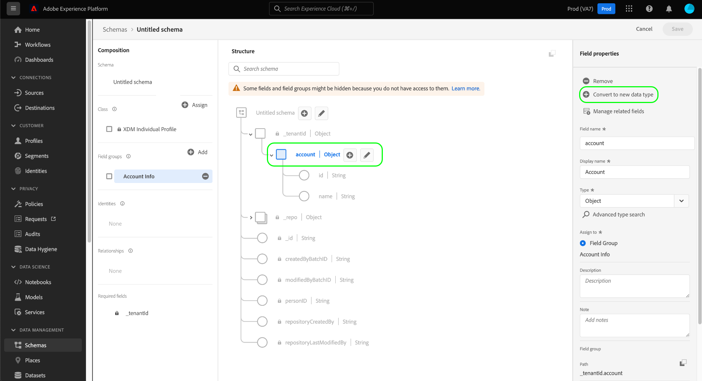

# Creación y edición de tipos de datos mediante la interfaz de usuario {#ui-create-and-edit}

>[!CONTEXTUALHELP]
>id="platform_schemas_datatype_filter"
>title="Filtro de tipo de datos estándar o personalizado"
>abstract="La lista de tipos de datos disponibles se filtra previamente en función de cómo se crearon. Seleccione el botón de opción para elegir entre las opciones Estándar y Personalizado. La opción Estándar muestra las entidades creadas por Adobe y la opción Personalizada muestra las entidades creadas dentro de su organización. Consulte la documentación para obtener más información sobre la creación y edición de tipos de datos."

En el modelo de datos de experiencia (XDM), los tipos de datos son campos reutilizables que contienen varios subcampos. Aunque son similares a los grupos de campos de esquema en el sentido de que permiten el uso coherente de una estructura de varios campos, los tipos de datos son más flexibles porque se pueden incluir en cualquier parte de la estructura de esquema, mientras que los grupos de campos solo se pueden añadir en el nivel raíz.

Adobe Experience Platform proporciona muchos tipos de datos estándar que se pueden utilizar para cubrir una amplia variedad de casos de uso comunes de administración de experiencias. Sin embargo, también puede definir sus propios tipos de datos personalizados para satisfacer sus necesidades comerciales únicas.

>[!NOTE]
>
>Si un campo está definido como un tipo de datos específico, no se puede crear el mismo campo con un tipo de datos diferente en otro esquema. Esta restricción se aplica a todo el inquilino de la organización.

Este tutorial trata los pasos para crear y editar tipos de datos personalizados en la interfaz de usuario de Experience Platform.

## Requisitos previos {#prerequisites}

Esta guía requiere una comprensión práctica del sistema XDM. Consulte la [descripción general de XDM](../../home.md) para obtener una introducción del papel de XDM en el ecosistema de Experience Platform y los [conceptos básicos de la composición de esquemas](../../schema/composition.md) para ver cómo los tipos de datos contribuyen a los esquemas XDM.

Si bien no es necesario para este guía, se recomienda que también seguir la tutorial de [componer un esquema en el IU](../../tutorials/create-schema-ui.md) de familiarizarse con las diversas capacidades del [!DNL Schema Editor]archivo .

## Abra el para un tipo de [!DNL Schema Editor] datos {#data-type}

En el IU Experience Platform, seleccione **[!UICONTROL Schemas]** en el navegación izquierdo para abrir el [!UICONTROL Schemas] espacio de trabajo y luego seleccione el **[!UICONTROL Data types]** pestaña. Se muestra una lista de los tipos de datos disponibles. La lista de tipos de datos se filtra automáticamente en función de cómo se crearon. La configuración predeterminada muestra los tipos de datos definidos por Adobe. También puede filtrar la lista para mostrar los que ha creado su organización.

![Espacio de trabajo [!UICONTROL Schemas] con [!UICONTROL Schemas] en la navegación izquierda y [!UICONTROL Data types] resaltado.](../../images/ui/resources/data-types/data-types-tab.png)

A partir de aquí, tiene las siguientes opciones:

- [Crear un nuevo tipo de datos](#create)
- [Filtrar tipos de datos](#filter)
- [Seleccione un tipo de datos existente para editar](#edit)

### Crear un nuevo tipo de datos {#create}

En la pestaña **[!UICONTROL Data types]**, seleccione **[!UICONTROL Create data type]**.

![La ficha [!UICONTROL Schemas] del área de trabajo [!UICONTROL Data types] con [!UICONTROL Create data type] resaltado.](../../images/ui/resources/data-types/create.png)

Aparecerá [!DNL Schema Editor] con la estructura actual del nuevo tipo de datos en el lienzo. En el lado derecho del editor, puede proporcionar un nombre para mostrar y una descripción opcional para el tipo de datos. Asegúrese de proporcionar un nombre único y conciso para el tipo de datos, ya que así es como se identificará al agregarlo a un esquema.

Este tutorial crea un tipo de datos que describe una propiedad de restaurante, de modo que al tipo de datos se le asigna el nombre para mostrar &quot;Restaurante&quot;.

Desde aquí, puede saltar a la [sección siguiente](#add-fields) para empezar a agregar campos al nuevo tipo de datos.

### Filtrar tipos de datos {#filter}

La lista de tipos de datos disponibles se filtra previamente en función de cómo se crearon. Seleccione el botón de opción para elegir entre las opciones [!UICONTROL Standard] y [!UICONTROL Custom]. La opción [!UICONTROL Standard] muestra las entidades creadas por Adobe y la opción [!UICONTROL Custom] muestra las entidades creadas dentro de su organización.

![La ficha [!UICONTROL Data types] del área de trabajo [!UICONTROL Schemas] con [!UICONTROL Standard] y [!UICONTROL Custom] resaltados.](../../images/ui/resources/data-types/standard-and-custom-data-types.png)

### Editar un tipo de datos existente {#edit}

>[!NOTE]
>
>Una vez que se utiliza un tipo de datos existente en un esquema que se ha habilitado para su uso en Perfil de cliente en tiempo real, solo se pueden realizar cambios no destructivos en ese tipo de datos a partir de entonces. Consulte las reglas de esquema [evolución](../../schema/composition.md#evolution) para obtener más información.

Solo se pueden editar los tipos de datos personalizados definidos por su organización. Seleccione **[!UICONTROL Custom]** para mostrar solamente los tipos de datos personalizados que sean propiedad de su organización.

Seleccione el tipo de datos que desea editar de la lista para abrir el carril derecho, mostrando los detalles del tipo de datos. Desde el panel de detalles también puede descargar un archivo de muestra, copiar la estructura JSON o añadir el tipo de datos a un paquete.

Seleccione el nombre del tipo de datos en el carril derecho para abrir su estructura en [!DNL Schema Editor].

![La ficha [!UICONTROL Data types] del área de trabajo [!UICONTROL Schemas], con un tipo de datos, [!UICONTROL Custom] y el tipo de datos [!UICONTROL Name] resaltados.](../../images/ui/resources/data-types/edit.png)

## añadir campos al tipo de datos {#add-fields}

Para inicio agregar campos al tipo de datos, seleccione el **icono más (+)** junto al campo de nivel de raíz en el lienzo. Aparece un nuevo campo a continuación y la carril derecha se actualiza para mostrar los controles para el nuevo campo.

Utilice los controles del carril derecho para configurar los detalles del nuevo campo. Consulte la guía sobre [la definición de campos en el IU](../fields/overview.md#define) para obtener pasos específicos sobre cómo configurar y agregar el campo al tipo de datos.

El tipo de datos Restaurante requiere un campo de cadena para representar el nombre del restaurante. Como tal, [!UICONTROL Field name] se establece como &quot;nombre&quot; y [!UICONTROL Type] se establece como &quot;[!UICONTROL String]&quot;. Seleccione **[!UICONTROL Apply]** para aplicar los cambios al campo.

Siga agregando más campos al tipo de datos según sea necesario. El tipo de datos de ejemplo Restaurante ahora tiene campos adicionales para la marca, la capacidad de los asientos y la superficie.

Además de los campos básicos, también puede anidar tipos de datos adicionales dentro del tipo de datos personalizado. Por ejemplo, el tipo de datos Restaurante requiere un campo que represente la dirección física de la propiedad. En este escenario, puede agregar un nuevo campo &quot;dirección&quot; que tiene asignado el tipo de datos estándar &quot;[!UICONTROL Postal address]&quot;.

Esto demuestra lo flexibles que pueden ser los tipos de datos a la hora de describir sus datos: los tipos de datos pueden emplear campos que también son tipos de datos, que a su vez pueden contener más tipos de datos, etc. Esto le permite abstraer y reutilizar patrones de datos comunes en todos sus esquemas XDM, lo que facilita la representación de estructuras de datos complejas.

Una vez que haya terminado de agregar campos al tipo de datos, seleccione **[!UICONTROL Save]** guardar los cambios y agregar el tipo de datos al [!DNL Schema Library]archivo .

## añadir el tipo de datos a una esquema {#add-data-type}

Una vez creado un tipo de datos, puede inicio utilizarlo en los esquemas. Dado que los esquemas XDM se componen de una clase y cero o más grupos de campos, los campos proporcionados por un tipo de datos no se pueden agregar a una esquema directamente. En su lugar, deben incluirse en una clase o un grupo de campos.

Comience por seguir los pasos involucrados con [agregar un campo a una clase](./classes.md#add-fields) o [agregar un campo a un grupo de campos](./field-groups.md#add-fields). Como alternativa, puede empezar a [agregar un campo directamente a un esquema](./schemas.md#add-individual-fields) y elegir la clase principal o el grupo de campos desde allí. Cuando elija **[!UICONTROL Type]** para el nuevo campo, seleccione el nombre del tipo de datos en el menú desplegable.

## Conversión de un objeto de varios campos en un tipo de datos {#convert}

Cuando crea un campo de tipo de objeto con varios subcampos en [!DNL Schema Editor], puede convertir ese campo en un tipo de datos para poder utilizar la misma estructura de campo en una clase o grupo de campos diferente.

Para convertir un campo de tipo objeto a un tipo de datos, seleccione el campo en el lienzo. Antes de convertir el campo, asegúrese de que el **[!UICONTROL Display name]** es descriptivo de los datos que contendrá el objeto, ya que se convertirá en el nombre del tipo de datos. Cuando esté preparado para convertir el campo, seleccione **[!UICONTROL Convert to new data type]** el carril derecho.

El lienzo actualiza el tipo de datos del campo de &quot;[!UICONTROL Object]&quot; al nuevo tipo de datos. Esta estructura ahora se puede reutilizar en otras clases y grupos de campos seleccionando este tipo de datos del menú desplegable **[!UICONTROL Type]** al definir un nuevo campo.

## Próximos pasos {#next-steps}

En esta guía se explica cómo crear y editar tipos de datos mediante la interfaz de usuario de Experience Platform. Para obtener más información sobre las capacidades del área de trabajo [!UICONTROL Schemas], vea la descripción general del área de trabajo [[!UICONTROL Schemas]](../overview.md).

Para obtener información sobre cómo administrar los tipos de datos mediante la API [!DNL Schema Registry], consulte la [guía de extremo de tipos de datos](../../api/data-types.md).
