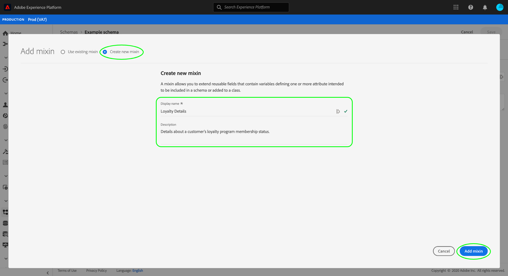

# Creación y edición de mezclas en la interfaz de usuario

En el Modelo de datos de experiencia (XDM), las mezclas son componentes reutilizables que definen uno o varios campos que implementan determinadas funciones, como detalles personales, preferencias del hotel o dirección. Las mezclas están pensadas para incluirse como parte de un esquema que implementa una clase compatible.

Una mezcla define con qué clase es compatible, en función del comportamiento de los datos que la mezcla representa (registro o serie temporal). Esto significa que no todas las mezclas están disponibles para su uso con todas las clases.

Adobe Experience Platform proporciona muchas mezclas estándar que cubren una amplia gama de casos de uso de mercadotecnia. Sin embargo, también puede crear y editar sus propias mezclas personalizadas para definir conceptos adicionales relacionados con su negocio dentro de sus esquemas XDM. Esta guía proporciona información general sobre cómo crear, editar y administrar mezclas personalizadas para su organización en la interfaz de usuario de la plataforma.

## Requisitos previos

Esta guía requiere un conocimiento práctico del sistema XDM. Consulte la [información general de XDM](../../home.md) para obtener una introducción a la función de XDM dentro del ecosistema del Experience Platform y los [conceptos básicos de la composición del esquema](../../schema/composition.md) para ver cómo las mezclas contribuyen a los esquemas XDM.

Aunque no es necesario para esta guía, se recomienda que también siga el tutorial sobre [composición de un esquema en la IU](../../tutorials/create-schema-ui.md) para familiarizarse con las diversas funciones de la [!DNL Schema Editor].

## Crear una nueva mezcla {#create}

Para crear una nueva mezcla, primero debe seleccionar un esquema al que se agregará la mezcla. Puede elegir [crear un nuevo esquema](./schemas.md#create) o [seleccionar un esquema existente para editar](./schemas.md#edit).

Una vez abierto el esquema en el [!DNL Schema Editor], seleccione **[!UICONTROL Añadir]** junto a la sección [!UICONTROL Mezclas] en el carril izquierdo.

Aparece un cuadro de diálogo que muestra una lista de mezclas existentes para su organización. Cerca de la parte superior del cuadro de diálogo, seleccione **[!UICONTROL Crear nueva mezcla]**. Aquí puede proporcionar un **[!UICONTROL nombre para mostrar]** y **[!UICONTROL Descripción]** para la mezcla. Cuando termine, seleccione **[!UICONTROL Añadir mezcla]**.

La [!DNL Schema Editor] reaparece, con la nueva mezcla enumerada en el carril izquierdo. Dado que se trata de una mezcla completamente nueva, no proporciona ningún campo al esquema, por lo que el lienzo permanece intacto. Ahora puede inicio [agregando campos a la mezcla](#add-fields).

## Editar una mezcla existente {#edit}

>[!NOTE]
>
>Solo las mezclas personalizadas definidas por su organización se pueden editar y personalizar completamente. Para las mezclas principales definidas por Adobe, solo se pueden editar los nombres para mostrar de sus campos en el contexto de esquemas individuales. Consulte la sección sobre [edición de nombres para mostrar para campos de esquema](./schemas.md#display-names) para obtener más información.
>
>Una vez guardada y utilizada una mezcla personalizada en un esquema para la ingestión de datos, sólo se podrán realizar cambios aditivos en la mezcla posteriormente. Consulte las [reglas de la evolución del esquema](../../schema/composition.md#evolution) para obtener más información.

Para editar una mezcla existente, primero debe abrir un esquema que utilice la mezcla dentro de [!DNL Schema Editor]. Puede [seleccionar un esquema existente para editarlo](./schemas.md#edit) o [crear un nuevo esquema](./schemas.md#create) y agregar la mezcla en cuestión.

Una vez que haya abierto el esquema en el editor, puede inicio [agregando campos a la mezcla](#add-fields).

## Añadir campos a una mezcla {#add-fields}

Para agregar campos a una mezcla en el [!DNL Schema Editor], seleccione el nombre de la mezcla en el carril izquierdo y luego seleccione el icono **más (+)** junto al nombre del esquema en el lienzo.

En el lienzo aparece un **[!UICONTROL nuevo campo]** y el carril correcto se actualiza para mostrar los controles a fin de configurar las propiedades del campo. Consulte la guía sobre [definición de campos en la interfaz de usuario](../fields/overview.md#define) para ver los pasos específicos sobre cómo configurar y agregar el campo a la mezcla.

Continúe agregando tantos campos como sea necesario a la mezcla. Cuando termine, seleccione **[!UICONTROL Guardar]** para guardar tanto el esquema como la mezcla.

Si la misma mezcla ya se utiliza en otros esquemas, los campos recién añadidos aparecerán automáticamente en esos esquemas.

## Pasos siguientes

En esta guía se explica cómo crear y editar mezclas mediante la interfaz de usuario de la plataforma. Para obtener más información sobre las capacidades del espacio de trabajo [!UICONTROL Esquemas], consulte la información general del [[!UICONTROL espacio de trabajo Esquemas]](../overview.md).

Para obtener información sobre cómo administrar las mezclas mediante la API [!DNL Schema Registry], consulte la [guía de punto final de las mezclas](../../api/mixins.md).