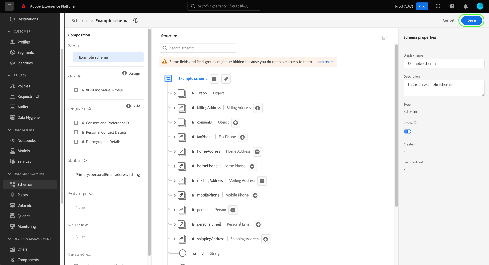

# Creación y edición de esquemas en la interfaz de usuario

Esta guía proporciona información general sobre cómo crear, editar y administrar esquemas del Modelo de datos de experiencia (XDM) para su organización en la interfaz de usuario de Adobe Experience Platform.

>[!IMPORTANT]
>
>Los esquemas XDM son extremadamente personalizables y, por lo tanto, los pasos involucrados en la creación de un esquema pueden variar según el tipo de datos que desee que el esquema capture. Como resultado, este documento solo cubre las interacciones básicas que puede realizar con esquemas en la interfaz de usuario y excluye los pasos relacionados como la personalización de clases, mezclas, tipos de datos y campos.
>
>Para obtener un recorrido completo del proceso de creación de esquemas, siga junto con el [tutorial de creación de esquemas](../../tutorials/create-schema-ui.md) para crear un esquema de ejemplo completo y familiarizarse con las muchas funcionalidades del [!DNL Schema Editor].

## Requisitos previos

Esta guía requiere un conocimiento práctico del sistema XDM. Consulte la [información general de XDM](../../home.md) para obtener una introducción a la función de XDM dentro del ecosistema del Experience Platform y los [conceptos básicos de la composición del esquema](../../schema/composition.md) para obtener una visión general de cómo se construyen los esquemas.

## Crear un nuevo esquema {#create}

En el espacio de trabajo [!UICONTROL Esquemas], seleccione **[!UICONTROL Crear esquema]** en la esquina superior derecha. En el menú desplegable que aparece, puede elegir entre **[!UICONTROL Perfil individual XDM]** y **[!UICONTROL evento de experiencia XDM]** como clase base para el esquema. Como alternativa, puede seleccionar **[!UICONTROL Examinar]** para seleccionar entre la lista completa de clases disponibles o [crear una nueva clase personalizada](./classes.md#create) en su lugar.

Una vez seleccionada una clase, aparece [!DNL Schema Editor] y la estructura base del esquema (proporcionada por la clase) se muestra en el lienzo. Desde aquí, puede utilizar el carril derecho para agregar un **[!UICONTROL nombre para mostrar]** y **[!UICONTROL Descripción]** para el esquema.

Ahora puede crear inicios de la estructura del esquema [agregando mezclas](#add-mixins).

## Editar un esquema existente {#edit}

>[!NOTE]
>
>Una vez guardado y utilizado un esquema en la ingestión de datos, solo se pueden realizar cambios aditivos. Consulte las [reglas de la evolución del esquema](../../schema/composition.md#evolution) para obtener más información.

Para editar un esquema existente, seleccione la ficha **[!UICONTROL Examinar]** y, a continuación, seleccione el nombre del esquema que desee editar.

>[!TIP]
>
>Puede utilizar las funciones de búsqueda y filtrado del espacio de trabajo para encontrar el esquema más fácilmente. Consulte la guía sobre [exploración de recursos XDM](../explore.md) para obtener más información.

Una vez seleccionado un esquema, el [!DNL Schema Editor] aparece con la estructura del esquema que se muestra en el lienzo. Ahora puede [agregar mezclas](#add-mixins) al esquema, [editar nombres de visualización de campos](#display-names) o [editar mezclas personalizadas existentes](./mixins.md#edit) si el esquema emplea alguna.

## Añadir mezclas a un esquema {#add-mixins}

>[!NOTE]
>
>Esta sección trata cómo agregar mezclas existentes a un esquema. Si desea crear una nueva mezcla personalizada, consulte la guía sobre [creación y edición de mezclas](./mixins.md#create) en su lugar.

Una vez que haya abierto un esquema dentro del [!DNL Schema Editor], puede agregar campos al esquema mediante el uso de mezclas. Para inicio, seleccione **[!UICONTROL Añadir]** junto a **[!UICONTROL Mezclas]** en el carril izquierdo.

Aparece un cuadro de diálogo que muestra una lista de mezclas que puede seleccionar para el esquema. Dado que las mezclas solo son compatibles con una clase, sólo se enumerarán las mezclas asociadas con la clase seleccionada del esquema. De forma predeterminada, las mezclas enumeradas se ordenan en función de su popularidad de uso en su organización.

Puede utilizar la barra de búsqueda para encontrar la mezcla deseada. Las mezclas cuyo nombre coincide con la consulta aparecen en la parte superior de la lista. En **[!UICONTROL Campos estándar]**, se muestran las mezclas que contienen campos que describen atributos de datos deseados.

Seleccione la casilla de verificación situada junto al nombre de la mezcla que desea agregar al esquema. Puede seleccionar varias mezclas de la lista, y cada una de ellas aparecerá en el carril derecho.

>[!TIP]
>
>Para cualquier mezcla de la lista, puede pasar el ratón por encima o centrarse en el icono de información () para vista de una breve descripción del tipo de datos que captura la mezcla. También puede seleccionar el icono de previsualización () para vista de la estructura de los campos que proporciona la mezcla antes de decidir agregarla al esquema.

Una vez que haya elegido sus mezclas, seleccione **[!UICONTROL Añadir mezcla]** para agregarlas al esquema.

El [!DNL Schema Editor] vuelve a aparecer con los campos proporcionados por la mezcla representados en el lienzo.

## Habilitar un esquema para el Perfil del cliente en tiempo real {#profile}

[Los ](../../../profile/home.md) perfiles de cliente en tiempo real extraen datos de fuentes diferentes para construir una vista completa de cada cliente individual. Si desea que los datos capturados por un esquema participen en este proceso, debe habilitar el esquema para utilizarlo en [!DNL Profile].

>[!IMPORTANT]
>
>Para habilitar un esquema para [!DNL Profile], debe tener un campo de identidad principal definido. Consulte la guía sobre [definición de campos de identidad](../fields/identity.md) para obtener más información.

Para habilitar el esquema, seleccione el nombre del esquema en el carril izquierdo y, a continuación, seleccione la opción **[!UICONTROL Perfil]** en el carril derecho.

Aparece una ventana emergente que le advierte que una vez que se ha habilitado y guardado un esquema, no se puede deshabilitar. Seleccione **[!UICONTROL Habilitar]** para continuar.

El lienzo vuelve a aparecer con la opción [!UICONTROL Perfil] activada.

>[!IMPORTANT]
>
>Dado que el esquema aún no se ha guardado, este es el punto de no retorno si cambia de opinión sobre permitir que el esquema participe en el Perfil del cliente en tiempo real: una vez guardado un esquema habilitado, ya no se puede deshabilitar. Seleccione la opción **[!UICONTROL Perfil]** de nuevo para deshabilitar el esquema.

Para finalizar el proceso, seleccione **[!UICONTROL Guardar]** para guardar el esquema.

El esquema ahora está habilitado para su uso en Perfil de clientes en tiempo real. Cuando Platform ingesta datos en conjuntos de datos basados en este esquema, esos datos se incorporarán a los datos de Perfil amalgamados.

## Editar los nombres para mostrar de los campos de esquema {#display-names}

Una vez que haya asignado una clase y agregado mezclas a un esquema, puede editar los nombres para mostrar de cualquiera de los campos del esquema, independientemente de si esos campos se han proporcionado con recursos XDM estándar o personalizados.

>[!NOTE]
>
>Tenga en cuenta que los nombres para mostrar de los campos que pertenecen a clases o mezclas estándar solo se pueden editar en el contexto de un esquema específico. En otras palabras, cambiar el nombre para mostrar de un campo estándar en un esquema no afecta a otros esquemas que emplean la misma clase o mezcla asociada.

Para editar el nombre para mostrar de un campo de esquema, seleccione el campo en el lienzo. En el carril derecho, proporcione el nuevo nombre en **[!UICONTROL Nombre para mostrar]**.

Seleccione **[!UICONTROL Aplicar]** en el carril derecho y el lienzo se actualiza para mostrar el nuevo nombre para mostrar del campo. Seleccione **[!UICONTROL Guardar]** para aplicar los cambios al esquema.

## Cambiar una clase de esquema {#change-class}

Puede cambiar la clase de un esquema en cualquier momento durante el proceso de composición inicial antes de guardar el esquema.

>[!WARNING]
>
>La reasignación de la clase para un esquema debe realizarse con extrema precaución. Las mezclas solo son compatibles con determinadas clases y, por lo tanto, si se cambia la clase, se restablecerán el lienzo y los campos que se hayan agregado.

Para reasignar una clase, seleccione **[!UICONTROL Asignar]** en el lado izquierdo del lienzo.

Aparece un cuadro de diálogo que muestra una lista de todas las clases disponibles, incluidas las definidas por su organización (el propietario es &quot;[!UICONTROL Cliente]&quot;), así como las clases estándar definidas por Adobe.

Seleccione una clase de la lista para mostrar su descripción en el lado derecho del cuadro de diálogo. También puede seleccionar **[!UICONTROL estructura de clase de Previsualización]** para ver los campos y metadatos asociados con la clase. Seleccione **[!UICONTROL Asignar clase]** para continuar.

Se abre un nuevo cuadro de diálogo en el que se le solicita que confirme que desea asignar una nueva clase. Seleccione **[!UICONTROL Asignar]** para confirmar.

Después de confirmar el cambio de clase, se restablecerá el lienzo y se perderá todo el progreso de la composición.

## Pasos siguientes

Este documento trató los aspectos básicos de la creación y edición de esquemas en la interfaz de usuario de la plataforma. Se recomienda encarecidamente que revise el [tutorial de creación de esquema](../../tutorials/create-schema-ui.md) para obtener un flujo de trabajo completo para crear un esquema completo en la interfaz de usuario, incluida la creación de mezclas personalizadas y tipos de datos para casos de uso únicos.

Para obtener más información sobre las capacidades del espacio de trabajo [!UICONTROL Esquemas], consulte la información general del [[!UICONTROL espacio de trabajo Esquemas]](../overview.md).

Para obtener información sobre cómo administrar esquemas en la API [!DNL Schema Registry], consulte la [guía de extremo de esquemas](../../api/schemas.md).