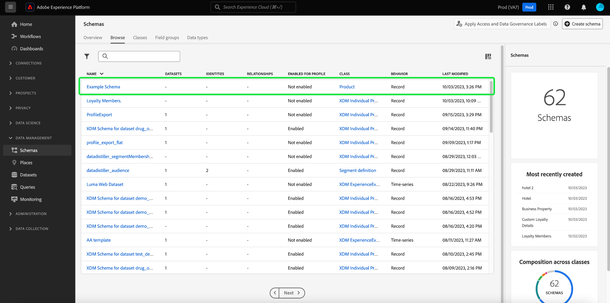
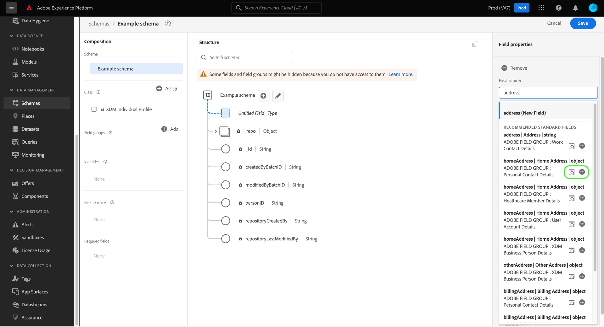
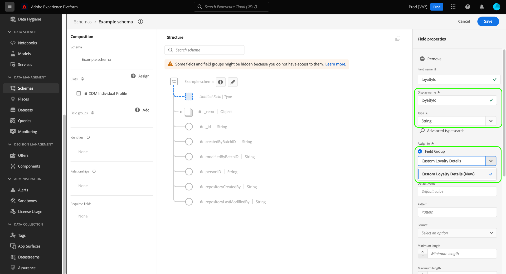
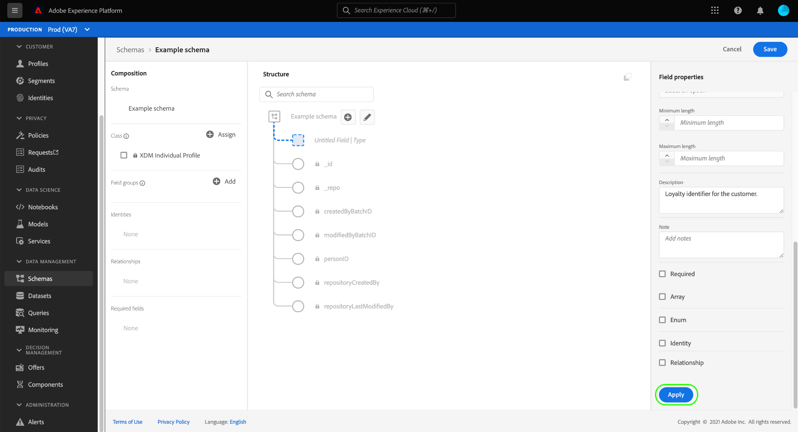

# Creación y edición de esquemas en la IU

Esta guía proporciona información general sobre cómo crear, editar y administrar esquemas del Modelo de datos de experiencia (XDM) para su organización en la interfaz de usuario de Adobe Experience Platform.

>[!IMPORTANT]
>
>Los esquemas XDM son extremadamente personalizables y, por lo tanto, los pasos necesarios para crear un esquema pueden variar según el tipo de datos que desee que capture el esquema. Como resultado, este documento solo cubre las interacciones básicas que se pueden realizar con los esquemas en la interfaz de usuario y excluye los pasos relacionados, como la personalización de clases, los grupos de campos de esquema, los tipos de datos y los campos.
>
>Para ver un recorrido completo por el proceso de creación de esquemas, siga junto con las [tutorial de creación de esquemas](../../tutorials/create-schema-ui.md) para crear un esquema de ejemplo completo y familiarizarse con las numerosas funcionalidades de [!DNL Schema Editor].

## Requisitos previos {#prerequisites}

Esta guía requiere una comprensión práctica del sistema XDM. Consulte la [Información general de XDM](../../home.md) para obtener una introducción a la función de XDM dentro del ecosistema de Experience Platform, y la [conceptos básicos de composición de esquemas](../../schema/composition.md) para obtener una descripción general de cómo se construyen los esquemas.

## Creación de un nuevo esquema {#create}

>[!NOTE]
>
>Esta sección explica cómo crear manualmente un nuevo esquema en la interfaz de usuario. Si está introduciendo datos CSV en Platform, puede optar por [asigne esos datos a un esquema XDM creado por recomendaciones generadas por IA](../../../ingestion/tutorials/map-csv/recommendations.md) (actualmente en fase beta) sin tener que crear manualmente el esquema.

En el [!UICONTROL Esquemas] workspace, seleccione **[!UICONTROL Crear esquema]** en la esquina superior derecha.

![El espacio de trabajo Esquemas con [!UICONTROL Crear esquema] resaltado.](../../images/ui/resources/schemas/create-schema.png)

El [!UICONTROL Crear esquema] flujo de trabajo aparece. Puede elegir una clase base para el esquema seleccionando una de las siguientes opciones **[!UICONTROL Perfil individual]**, **[!UICONTROL Evento de experiencia]**, o **[!UICONTROL Otros]**, seguido de **[!UICONTROL Siguiente]** para confirmar su elección. Consulte la [Perfil individual de XDM](../../classes/individual-profile.md) y [ExperienceEvent de XDM](../../classes/experienceevent.md) para obtener más información sobre estas clases.

![El [!UICONTROL Crear esquema] flujo de trabajo con las tres opciones de clase y [!UICONTROL Siguiente] resaltado.](../../images/ui/resources/schemas/schema-class-options.png)

Después de seleccionar una clase, la variable [!UICONTROL Nombre y revisión] aparece la sección. En esta sección, proporcione un nombre y una descripción para identificar el esquema. palo de golfLa estructura base del esquema (proporcionada por la clase ) se muestra en el lienzo para que revise y compruebe la clase y la estructura de esquema seleccionadas.

Introduce un amigo de los humanos [!UICONTROL Nombre para mostrar del esquema] en el campo de texto. A continuación, introduzca una descripción adecuada para ayudar a identificar el esquema. Cuando haya revisado la estructura de esquema y esté satisfecho con la configuración, seleccione **[!UICONTROL Finalizar]** para crear el esquema.

![El [!UICONTROL Nombre y revisión] de la sección [!UICONTROL Crear esquema] flujo de trabajo con [!UICONTROL Nombre para mostrar del esquema], [!UICONTROL Descripción], y [!UICONTROL Finalizar] resaltado.](../../images/ui/resources/schemas/name-and-review.png)

El [!UICONTROL Esquema] [!UICONTROL Examinar] aparece la pestaña. El esquema creado recientemente aparece ahora en la Biblioteca de esquemas y está disponible para editar en la [!DNL Schema Editor].

## Editar un esquema existente {#edit}

>[!NOTE]
>
>Una vez guardado un esquema y utilizado en la ingesta de datos, solo se pueden realizar cambios adicionales. Consulte la [reglas de evolución de esquema](../../schema/composition.md#evolution) para obtener más información.

Para editar un esquema existente, seleccione la **[!UICONTROL Examinar]** y, a continuación, seleccione el nombre del esquema que desea editar. También puede utilizar la barra de búsqueda para reducir la lista de opciones disponibles.

>[!TIP]
>
>Puede utilizar las funcionalidades de búsqueda y filtrado del espacio de trabajo para encontrar el esquema más fácilmente. Consulte la guía de [exploración de recursos XDM](../explore.md) para obtener más información.

Una vez seleccionado un esquema, la variable [!DNL Schema Editor] aparece con la estructura del esquema mostrada en el lienzo. Ahora puede [añadir grupos de campos](#add-field-groups) al esquema (o [añadir campos individuales](#add-individual-fields) de esos grupos), [editar nombres para mostrar de campos](#display-names), o [editar grupos de campos personalizados existentes](./field-groups.md#edit) si el esquema emplea alguno.

## Más acciones {#more}

En el Editor de esquemas también puede realizar acciones rápidas para copiar la estructura JSON del esquema o eliminar el esquema si no se ha habilitado para el perfil del cliente en tiempo real o tiene conjuntos de datos asociados. Seleccionar [!UICONTROL Más] en la parte superior de la vista para mostrar una lista desplegable con acciones rápidas.

La funcionalidad Copiar estructura JSON le permite ver el aspecto que tendría una carga útil de ejemplo mientras sigue creando el esquema y las canalizaciones de datos. Resulta especialmente útil en situaciones en las que hay estructuras de mapa de objetos complejas en el esquema, como un mapa de identidad.

## Alternar nombre para mostrar {#display-name-toggle}

Para su comodidad, el Editor de esquemas proporciona un conmutador para cambiar entre los nombres de campo originales y los nombres para mostrar más legibles en lenguaje natural. Esta flexibilidad permite mejorar la capacidad de detección de campos y la edición de los esquemas. La opción se encuentra en la parte superior derecha de la vista Editor de esquemas.

>[!NOTE]
>
>El cambio de nombres de campo a nombres para mostrar es puramente cosmético y no cambia ningún recurso descendente.

![El Editor de esquemas con [!UICONTROL Mostrar nombres para mostrar para campos] resaltado.](../../images/ui/resources/schemas/display-name-toggle.png)

Los nombres para mostrar de los grupos de campos estándar se generan en el sistema, pero se pueden personalizar, tal como se describe en la sección [nombres para mostrar](#display-names) sección. Los nombres para mostrar se reflejan en varias vistas de interfaz de usuario, incluidas las vistas previas de asignaciones y conjuntos de datos. La configuración predeterminada está desactivada y muestra los nombres de campo según sus valores originales.

## Adición de grupos de campos a un esquema {#add-field-groups}

>[!NOTE]
>
>Esta sección explica cómo añadir grupos de campos existentes a un esquema. Si desea crear un nuevo grupo de campos personalizados, consulte la guía de [creación y edición de grupos de campos](./field-groups.md#create) en su lugar.

Una vez abierto un esquema en la variable [!DNL Schema Editor]Además, puede agregar campos al esquema mediante el uso de grupos de campos. Para empezar, seleccione **[!UICONTROL Añadir]** junto a **[!UICONTROL Grupos de campos]** en el carril izquierdo.

![El Editor de esquemas con [!UICONTROL Añadir] desde el [!UICONTROL Grupos de campos] sección resaltada.](../../images/ui/resources/schemas/add-field-group-button.png)

Aparece un cuadro de diálogo que muestra una lista de grupos de campos que puede seleccionar para el esquema. Dado que los grupos de campos solo son compatibles con una clase, solo se enumerarán los grupos de campos asociados con la clase seleccionada del esquema. De forma predeterminada, los grupos de campos enumerados se ordenan según su popularidad de uso dentro de la organización.

![El [!UICONTROL Adición de grupos de campos] Cuadro de diálogo resaltado con [!UICONTROL Popularidad] columna resaltada.](../../images/ui/resources/schemas/field-group-popularity.png)

Si conoce la actividad general o el área empresarial de los campos que desea agregar, seleccione una o más de las categorías verticales del sector en el carril izquierdo para filtrar la lista mostrada de grupos de campos.

![El [!UICONTROL Adición de grupos de campos] Cuadro de diálogo resaltado con [!UICONTROL Industria] filtros y el [!UICONTROL Industria] columna resaltada.](../../images/ui/resources/schemas/industry-filter.png)

>[!NOTE]
>
>Para obtener más información sobre las prácticas recomendadas para el modelado de datos específicos del sector en XDM, consulte la documentación sobre [modelos de datos del sector](../../schema/industries/overview.md).

También puede utilizar la barra de búsqueda para localizar el grupo de campos deseado. Los grupos de campos cuyo nombre coincida con la consulta aparecen en la parte superior de la lista. En **[!UICONTROL Campos estándar]**, se muestran los grupos de campos que contienen campos que describen los atributos de datos deseados.

![El [!UICONTROL Adición de grupos de campos] diálogo con el [!UICONTROL Campos estándar] función de búsqueda resaltada.](../../images/ui/resources/schemas/field-group-search.png)

Seleccione la casilla de verificación situada junto al nombre del grupo de campos que desea agregar al esquema. Puede seleccionar varios grupos de campos en la lista, y cada grupo de campos seleccionado aparecerá en el carril derecho.

![El [!UICONTROL Adición de grupos de campos] Cuadro de diálogo con la función de selección de casilla de verificación resaltada.](../../images/ui/resources/schemas/add-field-group.png)

>[!TIP]
>
>Para cualquier grupo de campos de la lista, puede situarse encima o centrarse en el icono de información () para ver una breve descripción del tipo de datos que captura el grupo de campos. También puede seleccionar el icono de previsualización () para ver la estructura de los campos que proporciona el grupo de campos antes de decidir agregarla al esquema.

Una vez seleccionados los grupos de campos, seleccione **[!UICONTROL Adición de grupos de campos]** para añadirlos al esquema.

![El [!UICONTROL Adición de grupos de campos] diálogo con grupos de campos seleccionados y [!UICONTROL Adición de grupos de campos] resaltado.](../../images/ui/resources/schemas/add-field-group-finish.png)

El [!DNL Schema Editor] vuelve a aparecer con los campos proporcionados por el grupo de campos representados en el lienzo.

![El [!DNL Schema Editor] con un esquema de ejemplo mostrado.](../../images/ui/resources/schemas/field-groups-added.png)

Después de agregar un grupo de campos a un esquema, puede [eliminar campos existentes](#remove-fields) o [añadir nuevos campos personalizados](#add-fields) a esos grupos, según sus necesidades.

### Quitar campos agregados de grupos de campos {#remove-fields}

Después de agregar un grupo de campos a un esquema, puede quitar los campos que no necesite.

>[!NOTE]
>
>La eliminación de campos de un grupo de campos solo afecta al esquema en el que se está trabajando y no afecta al propio grupo de campos. Si elimina los campos de un esquema, esos campos seguirán estando disponibles en todos los demás esquemas que empleen el mismo grupo de campos.

En el ejemplo siguiente, el grupo de campos estándar **[!UICONTROL Datos demográficos]** se ha agregado a un esquema. Para quitar un solo campo como `taxId`, seleccione el campo en el lienzo y luego seleccione **[!UICONTROL Eliminar]** en el carril derecho.

![El [!DNL Schema Editor] con [!UICONTROL Eliminar] resaltado. Esta acción elimina un solo campo.](../../images/ui/resources/schemas/remove-single-field.png)

Si desea eliminar varios campos, puede administrar el grupo de campos en su conjunto. Seleccione un campo que pertenezca al grupo en el lienzo y, a continuación, seleccione **[!UICONTROL Administrar campos relacionados]** en el carril derecho.

![El [!DNL Schema Editor] con [!UICONTROL Administrar campos relacionados] resaltado.](../../images/ui/resources/schemas/manage-related-fields.png)

Aparecerá un cuadro de diálogo que muestra la estructura del grupo de campos en cuestión. Desde aquí puede utilizar las casillas de verificación proporcionadas para seleccionar o anular la selección de los campos necesarios. Cuando esté satisfecho, seleccione **[!UICONTROL Confirmar]**.

![El [!UICONTROL Administrar campos relacionados] diálogo con los campos seleccionados y [!UICONTROL Confirmar] resaltado.](../../images/ui/resources/schemas/select-fields.png)

El lienzo vuelve a aparecer con solo los campos seleccionados presentes en la estructura del esquema.

### Agregar campos personalizados a grupos de campos {#add-fields}

Después de agregar un grupo de campos a un esquema, puede definir campos adicionales para ese grupo. Sin embargo, cualquier campo agregado a un grupo de campos en un esquema también aparecerá en todos los demás esquemas que empleen el mismo grupo de campos.

Además, si se agrega un campo personalizado a un grupo de campos estándar, ese grupo de campos se convertirá en un grupo de campos personalizados y el grupo de campos estándar original dejará de estar disponible.

Si desea agregar un campo personalizado a un grupo de campos estándar, consulte la [sección siguiente](#custom-fields-for-standard-groups) para obtener instrucciones específicas. Si va a añadir campos a un grupo de campos personalizados, consulte la sección sobre [editar grupos de campos personalizados](./field-groups.md) en la guía de IU de grupos de campos.

Si no desea modificar ningún grupo de campos existente, puede hacer lo siguiente [crear un nuevo grupo de campos personalizados](./field-groups.md#create) para definir campos adicionales.

## Añadir campos individuales a un esquema {#add-individual-fields}

El Editor de esquemas permite agregar campos individuales directamente a un esquema si desea evitar agregar un grupo de campos completo para un caso de uso específico. Puede [añadir campos individuales de grupos de campos estándar](#add-standard-fields) o [añadir sus propios campos personalizados](#add-custom-fields) en su lugar.

>[!IMPORTANT]
>
>Aunque el Editor de esquemas permite funcionalmente agregar campos individuales directamente a un esquema, esto no cambia el hecho de que todos los campos de un esquema XDM deben proporcionarlos su clase o un grupo de campos compatible con esa clase. Como se explica en las secciones siguientes, todos los campos individuales siguen asociados a una clase o grupo de campos como paso clave cuando se añaden a un esquema.

### Añadir campos estándar {#add-standard-fields}

Puede añadir campos de grupos de campos estándar directamente a un esquema sin necesidad de conocer previamente su grupo de campos correspondiente. Para añadir un campo estándar a un esquema, seleccione el signo más (**+**) junto al nombre del esquema en el lienzo. Un **[!UICONTROL Campo sin título]** el marcador de posición aparece en la estructura del esquema y el carril derecho se actualiza para mostrar los controles y configurar el campo.

En **[!UICONTROL Nombre de campo]** A continuación, empiece a escribir el nombre del campo que desea agregar. El sistema busca automáticamente los campos estándar que coinciden con la consulta y los enumera en **[!UICONTROL Campos estándar recomendados]**, incluidos los grupos de campos a los que pertenecen.

Aunque algunos campos estándar comparten el mismo nombre, su estructura puede variar según el grupo de campos del que procedan. Si un campo estándar está anidado en un objeto principal en la estructura de grupo de campos, el campo principal también se incluye en el esquema si se agrega el campo secundario.

Seleccione el icono de previsualización () junto a un campo estándar para ver la estructura de su grupo de campos y comprender mejor cómo se puede anidar. Para añadir el campo estándar al esquema, seleccione el icono de signo más ().

El lienzo se actualiza para mostrar el campo estándar agregado al esquema, incluidos los campos principales en los que está anidado dentro de la estructura de grupo de campos. El nombre del grupo de campos también se enumera en **[!UICONTROL Grupos de campos]** en el carril izquierdo. Si desea agregar más campos del mismo grupo de campos, seleccione **[!UICONTROL Administrar campos relacionados]** en el carril derecho.

### Añadir campos personalizados {#add-custom-fields}

Al igual que el flujo de trabajo para los campos estándar, también puede agregar sus propios campos personalizados directamente a un esquema.

Para añadir campos al nivel raíz de un esquema, seleccione el signo más (**+**) junto al nombre del esquema en el lienzo. Un **[!UICONTROL Campo sin título]** el marcador de posición aparece en la estructura del esquema y el carril derecho se actualiza para mostrar los controles y configurar el campo.

Empiece a escribir el nombre del campo que desea añadir y el sistema comenzará automáticamente a buscar los campos estándar coincidentes. Para crear un nuevo campo personalizado, seleccione la opción superior anexada con **([!UICONTROL Nuevo campo])**.

Después de proporcionar un nombre para mostrar y un tipo de datos para el campo, el siguiente paso es asignar el campo a un recurso XDM principal. Si el esquema utiliza una clase personalizada, puede elegir [agregar el campo a la clase asignada](#add-to-class) o una [grupo de campos](#add-to-field-group) en su lugar. Sin embargo, si el esquema utiliza una clase estándar, solo puede asignar el campo personalizado a un grupo de campos.

#### Asignar el campo a un grupo de campos personalizados {#add-to-field-group}

>[!NOTE]
>
>Esta sección solo explica cómo asignar el campo a un grupo de campos personalizados. Si desea ampliar un grupo de campos estándar con el nuevo campo personalizado en su lugar, consulte la sección sobre [agregar campos personalizados a grupos de campos estándar](#custom-fields-for-standard-groups).

En **[!UICONTROL Asignar a]**, seleccione **[!UICONTROL Grupo de campos]**. Si el esquema utiliza una clase estándar, esta es la única opción disponible y está seleccionada de forma predeterminada.

A continuación, debe seleccionar un grupo de campos al que asociarse el nuevo campo. Empiece a escribir el nombre del grupo de campos en la entrada de texto proporcionada. Si tiene algún grupo de campos personalizados existente que coincida con la entrada, aparecerán en la lista desplegable. También puede escribir un nombre único para crear un nuevo grupo de campos.

>[!WARNING]
>
>Si selecciona un grupo de campos personalizados existente, cualquier otro esquema que emplee ese grupo de campos también heredará el campo recién agregado después de guardar los cambios. Por este motivo, seleccione únicamente un grupo de campos existente si desea este tipo de propagación. De lo contrario, debe optar por crear un nuevo grupo de campos personalizados.

Después de seleccionar el grupo de campos de la lista, seleccione **[!UICONTROL Aplicar]**.

El nuevo campo se añade al lienzo y tiene un espacio de nombres en la [ID de inquilino](../../api/getting-started.md#know-your-tenant_id) para evitar conflictos con los campos XDM estándar. El grupo de campos con el que ha asociado el nuevo campo también aparece debajo de **[!UICONTROL Grupos de campos]** en el carril izquierdo.

>[!NOTE]
>
>El resto de los campos proporcionados por el grupo de campos personalizados seleccionado se eliminan del esquema de forma predeterminada. Si desea agregar algunos de estos campos al esquema, seleccione un campo que pertenezca al grupo y, a continuación, seleccione **[!UICONTROL Administrar campos relacionados]** en el carril derecho.

#### Asignar el campo a una clase personalizada {#add-to-class}

En **[!UICONTROL Asignar a]**, seleccione **[!UICONTROL Clase]**. El campo de entrada siguiente se reemplaza con el nombre de la clase personalizada del esquema actual, lo que indica que el nuevo campo se asignará a esta clase.

![El [!UICONTROL Clase] opción seleccionada para la nueva asignación de campo.](../../images/ui/resources/schemas/assign-field-to-class.png)

Continúe configurando el campo como desee y seleccione **[!UICONTROL Aplicar]** cuando termine.

![[!UICONTROL Aplicar] seleccionado para el nuevo campo.](../../images/ui/resources/schemas/assign-field-to-class-apply.png)

El nuevo campo se añade al lienzo y tiene un espacio de nombres en la [ID de inquilino](../../api/getting-started.md#know-your-tenant_id) para evitar conflictos con los campos XDM estándar. Al seleccionar el nombre de clase en el carril izquierdo, se muestra el nuevo campo como parte de la estructura de la clase.

### Agregar campos personalizados a la estructura de grupos de campos estándar {#custom-fields-for-standard-groups}

Si el esquema en el que está trabajando tiene un campo de tipo de objeto proporcionado por un grupo de campos estándar, puede agregar sus propios campos personalizados a ese objeto estándar.

>[!WARNING]
>
>Todos los campos agregados a un grupo de campos en un esquema también aparecerán en todos los demás esquemas que empleen el mismo grupo de campos. Además, si se agrega un campo personalizado a un grupo de campos estándar, ese grupo de campos se convertirá en un grupo de campos personalizados y el grupo de campos estándar original dejará de estar disponible.
>
>Si ha participado en la versión beta de esta función, recibirá un cuadro de diálogo que le informará de los grupos de campos estándar que ha personalizado anteriormente. Una vez que seleccione **[!UICONTROL Reconocer]** Sin embargo, los recursos enumerados se convierten en grupos de campos personalizados.
>
>

Para empezar, seleccione el signo más (**+**) junto a la raíz del objeto proporcionada por el grupo de campos estándar.

Aparece un mensaje de advertencia que le solicita que confirme si desea convertir el grupo de campos estándar. Seleccionar **[!UICONTROL Continuar creando grupo de campos]** para continuar.

El lienzo vuelve a aparecer con un marcador de posición sin título para el nuevo campo. Tenga en cuenta que el nombre del grupo de campos estándar se ha anexado con &quot;([!UICONTROL Extendido])&quot; para indicar que se ha modificado de la versión original. Desde aquí, utilice los controles del carril derecho para definir las propiedades del campo.

Después de aplicar los cambios, el nuevo campo aparece en el área de nombres de ID de inquilino dentro del objeto estándar. Este área de nombres anidada evita conflictos de nombre de campo dentro del propio grupo de campos para evitar cambios importantes en otros esquemas que utilizan el mismo grupo de campos.

## Habilitación de un esquema para el perfil del cliente en tiempo real {#profile}

>[!CONTEXTUALHELP]
>id="platform_schemas_enableforprofile"
>title="Habilitar un esquema para perfil"
>abstract="Cuando se habilita un esquema para el perfil, cualquier conjunto de datos creado a partir de este esquema participa en el perfil del cliente en tiempo real, que combina datos de fuentes diferentes para construir una vista completa de cada cliente. Una vez que se utiliza un esquema para ingerir datos en el perfil, no se puede deshabilitar. Consulte la documentación para obtener más información."

[Perfil del cliente en tiempo real](../../../profile/home.md) combina datos de diferentes fuentes para crear una vista completa de cada cliente individual. Si desea que los datos capturados por un esquema participen en este proceso, debe habilitar el esquema para utilizarlo en [!DNL Profile].

>[!IMPORTANT]
>
>Para habilitar un esquema para [!DNL Profile], debe tener un campo de identidad principal definido. Consulte la guía de [definición de campos de identidad](../fields/identity.md) para obtener más información.

Para habilitar el esquema, comience seleccionando el nombre del esquema en el carril izquierdo y, a continuación, seleccione **[!UICONTROL Perfil]** alterne en el carril derecho.

Aparece una ventana emergente que le advierte de que, una vez activado y guardado un esquema, no se puede desactivar. Seleccionar **[!UICONTROL Activar]** para continuar.

El lienzo vuelve a aparecer con el [!UICONTROL Perfil] alternancia activada.

>[!IMPORTANT]
>
>Dado que el esquema aún no se ha guardado, este no es el punto de retorno si cambia de opinión sobre dejar que el esquema participe en el Perfil del cliente en tiempo real: una vez guardado un esquema activado, ya no se puede desactivar. Seleccione el **[!UICONTROL Perfil]** vuelva a cambiar para desactivar el esquema.

Para finalizar el proceso, seleccione **[!UICONTROL Guardar]** para guardar el esquema.

El esquema ahora está habilitado para su uso en el Perfil del cliente en tiempo real. Cuando Platform ingiere datos en conjuntos de datos basados en este esquema, esos datos se incorporarán a los datos del perfil amalgamados.

## Editar nombres para mostrar para campos de esquema {#display-names}

Una vez que haya asignado una clase y agregado grupos de campos a un esquema, puede editar los nombres para mostrar de cualquiera de los campos del esquema, independientemente de si esos campos los han proporcionado recursos XDM estándar o personalizados.

>[!NOTE]
>
>Tenga en cuenta que los nombres para mostrar de los campos que pertenecen a clases o grupos de campos estándar solo se pueden editar en el contexto de un esquema específico. En otras palabras, cambiar el nombre para mostrar de un campo estándar en un esquema no afecta a otros esquemas que emplean la misma clase o grupo de campos asociado.
>
>Una vez que realice cambios en los nombres para mostrar de los campos de un esquema, esos cambios se reflejarán inmediatamente en cualquier conjunto de datos existente basado en ese esquema.

Para editar el nombre para mostrar de un campo de esquema, seleccione el campo en el lienzo. En el carril derecho, proporcione el nuevo nombre en **[!UICONTROL Nombre para mostrar]**.

Seleccionar **[!UICONTROL Aplicar]** en el carril derecho, y el lienzo se actualiza para mostrar el nuevo nombre para mostrar del campo. Seleccionar **[!UICONTROL Guardar]** para aplicar los cambios al esquema.

## Cambiar la clase de un esquema {#change-class}

Puede cambiar la clase de un esquema en cualquier momento durante el proceso inicial de maquetación antes de guardar el esquema.

>[!WARNING]
>
>La reasignación de la clase para un esquema debe realizarse con extrema precaución. Los grupos de campos solo son compatibles con determinadas clases y, por lo tanto, al cambiar la clase se restablecerán el lienzo y los campos que haya agregado.

Para reasignar una clase, seleccione **[!UICONTROL Asignar]** en el lado izquierdo del lienzo.

Aparece un cuadro de diálogo que muestra una lista de todas las clases disponibles, incluidas las definidas por su organización (el propietario es &quot;[!UICONTROL Cliente]&quot;), así como las clases estándar definidas por el Adobe.

Seleccione una clase de la lista para mostrar su descripción en el lado derecho del cuadro de diálogo. También puede seleccionar **[!UICONTROL Previsualizar estructura de clase]** para ver los campos y metadatos asociados a la clase. Seleccionar **[!UICONTROL Asignar clase]** para continuar.

Se abre un nuevo cuadro de diálogo en el que se le pide que confirme que desea asignar una nueva clase. Seleccionar **[!UICONTROL Asignar]** para confirmar.

Después de confirmar el cambio de clase, el lienzo se restablecerá y se perderá todo el progreso de la composición.

## Pasos siguientes {#next-steps}

Este documento abarcaba los conceptos básicos de la creación y edición de esquemas en la IU de Platform. Se recomienda encarecidamente que revise la [tutorial de creación de esquemas](../../tutorials/create-schema-ui.md) para obtener un flujo de trabajo completo para crear un esquema completo en la interfaz de usuario, incluida la creación de grupos de campos personalizados y tipos de datos para casos de uso únicos.

Para obtener más información sobre las capacidades de [!UICONTROL Esquemas] Workspace, consulte la [[!UICONTROL Esquemas] información general de workspace](../overview.md).

Para aprender a administrar esquemas en [!DNL Schema Registry] API, consulte la [guía de extremo de esquemas](../../api/schemas.md).
