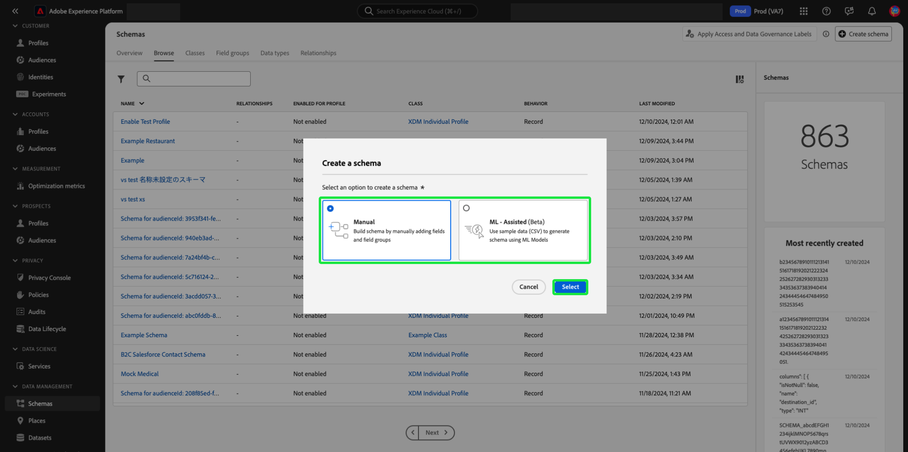
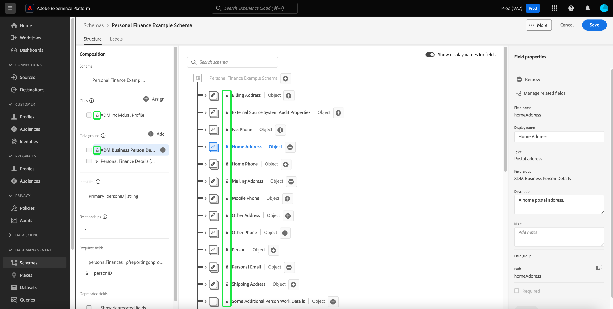

# Creación y edición de esquemas en la IU {#create-edit-schemas-in-ui}

Esta guía proporciona información general sobre cómo crear, editar y administrar esquemas del Modelo de datos de experiencia (XDM) para su organización en la interfaz de usuario de Adobe Experience Platform.

>[!IMPORTANT]
>
>Los esquemas XDM son extremadamente personalizables y, por lo tanto, los pasos necesarios para crear un esquema pueden variar según el tipo de datos que desee que capture el esquema. Como resultado, este documento solo cubre las interacciones básicas que se pueden realizar con los esquemas en la interfaz de usuario y excluye los pasos relacionados, como la personalización de clases, los grupos de campos de esquema, los tipos de datos y los campos.
>
>Para ver un recorrido completo del proceso de creación de esquemas, siga el [tutorial de creación de esquemas](../../tutorials/create-schema-ui.md) para crear un esquema de ejemplo completo y familiarizarse con las numerosas funcionalidades de [!DNL Schema Editor].

## Requisitos previos {#prerequisites}

Esta guía requiere una comprensión práctica del sistema XDM. Consulte la [descripción general de XDM](../../home.md) para ver una introducción al papel de XDM en el ecosistema de Experience Platform y los [conceptos básicos de la composición de esquemas](../../schema/composition.md) para ver una descripción general de cómo se construyen los esquemas.

## Creación de un nuevo esquema {#create}

>[!NOTE]
>
>Esta sección explica cómo crear manualmente un nuevo esquema en la interfaz de usuario. Si está introduciendo datos CSV en Platform, puede utilizar algoritmos de aprendizaje automático (ML) para **generar un esquema a partir de datos CSV de ejemplo**. Este flujo de trabajo coincide con el formato de datos y crea automáticamente un nuevo esquema basado en la estructura y el contenido del archivo CSV. Consulte la [guía de creación de esquemas asistidos por ML](../ml-assisted-schema-creation.md) para obtener más información sobre este flujo de trabajo.

En el área de trabajo [!UICONTROL Esquemas], seleccione **[!UICONTROL Crear esquema]** en la esquina superior derecha.

![Se ha resaltado el espacio de trabajo de esquemas con [!UICONTROL Crear esquema].](../../images/ui/resources/schemas/create-schema.png)

Aparecerá el cuadro de diálogo [!UICONTROL Crear un esquema]. En este cuadro de diálogo, puede elegir crear manualmente un esquema añadiendo campos y grupos de campos, o puede cargar un archivo CSV y utilizar algoritmos XML para generar un esquema. Seleccione un flujo de trabajo de creación de esquemas en el cuadro de diálogo.

### [!BADGE Beta]{type=Informative} Creación de esquemas asistida por ML o manual {#manual-or-assisted}

Para obtener información sobre cómo utilizar un algoritmo XML para recomendar una estructura de esquema basada en un archivo csv, consulte la [guía de creación de esquemas asistida por aprendizaje automático](../ml-assisted-schema-creation.md). Esta guía de la interfaz de usuario se centra en el flujo de trabajo de creación manual.

### Creación manual de esquemas {#manual-creation}

Aparece el flujo de trabajo [!UICONTROL Crear esquema]. Puede elegir una clase base para el esquema seleccionando **[!UICONTROL Perfil individual]**, **[!UICONTROL Evento de experiencia]** o **[!UICONTROL Otro]**, seguido de **[!UICONTROL Siguiente]** para confirmar su elección. Consulte la documentación de [[!UICONTROL XDM individual profile]](../../classes/individual-profile.md) y [[!UICONTROL XDM ExperienceEvent]](../../classes/experienceevent.md) para obtener más información sobre estas clases.

![Flujo de trabajo [!UICONTROL Crear esquema] con las tres opciones de clase y [!UICONTROL Siguiente] resaltado.](../../images/ui/resources/schemas/schema-class-options.png)

Al elegir **[!UICONTROL Otros]**, aparece una lista de clases disponibles. Desde aquí puede examinar y filtrar clases preexistentes.

![El flujo de trabajo [!UICONTROL Crear esquema] con [!UICONTROL Otros] resaltado en la sección [!UICONTROL Detalles del esquema].](../../images/ui/resources/schemas/other-schema-details.png)

Seleccione un botón de opción para filtrar las clases en función de si son clases personalizadas o estándar. También puede filtrar los resultados disponibles según su sector o buscar una clase específica utilizando el campo de búsqueda.

![Se ha resaltado el flujo de trabajo [!UICONTROL Crear esquema] con la barra de búsqueda, [!UICONTROL Personalizado] y [!UICONTROL Industrias].](../../images/ui/resources/schemas/filter-and-search.png)

Para ayudarle a decidir la clase adecuada, hay iconos de información y vista previa para cada clase. El icono de información () abre un cuadro de diálogo que proporciona una descripción de la clase y del sector al que está asociada.

El icono de vista previa () abre un cuadro de diálogo de vista previa para la clase que contiene un diagrama de esquema y sus propiedades.

Seleccione cualquier fila para elegir una clase y, a continuación, seleccione **[!UICONTROL Siguiente]** para confirmar su elección.

![El flujo de trabajo [!UICONTROL Crear esquema] con una clase seleccionada de la tabla de clases disponibles y [!UICONTROL Siguiente] resaltado.](../../images/ui/resources/schemas/select-class.png)

Después de seleccionar una clase, aparece la sección [!UICONTROL Nombre y revisión]. En esta sección, proporcione un nombre y una descripción para identificar el esquema. palo de golfLa estructura base del esquema (proporcionada por la clase ) se muestra en el lienzo para que revise y compruebe la clase y la estructura de esquema seleccionadas.

Escriba un [!UICONTROL nombre para mostrar del esquema] descriptivo en el campo de texto. A continuación, introduzca una descripción adecuada para ayudar a identificar el esquema. Cuando haya revisado la estructura de esquema y esté satisfecho con la configuración, seleccione **[!UICONTROL Finalizar]** para crear el esquema.

![Se ha resaltado la sección [!UICONTROL Nombre y revisión] del flujo de trabajo [!UICONTROL Crear esquema] con [!UICONTROL Nombre para mostrar esquema], [!UICONTROL Descripción] y [!UICONTROL Finalizar].](../../images/ui/resources/schemas/name-and-review.png)

Aparecerá el Editor de esquemas con la estructura del esquema mostrada en el lienzo. Si lo desea, ahora puede iniciar [agregando campos a la clase](../../ui/resources/classes.md#add-fields).

## Editar un esquema existente {#edit}

>[!NOTE]
>
Una vez guardado un esquema y utilizado en la ingesta de datos, solo se pueden realizar cambios adicionales. Consulte las [reglas de evolución de esquema](../../schema/composition.md#evolution) para obtener más información.

Para editar un esquema existente, seleccione la ficha **[!UICONTROL Examinar]** y, a continuación, seleccione el nombre del esquema que desee editar. También puede utilizar la barra de búsqueda para reducir la lista de opciones disponibles.

>[!TIP]
>
Puede utilizar las funcionalidades de búsqueda y filtrado del espacio de trabajo para encontrar el esquema más fácilmente. Consulte la guía [Exploración de recursos XDM](../explore.md) para obtener más información.

Una vez seleccionado un esquema, [!DNL Schema Editor] aparece con la estructura del esquema mostrada en el lienzo. Ahora puede [agregar grupos de campos](#add-field-groups) al esquema (o [agregar campos individuales](#add-individual-fields) de esos grupos), [editar nombres para mostrar de campos](#display-names) o [editar grupos de campos personalizados existentes](./field-groups.md#edit) si el esquema emplea alguno.

## Más acciones {#more}

En el Editor de esquemas también puede realizar acciones rápidas para copiar la estructura JSON del esquema o eliminar el esquema si no se ha habilitado para el perfil del cliente en tiempo real o tiene conjuntos de datos asociados. Seleccione [!UICONTROL Más] en la parte superior de la vista para mostrar una lista desplegable con acciones rápidas.

La funcionalidad Copiar estructura JSON le permite ver el aspecto que tendría una carga útil de ejemplo mientras sigue creando el esquema y las canalizaciones de datos. Resulta especialmente útil en situaciones en las que hay estructuras de mapa de objetos complejas en el esquema, como un mapa de identidad.

## Alternar nombre para mostrar {#display-name-toggle}

Para su comodidad, el Editor de esquemas proporciona un conmutador para cambiar entre los nombres de campo originales y los nombres para mostrar más legibles en lenguaje natural. Esta flexibilidad permite mejorar la capacidad de detección de campos y la edición de los esquemas. La opción se encuentra en la parte superior derecha de la vista Editor de esquemas.

>[!NOTE]
>
El cambio de nombres de campo a nombres para mostrar es puramente cosmético y no cambia ningún recurso descendente.

![Editor de esquemas con [!UICONTROL Mostrar nombres para mostrar para los campos] resaltados.](../../images/ui/resources/schemas/display-name-toggle.png)

Los nombres para mostrar de los grupos de campos estándar se generan en el sistema, pero se pueden personalizar, tal como se describe en la sección [nombres para mostrar](#display-names). Los nombres para mostrar se reflejan en varias vistas de interfaz de usuario, incluidas las vistas previas de asignaciones y conjuntos de datos. La configuración predeterminada está desactivada y muestra los nombres de campo según sus valores originales.

## Adición de grupos de campos a un esquema {#add-field-groups}

>[!NOTE]
>
Esta sección explica cómo añadir grupos de campos existentes a un esquema. Si desea crear un nuevo grupo de campos personalizados, consulte la guía sobre [creación y edición de grupos de campos](./field-groups.md#create) en su lugar.

Una vez que haya abierto un esquema dentro de [!DNL Schema Editor], puede agregar campos al esquema mediante el uso de grupos de campos. Para empezar, seleccione **[!UICONTROL Agregar]** junto a **[!UICONTROL Grupos de campos]** en el carril izquierdo.

![Se ha resaltado el editor de esquemas con el [!UICONTROL Agregar] de la sección [!UICONTROL Grupos de campos].](../../images/ui/resources/schemas/add-field-group-button.png)

Aparece un cuadro de diálogo que muestra una lista de grupos de campos que puede seleccionar para el esquema. Dado que los grupos de campos solo son compatibles con una clase, solo se enumerarán los grupos de campos asociados con la clase seleccionada del esquema. De forma predeterminada, los grupos de campos enumerados se ordenan según su popularidad de uso dentro de la organización.

![El cuadro de diálogo [!UICONTROL Agregar grupos de campos] resaltado con la columna [!UICONTROL Popularidad] resaltada.](../../images/ui/resources/schemas/field-group-popularity.png)

Si conoce la actividad general o el área empresarial de los campos que desea agregar, seleccione una o más de las categorías verticales del sector en el carril izquierdo para filtrar la lista mostrada de grupos de campos.

![El cuadro de diálogo [!UICONTROL Agregar grupos de campos] resaltado con los filtros [!UICONTROL Sector] y la columna [!UICONTROL Sector] resaltada.](../../images/ui/resources/schemas/industry-filter.png)

>[!NOTE]
>
Para obtener más información sobre las prácticas recomendadas para el modelado de datos específicos del sector en XDM, consulte la documentación sobre [modelos de datos del sector](../../schema/industries/overview.md).

También puede utilizar la barra de búsqueda para localizar el grupo de campos deseado. Los grupos de campos cuyo nombre coincida con la consulta aparecen en la parte superior de la lista. En **[!UICONTROL Campos estándar]**, se muestran los grupos de campos que contienen campos que describen atributos de datos deseados.

![Se ha resaltado el cuadro de diálogo [!UICONTROL Agregar grupos de campos] con la función de búsqueda [!UICONTROL Campos estándar].](../../images/ui/resources/schemas/field-group-search.png)

Seleccione la casilla de verificación situada junto al nombre del grupo de campos que desea agregar al esquema. Puede seleccionar varios grupos de campos en la lista, y cada grupo de campos seleccionado aparecerá en el carril derecho.

![Cuadro de diálogo [!UICONTROL Agregar grupos de campos] con la característica de selección de casilla de verificación resaltada.](../../images/ui/resources/schemas/add-field-group.png)

>[!TIP]
>
Para cualquier grupo de campos enumerado, puede situarse sobre el icono de información () o centrarse en él para ver una breve descripción del tipo de datos que captura el grupo de campos. También puede seleccionar el icono de vista previa () para ver la estructura de los campos que proporciona el grupo de campos antes de decidir agregarlo al esquema.

Una vez que haya elegido los grupos de campos, seleccione **[!UICONTROL Agregar grupos de campos]** para agregarlos al esquema.

![Se ha resaltado el cuadro de diálogo [!UICONTROL Agregar grupos de campos] con los grupos de campos seleccionados y [!UICONTROL Agregar grupos de campos].](../../images/ui/resources/schemas/add-field-group-finish.png)

[!DNL Schema Editor] vuelve a aparecer con los campos proporcionados por grupos de campos representados en el lienzo.

![Se muestra el [!DNL Schema Editor] con un esquema de ejemplo.](../../images/ui/resources/schemas/field-groups-added.png)

>[!NOTE]
>
En el Editor de esquemas, las clases y los grupos de campos estándar (generados por el Adobe) se indican con el icono de candado (. El candado aparece en el carril izquierdo junto al nombre de la clase o del grupo de campos, así como junto a cualquier campo del diagrama de esquema que forme parte de un recurso generado por el sistema.
>

Después de agregar un grupo de campos a un esquema, puede [quitar campos existentes](#remove-fields) o [agregar nuevos campos personalizados](#add-fields) a esos grupos, según sus necesidades.

### Quitar campos agregados de grupos de campos {#remove-fields}

Después de agregar un grupo de campos a un esquema, puede quitar los campos que no necesite.

>[!NOTE]
>
La eliminación de campos de un grupo de campos solo afecta al esquema en el que se está trabajando y no afecta al propio grupo de campos. Si elimina los campos de un esquema, esos campos seguirán estando disponibles en todos los demás esquemas que empleen el mismo grupo de campos.

En el ejemplo siguiente, se ha agregado el grupo de campos estándar **[!UICONTROL Detalles demográficos]** a un esquema. Para quitar un solo campo como `taxId`, selecciónelo en el lienzo y, a continuación, seleccione **[!UICONTROL Quitar]** en el carril derecho.

![Se resaltó el [!DNL Schema Editor] con [!UICONTROL Quitar]. Esta acción quita un solo campo.](../../images/ui/resources/schemas/remove-single-field.png)

Si desea eliminar varios campos, puede administrar el grupo de campos en su conjunto. Seleccione un campo que pertenezca al grupo en el lienzo y, a continuación, seleccione **[!UICONTROL Administrar campos relacionados]** en el carril derecho.

![Se resaltó el(la) [!DNL Schema Editor] con [!UICONTROL Administrar campos relacionados].](../../images/ui/resources/schemas/manage-related-fields.png)

Aparecerá un cuadro de diálogo que muestra la estructura del grupo de campos en cuestión. Desde aquí puede utilizar las casillas de verificación proporcionadas para seleccionar o anular la selección de los campos necesarios. Cuando esté satisfecho, seleccione **[!UICONTROL Confirmar]**.

![Se ha resaltado el cuadro de diálogo [!UICONTROL Administrar campos relacionados] con los campos seleccionados y [!UICONTROL Confirmar].](../../images/ui/resources/schemas/select-fields.png)

El lienzo vuelve a aparecer con solo los campos seleccionados presentes en la estructura del esquema.

### Agregar campos personalizados a grupos de campos {#add-fields}

Después de agregar un grupo de campos a un esquema, puede definir campos adicionales para ese grupo. Sin embargo, cualquier campo agregado a un grupo de campos en un esquema también aparecerá en todos los demás esquemas que empleen el mismo grupo de campos.

Además, si se agrega un campo personalizado a un grupo de campos estándar, ese grupo de campos se convertirá en un grupo de campos personalizados y el grupo de campos estándar original dejará de estar disponible.

Si desea agregar un campo personalizado a un grupo de campos estándar, consulte la [sección debajo de](#custom-fields-for-standard-groups) para obtener instrucciones específicas. Si está agregando campos a un grupo de campos personalizados, consulte la sección sobre [edición de grupos de campos personalizados](./field-groups.md) en la guía de IU de grupos de campos.

Si no desea modificar ningún grupo de campos existente, puede [crear un nuevo grupo de campos personalizados](./field-groups.md#create) para definir campos adicionales en su lugar.

## Añadir campos individuales a un esquema {#add-individual-fields}

El Editor de esquemas permite agregar campos individuales directamente a un esquema si desea evitar agregar un grupo de campos completo para un caso de uso específico. Puede [agregar campos individuales de grupos de campos estándar](#add-standard-fields) o [agregar sus propios campos personalizados](#add-custom-fields) en su lugar.

>[!IMPORTANT]
>
Aunque el Editor de esquemas permite funcionalmente agregar campos individuales directamente a un esquema, esto no cambia el hecho de que todos los campos de un esquema XDM deben proporcionarlos su clase o un grupo de campos compatible con esa clase. Como se explica en las secciones siguientes, todos los campos individuales siguen asociados a una clase o grupo de campos como paso clave cuando se añaden a un esquema.

### Añadir campos estándar {#add-standard-fields}

Puede añadir campos de grupos de campos estándar directamente a un esquema sin necesidad de conocer previamente su grupo de campos correspondiente. Para agregar un campo estándar a un esquema, seleccione el icono más (**+**) junto al nombre del esquema en el lienzo. Aparece un marcador de posición **[!UICONTROL Campo sin título]** en la estructura de esquema y el carril derecho se actualiza para mostrar los controles y configurar el campo.

En **[!UICONTROL Nombre de campo]**, empiece a escribir el nombre del campo que desea agregar. El sistema busca automáticamente los campos estándar que coinciden con la consulta y los enumera en **[!UICONTROL Campos estándar recomendados]**, incluidos los grupos de campos a los que pertenecen.

Aunque algunos campos estándar comparten el mismo nombre, su estructura puede variar según el grupo de campos del que procedan. Si un campo estándar está anidado en un objeto principal en la estructura de grupo de campos, el campo principal también se incluye en el esquema si se agrega el campo secundario.

Seleccione el icono de vista previa () junto a un campo estándar para ver la estructura de su grupo de campos y comprender mejor cómo se puede anidar. Para agregar el campo estándar al esquema, seleccione el icono más ().

El lienzo se actualiza para mostrar el campo estándar agregado al esquema, incluidos los campos principales en los que está anidado dentro de la estructura de grupo de campos. El nombre del grupo de campos también se enumera en **[!UICONTROL Grupos de campos]** en el carril izquierdo. Si desea agregar más campos del mismo grupo de campos, seleccione **[!UICONTROL Administrar campos relacionados]** en el carril derecho.

### Añadir campos personalizados {#add-custom-fields}

Al igual que el flujo de trabajo para los campos estándar, también puede agregar sus propios campos personalizados directamente a un esquema.

Para agregar campos al nivel raíz de un esquema, seleccione el icono de signo más (**+**) junto al nombre del esquema en el lienzo. Aparece un marcador de posición **[!UICONTROL Campo sin título]** en la estructura de esquema y el carril derecho se actualiza para mostrar los controles y configurar el campo.

Empiece a escribir el nombre del campo que desea añadir y el sistema comenzará automáticamente a buscar los campos estándar coincidentes. Para crear un nuevo campo personalizado, seleccione la opción superior anexada con **([!UICONTROL Nuevo campo])**.

Después de proporcionar un nombre para mostrar y un tipo de datos for En el campo, el siguiente paso es asignar el campo a un recurso XDM principal. Si el esquema usa una clase personalizada, puede elegir [agregar el campo a la clase asignada](#add-to-class) o a un [grupo de campos](#add-to-field-group) en su lugar. Sin embargo, si el esquema utiliza una clase estándar, solo puede asignar el campo personalizado a un grupo de campos.

#### Asignar el campo a un grupo de campos personalizados {#add-to-field-group}

>[!NOTE]
>
Esta sección solo explica cómo asignar el campo a un grupo de campos personalizados. Si desea ampliar un grupo de campos estándar con el nuevo campo personalizado, consulte la sección sobre [agregar campos personalizados a grupos de campos estándar](#custom-fields-for-standard-groups).

En **[!UICONTROL Asignar a]**, seleccione **[!UICONTROL Grupo de campos]**. Si el esquema utiliza una clase estándar, esta es la única opción disponible y está seleccionada de forma predeterminada.

A continuación, debe seleccionar un grupo de campos al que asociarse el nuevo campo. Empiece a escribir el nombre del grupo de campos en la entrada de texto proporcionada. Si tiene algún grupo de campos personalizados existente que coincida con la entrada, aparecerán en la lista desplegable. Como alternativa, puede escribir a nombre único para crear un nuevo grupo de campos en su lugar.

>[!WARNING]
>
Si selecciona un grupo de campos personalizados existente, cualquier otro esquema que emplee ese grupo de campos también heredará el campo recién agregado después de guardar los cambios. Por este motivo, seleccione solo un grupo de campos existente si desea este tipo of propagación. De lo contrario, debe optar por crear un nuevo grupo de campos personalizados.

Después de seleccionar el grupo de campos de la lista, seleccione **[!UICONTROL Aplicar]**.

El nuevo campo se agrega al lienzo y tiene un espacio de nombres bajo su [ID de inquilino](../../api/getting-started.md#know-your-tenant_id) para evitar conflictos con los campos XDM estándar. El grupo de campos con el que asoció el nuevo campo también aparece en **[!UICONTROL Grupos de campos]** en el carril izquierdo.

>[!NOTE]
>
El resto de los campos proporcionados por el grupo de campos personalizados seleccionado se eliminan del esquema de forma predeterminada. Si desea agregar algunos de estos campos al esquema, seleccione un campo que pertenezca al grupo y, a continuación, seleccione **[!UICONTROL Administrar campos relacionados]** en el carril derecho.

#### Asignar el campo a una clase personalizada {#add-to-class}

En **[!UICONTROL Asignar a]**, seleccione **[!UICONTROL Clase]**. El campo de entrada siguiente se reemplaza con el nombre de la clase personalizada del esquema actual, lo que indica que el nuevo campo se asignará a esta clase.

![Se está seleccionando la opción [!UICONTROL Clase] para la nueva asignación de campo.](../../images/ui/resources/schemas/assign-field-to-class.png)

Continúe configurando el campo como desee y seleccione **[!UICONTROL Aplicar]** cuando termine.

![[!UICONTROL Aplicar] seleccionado para el nuevo campo.](../../images/ui/resources/schemas/assign-field-to-class-apply.png)

El nuevo campo se agrega al lienzo y tiene un espacio de nombres bajo su [ID de inquilino](../../api/getting-started.md#know-your-tenant_id) para evitar conflictos con los campos XDM estándar. Al seleccionar el nombre de clase en el carril izquierdo, se muestra el nuevo campo como parte de la estructura de la clase.

### Agregar campos personalizados a la estructura de grupos de campos estándar {#custom-fields-for-standard-groups}

Si el esquema en el que está trabajando tiene un tipo de objeto field proporcionado por un grupo de campos estándar, puede agregar sus propios campos personalizados a ese objeto estándar.

>[!WARNING]
>
Todos los campos agregados a un grupo de campos en un esquema también aparecerán en todos los demás esquemas que empleen el mismo grupo de campos. Además, si se agrega un campo personalizado a un grupo de campos estándar, ese grupo de campos se convertirá en un grupo de campos personalizados y el grupo de campos estándar original dejará de estar disponible.
>
Si ha participado en la versión beta de esta función, recibirá un cuadro de diálogo que le informará de los grupos de campos estándar que ha personalizado anteriormente. Una vez que seleccione **[!UICONTROL Reconocer]**, los recursos enumerados se convierten en grupos de campos personalizados.
>

Para empezar, seleccione el icono más (**+**) junto a la raíz del objeto proporcionado por el grupo de campos estándar.

Aparece un mensaje de advertencia que le solicita que confirme si desea convertir el grupo de campos estándar. Seleccione **[!UICONTROL Continuar creando grupo de campos]** para continuar.

El lienzo vuelve a aparecer con un marcador de posición sin título para el nuevo campo. Tenga en cuenta que el nombre del grupo de campos estándar se ha anexado con &quot;([!UICONTROL Extended])&quot; para indicar que se ha modificado desde la versión original. Desde aquí, utilice los controles del carril derecho para definir las propiedades del campo.

Después de aplicar los cambios, el nuevo campo aparece en el área de nombres de ID de inquilino dentro del objeto estándar. Este área de nombres anidada evita conflictos de nombre de campo dentro del propio grupo de campos para evitar cambios importantes en otros esquemas que utilizan el mismo grupo de campos.

## Habilitación de un esquema para el perfil del cliente en tiempo real {#profile}

[!CONTEXTUALHELP]
id="platform_schemas_enableforprofile"
title="Habilitar un esquema para perfil"
abstract="Cuando se habilita un esquema para el perfil, cualquier conjunto de datos creado a partir de este esquema participa en el perfil del cliente en tiempo real, que combina datos de fuentes diferentes para construir una vista completa de cada cliente. Una vez que se utiliza un esquema para ingerir datos en el perfil, no se puede deshabilitar. Consulte la documentación para obtener más información."

[Perfil del cliente en tiempo real](../../../profile/home.md) combina datos de diferentes fuentes para crear una vista completa de cada cliente individual. Si desea que los datos capturados por un esquema participen en este proceso, debe habilitar el esquema para su uso en [!DNL Profile].

>[!IMPORTANT]
>
Para habilitar un esquema para [!DNL Profile], debe tener definido un campo de identidad principal. Consulte la guía de [definición de campos de identidad](../fields/identity.md) para obtener más información.

Para habilitar el esquema, comience seleccionando el nombre del esquema en el carril izquierdo y, a continuación, seleccione la opción **[!UICONTROL Perfil]** en el carril derecho.

Aparece una ventana emergente que le advierte de que, una vez activado y guardado un esquema, no se puede desactivar. Seleccione **[!UICONTROL Habilitar]** para continuar.

El lienzo vuelve a aparecer con la opción [!UICONTROL Perfil] habilitada.

>[!IMPORTANT]
>
Dado que el esquema aún no se ha guardado, este no es el punto de retorno si cambia de opinión sobre dejar que el esquema participe en el Perfil del cliente en tiempo real: una vez guardado un esquema activado, ya no se puede desactivar. Vuelva a seleccionar el conmutador **[!UICONTROL Perfil]** para deshabilitar el esquema.

Para finalizar el proceso, seleccione **[!UICONTROL Guardar]** para guardar el esquema.

El esquema ahora está habilitado para su uso en el Perfil del cliente en tiempo real. Cuando Platform ingiere datos en conjuntos de datos basados en este esquema, esos datos se incorporarán a los datos del perfil amalgamados.

## Editar nombres para mostrar para campos de esquema {#display-names}

Una vez que haya asignado una clase y agregado grupos de campos a un esquema, puede editar los nombres para mostrar de cualquiera de los campos del esquema, independientemente de si esos campos los han proporcionado recursos XDM estándar o personalizados.

>[!NOTE]
>
Tenga en cuenta que los nombres para mostrar de los campos que pertenecen a clases o grupos de campos estándar solo se pueden editar en el contexto de un esquema específico. En otras palabras, cambiar el nombre para mostrar de un campo estándar en un esquema no afecta a otros esquemas que emplean la misma clase o grupo de campos asociado.
>
Una vez que realice cambios en los nombres para mostrar de los campos de un esquema, esos cambios se reflejarán inmediatamente en cualquier conjunto de datos existente basado en ese esquema.

Cambie los nombres de campo a los nombres para mostrar activando **[!UICONTROL Mostrar nombres para mostrar para los campos]**. Para editar el nombre para mostrar de un campo de esquema, seleccione el campo en el lienzo. En el carril derecho, proporcione el nuevo nombre en **[!UICONTROL Nombre para mostrar]**.

Seleccione **[!UICONTROL Aplicar]** en el carril derecho y el lienzo se actualizará para mostrar el nuevo nombre para mostrar del campo. Seleccione **[!UICONTROL Guardar]** para aplicar los cambios al esquema.

## Cambiar la clase de un esquema {#change-class}

Puede cambiar la clase de un esquema en cualquier momento durante el proceso inicial de maquetación antes de guardar el esquema.

>[!WARNING]
>
La reasignación de la clase para un esquema debe realizarse con extrema precaución. Los grupos de campos solo son compatibles con determinadas clases y, por lo tanto, al cambiar la clase se restablecerán el lienzo y los campos que haya agregado.

Para reasignar una clase, seleccione **[!UICONTROL Assign]** en el lado izquierdo del lienzo.

Aparece un cuadro de diálogo que muestra una lista de todas las clases disponibles, incluidas las definidas por su organización (el propietario es &quot;[!UICONTROL Customer]&quot;), así como las clases estándar definidas por el Adobe.

Seleccione una clase de la lista para mostrar su descripción en el lado derecho del cuadro de diálogo. También puede seleccionar **[!UICONTROL Previsualizar estructura de clase]** para ver los campos y metadatos asociados con la clase. Seleccione **[!UICONTROL Asignar clase]** para continuar.

Se abre un nuevo cuadro de diálogo en el que se le pide que confirme que desea asignar una nueva clase. Seleccione **[!UICONTROL Asignar]** para confirmar.

Después de confirmar el cambio de clase, el lienzo se restablecerá y se perderá todo el progreso de la composición.

## Pasos siguientes {#next-steps}

Este documento abarcaba los conceptos básicos de la creación y edición de esquemas en la IU de Platform. Se recomienda revisar el [tutorial de creación de esquemas](../../tutorials/create-schema-ui.md) para obtener un flujo de trabajo completo que permita crear un esquema completo en la interfaz de usuario, incluida la creación de grupos de campos personalizados y tipos de datos for casos de uso únicos.

Para obtener más información sobre las capacidades del área de trabajo [!UICONTROL Esquemas], consulte la descripción general del área de trabajo [[!UICONTROL Esquemas]](../overview.md).

Para aprender a administrar esquemas en la API [!DNL Schema Registry], consulte la [guía de extremo de esquemas](../../api/schemas.md).
