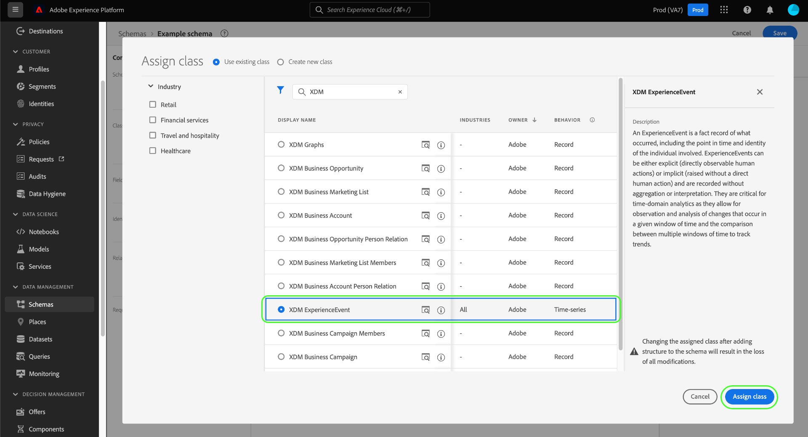

# Crear y editar esquemas en la interfaz de usuario

Esta guía proporciona información general sobre cómo crear, editar y administrar esquemas del Modelo de datos de experiencia (XDM) para su organización en la interfaz de usuario de Adobe Experience Platform.

>[!IMPORTANT]
>
>Los esquemas XDM son extremadamente personalizables y, por lo tanto, los pasos involucrados en la creación de un esquema pueden variar según el tipo de datos que desee capturar. Como resultado, este documento solo cubre las interacciones básicas que puede realizar con los esquemas en la interfaz de usuario y excluye los pasos relacionados como la personalización de clases, grupos de campos de esquema, tipos de datos y campos.
>
>Para obtener un recorrido completo por el proceso de creación de esquemas, siga junto con la [tutorial de creación de esquemas](../../tutorials/create-schema-ui.md) para crear un esquema de ejemplo completo y familiarizarse con las muchas capacidades de la variable [!DNL Schema Editor].

## Requisitos previos

Esta guía requiere una comprensión práctica del sistema XDM. Consulte la [Información general de XDM](../../home.md) para una introducción al papel de XDM dentro del ecosistema del Experience Platform, y [conceptos básicos de la composición del esquema](../../schema/composition.md) para obtener una descripción general de cómo se construyen los esquemas.

## Crear un nuevo esquema {#create}

En el [!UICONTROL Esquemas] espacio de trabajo, seleccione **[!UICONTROL Crear esquema]** en la esquina superior derecha. En el menú desplegable que aparece, puede elegir entre **[!UICONTROL Perfil individual XDM]** y **[!UICONTROL XDM ExperienceEvent]** como clase base para el esquema. También puede seleccionar **[!UICONTROL Examinar]** para seleccionar entre la lista completa de clases disponibles, o [crear una nueva clase personalizada](./classes.md#create) en su lugar.

Una vez seleccionada una clase, la variable [!DNL Schema Editor] y la estructura base del esquema (proporcionada por la clase ) se muestra en el lienzo. Desde aquí, puede utilizar el carril derecho para agregar un **[!UICONTROL Nombre para mostrar]** y **[!UICONTROL Descripción]** para el esquema .

Ahora puede empezar a crear la estructura del esquema mediante [adición de grupos de campos de esquema](#add-field-groups).

## Edición de un esquema existente {#edit}

>[!NOTE]
>
>Una vez guardado y utilizado un esquema en la ingesta de datos, solo se pueden realizar cambios aditivos en él. Consulte la [reglas de evolución de esquema](../../schema/composition.md#evolution) para obtener más información.

Para editar un esquema existente, seleccione la opción **[!UICONTROL Examinar]** y, a continuación, seleccione el nombre del esquema que desea editar.

>[!TIP]
>
>Puede utilizar las capacidades de búsqueda y filtrado del espacio de trabajo para ayudar a encontrar el esquema más fácil. Consulte la guía de [exploración de recursos XDM](../explore.md) para obtener más información.

Una vez que seleccione un esquema, la variable [!DNL Schema Editor] aparece con la estructura del esquema en el lienzo. Ahora puede [agregar grupos de campos](#add-field-groups) al esquema (o [añadir campos individuales](#add-individual-fields) de esos grupos), [editar nombres para mostrar de campos](#display-names)o [editar grupos de campos personalizados existentes](./field-groups.md#edit) si el esquema emplea alguno.

## Añadir grupos de campos a un esquema {#add-field-groups}

>[!NOTE]
>
>Esta sección explica cómo agregar grupos de campos existentes a un esquema. Si desea crear un nuevo grupo de campos personalizados, consulte la guía de [creación y edición de grupos de campos](./field-groups.md#create) en su lugar.

Una vez que haya abierto un esquema dentro de la variable [!DNL Schema Editor], puede añadir campos al esquema mediante el uso de grupos de campos. Para empezar, seleccione **[!UICONTROL Agregar]** junto a **[!UICONTROL Grupos de campo]** en el carril izquierdo.

Aparece un cuadro de diálogo que muestra una lista de los grupos de campos que puede seleccionar para el esquema. Dado que los grupos de campos solo son compatibles con una clase, solo se enumerarán los grupos de campos asociados con la clase seleccionada del esquema. De forma predeterminada, los grupos de campos enumerados se ordenan según su popularidad de uso dentro de su organización.

Si conoce la actividad general o el área comercial de los campos que desea añadir, seleccione una o varias categorías del sector en el carril izquierdo para filtrar la lista mostrada de grupos de campos.

>[!NOTE]
>
>Para obtener más información sobre las prácticas recomendadas para el modelado de datos específico del sector en XDM, consulte la documentación sobre [modelos de datos del sector](../../schema/industries/overview.md).

También puede utilizar la barra de búsqueda para localizar el grupo de campos deseado. Los grupos de campos cuyo nombre coincida con la consulta aparecen en la parte superior de la lista. En **[!UICONTROL Campos estándar]**, se muestran los grupos de campos que contienen campos que describen atributos de datos deseados.

Active la casilla situada junto al nombre del grupo de campos que desea agregar al esquema. Puede seleccionar varios grupos de campos en la lista, y cada grupo de campos seleccionado aparecerá en el carril derecho.

>[!TIP]
>
>Para cualquier grupo de campos enumerado, puede mantener el puntero sobre él o centrarse en el icono de información () para ver una breve descripción del tipo de datos que captura el grupo de campos. También puede seleccionar el icono de vista previa () para ver la estructura de los campos que proporciona el grupo de campos antes de decidir agregarla al esquema.

Una vez que haya elegido los grupos de campos, seleccione **[!UICONTROL Agregar grupos de campos]** para agregarlas al esquema.

La variable [!DNL Schema Editor] vuelve a aparecer con los campos proporcionados por el grupo de campos representados en el lienzo.

Después de agregar un grupo de campos a un esquema, se puede [quitar campos existentes](#remove-fields) o [agregar nuevos campos personalizados](#add-fields) a esos grupos, según sus necesidades.

### Eliminación de campos agregados de grupos de campos {#remove-fields}

Después de agregar un grupo de campos a un esquema, puede quitar los campos que no necesite.

>[!NOTE]
>
>La eliminación de campos de un grupo de campos solo afecta al esquema en el que se está trabajando y no afecta al propio grupo de campos. Si elimina los campos de un esquema, dichos campos seguirán estando disponibles en todos los demás esquemas que empleen el mismo grupo de campos.

En el ejemplo siguiente, el grupo de campos estándar **[!UICONTROL Detalles demográficos]** se ha agregado a un esquema. Quitar un único campo como `taxId`, seleccione el campo en el lienzo y, a continuación, seleccione **[!UICONTROL Eliminar]** en el carril derecho.

Si desea quitar varios campos, puede administrar el grupo de campos como un todo. Seleccione un campo que pertenezca al grupo en el lienzo y, a continuación, seleccione **[!UICONTROL Administrar campos relacionados]** en el carril derecho.

Aparece un cuadro de diálogo que muestra la estructura del grupo de campos en cuestión. Desde aquí puede utilizar las casillas de verificación proporcionadas para seleccionar o anular la selección de los campos que necesite. Cuando esté satisfecho, seleccione **[!UICONTROL Confirmar]**.

El lienzo vuelve a aparecer con solo los campos seleccionados presentes en la estructura del esquema.

### Añadir campos personalizados a grupos de campos {#add-fields}

Después de agregar un grupo de campos a un esquema, puede definir campos adicionales para ese grupo. Sin embargo, cualquier campo añadido a un grupo de campos en un esquema también aparecerá en todos los demás esquemas que empleen ese mismo grupo de campos.

Además, si se agrega un campo personalizado a un grupo de campos estándar, ese grupo de campos se convierte en un grupo de campos personalizado y el grupo de campos estándar original ya no estará disponible.

Si desea agregar un campo personalizado a un grupo de campos estándar, consulte la [sección inferior](#custom-fields-for-standard-groups) para instrucciones específicas. Si va a añadir campos a un grupo de campos personalizado, consulte la sección de [editar grupos de campos personalizados](./field-groups.md) en la guía de interfaz de usuario de grupos de campos.

Si no desea modificar ningún grupo de campos existente, puede [crear un nuevo grupo de campos personalizados](./field-groups.md#create) para definir campos adicionales en su lugar.

## Añadir campos individuales a un esquema {#add-individual-fields}

El Editor de esquemas le permite añadir campos individuales directamente a un esquema si desea evitar agregar un grupo de campos completo para un caso de uso específico. Puede [añadir campos individuales de grupos de campos estándar](#add-standard-fields) o [añadir sus propios campos personalizados](#add-custom-fields) en su lugar.

>[!IMPORTANT]
>
>Aunque funcionalmente el Editor de esquemas permite añadir campos individuales directamente a un esquema, esto no cambia el hecho de que todos los campos de un esquema XDM deben proporcionarlos su clase o un grupo de campos compatible con esa clase. Como se explica en las secciones siguientes, todos los campos individuales siguen asociados a un grupo de campos como paso clave cuando se añaden a un esquema.

### Añadir campos estándar {#add-standard-fields}

Puede agregar campos de grupos de campos estándar directamente a un esquema sin necesidad de conocer previamente su grupo de campos correspondiente. Para añadir un campo estándar a un esquema, seleccione el signo más (**+**) junto al nombre del esquema en el lienzo. Un **[!UICONTROL Campo sin título]** el marcador de posición aparece en la estructura del esquema y el carril correcto se actualiza para mostrar los controles que deben configurarse.

En **[!UICONTROL Nombre del campo]**, empiece a escribir el nombre del campo que desee añadir. El sistema busca automáticamente campos estándar que coincidan con la consulta y los enumera en **[!UICONTROL Campos estándar recomendados]**, incluidos los grupos de campos a los que pertenecen.

Aunque algunos campos estándar comparten el mismo nombre, su estructura puede variar según el grupo de campos del que provengan. Si un campo estándar está anidado dentro de un objeto principal en la estructura del grupo de campos, el campo principal también se incluye en el esquema si se agrega el campo secundario.

Seleccione el icono de vista previa () junto a un campo estándar para ver la estructura de su grupo de campos y comprender mejor cómo se puede anidar. Para añadir el campo estándar al esquema, seleccione el icono de signo más ().

El lienzo se actualiza para mostrar el campo estándar añadido al esquema, incluidos los campos principales anidados dentro de la estructura del grupo de campos. El nombre del grupo de campos también se enumera en **[!UICONTROL Grupos de campo]** en el carril izquierdo. Si desea agregar más campos del mismo grupo de campos, seleccione **[!UICONTROL Administrar campos relacionados]** en el carril derecho.

### Añadir campos personalizados {#add-custom-fields}

Al igual que el flujo de trabajo para los campos estándar, también puede añadir sus propios campos personalizados directamente a un esquema.

Para añadir campos al nivel raíz de un esquema, seleccione el signo más (**+**) junto al nombre del esquema en el lienzo. Un **[!UICONTROL Campo sin título]** el marcador de posición aparece en la estructura del esquema y el carril correcto se actualiza para mostrar los controles que deben configurarse.

Comience a escribir el nombre del campo que desee añadir y el sistema empezará automáticamente a buscar campos estándar coincidentes. Para crear un nuevo campo personalizado, seleccione la opción superior anexada con **([!UICONTROL Campo nuevo])**.

A partir de aquí, proporcione un nombre para mostrar y un tipo de datos para el campo. En **[!UICONTROL Asignar grupo de campos]**, debe seleccionar un grupo de campos para el nuevo campo al que desea asociar. Comience a escribir el nombre del grupo de campos y si ya lo ha hecho [grupos de campos personalizados creados](./field-groups.md#create) aparecerán en la lista desplegable. También puede escribir un nombre único en el campo para crear un nuevo grupo de campos.

>[!WARNING]
>
>Si selecciona un grupo de campos personalizado existente, cualquier otro esquema que emplee ese grupo de campos también heredará el campo recién agregado después de guardar los cambios. Por este motivo, seleccione únicamente un grupo de campos existente si desea este tipo de propagación. De lo contrario, debe optar por crear un nuevo grupo de campos personalizados.

Cuando termine, seleccione **[!UICONTROL Aplicar]**.

El nuevo campo se agrega al lienzo y tiene un área de nombres debajo de su [ID de inquilino](../../api/getting-started.md#know-your-tenant_id) para evitar conflictos con campos XDM estándar. El grupo de campos al que ha asociado el nuevo campo también aparece en **[!UICONTROL Grupos de campo]** en el carril izquierdo.

>[!NOTE]
>
>El resto de los campos proporcionados por el grupo de campos personalizados seleccionado se eliminan del esquema de forma predeterminada. Si desea añadir algunos de estos campos al esquema, seleccione un campo perteneciente al grupo y, a continuación, seleccione **[!UICONTROL Administrar campos relacionados]** en el carril derecho.

#### Añadir campos personalizados a la estructura de los grupos de campos estándar {#custom-fields-for-standard-groups}

Si el esquema en el que está trabajando tiene un campo de tipo objeto proporcionado por un grupo de campos estándar, puede agregar sus propios campos personalizados a ese objeto estándar.

>[!WARNING]
>
>Los campos añadidos a un grupo de campos de un esquema también aparecerán en todos los demás esquemas que empleen ese mismo grupo de campos. Además, si se agrega un campo personalizado a un grupo de campos estándar, ese grupo de campos se convierte en un grupo de campos personalizado y el grupo de campos estándar original ya no estará disponible.
>
>Si ha participado en la versión beta de esta función, recibirá un cuadro de diálogo en el que se le informarán de los grupos de campos estándar que haya personalizado previamente. Una vez seleccionada **[!UICONTROL Conocimiento]**, los recursos enumerados se convierten en grupos de campos personalizados.
>
>

Para empezar, seleccione el signo más (**+**) junto a la raíz del objeto proporcionado por el grupo de campos estándar.

Aparece un mensaje de advertencia que le solicita que confirme si desea convertir el grupo de campos estándar. Select **[!UICONTROL Continuar creando un grupo de campos]** para continuar.

El lienzo vuelve a aparecer con un marcador de posición sin título para el nuevo campo. Tenga en cuenta que el nombre del grupo de campos estándar se ha añadido con &quot;([!UICONTROL Extendido])&quot; para indicar que se ha modificado de la versión original. Desde aquí, utilice los controles del carril derecho para definir las propiedades del campo.

Después de aplicar los cambios, el nuevo campo aparece debajo del espacio de nombres del ID del inquilino dentro del objeto estándar. Esta área de nombres anidada evita conflictos de nombre de campo dentro del propio grupo de campos para evitar que se rompan los cambios en otros esquemas que utilizan el mismo grupo de campos.

## Activación de un esquema para el perfil de cliente en tiempo real {#profile}

>[!CONTEXTUALHELP]
>id="platform_schemas_enableforprofile"
>title="Habilitar un esquema para Perfil"
>abstract="Cuando un esquema está habilitado para Perfil, cualquier conjunto de datos creado a partir de este esquema participa en el Perfil del cliente en tiempo real, que combina datos de fuentes diferentes para construir una vista completa de cada cliente. Una vez que se utiliza un esquema para introducir datos en Perfil, no se puede deshabilitar. Consulte la Documentación para obtener más información."

[Perfil del cliente en tiempo real](../../../profile/home.md) combina datos de fuentes diferentes para construir una vista completa de cada cliente individual. Si desea que los datos capturados por un esquema participen en este proceso, debe activar el esquema para utilizarlo en [!DNL Profile].

>[!IMPORTANT]
>
>Para habilitar un esquema para [!DNL Profile], debe tener un campo de identidad principal definido. Consulte la guía de [definición de campos de identidad](../fields/identity.md) para obtener más información.

Para habilitar el esquema, comience por seleccionar el nombre del esquema en el carril izquierdo y, a continuación, seleccione la opción **[!UICONTROL Perfil]** alterne en el carril derecho.

Aparece una ventana emergente que le advierte de que una vez que un esquema se ha habilitado y guardado, no se puede desactivar. Select **[!UICONTROL Habilitar]** para continuar.

El lienzo vuelve a aparecer con la variable [!UICONTROL Perfil] activar.

>[!IMPORTANT]
>
>Dado que el esquema aún no se ha guardado, este es el punto de no retorno si cambia de opinión sobre permitir que el esquema participe en el perfil del cliente en tiempo real: una vez guardado un esquema habilitado, ya no se puede desactivar. Seleccione el **[!UICONTROL Perfil]** volver a alternar para deshabilitar el esquema.

Para finalizar el proceso, seleccione **[!UICONTROL Guardar]** para guardar el esquema.

El esquema ahora está habilitado para utilizarse en el perfil del cliente en tiempo real. Cuando Platform incorpora datos en conjuntos de datos basados en este esquema, esos datos se incorporan a los datos de perfil amalgamados.

## Edición de nombres para mostrar en campos de esquema {#display-names}

Una vez que haya asignado una clase y agregado grupos de campos a un esquema, puede editar los nombres para mostrar de cualquiera de los campos del esquema, independientemente de si esos campos han sido proporcionados por recursos XDM estándar o personalizados.

>[!NOTE]
>
>Tenga en cuenta que los nombres para mostrar de los campos que pertenecen a clases estándar o grupos de campos solo se pueden editar en el contexto de un esquema específico. En otras palabras, cambiar el nombre para mostrar de un campo estándar en un esquema no afecta a otros esquemas que emplean la misma clase o grupo de campos asociado.
>
>Una vez realizados los cambios en los nombres para mostrar de los campos de un esquema, esos cambios se reflejan inmediatamente en cualquier conjunto de datos existente basado en ese esquema.

Para editar el nombre para mostrar de un campo de esquema, seleccione el campo en el lienzo. En el carril derecho, proporcione el nuevo nombre en **[!UICONTROL Nombre para mostrar]**.

Select **[!UICONTROL Aplicar]** en el carril derecho y el lienzo se actualiza para mostrar el nuevo nombre para mostrar del campo. Select **[!UICONTROL Guardar]** para aplicar los cambios al esquema.

## Cambiar la clase de un esquema {#change-class}

Puede cambiar la clase de un esquema en cualquier momento durante el proceso de composición inicial antes de guardar el esquema.

>[!WARNING]
>
>La reasignación de la clase para un esquema debe realizarse con extrema precaución. Los grupos de campos solo son compatibles con ciertas clases y, por lo tanto, al cambiar la clase se restablecerá el lienzo y los campos que haya agregado.

Para reasignar una clase, seleccione **[!UICONTROL Asignar]** en el lado izquierdo del lienzo.

Aparece un cuadro de diálogo que muestra una lista de todas las clases disponibles, incluidas las definidas por su organización (siendo el propietario &quot;[!UICONTROL Cliente]&quot;) así como las clases estándar definidas por el Adobe.

Seleccione una clase de la lista para mostrar su descripción en el lado derecho del cuadro de diálogo. También puede seleccionar **[!UICONTROL Vista previa de la estructura de la clase]** para ver los campos y metadatos asociados a la clase . Select **[!UICONTROL Asignar clase]** para continuar.

Se abre un nuevo cuadro de diálogo en el que se le pedirá que confirme que desea asignar una nueva clase. Select **[!UICONTROL Asignar]** para confirmar.

Después de confirmar el cambio de clase, el lienzo se restablecerá y se perderá todo el progreso de composición.

## Pasos siguientes

Este documento abarcaba los aspectos básicos de la creación y edición de esquemas en la interfaz de usuario de Platform. Se recomienda que revise la [tutorial de creación de esquemas](../../tutorials/create-schema-ui.md) para obtener un flujo de trabajo completo para crear un esquema completo en la interfaz de usuario, incluida la creación de grupos de campos personalizados y tipos de datos para casos de uso únicos.

Para obtener más información sobre las capacidades de la variable [!UICONTROL Esquemas] espacio de trabajo, consulte [[!UICONTROL Esquemas] información general del espacio de trabajo](../overview.md).

Para aprender a administrar esquemas en la [!DNL Schema Registry] API, consulte la [guía de extremo de esquemas](../../api/schemas.md).
