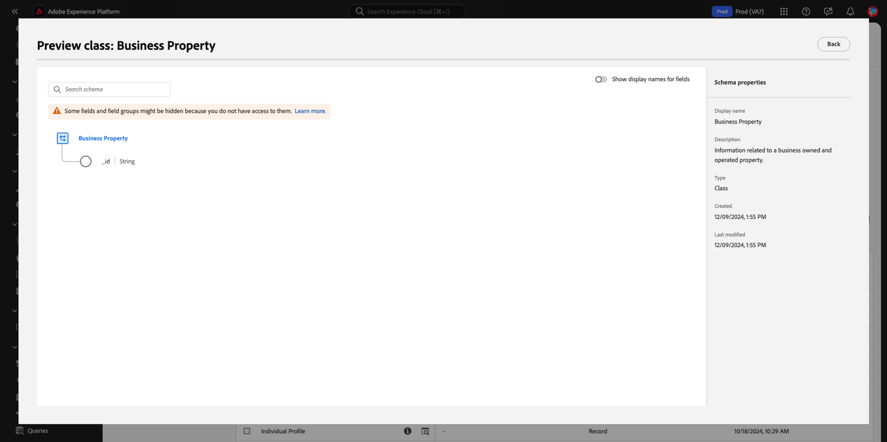
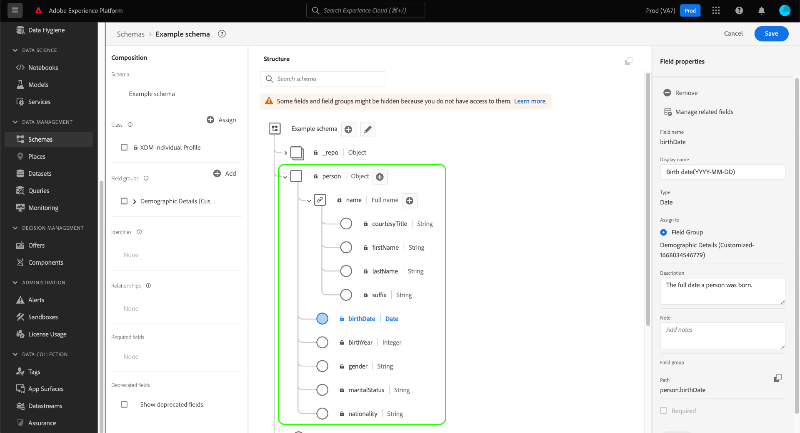

# Creación y edición de esquemas en la IU {#create-edit-schemas-in-ui}

Esta guía proporciona información general sobre cómo crear, editar y administrar esquemas del Modelo de datos de experiencia (XDM) para su organización en la interfaz de usuario de Adobe Experience Platform.

>[!IMPORTANT]
>
>Los esquemas XDM son extremadamente personalizables y, por lo tanto, los pasos involucrados en la creación de un esquema pueden variar según el tipo de datos que desee que capture el esquema. Como resultado, este documento solo cubre las interacciones básicas que se pueden realizar con los esquemas del IU y excluye pasos relacionados, como la personalización de clases, grupos de campos esquema, tipos de datos y campos.
>
>Para un recorrido completo por el proceso de creación de esquema, seguir junto con el [tutorial de creación de esquema](../../tutorials/create-schema-ui.md) crear un ejemplo completo esquema y familiarizarse con las muchas capacidades del [!DNL Schema Editor]archivo .

## Requisitos previos {#prerequisites}

Este guía requiere una comprensión práctica del sistema XDM. Consulte la [descripción general de XDM](../../home.md) para obtener una introducción al papel de XDM en el ecosistema de Experience Platform y los [conceptos básicos de la composición de esquemas](../../schema/composition.md) para obtener una descripción general de cómo se construyen los esquemas.

## Creación de un nuevo esquema {#create}

En el área de trabajo [!UICONTROL Schemas], seleccione **[!UICONTROL Create schema]** en la esquina superior derecha. Aparece el menú desplegable &quot;Seleccionar tipo de esquema&quot; con opciones para [!UICONTROL Standard] o [!UICONTROL Relational] esquemas.

![Se ha resaltado el espacio de trabajo de esquemas con [!UICONTROL Create Schema] y se ha mostrado la lista desplegable &#39;Seleccionar tipo de esquema&#39;](../../images/ui/resources/schemas/create-schema.png).

## Crear un esquema relacional {#create-relational-schema}

>[!AVAILABILITY]
>
>Los esquemas relacionales y de Data Mirror están disponibles para los titulares de licencias de **campañas orquestadas** de Adobe Journey Optimizer. También están disponibles como una **versión limitada** para los usuarios de Customer Journey Analytics, según su licencia y la habilitación de características. Póngase en contacto con su representante de Adobe para obtener acceso.

>[!NOTE]
>
>Los esquemas relacionales se denominaban anteriormente esquemas basados en modelos en versiones anteriores de la documentación de Adobe Experience Platform.

Seleccione **[!UICONTROL Relational]** para definir esquemas estructurados de estilo relacional con un control preciso de los registros. Los esquemas relacionales admiten la aplicación de claves principales, el control de versiones en el nivel de registro y las relaciones en el nivel de esquema a través de claves principales y externas. También están optimizados para la ingesta incremental mediante la captura de datos de cambio y admiten varios modelos de datos utilizados en implementaciones de Campaign Orchestration, Data Distiller y B2B.

Para obtener más información, consulte la [descripción general de Data Mirror](../../data-mirror/overview.md) o [esquema relacional](../../schema/relational.md).

### Crear manualmente {#create-manually}

>[!AVAILABILITY]
>
>La carga de archivos DDL solo está disponible para los titulares de licencias de Adobe Journey Optimizer Orchestrated Campaign. La interfaz de usuario puede aparecer de forma diferente.

Aparecerá el cuadro de diálogo **[!UICONTROL Create a relational schema]**. Puede elegir **[!UICONTROL Create manually]** o [**[!UICONTROL Upload DDL file]**](#upload-ddl-file) para definir la estructura del esquema.

En el cuadro de diálogo **[!UICONTROL Create a relational schema]**, seleccione **[!UICONTROL Create manually]** y luego seleccione **[!UICONTROL Next]**.

Aparecerá la página **[!UICONTROL Relational schema details]**. Escriba un nombre para mostrar en el esquema y una descripción opcional y, a continuación, seleccione **[!UICONTROL Finish]** para crear el esquema.

![Se resaltó la vista de detalles del esquema relacional con [!UICONTROL Schema display name], [!UICONTROL Description] y [!UICONTROL Finish].](../../images/ui/resources/schemas/relational-details.png)

El Editor de esquemas se abre con un lienzo vacío para definir la estructura del esquema. Puede agregar campos como de costumbre.

#### Agregar un campo de identificador de versión {#add-version-identifier}

Para habilitar el seguimiento de versiones y admitir la captura de datos de cambio, debe designar un campo de identificador de versión en el esquema. En el Editor de esquemas, seleccione el icono de signo más () junto al nombre del esquema para agregar un nuevo campo.

Escriba un nombre de campo como `updateSequence` y elija un tipo de datos de **[!UICONTROL DateTime]** o **[!UICONTROL Number]**.

En el carril derecho, active la casilla de verificación **[!UICONTROL Version Identifier]** y, a continuación, seleccione **[!UICONTROL Apply]** para confirmar el campo.

>[!IMPORTANT]
>
>Un esquema relacional debe incluir un campo de identificador de versión para admitir actualizaciones de nivel de registro y cambiar la ingesta de captura de datos.

Para definir relaciones, seleccione **[!UICONTROL Add Relationship]** en el Editor de esquemas para crear relaciones de clave principal/externa de nivel de esquema. Consulte el tutorial sobre [agregar relaciones de nivel de esquema](../../tutorials/relationship-ui.md#relationship-field) para obtener más información.

A continuación, continúe con [definir claves principales](../fields/identity.md#define-a-identity-field) y [agregue campos adicionales](#add-field-groups) según sea necesario. Para obtener instrucciones sobre cómo habilitar la captura de datos modificados en las fuentes de Experience Platform, consulte la [guía de ingesta de captura de datos modificados](../../../sources/tutorials/api/change-data-capture.md).

>[!NOTE]
>
>Una vez guardado, el campo [!UICONTROL Type] en la barra lateral [!UICONTROL &#x200B; Schema properties] indica que se trata de un esquema [!UICONTROL Relational]. Esto también se indica en la barra lateral de detalles de la vista de inventario de esquema.
>

### Cargar un archivo DDL {#upload-ddl-file}

>[!AVAILABILITY]
>
>La carga de archivos DDL solo está disponible para los titulares de licencias de Adobe Journey Optimizer Orchestrated Campaign.

Utilice este flujo de trabajo para definir el esquema cargando un archivo DDL. En el cuadro de diálogo **[!UICONTROL Create a relational schema]**, seleccione **[!UICONTROL Upload DDL file]** y, a continuación, arrastre un archivo DDL local desde el sistema o seleccione **[!UICONTROL Choose files]**. Experience Platform valida el esquema y muestra una marca de verificación verde si la carga del archivo se realiza correctamente. Seleccione **[!UICONTROL Next]** para confirmar la carga.

![Cuadro de diálogo Crear un esquema relacional con [!UICONTROL Upload DDL file] seleccionado y [!UICONTROL Next] resaltado.](../../images/ui/resources/schemas/upload-ddl-file.png)

Aparecerá el cuadro de diálogo [!UICONTROL Select entities and fields to import], que le permitirá obtener una vista previa del esquema. Revise la estructura del esquema y utilice los botones de opción y las casillas de verificación para asegurarse de que cada entidad tiene una clave principal y un identificador de versión especificados.

>[!IMPORTANT]
>
>La estructura de la tabla debe contener **clave principal** y **identificador de versión**, como un campo `updateSequence` de tipo datetime o number.
>
>Para cambiar la ingesta de captura de datos, también se requiere una columna especial denominada `_change_request_type` de tipo Cadena para habilitar el procesamiento incremental. Este campo indica el tipo de cambio de datos (por ejemplo, `u` (actualización) o `d` (eliminación)).

Aunque es necesario durante la ingesta, las columnas de control como `_change_request_type` no se almacenan en el esquema y no aparecen en la estructura de esquema final. Si todo parece correcto, seleccione **[!UICONTROL Done]** para crear el esquema.

>[!NOTE]
>
>El tamaño máximo de archivo admitido para una carga DDL es de 10 MB.

![Vista de revisión de esquema relacional con campos importados mostrados y [!UICONTROL Finish] resaltados.](../../images/ui/resources/schemas/entities-and-files-to-inport.png)

El esquema se abre en el Editor de esquemas, donde puede ajustar la estructura antes de guardarlo.

A continuación, continúe con [agregar campos adicionales](#add-field-groups) y [agregue relaciones de nivel de esquema adicionales](../../tutorials/relationship-ui.md#relationship-field) según sea necesario.

Para obtener instrucciones sobre cómo habilitar la captura de datos modificados en las fuentes de Experience Platform, consulte la [guía de ingesta de captura de datos modificados](../../../sources/tutorials/api/change-data-capture.md).

## Creación de esquema estándar {#standard-based-creation}

Si selecciona &quot;Tipo de esquema estándar&quot; en el menú desplegable &quot;Seleccionar tipo de esquema&quot;, aparecerá el cuadro de diálogo [!UICONTROL Create a schema]. En este cuadro de diálogo, puede elegir crear manualmente un esquema añadiendo campos y grupos de campos, o puede cargar un archivo CSV y utilizar algoritmos XML para generar un esquema. Seleccione un flujo de trabajo de creación de esquemas en el cuadro de diálogo.

### [!BADGE Beta]{type=Informative} Creación manual o de esquemas asistidos por ML {#manual-or-assisted}

Para obtener información sobre cómo utilizar un algoritmo XML para recomendar una estructura de esquema basada en un archivo csv, consulte la [guía de creación de esquemas asistida por aprendizaje automático](../ml-assisted-schema-creation.md). Esta guía de la interfaz de usuario se centra en el flujo de trabajo de creación manual.

### Creación manual esquema {#manual-creation}

Aparecerá la [!UICONTROL Create schema] flujo de trabajo. Puede elegir una clase base para el esquema seleccionando , **[!UICONTROL Individual Profile]**&#x200B;**[!UICONTROL Experience Event]**, o **[!UICONTROL Other]**, seguido de **[!UICONTROL Next]** para confirmar su elección. Consulte la [[!UICONTROL XDM individual profile]](../../classes/individual-profile.md) documentación para [[!UICONTROL XDM ExperienceEvent]](../../classes/experienceevent.md) obtener más información sobre estas clases.

![El [!UICONTROL Create schema] flujo de trabajo con las tres opciones de clase y [!UICONTROL Next] resaltado.](../../images/ui/resources/schemas/schema-class-options.png)

Al elegir **[!UICONTROL Other]**, aparece una lista de clases disponibles. Desde aquí puede examinar y filtrar clases preexistentes.

![El flujo de trabajo [!UICONTROL Create schema] con [!UICONTROL Other] resaltado en la sección [!UICONTROL Schema details].](../../images/ui/resources/schemas/other-schema-details.png)

Seleccione un botón de opción para filtrar las clases en función de si son clases personalizadas o estándar. También puede filtrar los resultados disponibles según su sector o buscar una clase específica utilizando el campo de búsqueda.

![Se resaltó el flujo de trabajo [!UICONTROL Create schema] con la barra de búsqueda [!UICONTROL Custom] y [!UICONTROL Industries].](../../images/ui/resources/schemas/filter-and-search.png)

Para ayudarle a decidir la clase adecuada, hay iconos de información y vista previa para cada clase. El icono de información () abre un cuadro de diálogo que proporciona una descripción de la clase y del sector al que está asociada.

El icono de vista previa () abre un cuadro de diálogo de vista previa para la clase que contiene un diagrama de esquema y sus propiedades.

Seleccione cualquier fila para elegir una clase y, a continuación, seleccione **[!UICONTROL Next]** para confirmar su elección.

![Flujo de trabajo [!UICONTROL Create schema] con una clase seleccionada de la tabla de clases disponibles y [!UICONTROL Next] resaltada.](../../images/ui/resources/schemas/select-class.png)

Después de seleccionar una clase, aparece la sección [!UICONTROL Name and review]. En esta sección, proporcione un nombre y una descripción para identificar el esquema. palo de golfLa estructura base del esquema (proporcionada por la clase ) se muestra en el lienzo para que revise y compruebe la clase y la estructura de esquema seleccionadas.

Escriba un(a) [!UICONTROL Schema display name] descriptivo(a) en el campo de texto. A continuación, introduzca una descripción adecuada para ayudar a identificar el esquema. Una vez que haya revisado la estructura de esquema y esté satisfecho con la configuración, seleccione **[!UICONTROL Finish]** para crear el esquema.

![La sección [!UICONTROL Name and review] del flujo de trabajo [!UICONTROL Create schema] con [!UICONTROL Schema display name], [!UICONTROL Description] y [!UICONTROL Finish] resaltados.](../../images/ui/resources/schemas/name-and-review.png)

Aparecerá el Editor de esquemas con la estructura del esquema mostrada en el lienzo. Si lo desea, ahora puede iniciar [agregando campos a la clase](../../ui/resources/classes.md#add-fields).

## Editar un esquema existente {#edit}

>[!NOTE]
>
>Una vez guardado un esquema y utilizado en la ingesta de datos, solo se pueden realizar cambios adicionales. Consulte las [reglas de evolución de esquema](../../schema/composition.md#evolution) para obtener más información.

Para editar un esquema existente, seleccione la ficha **[!UICONTROL Browse]** y, a continuación, seleccione el nombre del esquema que desea editar. También puede utilizar la barra de búsqueda para reducir la lista de opciones disponibles.

>[!TIP]
>
>Puede utilizar las funcionalidades de búsqueda y filtrado del espacio de trabajo para encontrar el esquema más fácilmente. Consulte la guía [Exploración de recursos XDM](../explore.md) para obtener más información.

Una vez seleccionado un esquema, [!DNL Schema Editor] aparece con la estructura del esquema mostrada en el lienzo. Ahora puede [agregar grupos de campos](#add-field-groups) al esquema (o [agregar campos individuales](#add-individual-fields) de esos grupos), [editar nombres para mostrar de campos](#display-names) o [editar grupos de campos personalizados existentes](./field-groups.md#edit) si el esquema emplea alguno.

## Más acciones {#more}

En el Editor de esquemas también puede realizar acciones rápidas para copiar la estructura JSON del esquema o eliminar el esquema si no se ha habilitado para el perfil del cliente en tiempo real o tiene conjuntos de datos asociados. Seleccione [!UICONTROL More] en la parte superior de la vista para mostrar una lista desplegable con acciones rápidas.

La funcionalidad Copiar estructura JSON le permite ver el aspecto que tendría una carga útil de ejemplo mientras sigue creando el esquema y las canalizaciones de datos. Resulta especialmente útil en situaciones en las que hay estructuras de mapa de objetos complejas en el esquema, como un mapa de identidad.

## Alternar nombre para mostrar {#display-name-toggle}

Para su comodidad, el Editor de esquemas proporciona un conmutador para cambiar entre los nombres de campo originales y los nombres para mostrar más legibles en lenguaje natural. Esta flexibilidad permite mejorar la capacidad de detección de campos y la edición de los esquemas. La opción se encuentra en la parte superior derecha de la vista Editor de esquemas.

>[!NOTE]
>
>El cambio de los nombres de campo a los nombres para mostrar es puramente estético y no cambia ningún recurso posterior.

![El editor de esquemas con [!UICONTROL Show display names for fields] resaltado.](../../images/ui/resources/schemas/display-name-toggle.png)

Los nombres para mostrar para los grupos de campos estándar son generados por el sistema, pero pueden personalizarse, como se describe en la sección Nombres[&#x200B; para &#x200B;](#display-names)mostrar. Los nombres para mostrar se reflejan en varias vistas IU, incluidas las vistas previas de mapas y conjunto de datos. La configuración predeterminada está desactivada y muestra los nombres de campo según sus valores originales.

## Adición de grupos de campos a un esquema {#add-field-groups}

>[!NOTE]
>
>Esta sección explica cómo añadir grupos de campos existentes a un esquema. Si desea crear un nuevo grupo de campos personalizados, consulte la guía sobre [creación y edición de grupos de campos](./field-groups.md#create) en su lugar.

Una vez que haya abierto un esquema dentro de [!DNL Schema Editor], puede agregar campos al esquema mediante el uso de grupos de campos. Para empezar, seleccione **[!UICONTROL Add]** junto a **[!UICONTROL Field groups]** en el carril izquierdo.

![Se resaltó el editor de esquemas con [!UICONTROL Add] de la sección [!UICONTROL Field groups].](../../images/ui/resources/schemas/add-field-group-button.png)

Aparece un cuadro de diálogo que muestra una lista de grupos de campos que puede seleccionar para el esquema. Dado que los grupos de campos solo son compatibles con una clase, solo se enumerarán los grupos de campos asociados con la clase seleccionada del esquema. De forma predeterminada, los grupos de campos enumerados se ordenan según su popularidad de uso dentro de la organización.

![Se resaltó el cuadro de diálogo [!UICONTROL Add field groups] con la columna [!UICONTROL Popularity] resaltada.](../../images/ui/resources/schemas/field-group-popularity.png)

Si conoce la actividad general o el área empresarial de los campos que desea agregar, seleccione una o más de las categorías verticales del sector en el carril izquierdo para filtrar la lista mostrada de grupos de campos.

![El cuadro de diálogo [!UICONTROL Add field groups] se resaltó con los filtros [!UICONTROL Industry] y la columna [!UICONTROL Industry] se resaltó.](../../images/ui/resources/schemas/industry-filter.png)

>[!NOTE]
>
>Para obtener más información sobre las prácticas recomendadas para el modelado de datos específicos del sector en XDM, consulte la documentación sobre [modelos de datos del sector](../../schema/industries/overview.md).

También puede utilizar la barra de búsqueda para localizar el grupo de campos deseado. Los grupos de campos cuyo nombre coincida con la consulta aparecen en la parte superior de la lista. En **[!UICONTROL Standard Fields]** se muestran los grupos de campos que contienen campos que describen atributos de datos deseados.

![Se resaltó el cuadro de diálogo [!UICONTROL Add field groups] con la función de búsqueda [!UICONTROL Standard fields].](../../images/ui/resources/schemas/field-group-search.png)

Seleccione la casilla de verificación situada junto al nombre del grupo de campos que desea agregar al esquema. Puede seleccionar varios grupos de campos en la lista, y cada grupo de campos seleccionado aparecerá en el carril derecho.

![Se resaltó el cuadro de diálogo [!UICONTROL Add field groups] con la característica de selección de casilla de verificación.](../../images/ui/resources/schemas/add-field-group.png)

>[!TIP]
>
>Para cualquier grupo de campo enumerado, puede pasar el cursor o enfocar el icono de información ( de información) para vista una breve descripción del tipo de datos que captura el grupo campo. También puede seleccionar el icono previsualización () para vista la estructura de los campos que proporciona el campo grupo antes de decidir agregarlo al esquema.

Una vez elegidos los grupos de campos, selecciónelos **[!UICONTROL Add field groups]** para agregarlos al esquema.

![Cuadro [!UICONTROL Add field groups] de diálogo con los grupos de campos seleccionados y [!UICONTROL Add field groups] resaltados.](../../images/ui/resources/schemas/add-field-group-finish.png)

[!DNL Schema Editor] vuelve a aparecer con los campos proporcionados por grupos de campos representados en el lienzo.

![Se muestra el [!DNL Schema Editor] con un esquema de ejemplo.](../../images/ui/resources/schemas/field-groups-added.png)

>[!NOTE]
>
>Dentro del Editor de esquemas, las clases y los grupos de campos estándar (generados por Adobe) se indican con el icono de candado . El candado aparece en el carril izquierdo junto al nombre de la clase o del grupo de campos, así como junto a cualquier campo del diagrama de esquema que forme parte de un recurso generado por el sistema.
>
>

Después de agregar un grupo de campos a un esquema, puede [quitar campos existentes](#remove-fields) o [agregar nuevos campos personalizados](#add-fields) a esos grupos, según sus necesidades.

### Quitar campos agregados de grupos de campos {#remove-fields}

Una vez agregado un grupo de campos a un esquema, puede quitar los campos globalmente del grupo de campos u ocultarlos localmente del esquema actual. Comprender la diferencia entre estas acciones es fundamental para evitar cambios no deseados en el esquema.

>[!IMPORTANT]
>
>Al seleccionar **[!UICONTROL Remove]**, se elimina el campo del propio grupo de campos, lo que afecta a *todos* los esquemas que utilizan ese grupo de campos.
>No utilice esta opción a menos que desee **quitar el campo de todos los esquemas que incluyen el grupo de campos**.

Para eliminar un campo del grupo de campos, selecciónelo en el lienzo y seleccione **[!UICONTROL Remove]** en el carril derecho. Este ejemplo muestra el campo `taxId` del grupo **[!UICONTROL Demographic Details]**.

![Se resaltó el [!DNL Schema Editor] con [!UICONTROL Remove]. Esta acción quita un solo campo.](../../images/ui/resources/schemas/remove-single-field.png)

Para ocultar varios campos de un esquema sin quitarlos del propio grupo de campos, utilice la opción **[!UICONTROL Manage related fields]**. Seleccione cualquier campo del grupo en el lienzo y, a continuación, seleccione **[!UICONTROL Manage related fields]** en el carril derecho.

![Se resaltó el(la) [!DNL Schema Editor] con [!UICONTROL Manage related fields].](../../images/ui/resources/schemas/manage-related-fields.png)

Aparecerá un cuadro de diálogo que muestra la estructura del grupo de campos. Utilice las casillas de verificación para seleccionar o anular la selección de los campos que desee incluir.

![Se resaltó el cuadro de diálogo [!UICONTROL Manage related fields] con los campos seleccionados y [!UICONTROL Confirm].](../../images/ui/resources/schemas/select-fields.png)

Seleccione **[!UICONTROL Confirm]** para actualizar el lienzo y reflejar los campos seleccionados.

### Comportamiento del campo al eliminar o dejar de utilizar campos {#field-removal-deprecation-behavior}

Utilice la tabla siguiente para comprender el ámbito de cada acción.

| Acción | Solo se aplica al esquema actual | Modifica el grupo de campos | Afecta a otros esquemas | Descripción |
|--------------------------|--------------------------------|----------------------|-----------------------|-------------|
| **Quitar campo** | No | Sí | Sí | Elimina el campo del grupo de campos. Esto lo elimina de todos los esquemas que utilizan ese grupo. |
| **Administrar campos relacionados** | Sí | No | No | Oculta solo los campos del esquema actual. El campo grupo permanece sin cambios. |
| **Dejar de utilizar campo** | No | Sí | Sí | Marca el campo como obsoleto en el grupo de campos. Ya no está disponible para su uso en ningún esquema. |

>[!NOTE]
>
>Este comportamiento es coherente tanto en los esquemas basados en registros como en los basados en eventos.

### Agregar campos personalizados a grupos de campos {#add-fields}

Después de agregar un grupo de campos a un esquema, puede definir campos adicionales para ese grupo. Sin embargo, cualquier campo agregado a un grupo de campos en un esquema también aparecerá en todos los demás esquemas que empleen el mismo grupo de campos.

Además, si se agrega un campo personalizado a un grupo de campos estándar, ese grupo de campos se convertirá en un grupo de campos personalizados y el grupo de campos estándar original dejará de estar disponible.

Si desea agregar un campo personalizado a un grupo de campos estándar, consulte la [sección debajo de](#custom-fields-for-standard-groups) para obtener instrucciones específicas. Si está agregando campos a un grupo de campos personalizados, consulte la sección sobre [edición de grupos de campos personalizados](./field-groups.md) en la guía de IU de grupos de campos.

Si no desea modificar ningún grupo de campos existente, puede [crear un nuevo grupo de campos personalizados](./field-groups.md#create) para definir campos adicionales en su lugar.

## Añadir campos individuales a un esquema {#add-individual-fields}

El Editor de esquemas permite agregar campos individuales directamente a un esquema si desea evitar agregar un grupo de campos completo para un caso de uso específico. Puede [agregar campos individuales de grupos de campos estándar](#add-standard-fields) o [agregar sus propios campos personalizados](#add-custom-fields) en su lugar.

>[!IMPORTANT]
>
>Aunque el Editor de esquemas permite funcionalmente agregar campos individuales directamente a un esquema, esto no cambia el hecho de que todos los campos de un esquema XDM deben proporcionarlos su clase o un grupo de campos compatible con esa clase. Como se explica en las secciones siguientes, todos los campos individuales siguen asociados a una clase o grupo de campos como paso clave cuando se añaden a un esquema.

### Añadir campos estándar {#add-standard-fields}

Puede añadir campos de grupos de campos estándar directamente a un esquema sin necesidad de conocer previamente su grupo de campos correspondiente. Para agregar un campo estándar a una esquema, seleccione el icono de signo más (**+**) junto al nombre del esquema en el lienzo. Aparece un **[!UICONTROL Untitled Field]** marcador de posición en la estructura esquema y el carril derecho se actualiza para mostrar los controles para configurar el campo.

En **[!UICONTROL Field name]** inicio escribir el nombre del campo que desea añadir. El sistema busca automáticamente los campos estándar que coinciden con la consulta y los enumera en **[!UICONTROL Recommended Standard Fields]**, incluidos los grupos de campos a los que pertenecen.

Aunque algunos campos estándar comparten el mismo nombre, su estructura puede variar según el grupo de campos del que procedan. Si un campo estándar está anidado en un objeto principal en la estructura de grupo de campos, el campo principal también se incluye en el esquema si se agrega el campo secundario.

Seleccione el icono de vista previa () junto a un campo estándar para ver la estructura de su grupo de campos y comprender mejor cómo se puede anidar. Para agregar el campo estándar al esquema, seleccione el icono más ().

El lienzo se actualiza para mostrar el campo estándar agregado al esquema, incluidos los campos principales en los que está anidado dentro de la estructura de grupo de campos. El nombre del grupo de campos también se muestra bajo **[!UICONTROL Field groups]** en el carril izquierdo. Si desea agregar más campos del mismo grupo de campos, seleccione **[!UICONTROL Manage related fields]** en el carril derecho.

### Añadir campos personalizados {#add-custom-fields}

Al igual que el flujo de trabajo para los campos estándar, también puede agregar sus propios campos personalizados directamente a un esquema.

Para agregar campos al nivel raíz de un esquema, seleccione el icono de signo más (**+**) junto al nombre del esquema en el lienzo. Aparece un marcador de posición **[!UICONTROL Untitled Field]** en la estructura de esquema y el carril derecho se actualiza para mostrar los controles y configurar el campo.

Empiece a escribir el nombre del campo que desea añadir y el sistema comenzará automáticamente a buscar los campos estándar coincidentes. Para crear un nuevo campo personalizado, seleccione la opción superior anexada con **([!UICONTROL New Field])**.

Después de proporcionar un nombre para mostrar y un tipo de datos para el campo, el siguiente paso es asignar el campo a un recurso XDM principal. Si el esquema usa una clase personalizada, puede elegir [agregar el campo a la clase asignada](#add-to-class) o a un [grupo de campos](#add-to-field-group) en su lugar. Sin embargo, si el esquema utiliza una clase estándar, solo puede asignar el campo personalizado a un grupo de campos.

#### Asignar el campo a un grupo de campos personalizados {#add-to-field-group}

>[!NOTE]
>
>Esta sección solo explica cómo asignar el campo a un grupo de campos personalizados. Si desea ampliar un grupo de campos estándar con el nuevo campo personalizado, consulte la sección sobre [agregar campos personalizados a grupos de campos estándar](#custom-fields-for-standard-groups).

En **[!UICONTROL Assign to]**, seleccione **[!UICONTROL Field Group]**. Si el esquema utiliza una clase estándar, esta es la única opción disponible y está seleccionada de forma predeterminada.

A continuación, debe seleccionar un grupo de campos al que asociarse el nuevo campo. Empiece a escribir el nombre del grupo de campos en la entrada de texto proporcionada. Si tiene algún grupo de campos personalizados existente que coincida con la entrada, aparecerán en la lista desplegable. También puede escribir un nombre único para crear un nuevo grupo de campos.

>[!WARNING]
>
>Si selecciona un grupo de campos personalizados existente, cualquier otro esquema que emplee ese grupo de campos también heredará el campo recién agregado después de guardar los cambios. Por este motivo, seleccione únicamente un grupo de campos existente si desea este tipo de propagación. De lo contrario, debe optar por crear un nuevo grupo de campos personalizados.

Después de seleccionar el grupo de campos de la lista, seleccione **[!UICONTROL Apply]**.

El nuevo campo se agrega al lienzo y tiene un espacio de nombres bajo su [ID de inquilino](../../api/getting-started.md#know-your-tenant_id) para evitar conflictos con los campos XDM estándar. El grupo de campos con el que asoció el nuevo campo también aparece bajo **[!UICONTROL Field groups]** en el carril izquierdo.

>[!NOTE]
>
>El resto de los campos proporcionados por el grupo de campos personalizados seleccionado se eliminan del esquema de forma predeterminada. Si desea agregar algunos de estos campos al esquema, seleccione un campo que pertenezca al grupo y, a continuación, seleccione **[!UICONTROL Manage related fields]** en el carril derecho.

#### Asignar el campo a una clase personalizada {#add-to-class}

En **[!UICONTROL Assign to]**, seleccione **[!UICONTROL Class]**. El campo de entrada siguiente se reemplaza con el nombre de la clase personalizada del esquema actual, lo que indica que el nuevo campo se asignará a esta clase.

![Se está seleccionando la opción [!UICONTROL Class] para la nueva asignación de campo.](../../images/ui/resources/schemas/assign-field-to-class.png)

Continúe configurando el campo como desee y seleccione **[!UICONTROL Apply]** cuando termine.

![[!UICONTROL Apply] se está seleccionando para el nuevo campo.](../../images/ui/resources/schemas/assign-field-to-class-apply.png)

El nuevo campo se agrega al lienzo y tiene un espacio de nombres bajo su [ID de](../../api/getting-started.md#know-your-tenant_id) inquilino para evitar conflictos con los campos XDM estándar. Al seleccionar el nombre de la clase en el carril izquierdo se revela el nuevo campo como parte de la estructura de la clase.

### Agregar campos personalizados a la estructura de grupos de campos estándar {#custom-fields-for-standard-groups}

Si el esquema en el que está trabajando tiene un campo de tipo de objeto proporcionado por un grupo de campos estándar, puede agregar sus propios campos personalizados a ese objeto estándar.

>[!WARNING]
>
>Todos los campos agregados a un grupo de campos en un esquema también aparecerán en todos los demás esquemas que empleen el mismo grupo de campos. Además, si se agrega un campo personalizado a un grupo de campos estándar, ese grupo de campos se convertirá en un grupo de campos personalizados y el grupo de campos estándar original dejará de estar disponible.
>
>Si ha participado en la versión beta de esta función, recibirá un cuadro de diálogo que le informará de los grupos de campos estándar que ha personalizado anteriormente. Una vez que seleccione **[!UICONTROL Acknowledge]**, los recursos enumerados se convierten en grupos de campos personalizados.
>
>

Para empezar, seleccione el icono más (**+**) junto a la raíz del objeto proporcionado por el grupo de campos estándar.

Aparece un mensaje de advertencia que le solicita que confirme si desea convertir el grupo de campos estándar. Seleccione **[!UICONTROL Continue creating field group]** para continuar.

El lienzo vuelve a aparecer con un marcador de posición sin título para el nuevo campo. Tenga en cuenta que el nombre del grupo de campos estándar se ha anexado con &quot;([!UICONTROL Extended])&quot; para indicar que se ha modificado de la versión original. Desde aquí, utilice los controles del carril derecho para definir las propiedades del campo.

Después de aplicar los cambios, el nuevo campo aparece en el área de nombres de ID de inquilino dentro del objeto estándar. Este área de nombres anidada evita conflictos de nombre de campo dentro del propio grupo de campos para evitar cambios importantes en otros esquemas que utilizan el mismo grupo de campos.

## Habilitación de un esquema para el perfil del cliente en tiempo real {#profile}

>[!CONTEXTUALHELP]
>id="platform_schemas_enableforprofile"
>title="Habilitar un esquema para perfil"
>abstract="Cuando se habilita un esquema para el perfil, cualquier conjunto de datos creado a partir de este esquema participa en el perfil del cliente en tiempo real, que combina datos de fuentes diferentes para construir una vista completa de cada cliente. Una vez que se utiliza un esquema para ingerir datos en el perfil, no se puede deshabilitar. Consulte la documentación para obtener más información."

[Perfil del cliente en tiempo real](../../../profile/home.md) combina datos de diferentes fuentes para crear una vista completa de cada cliente individual. Si desea que los datos capturados por un esquema participen en este proceso, debe habilitar el esquema para su uso en [!DNL Profile].

>[!IMPORTANT]
>
>Para habilitar un esquema para [!DNL Profile], debe tener definido un campo de identidad principal. Consulte la guía de [definición de campos de identidad](../fields/identity.md) para obtener más información.

Para habilitar el esquema, comience seleccionando el nombre del esquema en el carril izquierdo y, a continuación, seleccione la opción **[!UICONTROL Profile]** en el carril derecho.

Aparece una ventana emergente que le advierte de que, una vez activado y guardado un esquema, no se puede desactivar. Seleccione **[!UICONTROL Enable]** para continuar.

El lienzo vuelve a aparecer con la opción [!UICONTROL Profile] habilitada.

>[!IMPORTANT]
>
>Dado que el esquema aún no se ha guardado, este no es el punto de retorno si cambia de opinión sobre dejar que el esquema participe en el Perfil del cliente en tiempo real: una vez guardado un esquema activado, ya no se puede desactivar. Vuelva a seleccionar el conmutador **[!UICONTROL Profile]** para deshabilitar el esquema.

Para finalizar el proceso, seleccione **[!UICONTROL Save]** para guardar el esquema.

El esquema ahora está habilitado para su uso en el Perfil del cliente en tiempo real. Cuando Experience Platform ingiere datos en conjuntos de datos basados en este esquema, esos datos se incorporarán a los datos del perfil amalgamados.

## Editar nombres para mostrar para campos de esquema {#display-names}

Una vez que haya asignado una clase y agregado grupos de campos a un esquema, puede editar los nombres para mostrar de cualquiera de los campos del esquema, independientemente de si esos campos los han proporcionado recursos XDM estándar o personalizados.

>[!NOTE]
>
>Tenga en cuenta que los nombres para mostrar de los campos que pertenecen a clases o grupos de campos estándar solo se pueden editar en el contexto de un esquema específico. En otras palabras, cambiar el nombre para mostrar de un campo estándar en un esquema no afecta a otros esquemas que emplean la misma clase o grupo de campos asociado.
>
>Una vez que realice cambios en los nombres para mostrar de los campos de un esquema, esos cambios se reflejarán inmediatamente en cualquier conjunto de datos existente basado en ese esquema.

Cambie los nombres de campo a los nombres para mostrar activando **[!UICONTROL Show display names for fields]**. Para editar el nombre para mostrar de un campo de esquema, seleccione el campo en el lienzo. En el carril derecho, proporcione el nuevo nombre en **[!UICONTROL Display name]**.

Seleccione **[!UICONTROL Apply]** en el carril derecho y el lienzo se actualizará para mostrar el nuevo nombre para mostrar del campo. Seleccione **[!UICONTROL Save]** para aplicar los cambios al esquema.

## Cambiar la clase de un esquema {#change-class}

Puede cambiar la clase de un esquema en cualquier momento durante el proceso inicial de maquetación antes de guardar el esquema.

>[!WARNING]
>
>La reasignación de la clase para un esquema debe realizarse con extrema precaución. Los grupos de campos solo son compatibles con determinadas clases y, por lo tanto, al cambiar la clase se restablecerán el lienzo y los campos que haya agregado.

Para reasignar una clase, seleccione **[!UICONTROL Assign]** en el lado izquierdo del lienzo.

Aparece un cuadro de diálogo que muestra una lista de todas las clases disponibles, incluidas las definidas por su organización (el propietario es &quot;[!UICONTROL Customer]&quot;), así como las clases estándar definidas por Adobe.

Seleccione una clase de la lista para mostrar su descripción en el lado derecho del cuadro de diálogo. También puede seleccionar **[!UICONTROL Preview class structure]** para ver los campos y metadatos asociados con la clase. Seleccione **[!UICONTROL Assign class]** para continuar.

Se abre un nuevo cuadro de diálogo en el que se le pide que confirme que desea asignar una nueva clase. Seleccione **[!UICONTROL Assign]** para confirmar.

Después de confirmar el cambio de clase, el lienzo se restablecerá y se perderá todo el progreso de la composición.

## Próximos pasos {#next-steps}

Este documento abarcaba los conceptos básicos de la creación y edición de esquemas en la interfaz de usuario de Experience Platform. Se recomienda revisar el [tutorial de creación de esquemas](../../tutorials/create-schema-ui.md) para obtener un flujo de trabajo completo que permita crear un esquema completo en la interfaz de usuario, incluida la creación de grupos de campos personalizados y tipos de datos para casos de uso únicos.

Para obtener más información sobre las capacidades del área de trabajo [!UICONTROL Schemas], vea la descripción general del área de trabajo [[!UICONTROL Schemas]](../overview.md).

Para aprender a administrar esquemas en la API [!DNL Schema Registry], consulte la [guía de extremo de esquemas](../../api/schemas.md).
