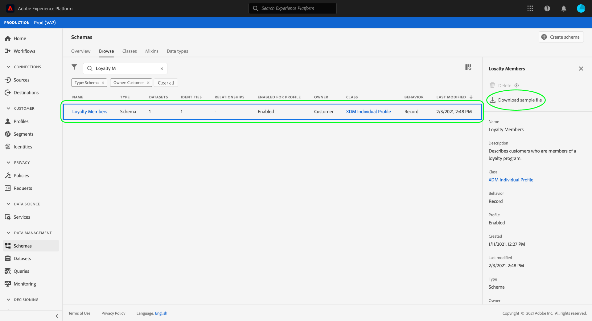

# Generar datos de muestra para un esquema XDM en la interfaz de usuario {#generate-sample-data-for-an-xdm-schema}

>[!CONTEXTUALHELP]
>id="platform_xdm_downloadsamplefile"
>title="Descargar archivo de muestra"
>abstract="Genere un objeto JSON de muestra que se ajuste a la estructura del esquema elegido. Este objeto puede servir como plantilla para garantizar que los datos tengan el formato correcto para su ingesta a conjuntos de datos que emplean ese esquema. El explorador descargará el archivo JSON de muestra."

Para introducir datos en Adobe Experience Platform, el formato y la estructura de los datos deben cumplir con un esquema de modelo de datos de experiencia (XDM) existente. Según la complejidad del esquema de un conjunto de datos determinado, puede resultar difícil determinar la forma exacta de los datos que el conjunto de datos espera tras la ingesta.

Para cualquier esquema que defina en la interfaz de usuario de Experience Platform, puede generar un objeto JSON de muestra que se ajuste a la estructura del esquema. Este objeto puede servir como plantilla para cualquier dato que se ingrese en conjuntos de datos que emplean el esquema en cuestión.

>[!NOTE]
>
>Si no encuentra acciones como **Eliminar** o **Copiar la estructura de JSON**, asegúrese de que está trabajando con un recurso personalizado (definido por el inquilino) y de que tiene acceso a él desde el menú de fila de tabla o la vista de detalles (**[!UICONTROL More]**). La disponibilidad de la acción también depende de los permisos y las restricciones de uso. Ver [Administrar esquemas, clases, grupos de campos y tipos de datos: acciones y eliminación](./explore.md#xdm-resource-actions).

En la interfaz de usuario de Experience Platform, seleccione **[!UICONTROL Schemas]** en el panel de navegación izquierdo. En la ficha **[!UICONTROL Browse]**, busque el esquema para el que desee generar datos de ejemplo. Selecciónelo en la lista y el carril derecho se actualiza para mostrar detalles sobre el esquema. Desde aquí, seleccione **[!UICONTROL Download sample file]**.

El explorador descarga un archivo JSON de muestra. Ahora puede utilizar este archivo como referencia para estructurar los datos al ingerirlos en conjuntos de datos que emplean este esquema.

## Próximos pasos

En esta guía se explica cómo generar un archivo JSON de muestra a partir de un esquema XDM en la interfaz de usuario de Experience Platform. Para obtener información sobre cómo generar datos de ejemplo mediante la API de Registro de esquemas, consulte la [guía de extremo de datos de ejemplo](../api/sample-data.md).

Una vez que esté listo para empezar a ingerir datos, consulte el tutorial sobre [asignación de un archivo CSV a XDM](../../ingestion/tutorials/map-csv/overview.md) para aprender a asignar un archivo de datos plano (como un CSV) a un esquema XDM e ingerirlo en Experience Platform. También puede establecer una [conexión de origen](../../sources/home.md) para traer los datos de un origen externo y asignarlos a XDM.

Para obtener más información sobre las capacidades del área de trabajo [!UICONTROL Schemas] en la interfaz de usuario, consulte la [[!UICONTROL Schemas] descripción general del área de trabajo](./overview.md).
